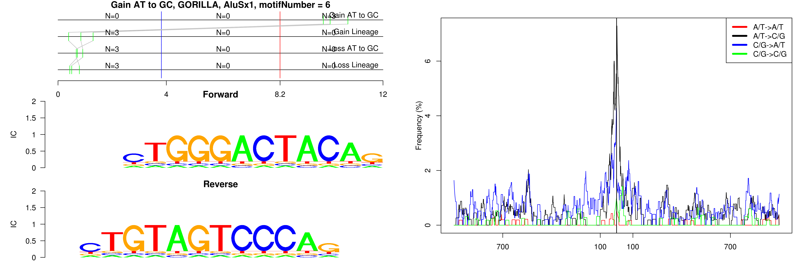

```
## Gain AT to GC, GORILLA, AluJb, motifNumber = 1
```

 

```
## Gain AT to GC, GORILLA, AluJo, motifNumber = 1
```

 

```
## Gain AT to GC, GORILLA, AluSp, motifNumber = 1
```

 

```
## Gain AT to GC, GORILLA, AluSp, motifNumber = 2
```

 

```
## Gain AT to GC, GORILLA, AluSq2, motifNumber = 1
```

 

```
## Gain AT to GC, GORILLA, AluSq2, motifNumber = 2
```

 

```
## Gain AT to GC, GORILLA, AluSx, motifNumber = 1
```

 

```
## Gain AT to GC, GORILLA, AluSx, motifNumber = 2
```

 

```
## Gain AT to GC, GORILLA, AluSx, motifNumber = 3
```

 

```
## Gain AT to GC, GORILLA, AluSx, motifNumber = 4
```

 

```
## Gain AT to GC, GORILLA, AluSx, motifNumber = 5
```

 

```
## Gain AT to GC, GORILLA, AluSx, motifNumber = 6
```

 

```
## Gain AT to GC, GORILLA, AluSx, motifNumber = 7
```

 

```
## Gain AT to GC, GORILLA, AluSx, motifNumber = 8
```

 

```
## Gain AT to GC, GORILLA, AluSx1, motifNumber = 1
```

 

```
## Gain AT to GC, GORILLA, AluSx1, motifNumber = 2
```

 

```
## Gain AT to GC, GORILLA, AluSx1, motifNumber = 3
```

 

```
## Gain AT to GC, GORILLA, AluSx1, motifNumber = 4
```

 

```
## Gain AT to GC, GORILLA, AluSx1, motifNumber = 5
```

 

```
## Gain AT to GC, GORILLA, AluSx1, motifNumber = 6
```

 

```
## Gain AT to GC, GORILLA, AluSx1, motifNumber = 7
```

 

```
## Gain AT to GC, GORILLA, AluSx1, motifNumber = 8
```

 

```
## Gain AT to GC, GORILLA, AluSx1, motifNumber = 9
```

 

```
## Gain AT to GC, GORILLA, AluSz, motifNumber = 1
```

 

```
## Gain AT to GC, GORILLA, AluSz6, motifNumber = 1
```

 
  
