```
## Gain AT to GC, MACAQUE, AluSq2, motifNumber = 1
```

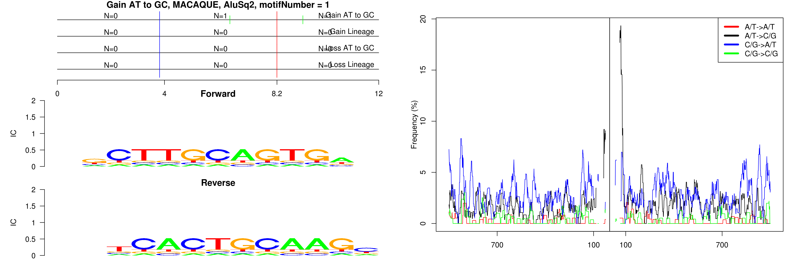 

```
## Gain AT to GC, MACAQUE, AluSx, motifNumber = 1
```

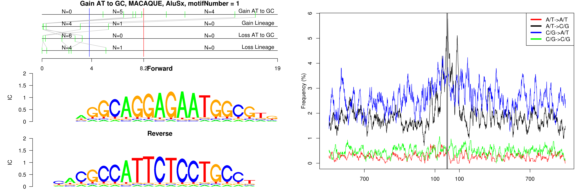 

```
## Gain AT to GC, MACAQUE, AluSx, motifNumber = 2
```

 

```
## Gain AT to GC, MACAQUE, AluSx, motifNumber = 3
```

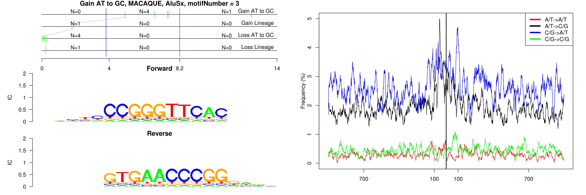 

```
## Gain AT to GC, MACAQUE, AluSx, motifNumber = 4
```

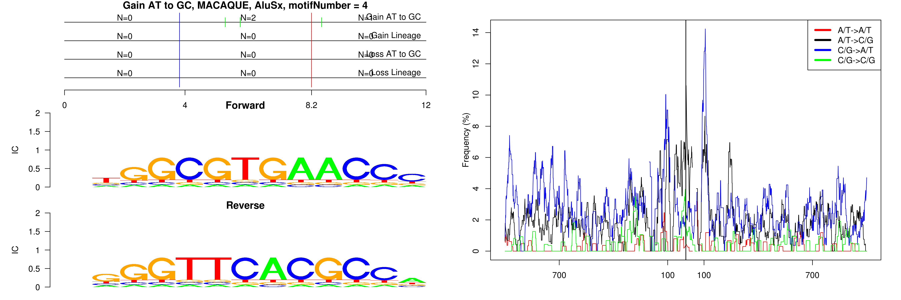 

```
## Gain AT to GC, MACAQUE, AluSx1, motifNumber = 1
```

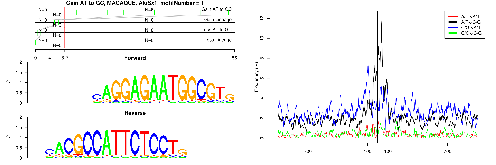 

```
## Gain AT to GC, MACAQUE, AluSx1, motifNumber = 2
```

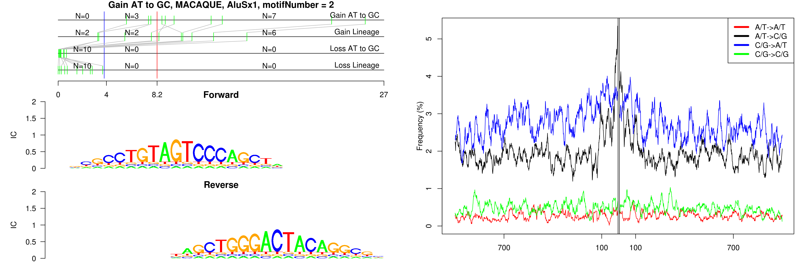 

```
## Gain AT to GC, MACAQUE, AluSx1, motifNumber = 3
```

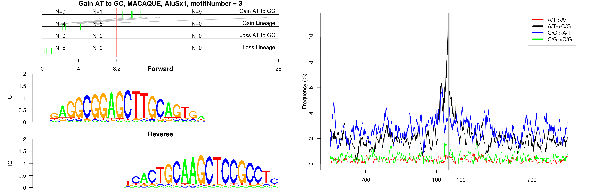 

```
## Gain AT to GC, MACAQUE, AluSx1, motifNumber = 4
```

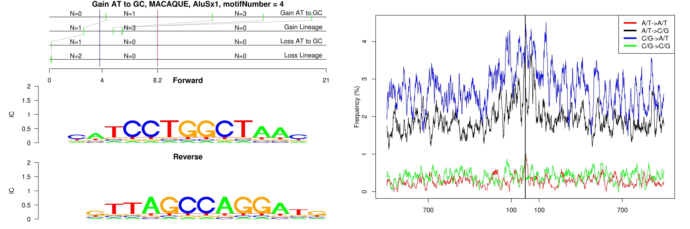 

```
## Gain AT to GC, MACAQUE, AluSx1, motifNumber = 5
```

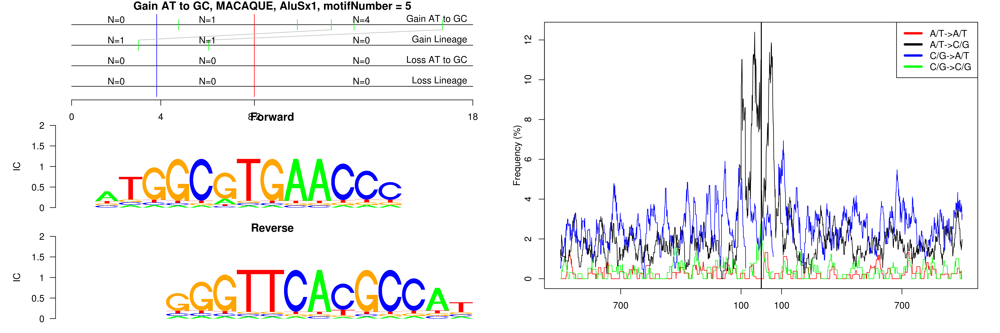 

```
## Gain AT to GC, MACAQUE, AluSx1, motifNumber = 6
```

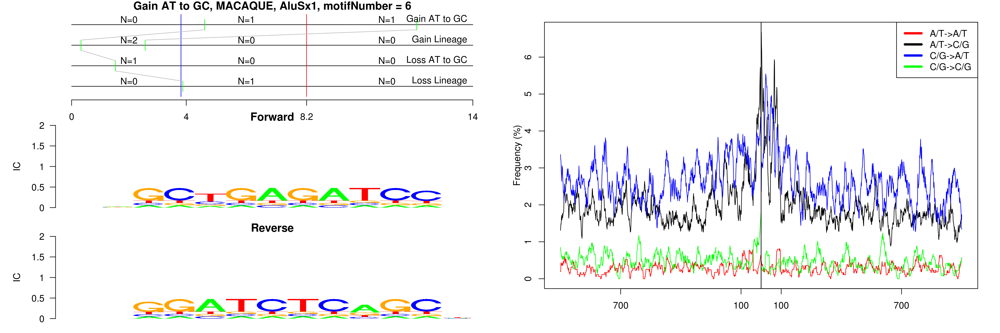 

```
## Gain AT to GC, MACAQUE, AluSx1, motifNumber = 7
```

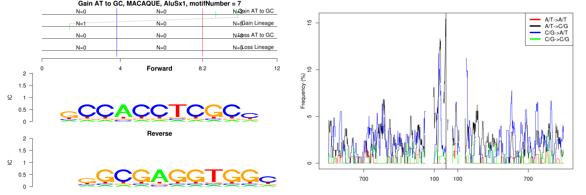 

```
## Gain AT to GC, MACAQUE, AluSz, motifNumber = 1
```

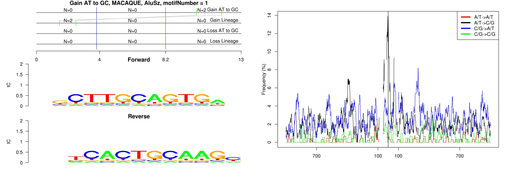 

```
## Gain AT to GC, MACAQUE, AluSz, motifNumber = 2
```

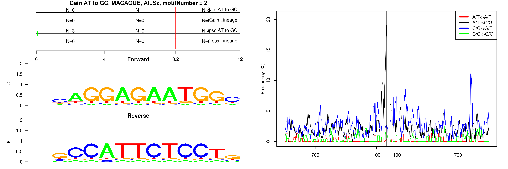 
  
