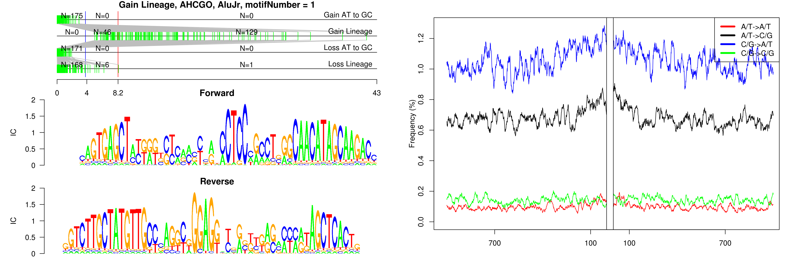
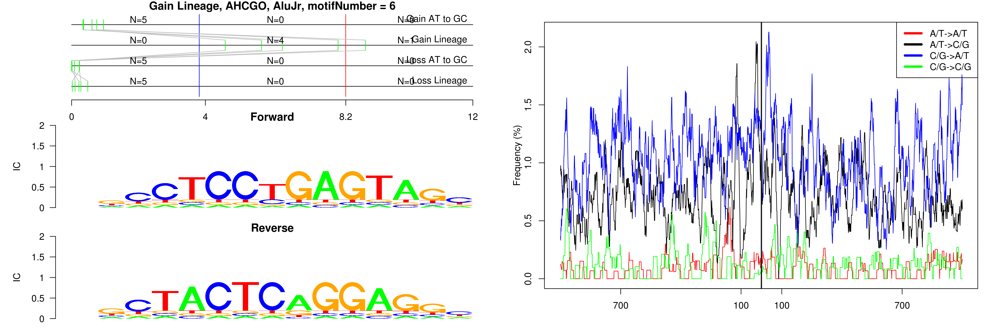
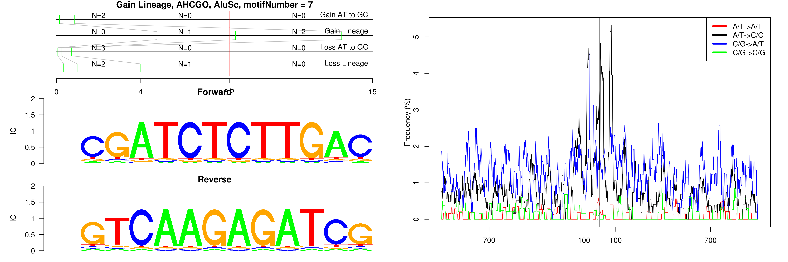
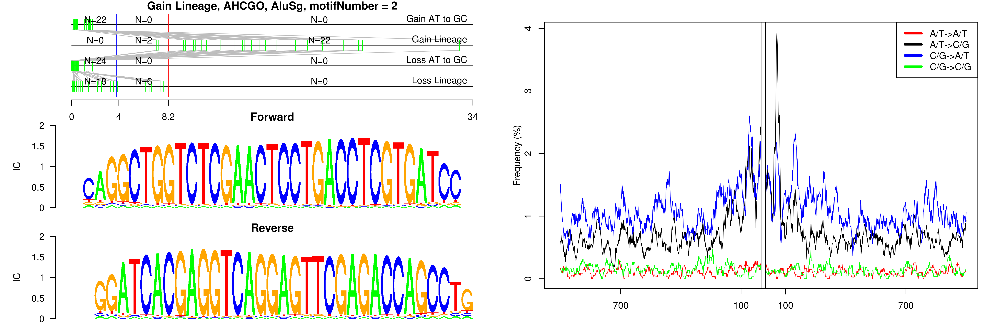
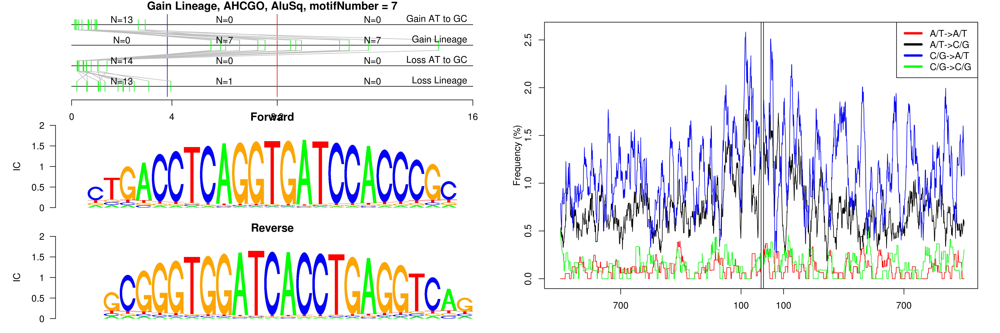
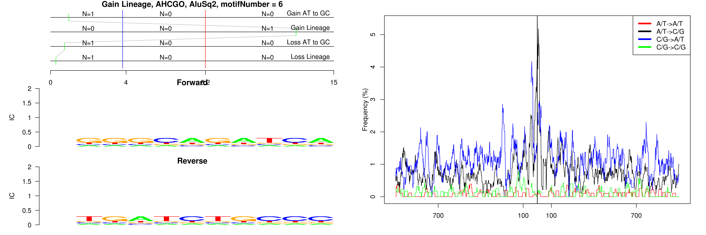
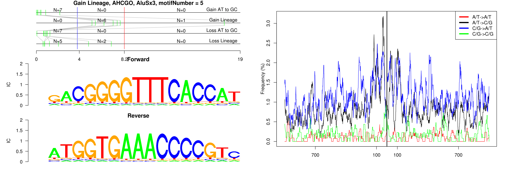
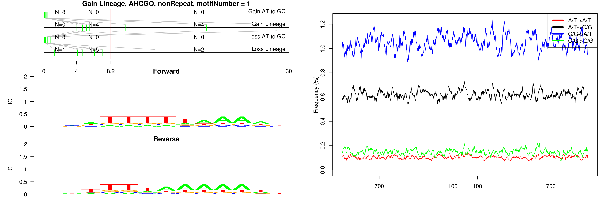
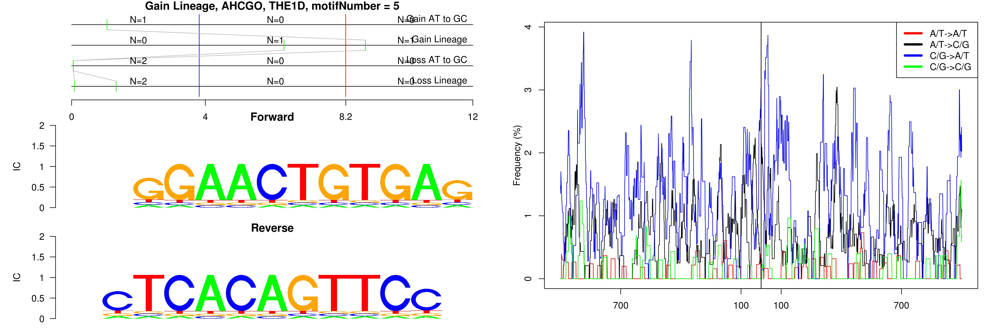

```
## Gain Lineage, AHCGO, AluJb, motifNumber = 1
```

 

```
## Gain Lineage, AHCGO, AluJo, motifNumber = 1
```

 

```
## Gain Lineage, AHCGO, AluJo, motifNumber = 2
```

 

```
## Gain Lineage, AHCGO, AluJo, motifNumber = 3
```

 

```
## Gain Lineage, AHCGO, AluJo, motifNumber = 4
```

 

```
## Gain Lineage, AHCGO, AluJo, motifNumber = 5
```

 

```
## Gain Lineage, AHCGO, AluJr, motifNumber = 1
```

 

```
## Gain Lineage, AHCGO, AluJr, motifNumber = 2
```

 

```
## Gain Lineage, AHCGO, AluJr, motifNumber = 3
```

 

```
## Gain Lineage, AHCGO, AluJr, motifNumber = 4
```

 

```
## Gain Lineage, AHCGO, AluJr, motifNumber = 5
```

 

```
## Gain Lineage, AHCGO, AluJr, motifNumber = 6
```

 

```
## Gain Lineage, AHCGO, AluJr4, motifNumber = 1
```

 

```
## Gain Lineage, AHCGO, AluJr4, motifNumber = 2
```

 

```
## Gain Lineage, AHCGO, AluJr4, motifNumber = 3
```

 

```
## Gain Lineage, AHCGO, AluJr4, motifNumber = 4
```

 

```
## Gain Lineage, AHCGO, AluSc, motifNumber = 1
```

 

```
## Gain Lineage, AHCGO, AluSc, motifNumber = 2
```

 

```
## Gain Lineage, AHCGO, AluSc, motifNumber = 3
```

 

```
## Gain Lineage, AHCGO, AluSc, motifNumber = 4
```

 

```
## Gain Lineage, AHCGO, AluSc, motifNumber = 5
```

 

```
## Gain Lineage, AHCGO, AluSc, motifNumber = 6
```

 

```
## Gain Lineage, AHCGO, AluSc, motifNumber = 7
```

 

```
## Gain Lineage, AHCGO, AluSc, motifNumber = 8
```

 

```
## Gain Lineage, AHCGO, AluSc, motifNumber = 9
```

 

```
## Gain Lineage, AHCGO, AluSc, motifNumber = 10
```

 

```
## Gain Lineage, AHCGO, AluSc, motifNumber = 11
```

 

```
## Gain Lineage, AHCGO, AluSc, motifNumber = 12
```

 

```
## Gain Lineage, AHCGO, AluSc, motifNumber = 13
```

 

```
## Gain Lineage, AHCGO, AluSc8, motifNumber = 1
```

 

```
## Gain Lineage, AHCGO, AluSg, motifNumber = 1
```

 

```
## Gain Lineage, AHCGO, AluSg, motifNumber = 2
```

 

```
## Gain Lineage, AHCGO, AluSg, motifNumber = 3
```

 

```
## Gain Lineage, AHCGO, AluSg, motifNumber = 4
```

 

```
## Gain Lineage, AHCGO, AluSg, motifNumber = 5
```

 

```
## Gain Lineage, AHCGO, AluSg, motifNumber = 6
```

 

```
## Gain Lineage, AHCGO, AluSg, motifNumber = 7
```

 

```
## Gain Lineage, AHCGO, AluSg, motifNumber = 8
```

 

```
## Gain Lineage, AHCGO, AluSg, motifNumber = 9
```

 

```
## Gain Lineage, AHCGO, AluSg, motifNumber = 10
```

 

```
## Gain Lineage, AHCGO, AluSg, motifNumber = 11
```

 

```
## Gain Lineage, AHCGO, AluSp, motifNumber = 1
```

 

```
## Gain Lineage, AHCGO, AluSp, motifNumber = 2
```

 

```
## Gain Lineage, AHCGO, AluSp, motifNumber = 3
```

 

```
## Gain Lineage, AHCGO, AluSp, motifNumber = 4
```

 

```
## Gain Lineage, AHCGO, AluSp, motifNumber = 5
```

 

```
## Gain Lineage, AHCGO, AluSp, motifNumber = 6
```

 

```
## Gain Lineage, AHCGO, AluSp, motifNumber = 7
```

 

```
## Gain Lineage, AHCGO, AluSp, motifNumber = 8
```

 

```
## Gain Lineage, AHCGO, AluSp, motifNumber = 9
```

 

```
## Gain Lineage, AHCGO, AluSp, motifNumber = 10
```

 

```
## Gain Lineage, AHCGO, AluSp, motifNumber = 11
```

 

```
## Gain Lineage, AHCGO, AluSp, motifNumber = 12
```

 

```
## Gain Lineage, AHCGO, AluSp, motifNumber = 13
```

 

```
## Gain Lineage, AHCGO, AluSp, motifNumber = 14
```

 

```
## Gain Lineage, AHCGO, AluSq, motifNumber = 1
```

 

```
## Gain Lineage, AHCGO, AluSq, motifNumber = 2
```

 

```
## Gain Lineage, AHCGO, AluSq, motifNumber = 3
```

 

```
## Gain Lineage, AHCGO, AluSq, motifNumber = 4
```

 

```
## Gain Lineage, AHCGO, AluSq, motifNumber = 5
```

 

```
## Gain Lineage, AHCGO, AluSq, motifNumber = 6
```

 

```
## Gain Lineage, AHCGO, AluSq, motifNumber = 7
```

 

```
## Gain Lineage, AHCGO, AluSq, motifNumber = 8
```

 

```
## Gain Lineage, AHCGO, AluSq, motifNumber = 9
```

 

```
## Gain Lineage, AHCGO, AluSq, motifNumber = 10
```

 

```
## Gain Lineage, AHCGO, AluSq, motifNumber = 11
```

 

```
## Gain Lineage, AHCGO, AluSq, motifNumber = 12
```

 

```
## Gain Lineage, AHCGO, AluSq2, motifNumber = 1
```

 

```
## Gain Lineage, AHCGO, AluSq2, motifNumber = 2
```

 

```
## Gain Lineage, AHCGO, AluSq2, motifNumber = 3
```

 

```
## Gain Lineage, AHCGO, AluSq2, motifNumber = 4
```

 

```
## Gain Lineage, AHCGO, AluSq2, motifNumber = 5
```

 

```
## Gain Lineage, AHCGO, AluSq2, motifNumber = 6
```

 

```
## Gain Lineage, AHCGO, AluSq2, motifNumber = 7
```

 

```
## Gain Lineage, AHCGO, AluSx, motifNumber = 1
```

 

```
## Gain Lineage, AHCGO, AluSx, motifNumber = 2
```

 

```
## Gain Lineage, AHCGO, AluSx, motifNumber = 3
```

 

```
## Gain Lineage, AHCGO, AluSx, motifNumber = 4
```

 

```
## Gain Lineage, AHCGO, AluSx1, motifNumber = 1
```

 

```
## Gain Lineage, AHCGO, AluSx1, motifNumber = 2
```

 

```
## Gain Lineage, AHCGO, AluSx1, motifNumber = 3
```

 

```
## Gain Lineage, AHCGO, AluSx3, motifNumber = 1
```

 

```
## Gain Lineage, AHCGO, AluSx3, motifNumber = 2
```

 

```
## Gain Lineage, AHCGO, AluSx3, motifNumber = 3
```

 

```
## Gain Lineage, AHCGO, AluSx3, motifNumber = 4
```

 

```
## Gain Lineage, AHCGO, AluSx3, motifNumber = 5
```

 

```
## Gain Lineage, AHCGO, AluSx3, motifNumber = 6
```

 

```
## Gain Lineage, AHCGO, AluSx3, motifNumber = 7
```

 

```
## Gain Lineage, AHCGO, AluSz, motifNumber = 1
```

 

```
## Gain Lineage, AHCGO, AluSz, motifNumber = 2
```

 

```
## Gain Lineage, AHCGO, AluSz, motifNumber = 3
```

 

```
## Gain Lineage, AHCGO, AluSz, motifNumber = 4
```

 

```
## Gain Lineage, AHCGO, AluSz, motifNumber = 5
```

 

```
## Gain Lineage, AHCGO, AluSz, motifNumber = 6
```

 

```
## Gain Lineage, AHCGO, AluSz, motifNumber = 7
```

 

```
## Gain Lineage, AHCGO, AluSz6, motifNumber = 1
```

 

```
## Gain Lineage, AHCGO, AluSz6, motifNumber = 2
```

 

```
## Gain Lineage, AHCGO, AluSz6, motifNumber = 3
```

 

```
## Gain Lineage, AHCGO, AluSz6, motifNumber = 4
```

 

```
## Gain Lineage, AHCGO, AluY, motifNumber = 1
```

 

```
## Gain Lineage, AHCGO, AluY, motifNumber = 2
```

 

```
## Gain Lineage, AHCGO, AluY, motifNumber = 3
```

 

```
## Gain Lineage, AHCGO, AluY, motifNumber = 4
```

 

```
## Gain Lineage, AHCGO, AluY, motifNumber = 5
```

 

```
## Gain Lineage, AHCGO, AluY, motifNumber = 6
```

 

```
## Gain Lineage, AHCGO, AluY, motifNumber = 7
```

 

```
## Gain Lineage, AHCGO, AluY, motifNumber = 8
```

 

```
## Gain Lineage, AHCGO, AluY, motifNumber = 9
```

 

```
## Gain Lineage, AHCGO, AluY, motifNumber = 10
```

 

```
## Gain Lineage, AHCGO, AluY, motifNumber = 11
```

 

```
## Gain Lineage, AHCGO, FLAM_C, motifNumber = 1
```

 

```
## Gain Lineage, AHCGO, FLAM_C, motifNumber = 2
```

 

```
## Gain Lineage, AHCGO, FLAM_C, motifNumber = 3
```

 

```
## Gain Lineage, AHCGO, FLAM_C, motifNumber = 4
```

 

```
## Gain Lineage, AHCGO, L1PA16, motifNumber = 1
```

 

```
## Gain Lineage, AHCGO, L1PA7, motifNumber = 1
```

 

```
## Gain Lineage, AHCGO, L1PA7, motifNumber = 2
```

 

```
## Gain Lineage, AHCGO, L1PA7, motifNumber = 3
```

 

```
## Gain Lineage, AHCGO, L1PA8, motifNumber = 1
```

 

```
## Gain Lineage, AHCGO, L1PA8, motifNumber = 2
```

 

```
## Gain Lineage, AHCGO, L1PA8, motifNumber = 3
```

 

```
## Gain Lineage, AHCGO, MER1B, motifNumber = 1
```

 

```
## Gain Lineage, AHCGO, MLT1A0, motifNumber = 1
```

 

```
## Gain Lineage, AHCGO, MLT1A0, motifNumber = 2
```

 

```
## Gain Lineage, AHCGO, nonRepeat, motifNumber = 1
```

 

```
## Gain Lineage, AHCGO, THE1B, motifNumber = 1
```

 

```
## Gain Lineage, AHCGO, THE1B, motifNumber = 2
```

 

```
## Gain Lineage, AHCGO, THE1B, motifNumber = 3
```

 

```
## Gain Lineage, AHCGO, THE1B, motifNumber = 4
```

 

```
## Gain Lineage, AHCGO, THE1B, motifNumber = 5
```

 

```
## Gain Lineage, AHCGO, THE1B, motifNumber = 6
```

 

```
## Gain Lineage, AHCGO, THE1B, motifNumber = 7
```

 

```
## Gain Lineage, AHCGO, THE1B, motifNumber = 8
```

 

```
## Gain Lineage, AHCGO, THE1C, motifNumber = 1
```

 

```
## Gain Lineage, AHCGO, THE1C, motifNumber = 2
```

 

```
## Gain Lineage, AHCGO, THE1C, motifNumber = 3
```

 

```
## Gain Lineage, AHCGO, THE1D, motifNumber = 1
```

 

```
## Gain Lineage, AHCGO, THE1D, motifNumber = 2
```

 

```
## Gain Lineage, AHCGO, THE1D, motifNumber = 3
```

 

```
## Gain Lineage, AHCGO, THE1D, motifNumber = 4
```

 

```
## Gain Lineage, AHCGO, THE1D, motifNumber = 5
```

 
  
