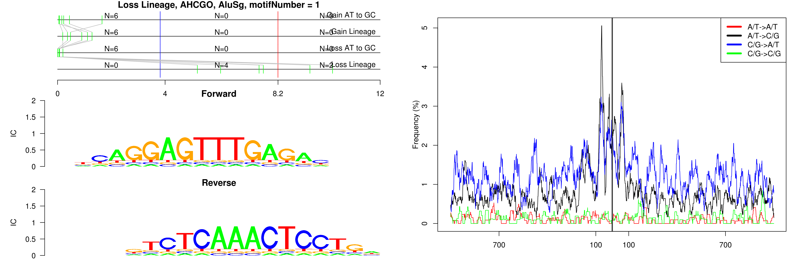
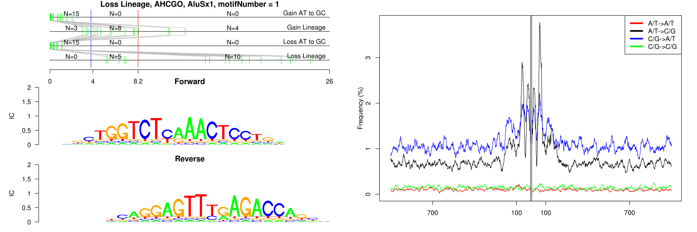

```
## Loss Lineage, AHCGO, AluJo, motifNumber = 1
```

 

```
## Loss Lineage, AHCGO, AluJr, motifNumber = 1
```

 

```
## Loss Lineage, AHCGO, AluSc, motifNumber = 1
```

 

```
## Loss Lineage, AHCGO, AluSg, motifNumber = 1
```

 

```
## Loss Lineage, AHCGO, AluSg, motifNumber = 2
```

 

```
## Loss Lineage, AHCGO, AluSg, motifNumber = 3
```

 

```
## Loss Lineage, AHCGO, AluSp, motifNumber = 1
```

 

```
## Loss Lineage, AHCGO, AluSp, motifNumber = 2
```

 

```
## Loss Lineage, AHCGO, AluSq2, motifNumber = 1
```

 

```
## Loss Lineage, AHCGO, AluSq2, motifNumber = 2
```

 

```
## Loss Lineage, AHCGO, AluSq2, motifNumber = 3
```

 

```
## Loss Lineage, AHCGO, AluSq2, motifNumber = 4
```

 

```
## Loss Lineage, AHCGO, AluSq2, motifNumber = 5
```

 

```
## Loss Lineage, AHCGO, AluSq2, motifNumber = 6
```

 

```
## Loss Lineage, AHCGO, AluSq2, motifNumber = 7
```

 

```
## Loss Lineage, AHCGO, AluSq2, motifNumber = 8
```

 

```
## Loss Lineage, AHCGO, AluSq2, motifNumber = 9
```

 

```
## Loss Lineage, AHCGO, AluSx, motifNumber = 1
```

 

```
## Loss Lineage, AHCGO, AluSx, motifNumber = 2
```

 

```
## Loss Lineage, AHCGO, AluSx, motifNumber = 3
```

 

```
## Loss Lineage, AHCGO, AluSx, motifNumber = 4
```

 

```
## Loss Lineage, AHCGO, AluSx, motifNumber = 5
```

 

```
## Loss Lineage, AHCGO, AluSx, motifNumber = 6
```

 

```
## Loss Lineage, AHCGO, AluSx, motifNumber = 7
```

 

```
## Loss Lineage, AHCGO, AluSx, motifNumber = 8
```

 

```
## Loss Lineage, AHCGO, AluSx, motifNumber = 9
```

 

```
## Loss Lineage, AHCGO, AluSx1, motifNumber = 1
```

 

```
## Loss Lineage, AHCGO, AluSx1, motifNumber = 2
```

 

```
## Loss Lineage, AHCGO, AluSx1, motifNumber = 3
```

 

```
## Loss Lineage, AHCGO, AluSx1, motifNumber = 4
```

 

```
## Loss Lineage, AHCGO, AluSx1, motifNumber = 5
```

 

```
## Loss Lineage, AHCGO, AluSx1, motifNumber = 6
```

 

```
## Loss Lineage, AHCGO, AluSx1, motifNumber = 7
```

 

```
## Loss Lineage, AHCGO, AluSx1, motifNumber = 8
```

 

```
## Loss Lineage, AHCGO, AluSz, motifNumber = 1
```

 

```
## Loss Lineage, AHCGO, AluSz6, motifNumber = 1
```

 

```
## Loss Lineage, AHCGO, AluY, motifNumber = 1
```

 

```
## Loss Lineage, AHCGO, AluY, motifNumber = 2
```

 

```
## Loss Lineage, AHCGO, AluY, motifNumber = 3
```

 

```
## Loss Lineage, AHCGO, AluY, motifNumber = 4
```

 

```
## Loss Lineage, AHCGO, AluY, motifNumber = 5
```

 

```
## Loss Lineage, AHCGO, AluY, motifNumber = 6
```

 

```
## Loss Lineage, AHCGO, AluY, motifNumber = 7
```

 

```
## Loss Lineage, AHCGO, nonRepeat, motifNumber = 1
```

 

```
## Loss Lineage, AHCGO, nonRepeat, motifNumber = 2
```

 
  
