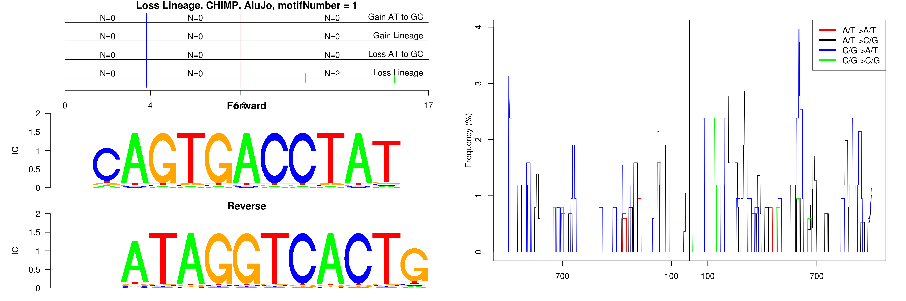
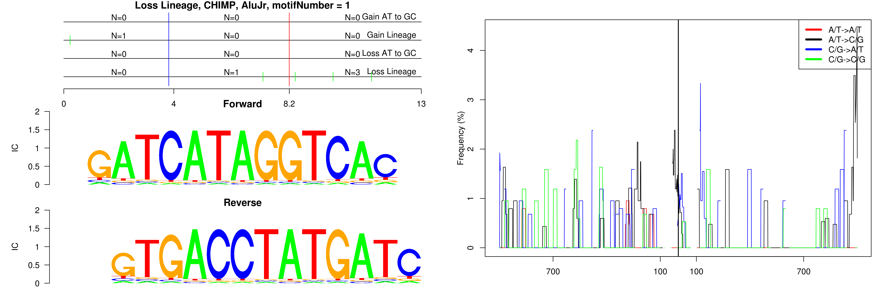
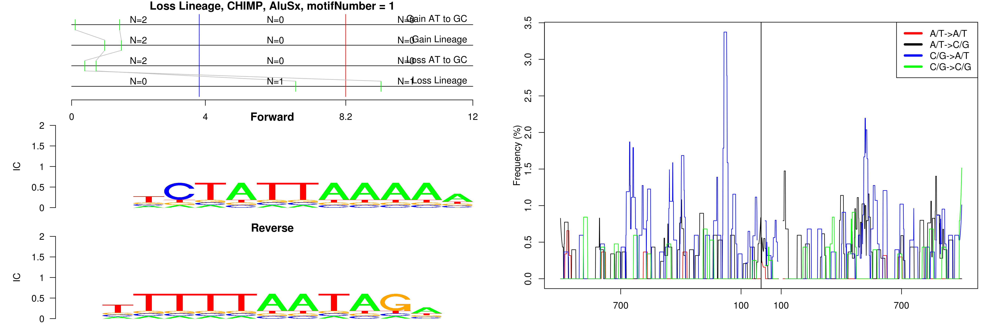
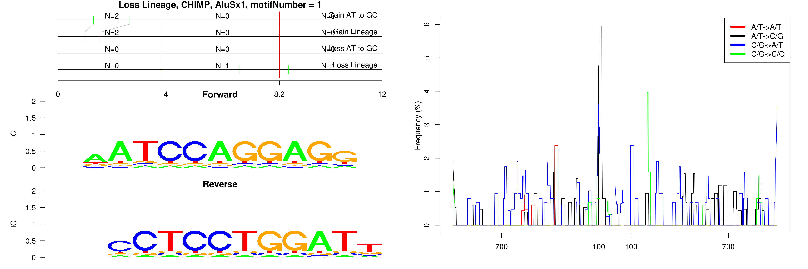
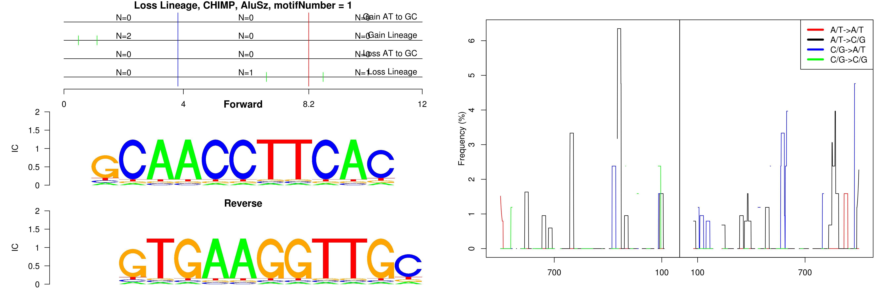
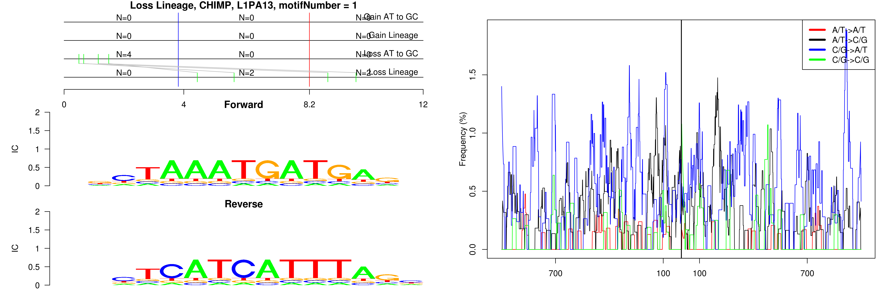
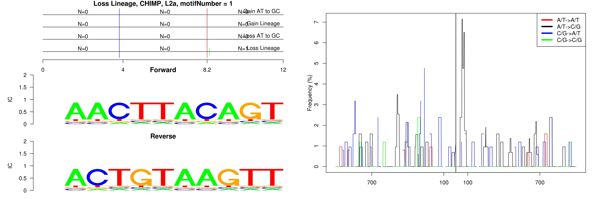
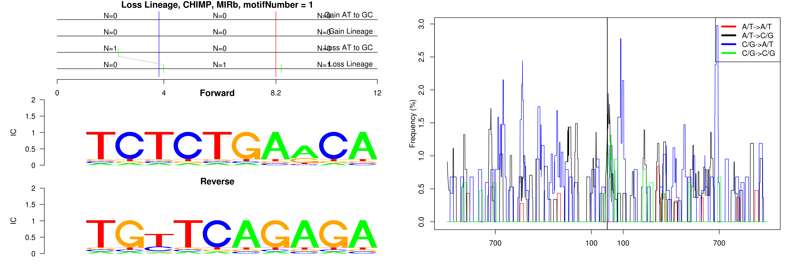
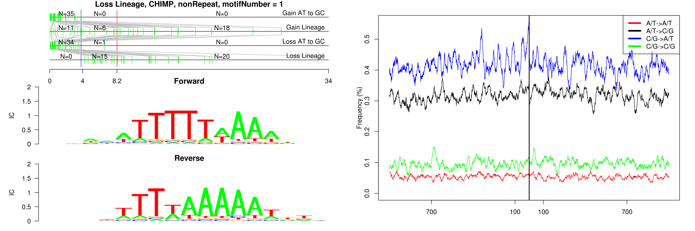

```
## Loss Lineage, CHIMP, AluJo, motifNumber = 1
```

 

```
## Loss Lineage, CHIMP, AluJr, motifNumber = 1
```

 

```
## Loss Lineage, CHIMP, AluSq, motifNumber = 1
```

 

```
## Loss Lineage, CHIMP, AluSx, motifNumber = 1
```

 

```
## Loss Lineage, CHIMP, AluSx1, motifNumber = 1
```

 

```
## Loss Lineage, CHIMP, AluSz, motifNumber = 1
```

 

```
## Loss Lineage, CHIMP, L1PA13, motifNumber = 1
```

 

```
## Loss Lineage, CHIMP, L2a, motifNumber = 1
```

 

```
## Loss Lineage, CHIMP, MIRb, motifNumber = 1
```

 

```
## Loss Lineage, CHIMP, nonRepeat, motifNumber = 1
```

 
  
