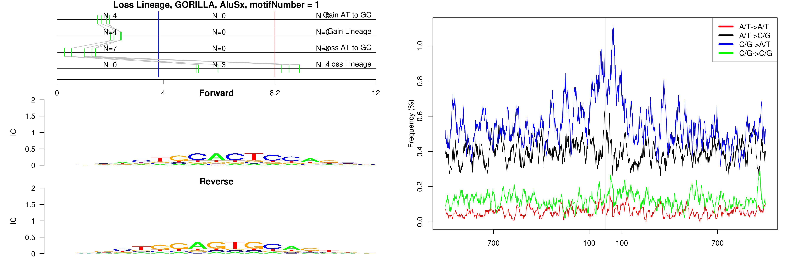
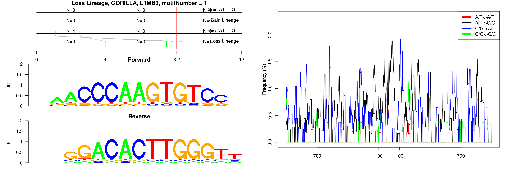
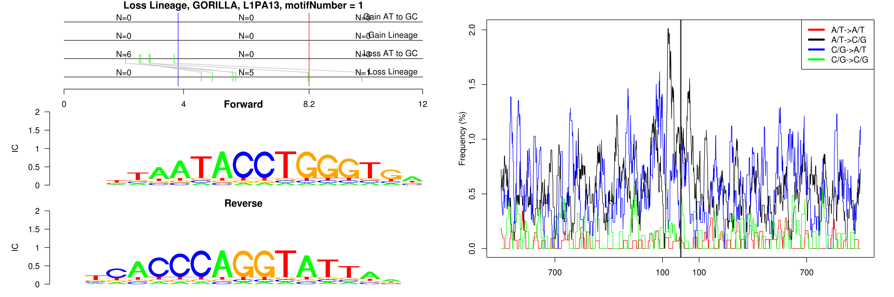
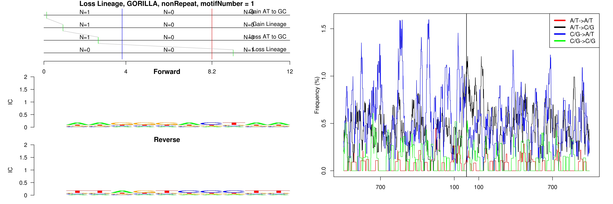

```
## Loss Lineage, GORILLA, AluSx, motifNumber = 1
```

 

```
## Loss Lineage, GORILLA, L1MB3, motifNumber = 1
```

 

```
## Loss Lineage, GORILLA, L1PA13, motifNumber = 1
```

 

```
## Loss Lineage, GORILLA, nonRepeat, motifNumber = 1
```

 
  
