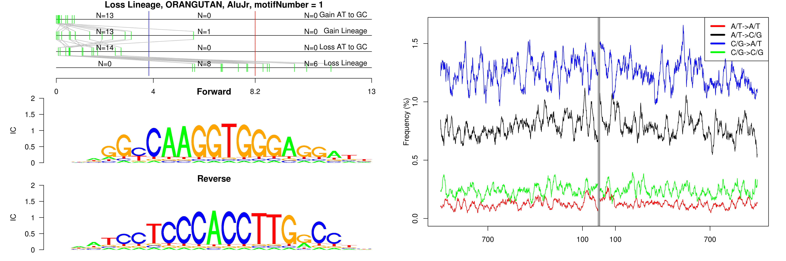
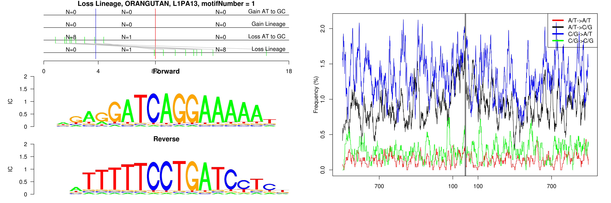
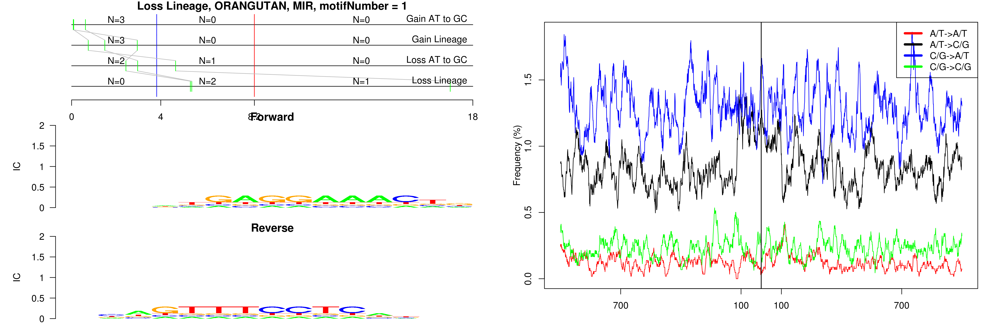
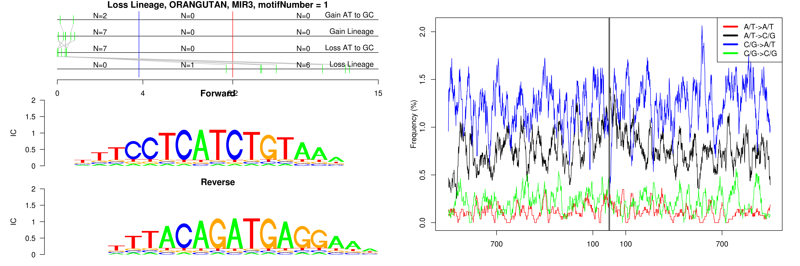
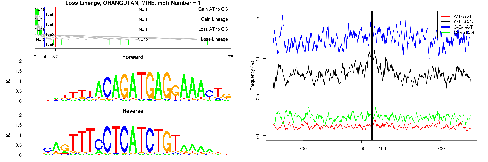
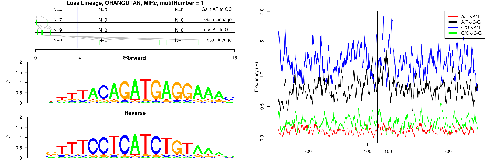
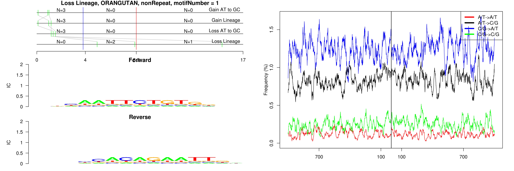

```
## Loss Lineage, ORANGUTAN, AluJr, motifNumber = 1
```

 

```
## Loss Lineage, ORANGUTAN, L1PA13, motifNumber = 1
```

 

```
## Loss Lineage, ORANGUTAN, MIR, motifNumber = 1
```

 

```
## Loss Lineage, ORANGUTAN, MIR3, motifNumber = 1
```

 

```
## Loss Lineage, ORANGUTAN, MIRb, motifNumber = 1
```

 

```
## Loss Lineage, ORANGUTAN, MIRc, motifNumber = 1
```

 

```
## Loss Lineage, ORANGUTAN, nonRepeat, motifNumber = 1
```

 
  
