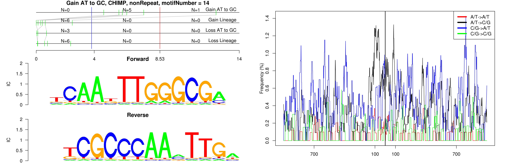
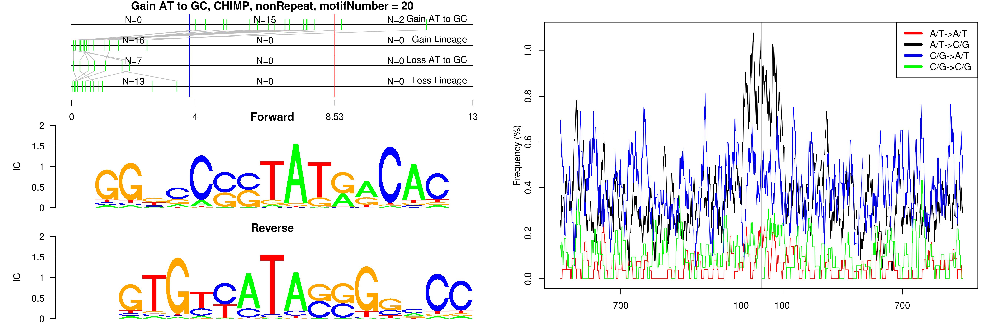
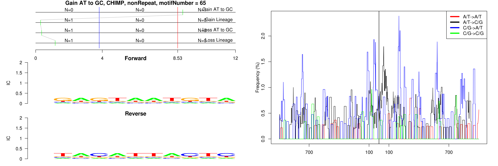
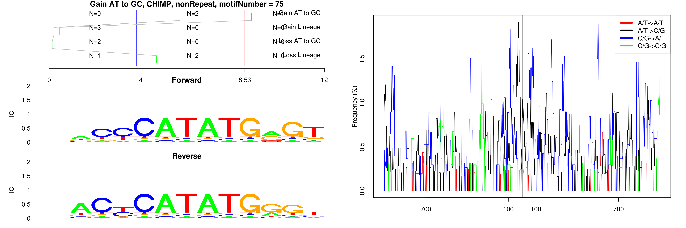

```
## Gain AT to GC, CHIMP, AluJb, motifNumber = 1
```

 

```
## Gain AT to GC, CHIMP, AluJb, motifNumber = 2
```

 

```
## Gain AT to GC, CHIMP, AluJb, motifNumber = 3
```

 

```
## Gain AT to GC, CHIMP, AluJb, motifNumber = 4
```

 

```
## Gain AT to GC, CHIMP, AluJb, motifNumber = 5
```

 

```
## Gain AT to GC, CHIMP, AluJo, motifNumber = 1
```

 

```
## Gain AT to GC, CHIMP, AluSq, motifNumber = 1
```

 

```
## Gain AT to GC, CHIMP, AluSq, motifNumber = 2
```

 

```
## Gain AT to GC, CHIMP, AluSx, motifNumber = 1
```

 

```
## Gain AT to GC, CHIMP, AluSx, motifNumber = 2
```

 

```
## Gain AT to GC, CHIMP, AluSx1, motifNumber = 1
```

 

```
## Gain AT to GC, CHIMP, AluSx1, motifNumber = 2
```

 

```
## Gain AT to GC, CHIMP, AluSx1, motifNumber = 3
```

 

```
## Gain AT to GC, CHIMP, AluSx1, motifNumber = 4
```

 

```
## Gain AT to GC, CHIMP, AluSz6, motifNumber = 1
```

 

```
## Gain AT to GC, CHIMP, AluSz6, motifNumber = 2
```

 

```
## Gain AT to GC, CHIMP, L1MEc, motifNumber = 1
```

 

```
## Gain AT to GC, CHIMP, L1MEc, motifNumber = 2
```

 

```
## Gain AT to GC, CHIMP, L2c, motifNumber = 1
```

 

```
## Gain AT to GC, CHIMP, L2c, motifNumber = 2
```

 

```
## Gain AT to GC, CHIMP, L2c, motifNumber = 3
```

 

```
## Gain AT to GC, CHIMP, L2c, motifNumber = 4
```

 

```
## Gain AT to GC, CHIMP, L2c, motifNumber = 5
```

 

```
## Gain AT to GC, CHIMP, L2c, motifNumber = 6
```

 

```
## Gain AT to GC, CHIMP, MIRb, motifNumber = 1
```

 

```
## Gain AT to GC, CHIMP, MIRb, motifNumber = 2
```

 

```
## Gain AT to GC, CHIMP, nonRepeat, motifNumber = 1
```

 

```
## Gain AT to GC, CHIMP, nonRepeat, motifNumber = 2
```

 

```
## Gain AT to GC, CHIMP, nonRepeat, motifNumber = 3
```

 

```
## Gain AT to GC, CHIMP, nonRepeat, motifNumber = 4
```

 

```
## Gain AT to GC, CHIMP, nonRepeat, motifNumber = 5
```

 

```
## Gain AT to GC, CHIMP, nonRepeat, motifNumber = 6
```

 

```
## Gain AT to GC, CHIMP, nonRepeat, motifNumber = 7
```

 

```
## Gain AT to GC, CHIMP, nonRepeat, motifNumber = 8
```

 

```
## Gain AT to GC, CHIMP, nonRepeat, motifNumber = 9
```

 

```
## Gain AT to GC, CHIMP, nonRepeat, motifNumber = 10
```

 

```
## Gain AT to GC, CHIMP, nonRepeat, motifNumber = 11
```

 

```
## Gain AT to GC, CHIMP, nonRepeat, motifNumber = 12
```

 

```
## Gain AT to GC, CHIMP, nonRepeat, motifNumber = 13
```

 

```
## Gain AT to GC, CHIMP, nonRepeat, motifNumber = 14
```

 

```
## Gain AT to GC, CHIMP, nonRepeat, motifNumber = 15
```

 

```
## Gain AT to GC, CHIMP, nonRepeat, motifNumber = 16
```

 

```
## Gain AT to GC, CHIMP, nonRepeat, motifNumber = 17
```

 

```
## Gain AT to GC, CHIMP, nonRepeat, motifNumber = 18
```

 

```
## Gain AT to GC, CHIMP, nonRepeat, motifNumber = 19
```

 

```
## Gain AT to GC, CHIMP, nonRepeat, motifNumber = 20
```

 

```
## Gain AT to GC, CHIMP, nonRepeat, motifNumber = 21
```

 

```
## Gain AT to GC, CHIMP, nonRepeat, motifNumber = 22
```

 

```
## Gain AT to GC, CHIMP, nonRepeat, motifNumber = 23
```

 

```
## Gain AT to GC, CHIMP, nonRepeat, motifNumber = 24
```

 

```
## Gain AT to GC, CHIMP, nonRepeat, motifNumber = 25
```

 

```
## Gain AT to GC, CHIMP, nonRepeat, motifNumber = 26
```

 

```
## Gain AT to GC, CHIMP, nonRepeat, motifNumber = 27
```

 

```
## Gain AT to GC, CHIMP, nonRepeat, motifNumber = 28
```

 

```
## Gain AT to GC, CHIMP, nonRepeat, motifNumber = 29
```

 

```
## Gain AT to GC, CHIMP, nonRepeat, motifNumber = 30
```

 

```
## Gain AT to GC, CHIMP, nonRepeat, motifNumber = 31
```

 

```
## Gain AT to GC, CHIMP, nonRepeat, motifNumber = 32
```

 

```
## Gain AT to GC, CHIMP, nonRepeat, motifNumber = 33
```

 

```
## Gain AT to GC, CHIMP, nonRepeat, motifNumber = 34
```

 

```
## Gain AT to GC, CHIMP, nonRepeat, motifNumber = 35
```

 

```
## Gain AT to GC, CHIMP, nonRepeat, motifNumber = 36
```

 

```
## Gain AT to GC, CHIMP, nonRepeat, motifNumber = 37
```

 

```
## Gain AT to GC, CHIMP, nonRepeat, motifNumber = 38
```

 

```
## Gain AT to GC, CHIMP, nonRepeat, motifNumber = 39
```

 

```
## Gain AT to GC, CHIMP, nonRepeat, motifNumber = 40
```

 

```
## Gain AT to GC, CHIMP, nonRepeat, motifNumber = 41
```

 

```
## Gain AT to GC, CHIMP, nonRepeat, motifNumber = 42
```

 

```
## Gain AT to GC, CHIMP, nonRepeat, motifNumber = 43
```

 

```
## Gain AT to GC, CHIMP, nonRepeat, motifNumber = 44
```

 

```
## Gain AT to GC, CHIMP, nonRepeat, motifNumber = 45
```

 

```
## Gain AT to GC, CHIMP, nonRepeat, motifNumber = 46
```

 

```
## Gain AT to GC, CHIMP, nonRepeat, motifNumber = 47
```

 

```
## Gain AT to GC, CHIMP, nonRepeat, motifNumber = 48
```

 

```
## Gain AT to GC, CHIMP, nonRepeat, motifNumber = 49
```

 

```
## Gain AT to GC, CHIMP, nonRepeat, motifNumber = 50
```

 

```
## Gain AT to GC, CHIMP, nonRepeat, motifNumber = 51
```

 

```
## Gain AT to GC, CHIMP, nonRepeat, motifNumber = 52
```

 

```
## Gain AT to GC, CHIMP, nonRepeat, motifNumber = 53
```

 

```
## Gain AT to GC, CHIMP, nonRepeat, motifNumber = 54
```

 

```
## Gain AT to GC, CHIMP, nonRepeat, motifNumber = 55
```

 

```
## Gain AT to GC, CHIMP, nonRepeat, motifNumber = 56
```

 

```
## Gain AT to GC, CHIMP, nonRepeat, motifNumber = 57
```

 

```
## Gain AT to GC, CHIMP, nonRepeat, motifNumber = 58
```

 

```
## Gain AT to GC, CHIMP, nonRepeat, motifNumber = 59
```

 

```
## Gain AT to GC, CHIMP, nonRepeat, motifNumber = 60
```

 

```
## Gain AT to GC, CHIMP, nonRepeat, motifNumber = 61
```

 

```
## Gain AT to GC, CHIMP, nonRepeat, motifNumber = 62
```

 

```
## Gain AT to GC, CHIMP, nonRepeat, motifNumber = 63
```

 

```
## Gain AT to GC, CHIMP, nonRepeat, motifNumber = 64
```

 

```
## Gain AT to GC, CHIMP, nonRepeat, motifNumber = 65
```

 

```
## Gain AT to GC, CHIMP, nonRepeat, motifNumber = 66
```

 

```
## Gain AT to GC, CHIMP, nonRepeat, motifNumber = 67
```

 

```
## Gain AT to GC, CHIMP, nonRepeat, motifNumber = 68
```

 

```
## Gain AT to GC, CHIMP, nonRepeat, motifNumber = 69
```

 

```
## Gain AT to GC, CHIMP, nonRepeat, motifNumber = 70
```

 

```
## Gain AT to GC, CHIMP, nonRepeat, motifNumber = 71
```

 

```
## Gain AT to GC, CHIMP, nonRepeat, motifNumber = 72
```

 

```
## Gain AT to GC, CHIMP, nonRepeat, motifNumber = 73
```

 

```
## Gain AT to GC, CHIMP, nonRepeat, motifNumber = 74
```

 

```
## Gain AT to GC, CHIMP, nonRepeat, motifNumber = 75
```

 
  
