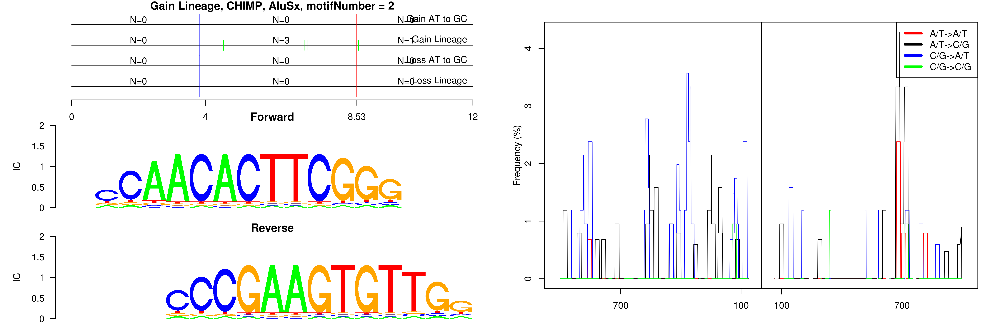

```
## Gain Lineage, CHIMP, AluJo, motifNumber = 1
```

 

```
## Gain Lineage, CHIMP, AluJr, motifNumber = 1
```

 

```
## Gain Lineage, CHIMP, AluSq2, motifNumber = 1
```

 

```
## Gain Lineage, CHIMP, AluSx, motifNumber = 1
```

 

```
## Gain Lineage, CHIMP, AluSx, motifNumber = 2
```

 

```
## Gain Lineage, CHIMP, AluSx1, motifNumber = 1
```

 

```
## Gain Lineage, CHIMP, AluSx1, motifNumber = 2
```

 

```
## Gain Lineage, CHIMP, AluSx1, motifNumber = 3
```

 

```
## Gain Lineage, CHIMP, AluSx1, motifNumber = 4
```

 

```
## Gain Lineage, CHIMP, AluSx1, motifNumber = 5
```

 

```
## Gain Lineage, CHIMP, AluSx1, motifNumber = 6
```

 

```
## Gain Lineage, CHIMP, AluSx1, motifNumber = 7
```

 

```
## Gain Lineage, CHIMP, AluSz6, motifNumber = 1
```

 

```
## Gain Lineage, CHIMP, MLT1C, motifNumber = 1
```

 

```
## Gain Lineage, CHIMP, nonRepeat, motifNumber = 1
```

 

```
## Gain Lineage, CHIMP, nonRepeat, motifNumber = 2
```

 

```
## Gain Lineage, CHIMP, nonRepeat, motifNumber = 3
```

 

```
## Gain Lineage, CHIMP, nonRepeat, motifNumber = 4
```

 

```
## Gain Lineage, CHIMP, nonRepeat, motifNumber = 5
```

 
  
