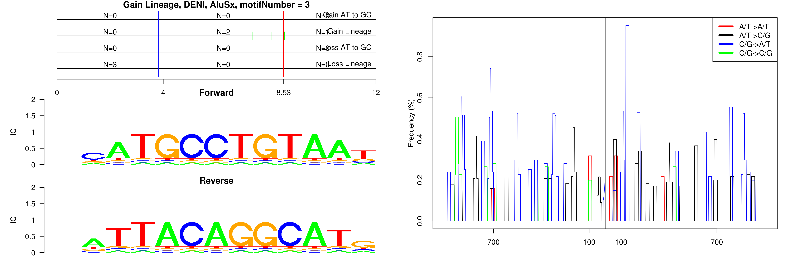

```
## Gain Lineage, DENI, AluJb, motifNumber = 1
```

 

```
## Gain Lineage, DENI, AluSg, motifNumber = 1
```

 

```
## Gain Lineage, DENI, AluSq2, motifNumber = 1
```

 

```
## Gain Lineage, DENI, AluSx, motifNumber = 1
```

 

```
## Gain Lineage, DENI, AluSx, motifNumber = 2
```

 

```
## Gain Lineage, DENI, AluSx, motifNumber = 3
```

 

```
## Gain Lineage, DENI, AluSx1, motifNumber = 1
```

 

```
## Gain Lineage, DENI, AluSx1, motifNumber = 2
```

 

```
## Gain Lineage, DENI, AluSx1, motifNumber = 3
```

 

```
## Gain Lineage, DENI, AluY, motifNumber = 1
```

 

```
## Gain Lineage, DENI, AluY, motifNumber = 2
```

 

```
## Gain Lineage, DENI, AluY, motifNumber = 3
```

 

```
## Gain Lineage, DENI, nonRepeat, motifNumber = 1
```

 
  
