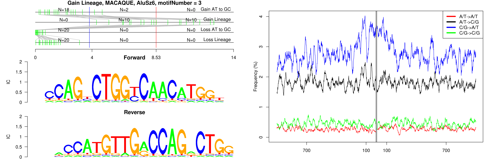

```
## Gain Lineage, MACAQUE, AluJb, motifNumber = 1
```

 

```
## Gain Lineage, MACAQUE, AluJb, motifNumber = 2
```

 

```
## Gain Lineage, MACAQUE, AluJb, motifNumber = 3
```

 

```
## Gain Lineage, MACAQUE, AluJo, motifNumber = 1
```

 

```
## Gain Lineage, MACAQUE, AluJo, motifNumber = 2
```

 

```
## Gain Lineage, MACAQUE, AluJo, motifNumber = 3
```

 

```
## Gain Lineage, MACAQUE, AluJr, motifNumber = 1
```

 

```
## Gain Lineage, MACAQUE, AluJr, motifNumber = 2
```

 

```
## Gain Lineage, MACAQUE, AluJr, motifNumber = 3
```

 

```
## Gain Lineage, MACAQUE, AluJr, motifNumber = 4
```

 

```
## Gain Lineage, MACAQUE, AluSc, motifNumber = 1
```

 

```
## Gain Lineage, MACAQUE, AluSg, motifNumber = 1
```

 

```
## Gain Lineage, MACAQUE, AluSg, motifNumber = 2
```

 

```
## Gain Lineage, MACAQUE, AluSp, motifNumber = 1
```

 

```
## Gain Lineage, MACAQUE, AluSp, motifNumber = 2
```

 

```
## Gain Lineage, MACAQUE, AluSq, motifNumber = 1
```

 

```
## Gain Lineage, MACAQUE, AluSq2, motifNumber = 1
```

 

```
## Gain Lineage, MACAQUE, AluSq2, motifNumber = 2
```

 

```
## Gain Lineage, MACAQUE, AluSq2, motifNumber = 3
```

 

```
## Gain Lineage, MACAQUE, AluSq2, motifNumber = 4
```

 

```
## Gain Lineage, MACAQUE, AluSq2, motifNumber = 5
```

 

```
## Gain Lineage, MACAQUE, AluSx, motifNumber = 1
```

 

```
## Gain Lineage, MACAQUE, AluSx, motifNumber = 2
```

 

```
## Gain Lineage, MACAQUE, AluSx, motifNumber = 3
```

 

```
## Gain Lineage, MACAQUE, AluSx, motifNumber = 4
```

 

```
## Gain Lineage, MACAQUE, AluSx1, motifNumber = 1
```

 

```
## Gain Lineage, MACAQUE, AluSx1, motifNumber = 2
```

 

```
## Gain Lineage, MACAQUE, AluSx1, motifNumber = 3
```

 

```
## Gain Lineage, MACAQUE, AluSx1, motifNumber = 4
```

 

```
## Gain Lineage, MACAQUE, AluSz, motifNumber = 1
```

 

```
## Gain Lineage, MACAQUE, AluSz, motifNumber = 2
```

 

```
## Gain Lineage, MACAQUE, AluSz6, motifNumber = 1
```

 

```
## Gain Lineage, MACAQUE, AluSz6, motifNumber = 2
```

 

```
## Gain Lineage, MACAQUE, AluSz6, motifNumber = 3
```

 

```
## Gain Lineage, MACAQUE, AluSz6, motifNumber = 4
```

 

```
## Gain Lineage, MACAQUE, AluY, motifNumber = 1
```

 

```
## Gain Lineage, MACAQUE, nonRepeat, motifNumber = 1
```

 

```
## Gain Lineage, MACAQUE, THE1A, motifNumber = 1
```

 

```
## Gain Lineage, MACAQUE, THE1B, motifNumber = 1
```

 

```
## Gain Lineage, MACAQUE, THE1B-int, motifNumber = 1
```

 

```
## Gain Lineage, MACAQUE, THE1C, motifNumber = 1
```

 

```
## Gain Lineage, MACAQUE, THE1D, motifNumber = 1
```

 
  
