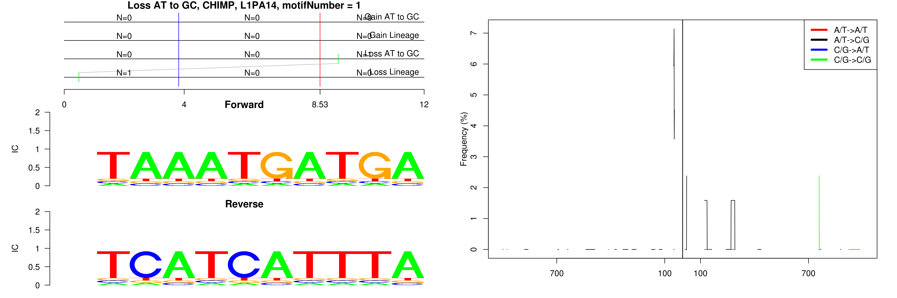
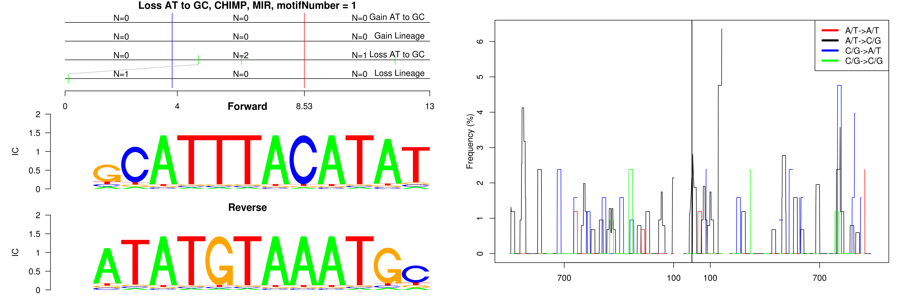
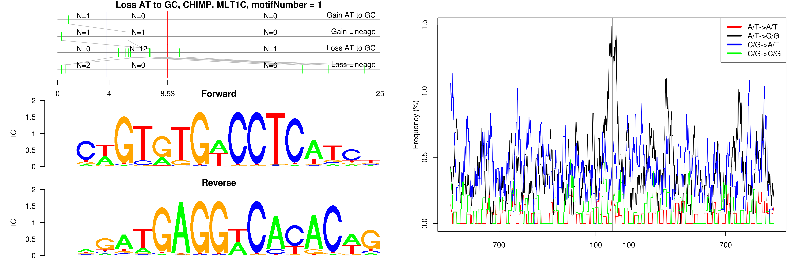
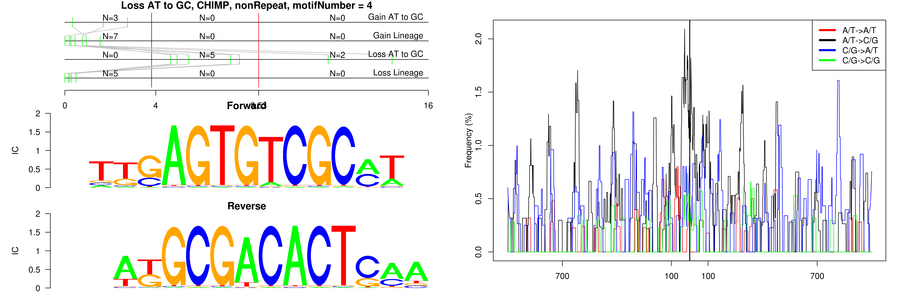
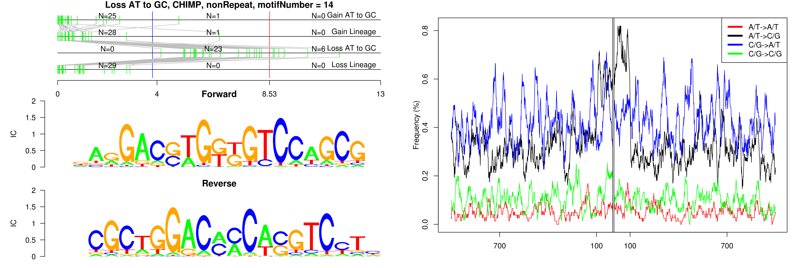
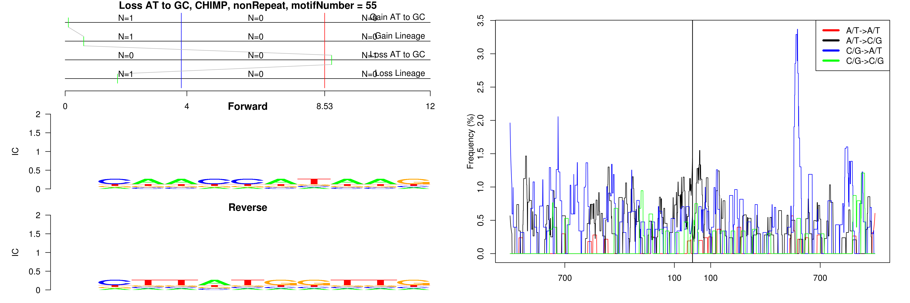

```
## Loss AT to GC, CHIMP, AluJb, motifNumber = 1
```

 

```
## Loss AT to GC, CHIMP, AluJb, motifNumber = 2
```

 

```
## Loss AT to GC, CHIMP, AluJb, motifNumber = 3
```

 

```
## Loss AT to GC, CHIMP, AluSx, motifNumber = 1
```

 

```
## Loss AT to GC, CHIMP, AluSz, motifNumber = 1
```

 

```
## Loss AT to GC, CHIMP, L1M1, motifNumber = 1
```

 

```
## Loss AT to GC, CHIMP, L1M5, motifNumber = 1
```

 

```
## Loss AT to GC, CHIMP, L1MA9, motifNumber = 1
```

 

```
## Loss AT to GC, CHIMP, L1MB3, motifNumber = 1
```

 

```
## Loss AT to GC, CHIMP, L1MB3, motifNumber = 2
```

 

```
## Loss AT to GC, CHIMP, L1MB3, motifNumber = 3
```

 

```
## Loss AT to GC, CHIMP, L1MB7, motifNumber = 1
```

 

```
## Loss AT to GC, CHIMP, L1ME1, motifNumber = 1
```

 

```
## Loss AT to GC, CHIMP, L1ME2, motifNumber = 1
```

 

```
## Loss AT to GC, CHIMP, L1MEc, motifNumber = 1
```

 

```
## Loss AT to GC, CHIMP, L1MEc, motifNumber = 2
```

 

```
## Loss AT to GC, CHIMP, L1MEc, motifNumber = 3
```

 

```
## Loss AT to GC, CHIMP, L1MEc, motifNumber = 4
```

 

```
## Loss AT to GC, CHIMP, L1MEc, motifNumber = 5
```

 

```
## Loss AT to GC, CHIMP, L1MEc, motifNumber = 6
```

 

```
## Loss AT to GC, CHIMP, L1MEc, motifNumber = 7
```

 

```
## Loss AT to GC, CHIMP, L1PA13, motifNumber = 1
```

 

```
## Loss AT to GC, CHIMP, L1PA13, motifNumber = 2
```

 

```
## Loss AT to GC, CHIMP, L1PA14, motifNumber = 1
```

 

```
## Loss AT to GC, CHIMP, L1PA15, motifNumber = 1
```

 

```
## Loss AT to GC, CHIMP, L1PA17, motifNumber = 1
```

 

```
## Loss AT to GC, CHIMP, L1PA17, motifNumber = 2
```

 

```
## Loss AT to GC, CHIMP, L2a, motifNumber = 1
```

 

```
## Loss AT to GC, CHIMP, L2a, motifNumber = 2
```

 

```
## Loss AT to GC, CHIMP, L2a, motifNumber = 3
```

 

```
## Loss AT to GC, CHIMP, L2b, motifNumber = 1
```

 

```
## Loss AT to GC, CHIMP, L2c, motifNumber = 1
```

 

```
## Loss AT to GC, CHIMP, L2c, motifNumber = 2
```

 

```
## Loss AT to GC, CHIMP, L2c, motifNumber = 3
```

 

```
## Loss AT to GC, CHIMP, L2c, motifNumber = 4
```

 

```
## Loss AT to GC, CHIMP, L2c, motifNumber = 5
```

 

```
## Loss AT to GC, CHIMP, L2c, motifNumber = 6
```

 

```
## Loss AT to GC, CHIMP, L2c, motifNumber = 7
```

 

```
## Loss AT to GC, CHIMP, L2c, motifNumber = 8
```

 

```
## Loss AT to GC, CHIMP, L2c, motifNumber = 9
```

 

```
## Loss AT to GC, CHIMP, L2c, motifNumber = 10
```

 

```
## Loss AT to GC, CHIMP, L2c, motifNumber = 11
```

 

```
## Loss AT to GC, CHIMP, L2c, motifNumber = 12
```

 

```
## Loss AT to GC, CHIMP, L2c, motifNumber = 13
```

 

```
## Loss AT to GC, CHIMP, L2c, motifNumber = 14
```

 

```
## Loss AT to GC, CHIMP, L2c, motifNumber = 15
```

 

```
## Loss AT to GC, CHIMP, MER41B, motifNumber = 1
```

 

```
## Loss AT to GC, CHIMP, MIR, motifNumber = 1
```

 

```
## Loss AT to GC, CHIMP, MIR, motifNumber = 2
```

 

```
## Loss AT to GC, CHIMP, MIR, motifNumber = 3
```

 

```
## Loss AT to GC, CHIMP, MIR, motifNumber = 4
```

 

```
## Loss AT to GC, CHIMP, MIR, motifNumber = 5
```

 

```
## Loss AT to GC, CHIMP, MIRb, motifNumber = 1
```

 

```
## Loss AT to GC, CHIMP, MIRb, motifNumber = 2
```

 

```
## Loss AT to GC, CHIMP, MLT1C, motifNumber = 1
```

 

```
## Loss AT to GC, CHIMP, MLT1D, motifNumber = 1
```

 

```
## Loss AT to GC, CHIMP, MLT1D, motifNumber = 2
```

 

```
## Loss AT to GC, CHIMP, MLT2B1, motifNumber = 1
```

 

```
## Loss AT to GC, CHIMP, MLT2B1, motifNumber = 2
```

 

```
## Loss AT to GC, CHIMP, nonRepeat, motifNumber = 1
```

 

```
## Loss AT to GC, CHIMP, nonRepeat, motifNumber = 2
```

 

```
## Loss AT to GC, CHIMP, nonRepeat, motifNumber = 3
```

 

```
## Loss AT to GC, CHIMP, nonRepeat, motifNumber = 4
```

 

```
## Loss AT to GC, CHIMP, nonRepeat, motifNumber = 5
```

 

```
## Loss AT to GC, CHIMP, nonRepeat, motifNumber = 6
```

 

```
## Loss AT to GC, CHIMP, nonRepeat, motifNumber = 7
```

 

```
## Loss AT to GC, CHIMP, nonRepeat, motifNumber = 8
```

 

```
## Loss AT to GC, CHIMP, nonRepeat, motifNumber = 9
```

 

```
## Loss AT to GC, CHIMP, nonRepeat, motifNumber = 10
```

 

```
## Loss AT to GC, CHIMP, nonRepeat, motifNumber = 11
```

 

```
## Loss AT to GC, CHIMP, nonRepeat, motifNumber = 12
```

 

```
## Loss AT to GC, CHIMP, nonRepeat, motifNumber = 13
```

 

```
## Loss AT to GC, CHIMP, nonRepeat, motifNumber = 14
```

 

```
## Loss AT to GC, CHIMP, nonRepeat, motifNumber = 15
```

 

```
## Loss AT to GC, CHIMP, nonRepeat, motifNumber = 16
```

 

```
## Loss AT to GC, CHIMP, nonRepeat, motifNumber = 17
```

 

```
## Loss AT to GC, CHIMP, nonRepeat, motifNumber = 18
```

 

```
## Loss AT to GC, CHIMP, nonRepeat, motifNumber = 19
```

 

```
## Loss AT to GC, CHIMP, nonRepeat, motifNumber = 20
```

 

```
## Loss AT to GC, CHIMP, nonRepeat, motifNumber = 21
```

 

```
## Loss AT to GC, CHIMP, nonRepeat, motifNumber = 22
```

 

```
## Loss AT to GC, CHIMP, nonRepeat, motifNumber = 23
```

 

```
## Loss AT to GC, CHIMP, nonRepeat, motifNumber = 24
```

 

```
## Loss AT to GC, CHIMP, nonRepeat, motifNumber = 25
```

 

```
## Loss AT to GC, CHIMP, nonRepeat, motifNumber = 26
```

 

```
## Loss AT to GC, CHIMP, nonRepeat, motifNumber = 27
```

 

```
## Loss AT to GC, CHIMP, nonRepeat, motifNumber = 28
```

 

```
## Loss AT to GC, CHIMP, nonRepeat, motifNumber = 29
```

 

```
## Loss AT to GC, CHIMP, nonRepeat, motifNumber = 30
```

 

```
## Loss AT to GC, CHIMP, nonRepeat, motifNumber = 31
```

 

```
## Loss AT to GC, CHIMP, nonRepeat, motifNumber = 32
```

 

```
## Loss AT to GC, CHIMP, nonRepeat, motifNumber = 33
```

 

```
## Loss AT to GC, CHIMP, nonRepeat, motifNumber = 34
```

 

```
## Loss AT to GC, CHIMP, nonRepeat, motifNumber = 35
```

 

```
## Loss AT to GC, CHIMP, nonRepeat, motifNumber = 36
```

 

```
## Loss AT to GC, CHIMP, nonRepeat, motifNumber = 37
```

 

```
## Loss AT to GC, CHIMP, nonRepeat, motifNumber = 38
```

 

```
## Loss AT to GC, CHIMP, nonRepeat, motifNumber = 39
```

 

```
## Loss AT to GC, CHIMP, nonRepeat, motifNumber = 40
```

 

```
## Loss AT to GC, CHIMP, nonRepeat, motifNumber = 41
```

 

```
## Loss AT to GC, CHIMP, nonRepeat, motifNumber = 42
```

 

```
## Loss AT to GC, CHIMP, nonRepeat, motifNumber = 43
```

 

```
## Loss AT to GC, CHIMP, nonRepeat, motifNumber = 44
```

 

```
## Loss AT to GC, CHIMP, nonRepeat, motifNumber = 45
```

 

```
## Loss AT to GC, CHIMP, nonRepeat, motifNumber = 46
```

 

```
## Loss AT to GC, CHIMP, nonRepeat, motifNumber = 47
```

 

```
## Loss AT to GC, CHIMP, nonRepeat, motifNumber = 48
```

 

```
## Loss AT to GC, CHIMP, nonRepeat, motifNumber = 49
```

 

```
## Loss AT to GC, CHIMP, nonRepeat, motifNumber = 50
```

 

```
## Loss AT to GC, CHIMP, nonRepeat, motifNumber = 51
```

 

```
## Loss AT to GC, CHIMP, nonRepeat, motifNumber = 52
```

 

```
## Loss AT to GC, CHIMP, nonRepeat, motifNumber = 53
```

 

```
## Loss AT to GC, CHIMP, nonRepeat, motifNumber = 54
```

 

```
## Loss AT to GC, CHIMP, nonRepeat, motifNumber = 55
```

 

```
## Loss AT to GC, CHIMP, nonRepeat, motifNumber = 56
```

 
  
