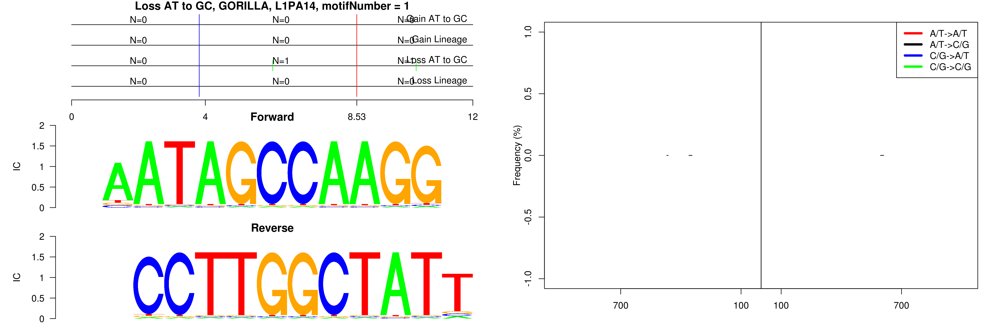
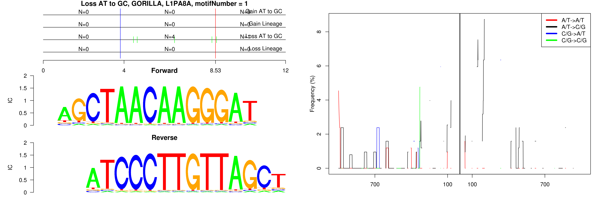
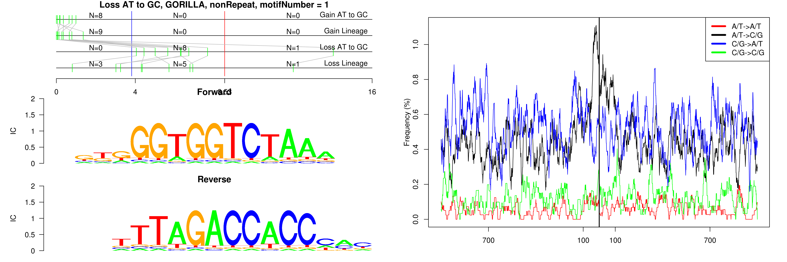
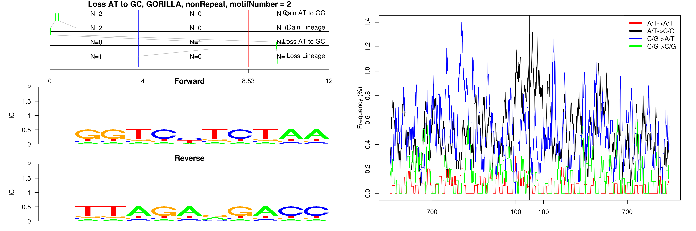

```
## Loss AT to GC, GORILLA, L1PA14, motifNumber = 1
```

 

```
## Loss AT to GC, GORILLA, L1PA8A, motifNumber = 1
```

 

```
## Loss AT to GC, GORILLA, nonRepeat, motifNumber = 1
```

 

```
## Loss AT to GC, GORILLA, nonRepeat, motifNumber = 2
```

 
  
