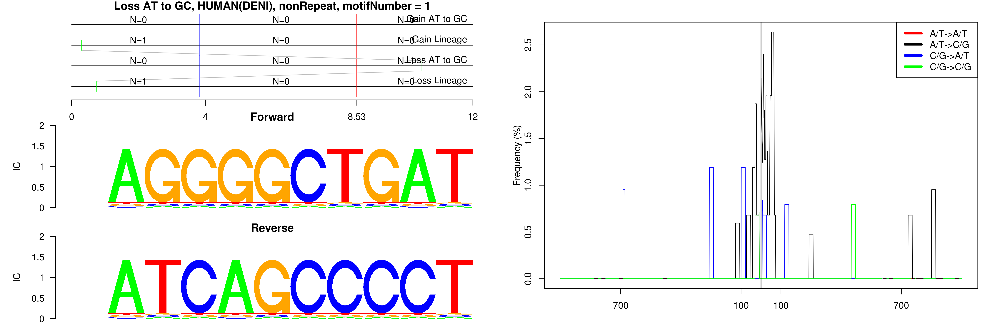
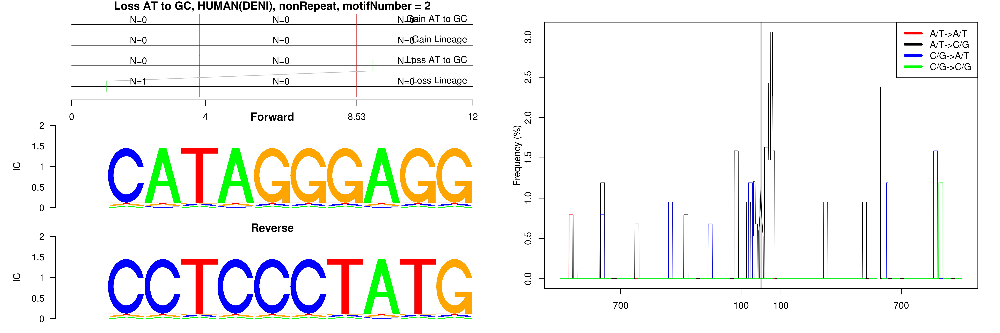
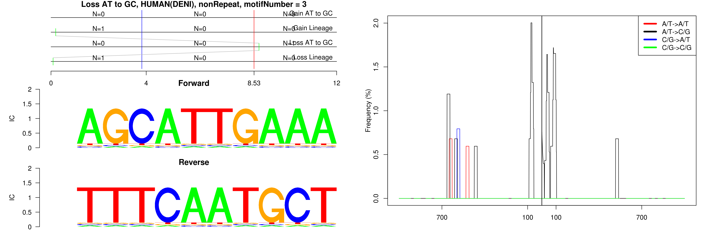

```
## Loss AT to GC, HUMAN(DENI), nonRepeat, motifNumber = 1
```

 

```
## Loss AT to GC, HUMAN(DENI), nonRepeat, motifNumber = 2
```

 

```
## Loss AT to GC, HUMAN(DENI), nonRepeat, motifNumber = 3
```

 
  
