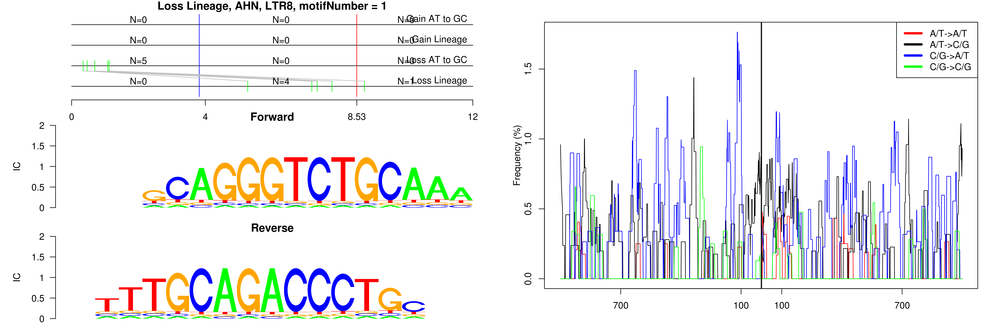

```
## Loss Lineage, AHN, AluSx, motifNumber = 1
```

 

```
## Loss Lineage, AHN, LTR8, motifNumber = 1
```

 

```
## Loss Lineage, AHN, MER20, motifNumber = 1
```

 

```
## Loss Lineage, AHN, MER5A, motifNumber = 1
```

 

```
## Loss Lineage, AHN, MSTA, motifNumber = 1
```

 

```
## Loss Lineage, AHN, MSTB, motifNumber = 1
```

 

```
## Loss Lineage, AHN, nonRepeat, motifNumber = 1
```

 
  
