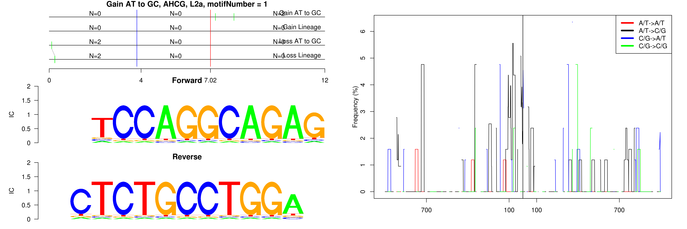
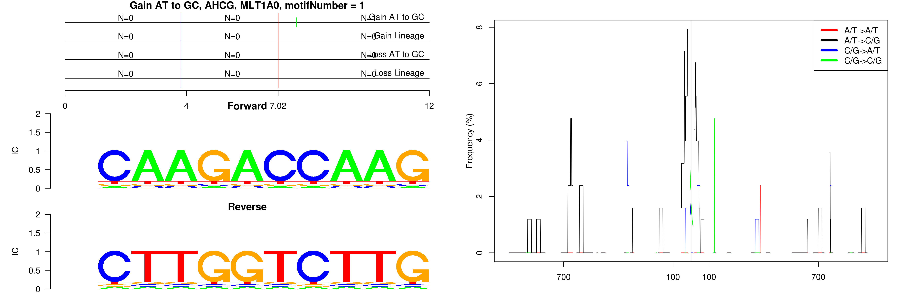
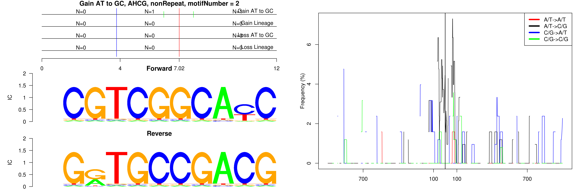

```
## Gain AT to GC, AHCG, L2a, motifNumber = 1
```

 

```
## Gain AT to GC, AHCG, MLT1A0, motifNumber = 1
```

 

```
## Gain AT to GC, AHCG, nonRepeat, motifNumber = 1
```

 

```
## Gain AT to GC, AHCG, nonRepeat, motifNumber = 2
```

 
  
