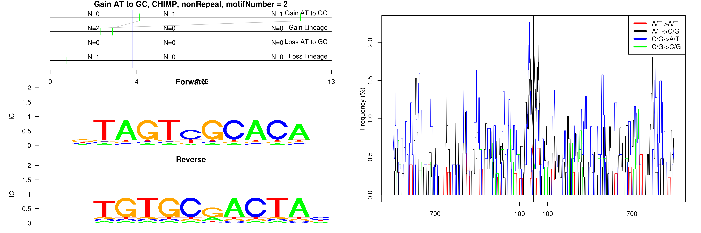
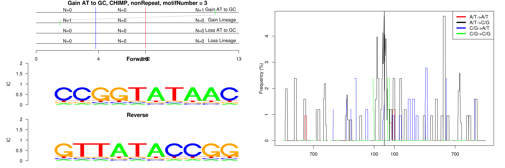
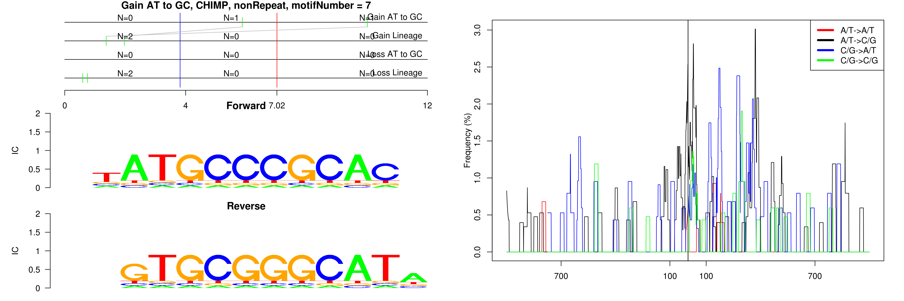
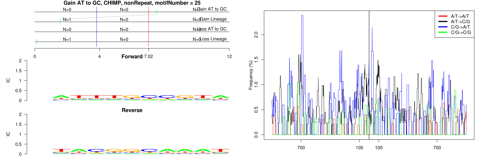

```
## Gain AT to GC, CHIMP, HAL1, motifNumber = 1
```

 

```
## Gain AT to GC, CHIMP, L2a, motifNumber = 1
```

 

```
## Gain AT to GC, CHIMP, L2c, motifNumber = 1
```

 

```
## Gain AT to GC, CHIMP, L2c, motifNumber = 2
```

 

```
## Gain AT to GC, CHIMP, L2c, motifNumber = 3
```

 

```
## Gain AT to GC, CHIMP, MIR, motifNumber = 1
```

 

```
## Gain AT to GC, CHIMP, MIR, motifNumber = 2
```

 

```
## Gain AT to GC, CHIMP, MIRb, motifNumber = 1
```

 

```
## Gain AT to GC, CHIMP, MIRb, motifNumber = 2
```

 

```
## Gain AT to GC, CHIMP, nonRepeat, motifNumber = 1
```

 

```
## Gain AT to GC, CHIMP, nonRepeat, motifNumber = 2
```

 

```
## Gain AT to GC, CHIMP, nonRepeat, motifNumber = 3
```

 

```
## Gain AT to GC, CHIMP, nonRepeat, motifNumber = 4
```

 

```
## Gain AT to GC, CHIMP, nonRepeat, motifNumber = 5
```

 

```
## Gain AT to GC, CHIMP, nonRepeat, motifNumber = 6
```

 

```
## Gain AT to GC, CHIMP, nonRepeat, motifNumber = 7
```

 

```
## Gain AT to GC, CHIMP, nonRepeat, motifNumber = 8
```

 

```
## Gain AT to GC, CHIMP, nonRepeat, motifNumber = 9
```

 

```
## Gain AT to GC, CHIMP, nonRepeat, motifNumber = 10
```

 

```
## Gain AT to GC, CHIMP, nonRepeat, motifNumber = 11
```

 

```
## Gain AT to GC, CHIMP, nonRepeat, motifNumber = 12
```

 

```
## Gain AT to GC, CHIMP, nonRepeat, motifNumber = 13
```

 

```
## Gain AT to GC, CHIMP, nonRepeat, motifNumber = 14
```

 

```
## Gain AT to GC, CHIMP, nonRepeat, motifNumber = 15
```

 

```
## Gain AT to GC, CHIMP, nonRepeat, motifNumber = 16
```

 

```
## Gain AT to GC, CHIMP, nonRepeat, motifNumber = 17
```

 

```
## Gain AT to GC, CHIMP, nonRepeat, motifNumber = 18
```

 

```
## Gain AT to GC, CHIMP, nonRepeat, motifNumber = 19
```

 

```
## Gain AT to GC, CHIMP, nonRepeat, motifNumber = 20
```

 

```
## Gain AT to GC, CHIMP, nonRepeat, motifNumber = 21
```

 

```
## Gain AT to GC, CHIMP, nonRepeat, motifNumber = 22
```

 

```
## Gain AT to GC, CHIMP, nonRepeat, motifNumber = 23
```

 

```
## Gain AT to GC, CHIMP, nonRepeat, motifNumber = 24
```

 

```
## Gain AT to GC, CHIMP, nonRepeat, motifNumber = 25
```

 

```
## Gain AT to GC, CHIMP, nonRepeat, motifNumber = 26
```

 

```
## Gain AT to GC, CHIMP, nonRepeat, motifNumber = 27
```

 

```
## Gain AT to GC, CHIMP, nonRepeat, motifNumber = 28
```

 

```
## Gain AT to GC, CHIMP, nonRepeat, motifNumber = 29
```

 

```
## Gain AT to GC, CHIMP, nonRepeat, motifNumber = 30
```

 

```
## Gain AT to GC, CHIMP, nonRepeat, motifNumber = 31
```

 

```
## Gain AT to GC, CHIMP, nonRepeat, motifNumber = 32
```

 

```
## Gain AT to GC, CHIMP, nonRepeat, motifNumber = 33
```

 

```
## Gain AT to GC, CHIMP, nonRepeat, motifNumber = 34
```

 

```
## Gain AT to GC, CHIMP, nonRepeat, motifNumber = 35
```

 

```
## Gain AT to GC, CHIMP, nonRepeat, motifNumber = 36
```

 

```
## Gain AT to GC, CHIMP, nonRepeat, motifNumber = 37
```

 

```
## Gain AT to GC, CHIMP, nonRepeat, motifNumber = 38
```

 

```
## Gain AT to GC, CHIMP, nonRepeat, motifNumber = 39
```

 

```
## Gain AT to GC, CHIMP, nonRepeat, motifNumber = 40
```

 
  
