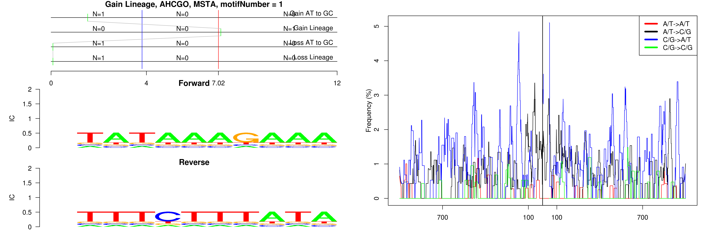

```
## Gain Lineage, AHCGO, L1PA8, motifNumber = 1
```

 

```
## Gain Lineage, AHCGO, L1PA8, motifNumber = 2
```

 

```
## Gain Lineage, AHCGO, L1PB1, motifNumber = 1
```

 

```
## Gain Lineage, AHCGO, MSTA, motifNumber = 1
```

 

```
## Gain Lineage, AHCGO, THE1B, motifNumber = 1
```

 

```
## Gain Lineage, AHCGO, THE1D, motifNumber = 1
```

 
  
