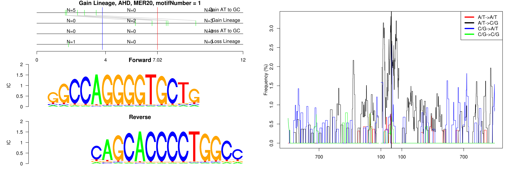
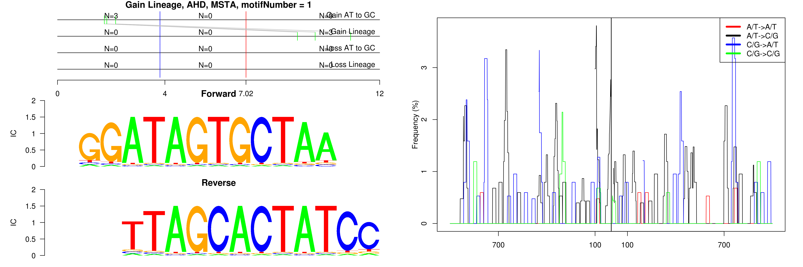
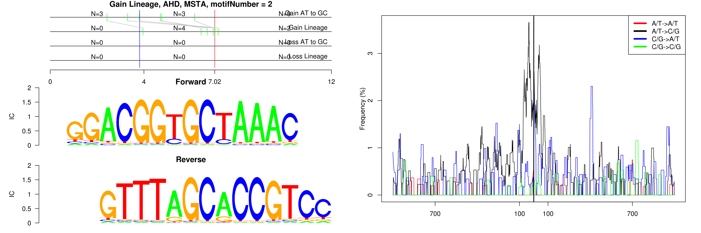

```
## Gain Lineage, AHD, MER20, motifNumber = 1
```

 

```
## Gain Lineage, AHD, MER20, motifNumber = 2
```

 

```
## Gain Lineage, AHD, MSTA, motifNumber = 1
```

 

```
## Gain Lineage, AHD, MSTA, motifNumber = 2
```

 

```
## Gain Lineage, AHD, MSTA, motifNumber = 3
```

 
  
