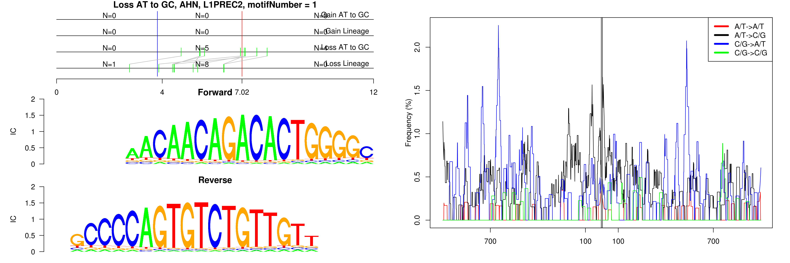
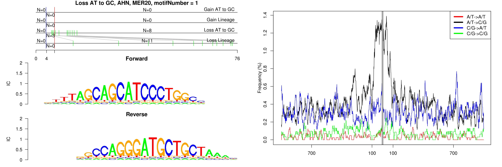
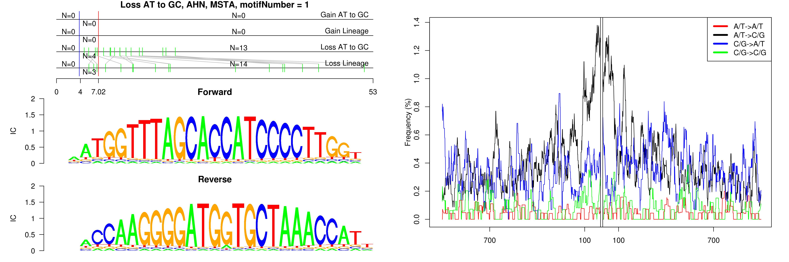
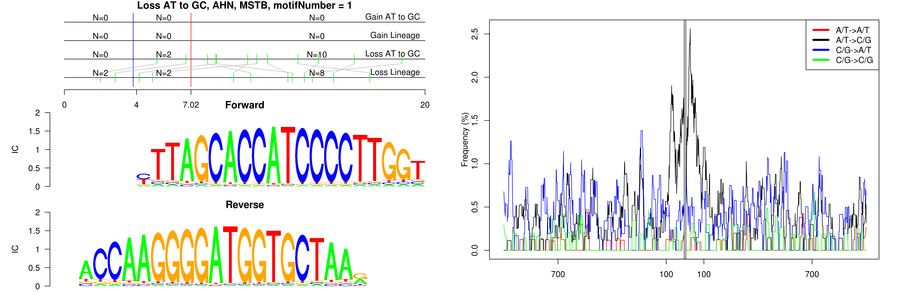
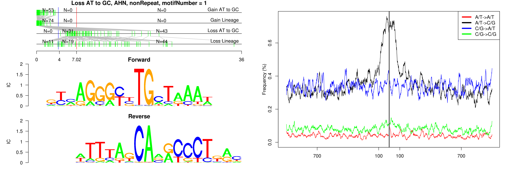
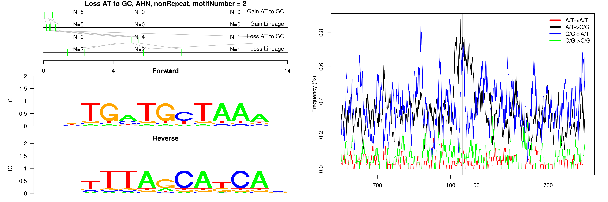
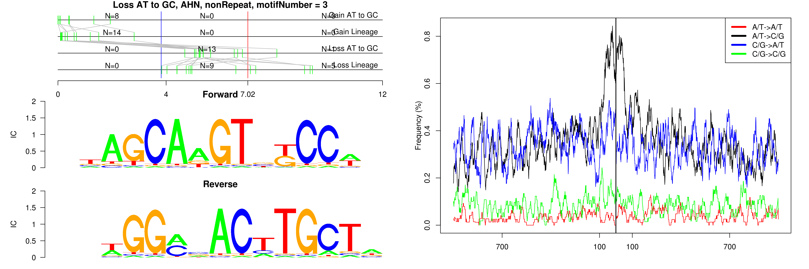

```
## Loss AT to GC, AHN, L1PREC2, motifNumber = 1
```

 

```
## Loss AT to GC, AHN, MER20, motifNumber = 1
```

 

```
## Loss AT to GC, AHN, MSTA, motifNumber = 1
```

 

```
## Loss AT to GC, AHN, MSTB, motifNumber = 1
```

 

```
## Loss AT to GC, AHN, nonRepeat, motifNumber = 1
```

 

```
## Loss AT to GC, AHN, nonRepeat, motifNumber = 2
```

 

```
## Loss AT to GC, AHN, nonRepeat, motifNumber = 3
```

 
  
