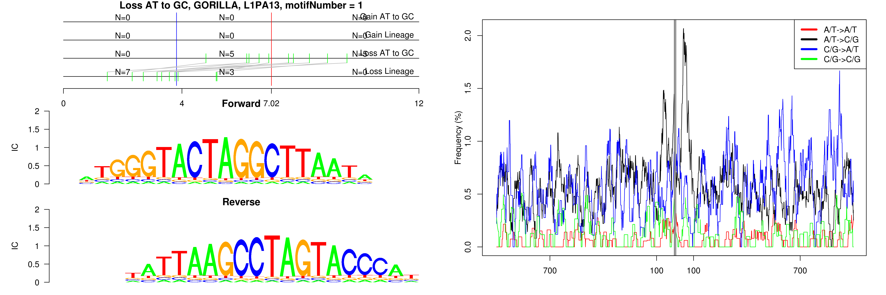
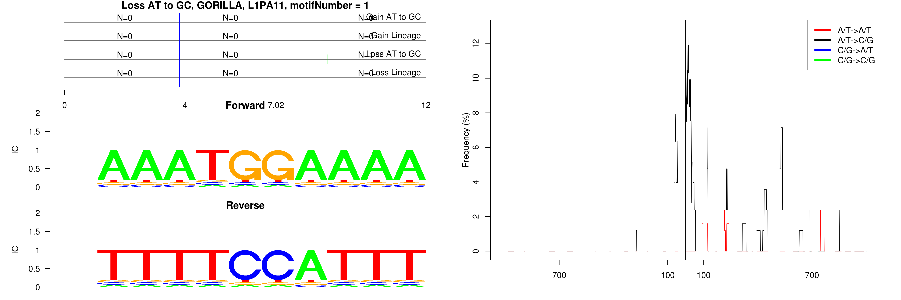
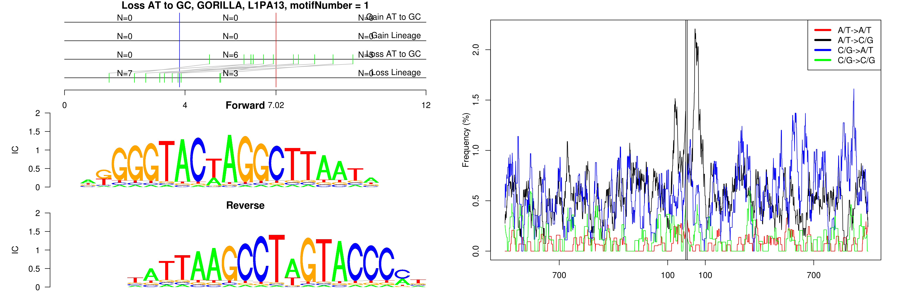
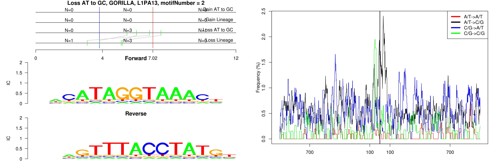
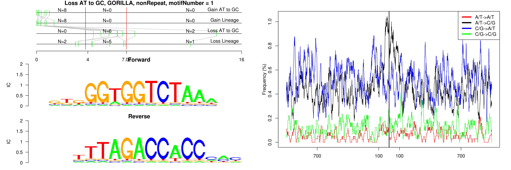
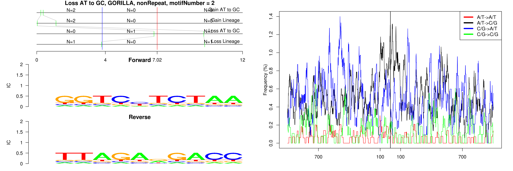

```
## Loss AT to GC, GORILLA, L1MD2, motifNumber = 1
```

 

```
## Loss AT to GC, GORILLA, L1PA11, motifNumber = 1
```

 

```
## Loss AT to GC, GORILLA, L1PA13, motifNumber = 1
```

 

```
## Loss AT to GC, GORILLA, L1PA13, motifNumber = 2
```

 

```
## Loss AT to GC, GORILLA, nonRepeat, motifNumber = 1
```

 

```
## Loss AT to GC, GORILLA, nonRepeat, motifNumber = 2
```

 
  
