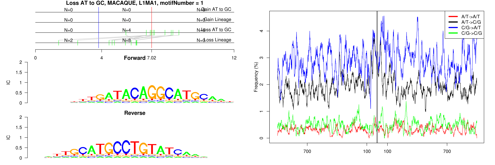
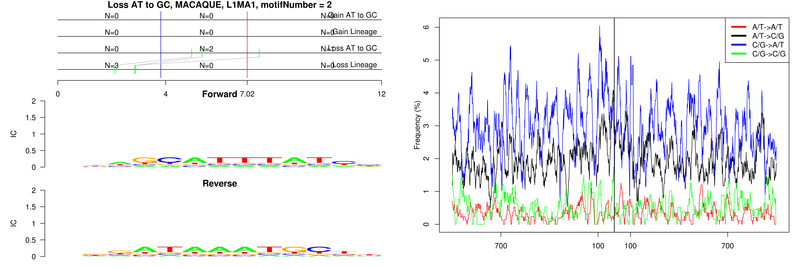
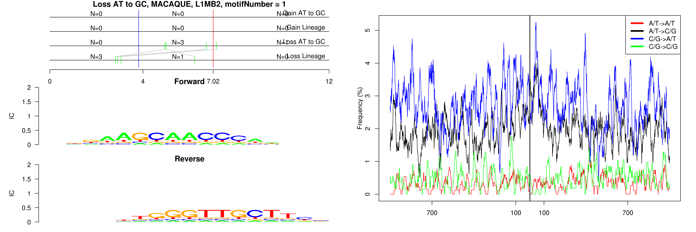
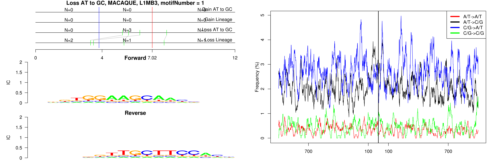
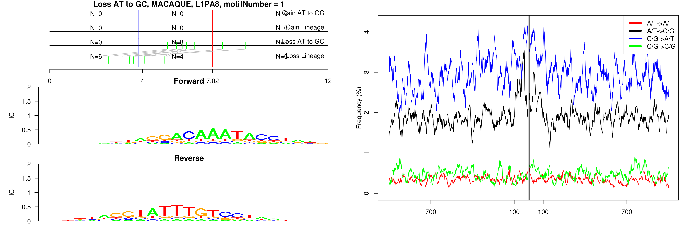
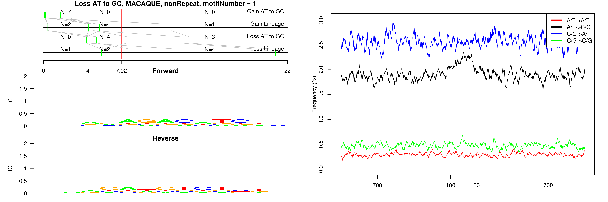
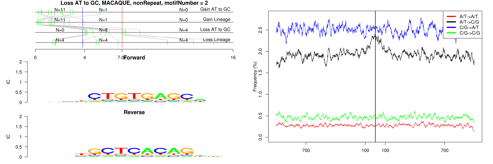
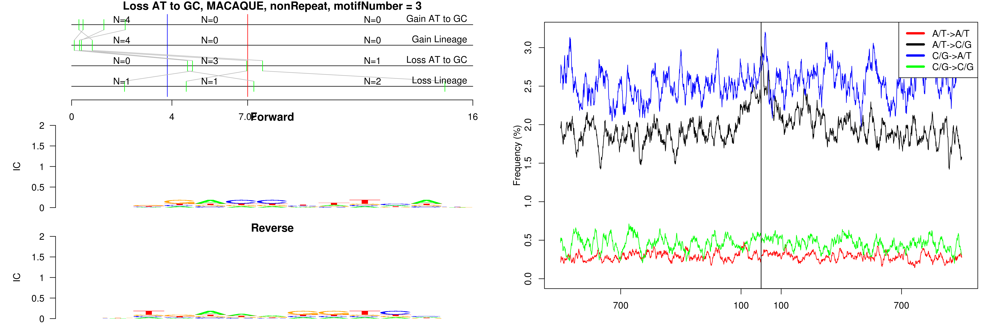
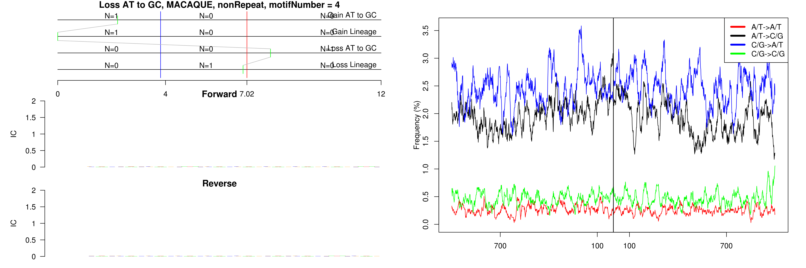
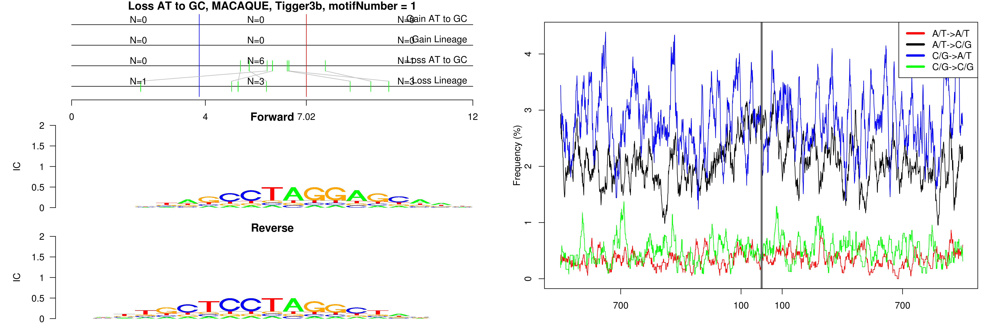

```
## Loss AT to GC, MACAQUE, L1MA1, motifNumber = 1
```

 

```
## Loss AT to GC, MACAQUE, L1MA1, motifNumber = 2
```

 

```
## Loss AT to GC, MACAQUE, L1MB2, motifNumber = 1
```

 

```
## Loss AT to GC, MACAQUE, L1MB3, motifNumber = 1
```

 

```
## Loss AT to GC, MACAQUE, L1PA8, motifNumber = 1
```

 

```
## Loss AT to GC, MACAQUE, nonRepeat, motifNumber = 1
```

 

```
## Loss AT to GC, MACAQUE, nonRepeat, motifNumber = 2
```

 

```
## Loss AT to GC, MACAQUE, nonRepeat, motifNumber = 3
```

 

```
## Loss AT to GC, MACAQUE, nonRepeat, motifNumber = 4
```

 

```
## Loss AT to GC, MACAQUE, Tigger3b, motifNumber = 1
```

 
  
