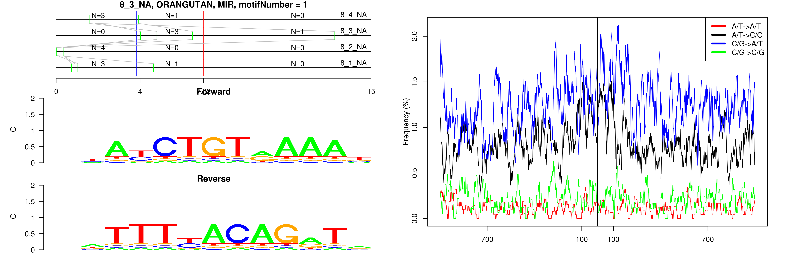

```
## 8_3_NA, ORANGUTAN, MIR, motifNumber = 1
```

 

```
## 8_3_NA, ORANGUTAN, MIR, motifNumber = 2
```

 

```
## 8_3_NA, ORANGUTAN, MIRb, motifNumber = 1
```

 

```
## 8_3_NA, ORANGUTAN, MIRb, motifNumber = 2
```

 
  
