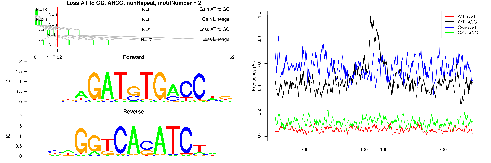
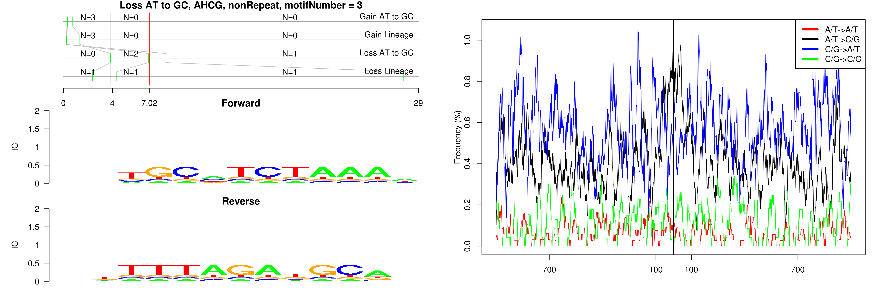
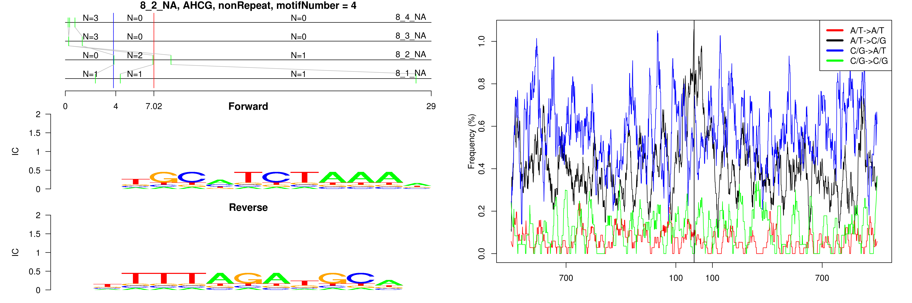

```
## 8_2_NA, AHCG, nonRepeat, motifNumber = 1
```

 

```
## 8_2_NA, AHCG, nonRepeat, motifNumber = 2
```

 

```
## 8_2_NA, AHCG, nonRepeat, motifNumber = 3
```

 

```
## 8_2_NA, AHCG, nonRepeat, motifNumber = 4
```

 
  
