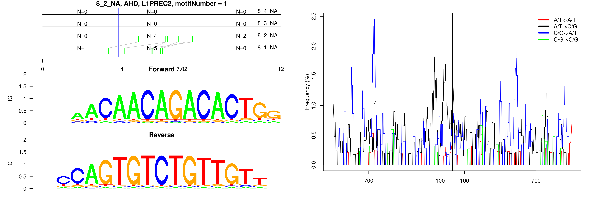

```
## Loss AT to GC, AHD, L1PREC2, motifNumber = 1
```

 

```
## Loss AT to GC, AHD, MER20, motifNumber = 1
```

 

```
## Loss AT to GC, AHD, MSTB, motifNumber = 1
```

 

```
## Loss AT to GC, AHD, nonRepeat, motifNumber = 1
```

 

```
## Loss AT to GC, AHD, nonRepeat, motifNumber = 2
```

 
  
