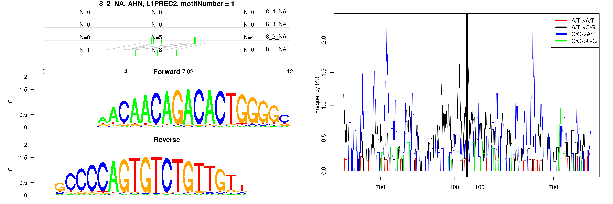

```
## 8_2_NA, AHN, L1PREC2, motifNumber = 1
```

 

```
## 8_2_NA, AHN, MER20, motifNumber = 1
```

 

```
## 8_2_NA, AHN, MSTB, motifNumber = 1
```

 

```
## 8_2_NA, AHN, nonRepeat, motifNumber = 1
```

 

```
## 8_2_NA, AHN, nonRepeat, motifNumber = 2
```

 

```
## 8_2_NA, AHN, nonRepeat, motifNumber = 3
```

 

```
## 8_2_NA, AHN, nonRepeat, motifNumber = 4
```

 
  
