```
## 8_2_NA, CHIMP, L1PA13, motifNumber = 1
```

 

```
## 8_2_NA, CHIMP, L2c, motifNumber = 1
```

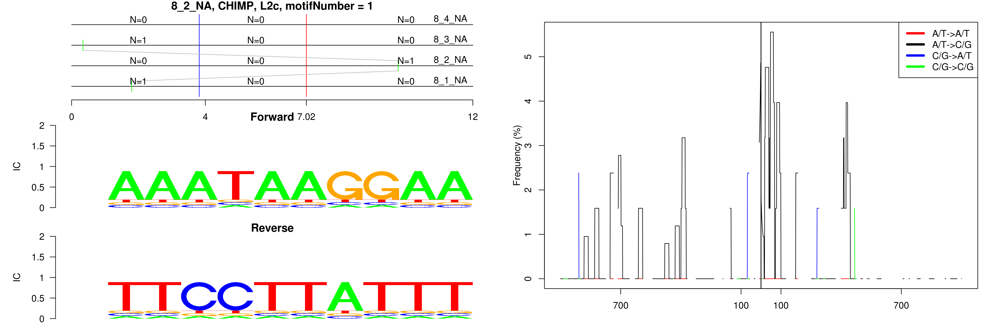 

```
## 8_2_NA, CHIMP, L2c, motifNumber = 2
```

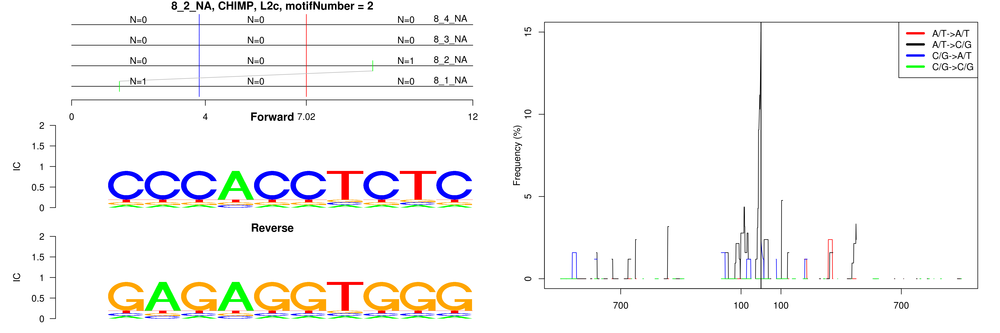 

```
## 8_2_NA, CHIMP, L2c, motifNumber = 3
```

 

```
## 8_2_NA, CHIMP, MIR, motifNumber = 1
```

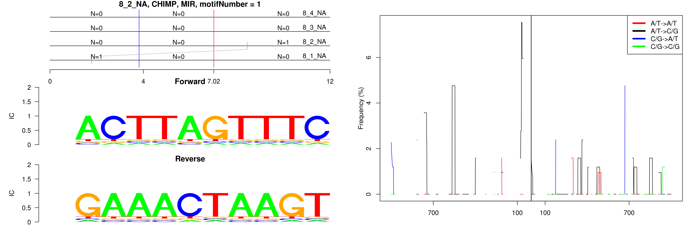 

```
## 8_2_NA, CHIMP, MLT1C, motifNumber = 1
```

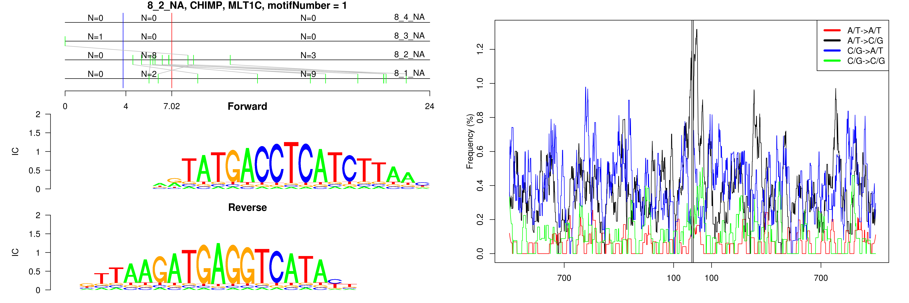 

```
## 8_2_NA, CHIMP, MLT2A1, motifNumber = 1
```

 

```
## 8_2_NA, CHIMP, nonRepeat, motifNumber = 1
```

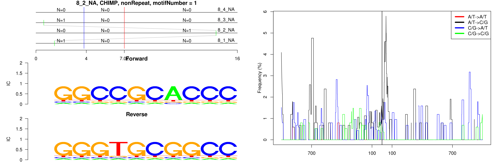 

```
## 8_2_NA, CHIMP, nonRepeat, motifNumber = 2
```

 

```
## 8_2_NA, CHIMP, nonRepeat, motifNumber = 3
```

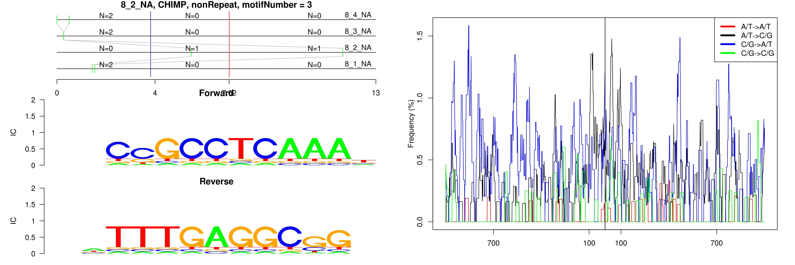 

```
## 8_2_NA, CHIMP, nonRepeat, motifNumber = 4
```

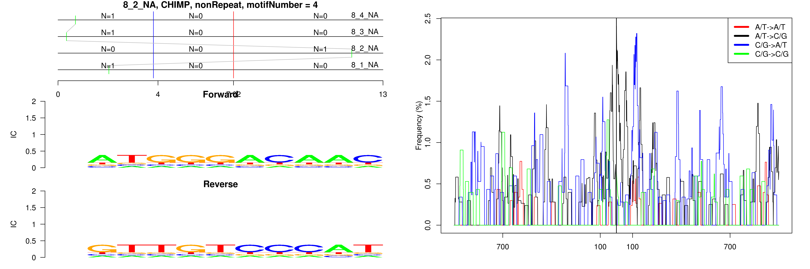 

```
## 8_2_NA, CHIMP, nonRepeat, motifNumber = 5
```

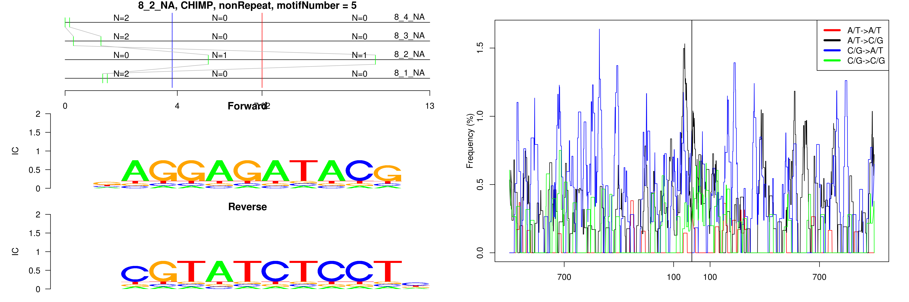 

```
## 8_2_NA, CHIMP, nonRepeat, motifNumber = 6
```

 

```
## 8_2_NA, CHIMP, nonRepeat, motifNumber = 7
```

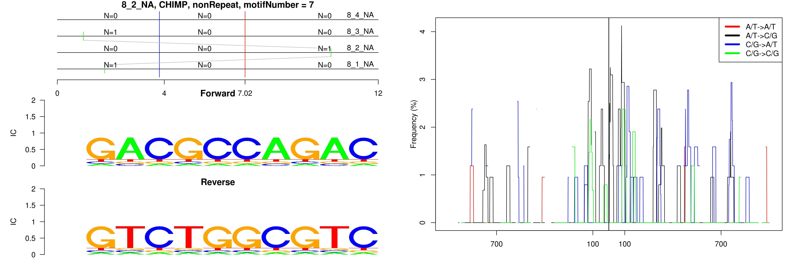 

```
## 8_2_NA, CHIMP, nonRepeat, motifNumber = 8
```

 

```
## 8_2_NA, CHIMP, nonRepeat, motifNumber = 9
```

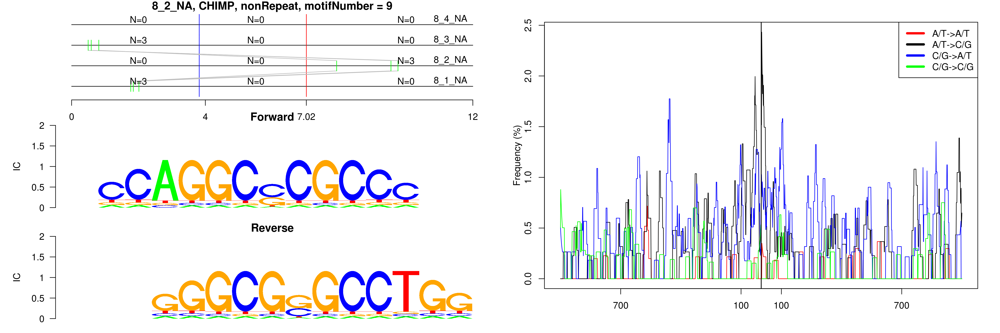 

```
## 8_2_NA, CHIMP, nonRepeat, motifNumber = 10
```

 

```
## 8_2_NA, CHIMP, nonRepeat, motifNumber = 11
```

 

```
## 8_2_NA, CHIMP, nonRepeat, motifNumber = 12
```

 

```
## 8_2_NA, CHIMP, nonRepeat, motifNumber = 13
```

 

```
## 8_2_NA, CHIMP, nonRepeat, motifNumber = 14
```

 

```
## 8_2_NA, CHIMP, nonRepeat, motifNumber = 15
```

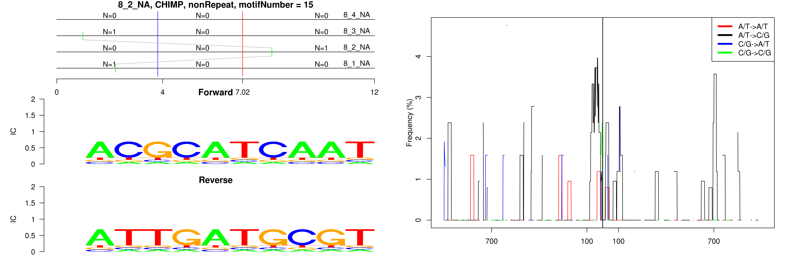 

```
## 8_2_NA, CHIMP, nonRepeat, motifNumber = 16
```

 

```
## 8_2_NA, CHIMP, nonRepeat, motifNumber = 17
```

 

```
## 8_2_NA, CHIMP, nonRepeat, motifNumber = 18
```

 

```
## 8_2_NA, CHIMP, nonRepeat, motifNumber = 19
```

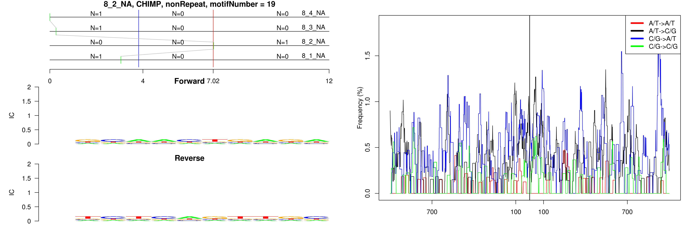 

```
## 8_2_NA, CHIMP, nonRepeat, motifNumber = 20
```

 

```
## 8_2_NA, CHIMP, nonRepeat, motifNumber = 21
```

 

```
## 8_2_NA, CHIMP, nonRepeat, motifNumber = 22
```

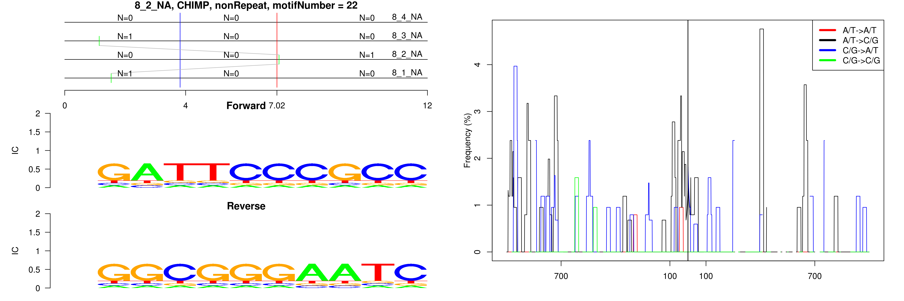 

```
## 8_2_NA, CHIMP, nonRepeat, motifNumber = 23
```

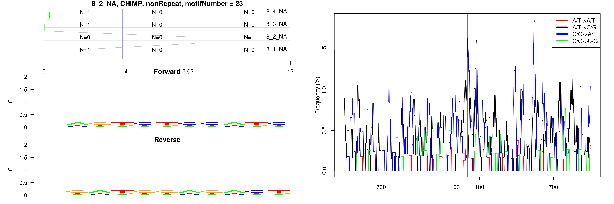 
  
