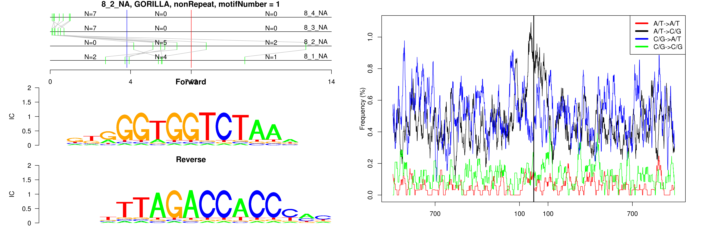
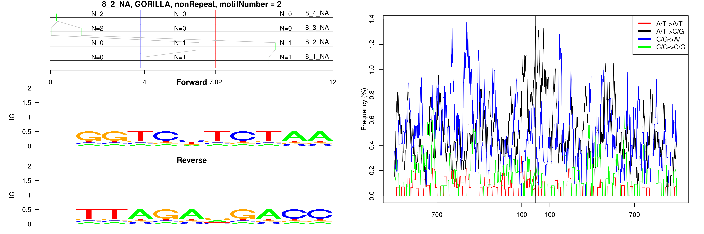

```
## 8_2_NA, GORILLA, L1PA13, motifNumber = 1
```

 

```
## 8_2_NA, GORILLA, L1PA13, motifNumber = 2
```

 

```
## 8_2_NA, GORILLA, nonRepeat, motifNumber = 1
```

 

```
## 8_2_NA, GORILLA, nonRepeat, motifNumber = 2
```

 
  
