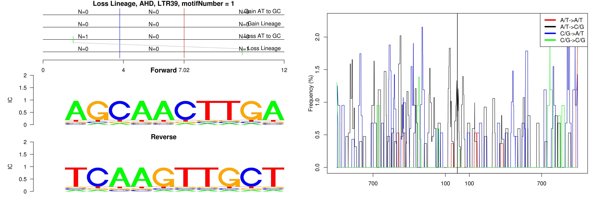
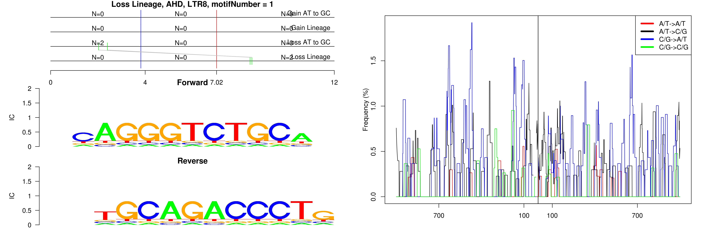
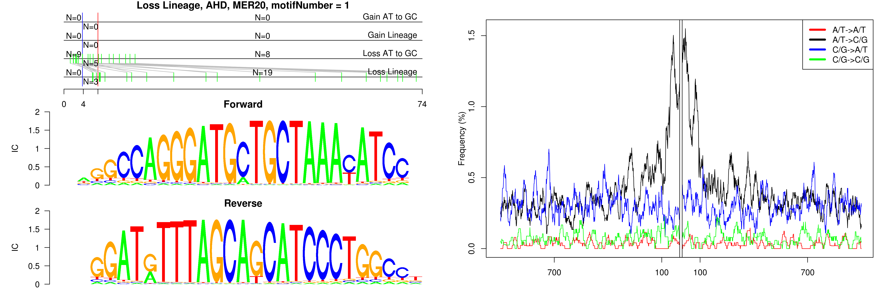
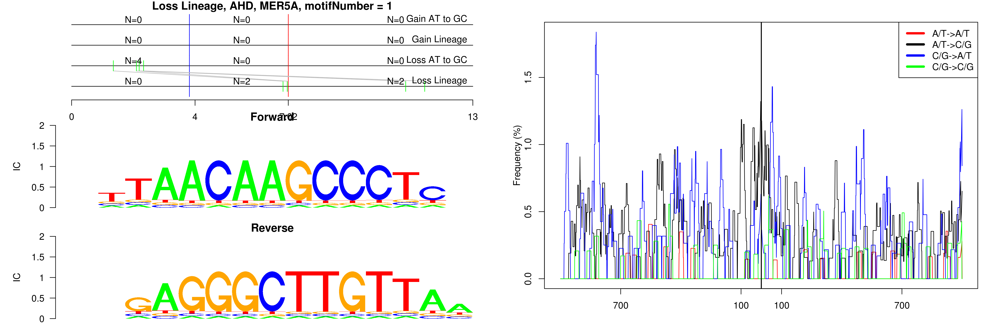
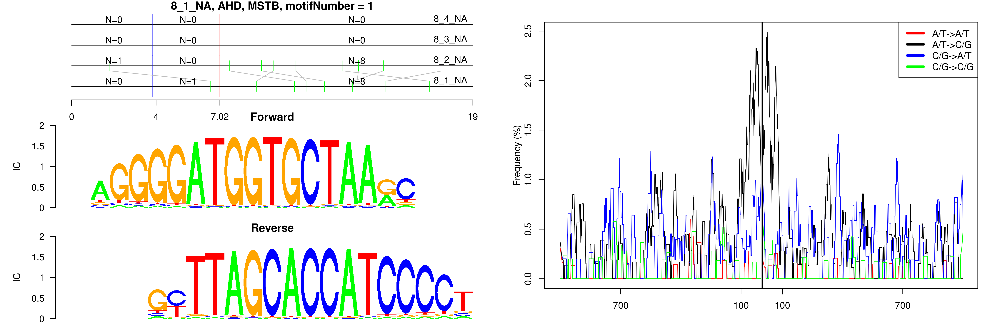
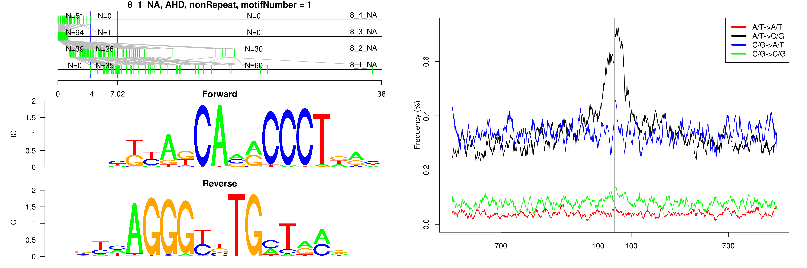
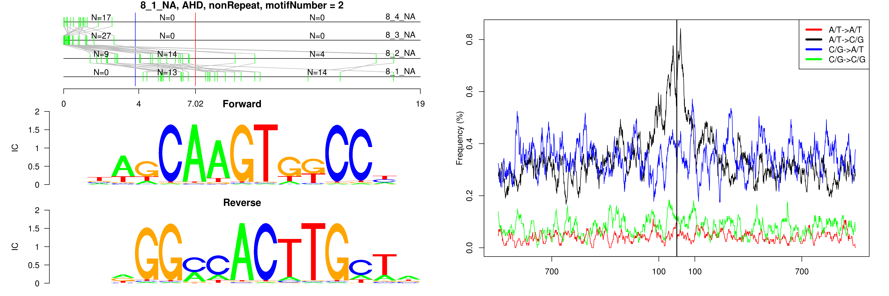
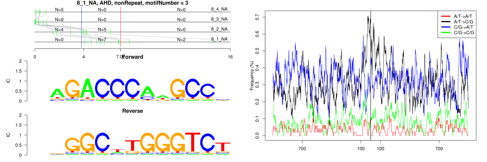
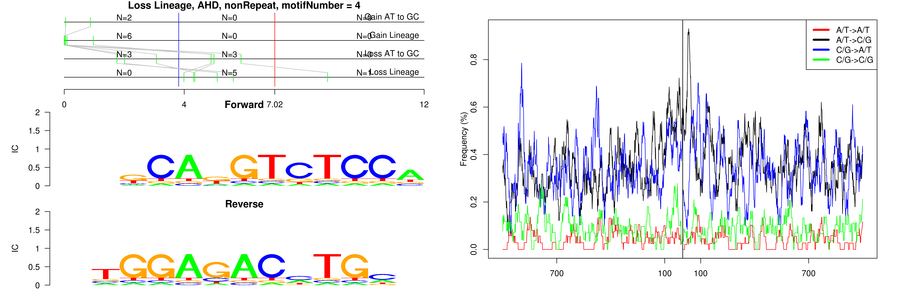
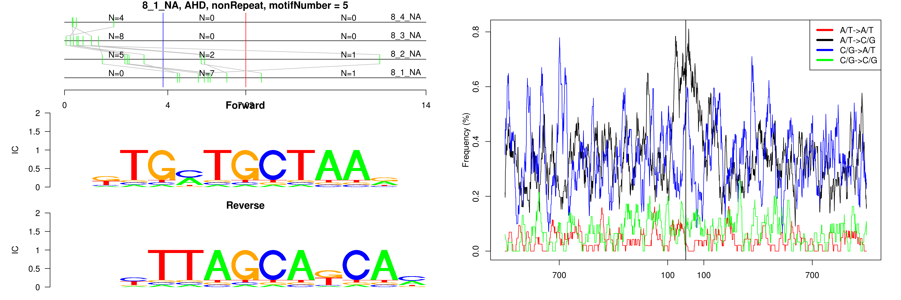

```
## 8_1_NA, AHD, LTR39, motifNumber = 1
```

 

```
## 8_1_NA, AHD, LTR8, motifNumber = 1
```

 

```
## 8_1_NA, AHD, MER20, motifNumber = 1
```

 

```
## 8_1_NA, AHD, MER5A, motifNumber = 1
```

 

```
## 8_1_NA, AHD, MSTB, motifNumber = 1
```

 

```
## 8_1_NA, AHD, nonRepeat, motifNumber = 1
```

 

```
## 8_1_NA, AHD, nonRepeat, motifNumber = 2
```

 

```
## 8_1_NA, AHD, nonRepeat, motifNumber = 3
```

 

```
## 8_1_NA, AHD, nonRepeat, motifNumber = 4
```

 

```
## 8_1_NA, AHD, nonRepeat, motifNumber = 5
```

 
  
