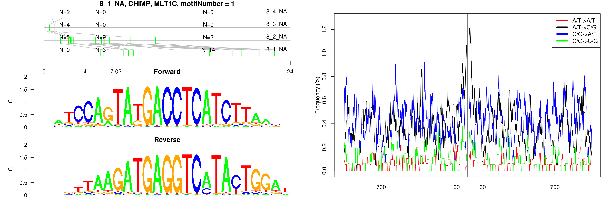

```
## Loss Lineage, CHIMP, L1PA13, motifNumber = 1
```

 

```
## Loss Lineage, CHIMP, MLT1C, motifNumber = 1
```

 

```
## Loss Lineage, CHIMP, MLT1C, motifNumber = 2
```

 

```
## Loss Lineage, CHIMP, nonRepeat, motifNumber = 1
```

 

```
## Loss Lineage, CHIMP, nonRepeat, motifNumber = 2
```

 

```
## Loss Lineage, CHIMP, nonRepeat, motifNumber = 3
```

 

```
## Loss Lineage, CHIMP, nonRepeat, motifNumber = 4
```

 

```
## Loss Lineage, CHIMP, nonRepeat, motifNumber = 5
```

 

```
## Loss Lineage, CHIMP, nonRepeat, motifNumber = 6
```

 

```
## Loss Lineage, CHIMP, nonRepeat, motifNumber = 7
```

 
  
