```
## 8_1_NA, MACAQUE, L1MA2, motifNumber = 1
```

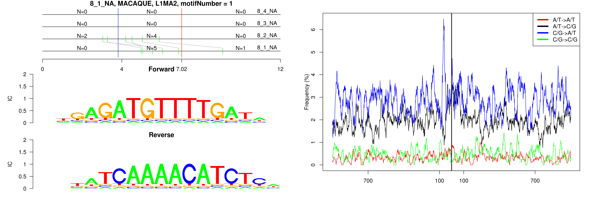 

```
## 8_1_NA, MACAQUE, L1MB2, motifNumber = 1
```

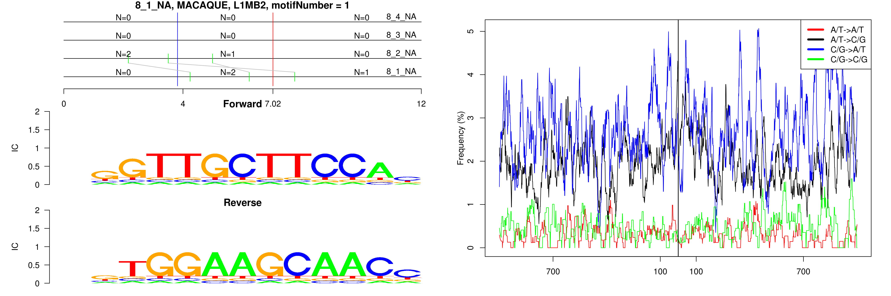 

```
## 8_1_NA, MACAQUE, L1MB3, motifNumber = 1
```

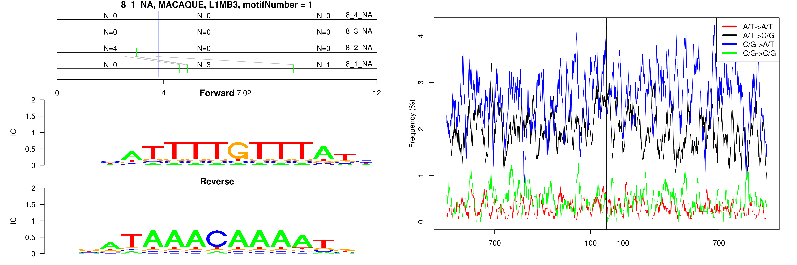 

```
## 8_1_NA, MACAQUE, L1MB3, motifNumber = 2
```

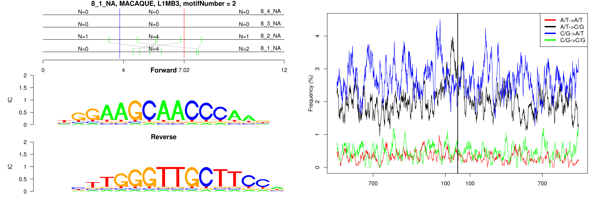 

```
## 8_1_NA, MACAQUE, MLT1B, motifNumber = 1
```

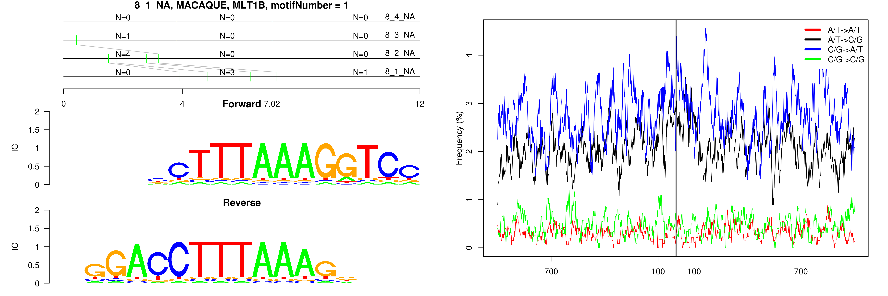 

```
## 8_1_NA, MACAQUE, MSTD, motifNumber = 1
```

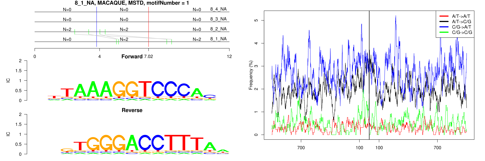 

```
## 8_1_NA, MACAQUE, nonRepeat, motifNumber = 1
```

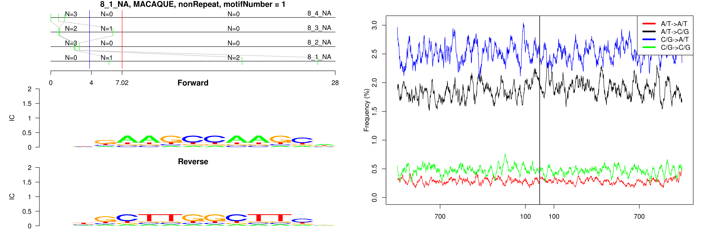 

```
## 8_1_NA, MACAQUE, nonRepeat, motifNumber = 2
```

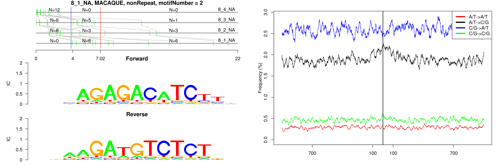 

```
## 8_1_NA, MACAQUE, nonRepeat, motifNumber = 3
```

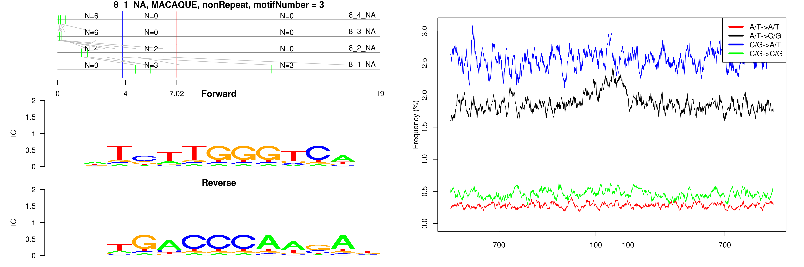 

```
## 8_1_NA, MACAQUE, nonRepeat, motifNumber = 4
```

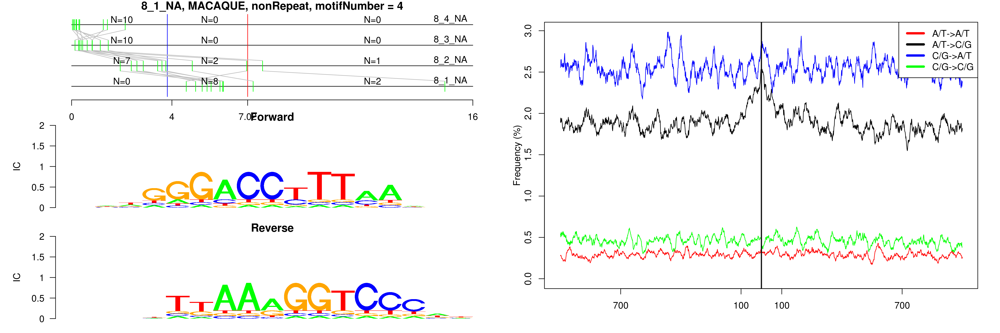 

```
## 8_1_NA, MACAQUE, nonRepeat, motifNumber = 5
```

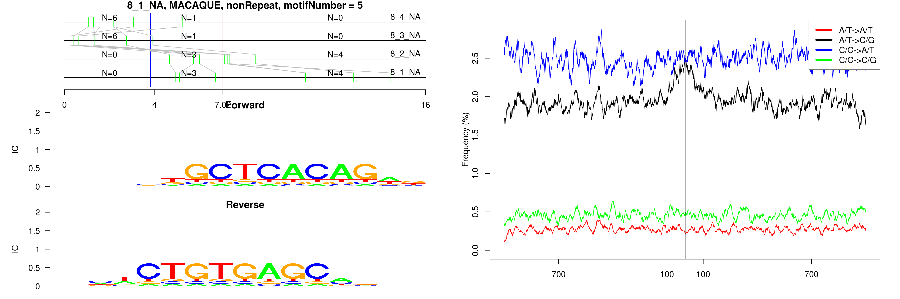 

```
## 8_1_NA, MACAQUE, nonRepeat, motifNumber = 6
```

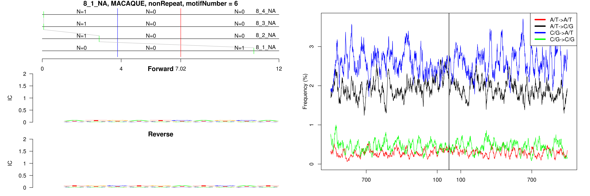 

```
## 8_1_NA, MACAQUE, nonRepeat, motifNumber = 7
```

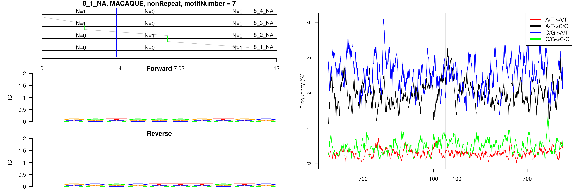 

```
## 8_1_NA, MACAQUE, nonRepeat, motifNumber = 8
```

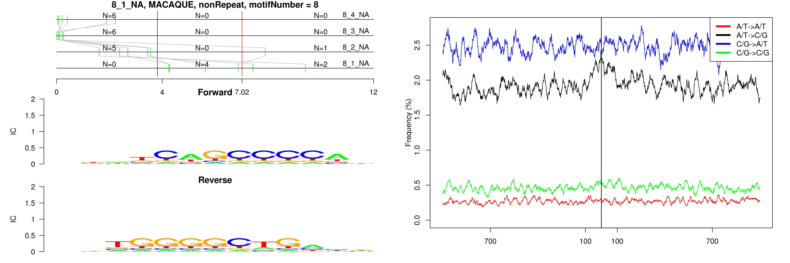 

```
## 8_1_NA, MACAQUE, nonRepeat, motifNumber = 9
```

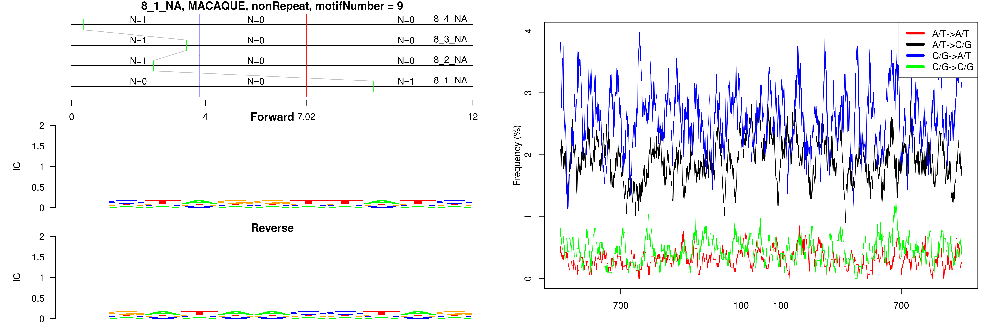 

```
## 8_1_NA, MACAQUE, nonRepeat, motifNumber = 10
```

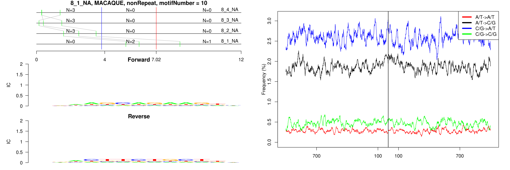 

```
## 8_1_NA, MACAQUE, THE1B, motifNumber = 1
```

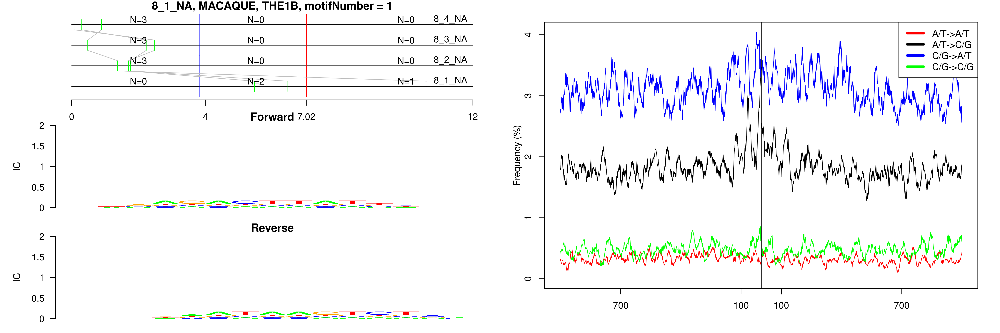 

```
## 8_1_NA, MACAQUE, Tigger1, motifNumber = 1
```

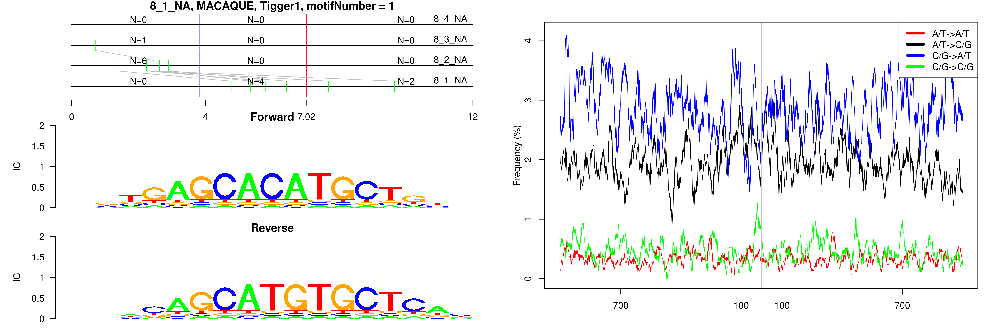 

```
## 8_1_NA, MACAQUE, Tigger3a, motifNumber = 1
```

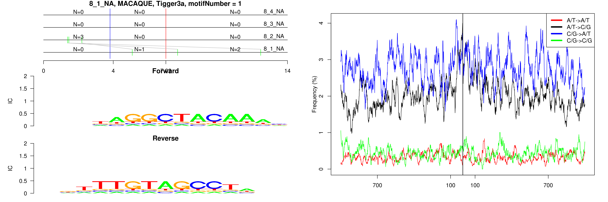 

```
## 8_1_NA, MACAQUE, Tigger3b, motifNumber = 1
```

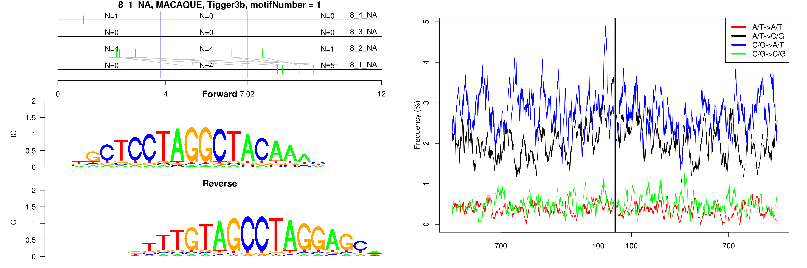 
  
