```
## 8_1_NA, ORANGUTAN, L1PA13, motifNumber = 1
```

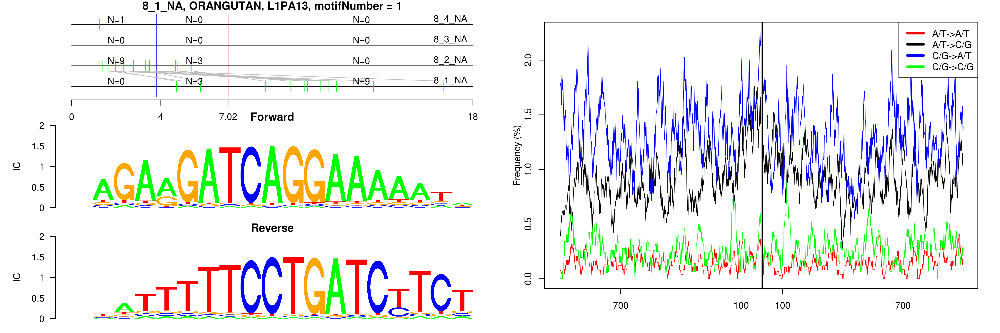 

```
## 8_1_NA, ORANGUTAN, MIR, motifNumber = 1
```

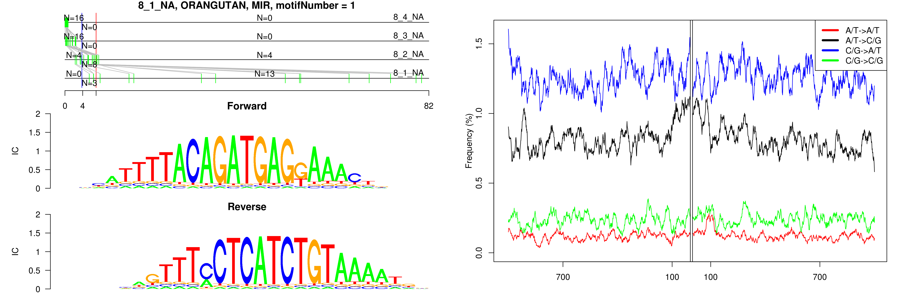 

```
## 8_1_NA, ORANGUTAN, MIRb, motifNumber = 1
```

 

```
## 8_1_NA, ORANGUTAN, MIRc, motifNumber = 1
```

 

```
## 8_1_NA, ORANGUTAN, MIRc, motifNumber = 2
```

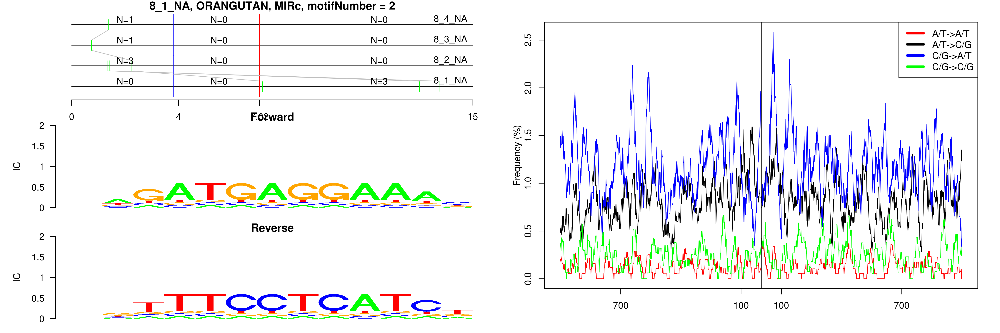 

```
## 8_1_NA, ORANGUTAN, MIRc, motifNumber = 3
```

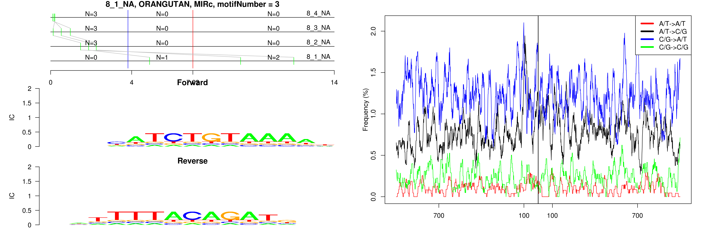 

```
## 8_1_NA, ORANGUTAN, MLT1B, motifNumber = 1
```

 

```
## 8_1_NA, ORANGUTAN, nonRepeat, motifNumber = 1
```

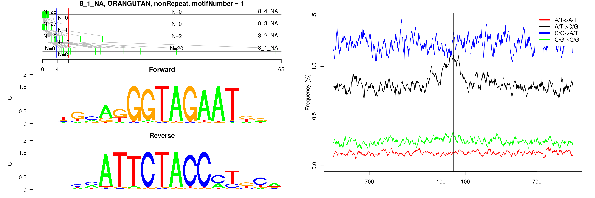 

```
## 8_1_NA, ORANGUTAN, nonRepeat, motifNumber = 2
```

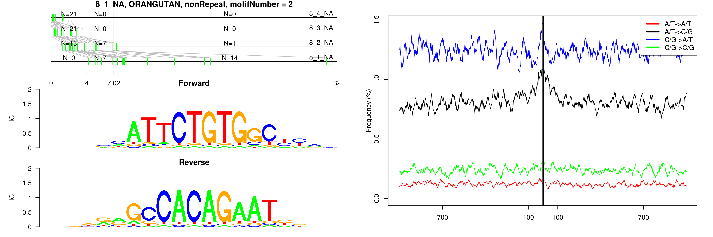 

```
## 8_1_NA, ORANGUTAN, nonRepeat, motifNumber = 3
```

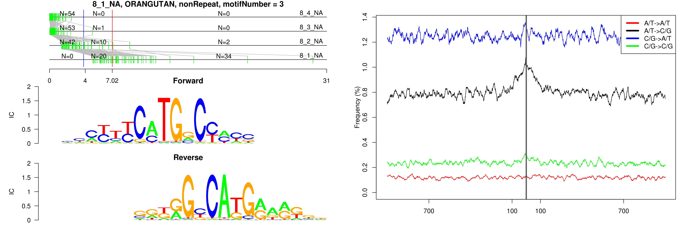 

```
## 8_1_NA, ORANGUTAN, nonRepeat, motifNumber = 4
```

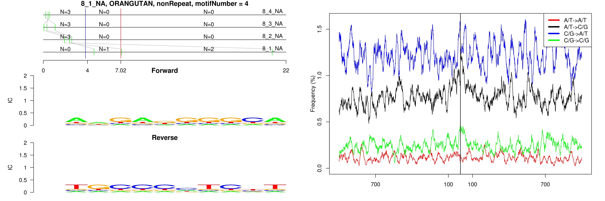 

```
## 8_1_NA, ORANGUTAN, nonRepeat, motifNumber = 5
```

 

```
## 8_1_NA, ORANGUTAN, nonRepeat, motifNumber = 6
```

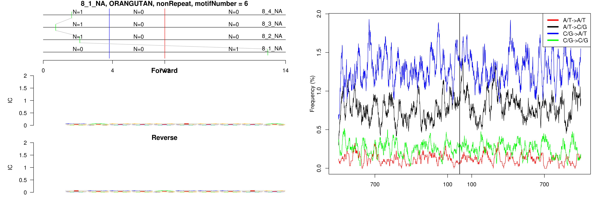 

```
## 8_1_NA, ORANGUTAN, nonRepeat, motifNumber = 7
```

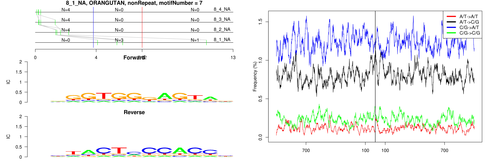 

```
## 8_1_NA, ORANGUTAN, nonRepeat, motifNumber = 8
```

 

```
## 8_1_NA, ORANGUTAN, nonRepeat, motifNumber = 9
```

 

```
## 8_1_NA, ORANGUTAN, nonRepeat, motifNumber = 10
```

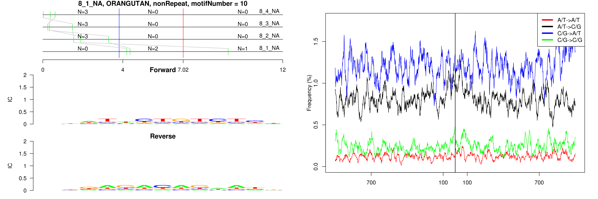 

```
## 8_1_NA, ORANGUTAN, nonRepeat, motifNumber = 11
```

 

```
## 8_1_NA, ORANGUTAN, nonRepeat, motifNumber = 12
```

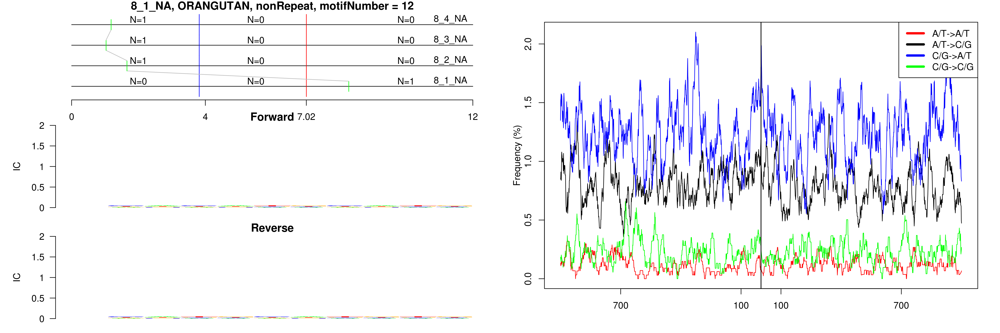 

```
## 8_1_NA, ORANGUTAN, nonRepeat, motifNumber = 13
```

 

```
## 8_1_NA, ORANGUTAN, nonRepeat, motifNumber = 14
```

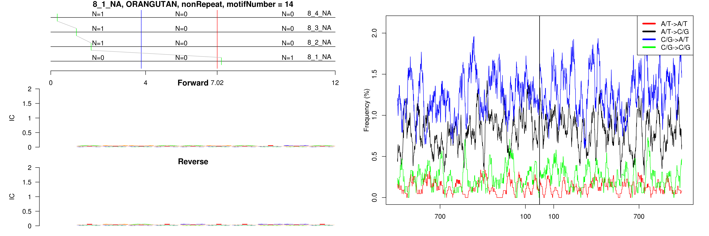 

```
## 8_1_NA, ORANGUTAN, nonRepeat, motifNumber = 15
```

 

```
## 8_1_NA, ORANGUTAN, nonRepeat, motifNumber = 16
```

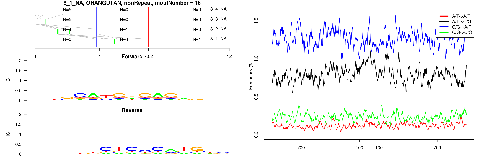 

```
## 8_1_NA, ORANGUTAN, THE1D, motifNumber = 1
```

 
  
