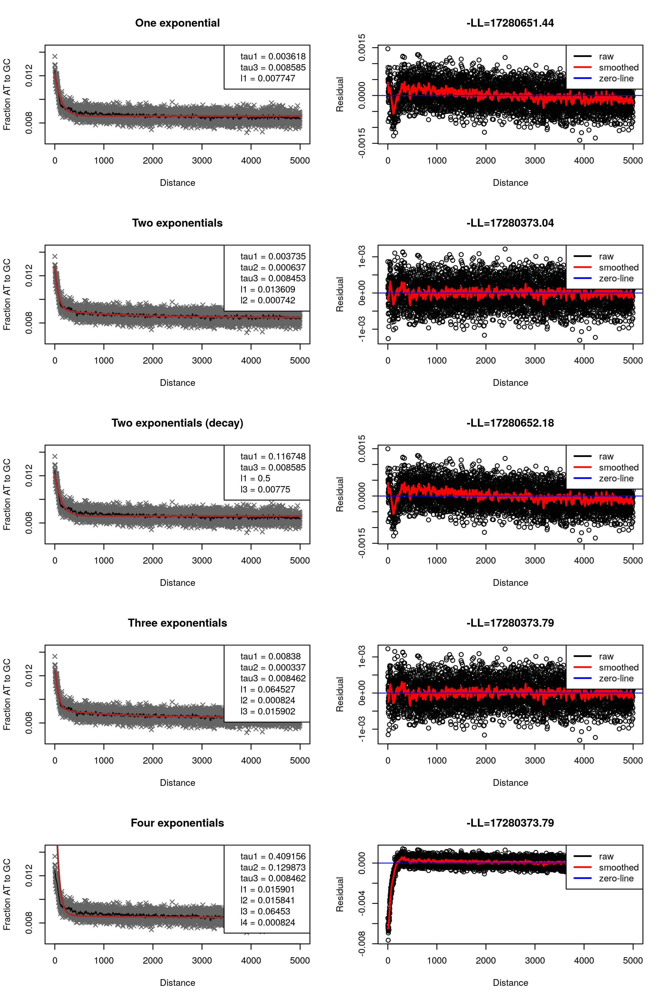

#Hotspot death
##Species: afihuman
##Run version: 2016_06_25
---


##Changelog
Date refers to first version with changes. If there is a plus after, then all subsequent versions have the change
* **2015_04_10** Bugfix - Get the OR right in the PWM summation
* **2015_04_06** Bugfix - for the human results, fix issue where two SNPs are nearby when one was supposed to enter the immediate previous lineage
* **2015_04_06** Re-work the way expectations are calcualted for ancestral rate maps
* **2015_01_22** Bigfix - prevent motif where a motif and its converse could both enter motif cluster at the same time
* **2015_01_22** Add curve fitting to AT to GC plotting
* **2015_01_22** For primates, remove all Alus from consideration during the summarization procedure
* **2015_01_22** Choose a p-value threshold which isn't necessarily genome-wide significant - now a parameter
* **2015_01_22** Choosing significant p-values - require that the other test - AT to GC or lineage - also be a value, now a parameter
* **2015_01_22** Change the way normalization is done for p-value calculation - only remove motifs from consideration after using them for normalizing the p-value calculations (still don't test them though)
* **2015_01_09** Fixed bug in human pipeline where ancestral number of motifs was not being properly calculated and utilized
* **2015_01_06** Better normalization for calculating ancestral broad scale plots
* **2014_10_27** Redo significant value selection - do not require to the best on a lineage, but if OR>1, require that does not exist OR<1 with more significant p-value, for both clustering and motif selection
* **2014_10_27** Added variable pwmMinimum to control PWM plotting
* **2014_10_27** Use OR for better PWM plotting
* **2014_10_24** Added filtering folder for mice (ArrayNotFiltered95.0 used in all prior runs)
* **2014_10_01** Changed clustering method - increase difficulty such that current threshold for iteration is Bonferonni for this round and all other previous rounds. Also, only allow a motif to be included in one cluster per repeat background
* **2014_10_01** Fixed major repeat name problem - assigning motifs to repeats was fine, but got name wrong between assigning and reporting. Also affected generation of QQ plots in this summary document
* **2014_09_22** Added number of motif clusters in summary section  
* **2014_09_22** Add new AT  to GC plots, and details of making the plots
* **2014_09_18** Give the option to specify how to compare against other motifs for making 2x2 tables
* **2014_09_18** Don't perform motif loss counting if the the repeat background changes during the motif loss region
* **2014_09_17** For mice, set regions of the genome as uncallable if insufficient number of samples are callable in that region
* **2014_09_16** Clustering - changed it so motifs are only eligible to be added to a cluster if they have the best p-value among lineages for that motif
* **2014_09_15** added removal of A) nearby SNPs on the same lineage and B) too many SNPs in general locally, as well as check against expectations
* **2014_09_15** added proper support for mice for smaller number of musculus lineages
* **2014_09_13** x axis in left plot for comparison between two test p-values

------


##Important Parameters

|Parameter             |Value                                                 |Description                                                                 |
|:---------------------|:-----------------------------------------------------|:---------------------------------------------------------------------------|
|mouseFilter           |NA                                                    |What folder used for mice                                                   |
|mrle                  |10                                                    |Maximum run length less than or equal to                                    |
|ndge                  |0                                                     |Nuclotide diversity greater than or equal to                                |
|pwmMinimum            |0.1                                                   |When a PWM has 0 entry, what to reset the 0 values to                       |
|Klist                 |10                                                    |Range of K to use                                                           |
|gcW1                  |100                                                   |Range to test for GC increase                                               |
|gcW2                  |5000                                                  |Range to plot GC increases                                                  |
|gcW3                  |10                                                    |Smoothing window for AT to GC plots                                         |
|gcW4                  |10                                                    |Range to plot recombination around loss positions                           |
|ctge                  |10                                                    |For a p-value to be generated, each cell must have at least this number     |
|rgte                  |50                                                    |For a row to count, there must be this many entries                         |
|testingNames          |losslin,lossat,gainlin,gainat                         |(Short) names of the tests we will perform                                  |
|plottingNames         |Loss Lineage,Loss AT to GC,Gain Lineage,Gain AT to GC |Plotting names of the tests we will perform                                 |
|nTests                |4                                                     |Number of tests to be performed                                             |
|globalPThresh         |9.52743902439024e-08                                  |P-value threshold (if NA use total number of tests performed)               |
|pThresh               |0.000196850393700787                                  |Initial threshold for p-value clstering                                     |
|otherPThresh          |0.05                                                  |Every p-value for a given test must exceed this p-value down the other test |
|mouseMatrixDefinition |narrow                                                |How we define mice lineages                                                 |
|nR1                   |12                                                    |If there are nR1 SNPs in nD1 bp, remove all SNPs                            |
|nD1                   |50                                                    |See above                                                                   |
|nR2                   |7                                                     |For a lineage, if there are ge this many SNPs in nD2 bp, remove all SNPs    |
|nD2                   |50                                                    |See above                                                                   |
|removeNum             |0                                                     |How many samples are allowed to be uncallable                               |
|contingencyComparison |Same CpG, GC Content                                  |To what do we compare motifs                                                |
|nATtoGCrepeats        |1000                                                  |How many bootstrap repeats should we do for curve fitting                   |

---


##Methods
###SNP Filtering

SNPs are filtered if they have any missingness among the lineages, do not agree with the species tree, are multi-allelic, or are heterozygous among homozygous animals. 

Subsequently, SNPs are removed if they are too close together. This is the last step in the procedure, ie after removing SNPs for reasons listed above. I removed any SNPs if there were nR1 SNPs within nD1 bases, and, following this, I removed lineage specific SNPs down any lineage if there were nR2 SNPs within nD2 bases. For example, if nR1 was 10 and nD1 was 50, and there was a cluster of 14 SNPs within 50 bases, all of the offending SNPs were removed. 

To get a sense of how many SNPs this removed for given parameter settings, I checked how many SNPs were filtered for a range of parameter settings for the smallest chromosome. I also compared this against expectations. To get an expectation, I simulated a pseudo-chromosome of results. I calculated the expected branch lengths of each lineage given the emprical data to this point, ie lineage 1 has 1 percent divergence against MRCA of the set of all lineages, lineage 2 has 0.5 percent divergence against MRCA, etc. Then, I decided whether each base was mutated according to the total branch length of the tree, and then, given a mutation, what branch it occured on with probabilities equal to each lineages share of the total tree length. 


```
## Warning in readChar(con, 5L, useBytes = TRUE): cannot open compressed
## file '/data/smew1/rdavies//motifLoss/afihuman/input_A_2016_06_25/
## forFilteringPlot.RData', probable reason 'No such file or directory'
```

```
## Error in readChar(con, 5L, useBytes = TRUE): cannot open the connection
```

###Testing - general

3 tests are run based on motifs which are lost at every SNP down a lineage. Note that where there are multiple SNPs within a motif size (ie two SNPs 5 bases away), I considered all motifs lost over that range. If there were any missing bases within that range, the motifs were not counted towards the testing. Further, if the repeat background changed during that range, the motifs were not counted towards the testing.

###Test 1 - Lineage - Motif loss within a lineage versus other lineages

Here I look at the number of motifs lost down a lineage versus all other lineages. The 2 * 2 test is therefore


|                     |Lineage |All other lineages |
|:--------------------|:-------|:------------------|
|Motif                |n1      |n2                 |
|Same CpG, GC Content |n3      |n4                 |

###Test 2 - Shared - Motif loss within a lineage versus ancestral counts

Here, I look at the number of motifs lost down a lineage versus the number present in its ancestor in the species tree. Then, we test the number of motifs lost vs the number which are not lost. The 2 * 2 test is therefore


|                     |Lost down this lineage |Not lost down this lineage |
|:--------------------|:----------------------|:--------------------------|
|Motif                |n1                     |n2                         |
|Same CpG, GC Content |n3                     |n4                         |

###Test 3 - AT to GC - Motif loss AT to GC counts versus local AT bases
  
Let gcW1=100 be the distance to test for increased presence of AT to GC
bases. Then around every motif that is lost, we count three numbers

* The number of AT to GC changes in nearest gcW bases away from the motif, not including the motif itself. For example, with K=10, for a motif from 1,000 to 1,009 inclusive, then the following 100 bp are from 1,010 to 1,109, inclusive. So an A to a G at 1,109 is within range while an A to a C at 1,110 is out of range.
* The number of AT bases within gcW bases, not including motif
* The number of callable bases within gcW bases, not including motif

We are currently not using the third value (the number of callable bases), only the total number of AT bases. The 2 * 2 test per motif is


|                     |AT to GC bases |Number of AT bases |
|:--------------------|:--------------|:------------------|
|Motif                |n1             |n2                 |
|Same CpG, GC Content |n3             |n4                 |
            
###Motif Filtering

Motifs were kept if the longest run of a specific nucleotide was less than or equal to mrle = 10. Motifs were also kept if the nucleotide diversity (ie number of A,C,G,T) bases was greater than or equal to ndge =0. For each test seperately, motifs were removed as well as individual results masked if the counts were too low. Motif level results were not calculated if the counts among all lineages for a motif was less than rgte = 50. Lineage specific results were also masked (ie not calculated) in each test seperately if the motif lineage value was less than cgte = 10 (ie the n1 entry in the contingency tables).

###Clustering

To be eligible for clustering, a motif had to be Bonferonni significant on its lineage, have an OR>1, and not have a lineage with an OR<1 which had a more significant p-value. For clustering, a motif would have to meet a p-value threshold (explained below), as well as meet the criteria that there not be a lineage with OR<1 with a more significant p-value.

Given a set of eligible motifs for a given lineage for a given test for a given repeat background, start with the motif with the most significant p-value. Add to the cluster all eligible motifs beating a certain p-value within a certain distance (defined below), keeping track of alignment. Continue recursively for each added motif until exhausted. Build a position weight matrix by adding together the influence of each motif in the cluster, using a weight of the odds ratio minus 1, and adding it to the bases in the motif. Replace bases in the PWM after the summing with an entry of 0 with 0.1, and divide by the column totals to have each entry scaled between 0 and 1. 

Let K be the motif length we are interested in. We define as acceptably close for clustering all motifs which align perfectly and are off by 1 base (sum of K*4), or that are off by 1 base in the alignment left or right (2 for left vs right) with any new base in the gap (4 bases) with any one of the remaining K-1 bases allowed to change as well (4). In total there are (K-1)*4*4*2+K*4 = 328 possible acceptably close motifs.

For the first iteration, take a p-value threshold of the number of motifs to be searched, or (K-1)*4*4*2+K*4 = 328. For each subsequent iteration, take a p-value threshold where the deminator is the number of tests already performed plus the number to be searched on this iteration. For example, if on the first iteration 3 close motifs were found to meet the iteration 1 p-value threshold, then on the second iteration the p-value threhsold would be 0.05 divided by the number of motifs searched on the first iteration, 328, plus the 3 * 328 to be searched on the second iteration.

For plotting, we summed the collapsed motif clusters counts by base and added 0.5 to each count. Then, for a motif cluster of length $m$, letting $j \in \{1,2,3,4\}$ be the four nucleotides and $i \in \{1,2,...,m\}$ be the position within the motif cluster, we set $H_i = \sum_{j=1}^4 f_{i,j} \log(f_{i,j})$, and define the height of each base as $h_{i,j}=H_{i} f_{i,j}$. Bases are then ordered from smallest to largest entropy and plotted. We used elements of the seqLogo R package to draw the PWM.

The math for drawing the PWM is taken from [here](http://en.wikipedia.org/wiki/Sequence_logo).


###AT to GC plots
To better visualize the localization of AT to GC changes surrounding a motif cluster, we plotted whether bases changed from AT to GC or vice versa, with respect to their distance from the motif. We first scanned through the chromosomes to find instances where motifs in the motif cluster were lost. To ensure we weren't oversampling SNP changes due to similar motifs, we limited ourselves to counting only a single motif loss instance among a run of motif losses each one within the length of the motif cluster in distance from each other. 

Next, taking care to get both the correct strand as well as the position of the motif within the cluster of motifs correct, we catalogued both the position and base composition of any changes within a neighbourhood of 5000 bases. By summing across all loss instances of motifs in the cluster, and normalizing to the local sequence context, we could plot any type of ancestral to derived base change. Smoothing was done over 21 bases, ie taking the value at the flanking bases and over the prior and aft 10 bases. 

These plots also feature a PWM for the forward and reverse forms of the motif, as well as a series of line plots which show the number of motifs and their p-values for the motifs in the cluster. There is no particular order in which test is placed where vertically. Each line shows p-values for the test under consideration, with grey lines linking the same motif (motifs with undefined p-values on the other two tests are omitted from the plots for those tests and are not linked). These are stratified into those which meet genome-wide significance to the right of the red line, those which are between the initial clustering p-value threshold and the Bonferonni threshold in the middle, and those which do not meet the initial clustering p-value threhsold on the left. Numbers of motifs falling into each category are given as well.


###AT to GC plot - curve fitting
We fitted a curve to estimate parameters relating to the increa
se in AT to GC fixation near ancient hotspot death events. More details are available in my thesis


###Ancestral map construction

First, we calculate the expectation for a cluster with no Prdm9 affinity. For rate of loss, this means we first calculate the rate of loss of all motifs in the cluster as the number of times these motifs were lost divided by their ancestral count. We then calculate the rate of loss for all motifs in a similar way. The expectation for the rate of loss for a given lineage is taken as the rate of loss over all motifs multiplied by the median of the rate of loss of these motifs divided by the rate of loss of all motifs, without including the current lineage. 


, both for what proportion of motifs we'd expect to lose if motifs were lost at neutrality, and for what AT to GC rate we'd expect to see given neutrality. 


Next, for a given window size, over all intervals in the genome, we count both the number of motif losses in a cluster and the number of ancestral motif counts. Both of these can be either filtered or unfiltered, ie distinct loss events must be a certain distance away; used here is the cluster width. 


### motifSuperResults description
Results for clustering are contained in an RData object, one seperately for each test that has been performed. The files are a series of lists of lists, with the RData object being named motifSuperResults.

List level 1 is by lineage name. So motifSuperResults[[1]] are the results for the first lineage.

Within lineage, results are sorted by repeat background. For example, there is usually results available for the non-repeat background under motifSuperResults[[1]]$nonRepeat.

Within lineage and within repeat there are the following variables


|Variable name     |Description of Variable                                                                                                                                                      |
|:-----------------|:----------------------------------------------------------------------------------------------------------------------------------------------------------------------------|
|hashSigR          |Matrix with rows equal to each Bonferonni significant motif and K columns. 0=A, 1=C, 2=G, 3=T                                                                                |
|pSigR             |Matrix where each row corresponds to a motif, and the columns are the different lineages, in the same order as the included linName variable and/or names(motifSuperResults) |
|pSigOR            |Same as above but the original p-value for the test in each lineage                                                                                                          |
|orSigR            |Same as above but odds ratio for that test                                                                                                                                   |
|motifClusters     |For each Bonferonni significant motif, what cluster was it eventually included in                                                                                            |
|clusteredResults  |Deprecated                                                                                                                                                                   |
|clusteringResults |List of length equal to the number of significant clusters, containing the result of clustering                                                                              |

So for example, length(motifSuperResults[[1]]$nonRepeat) gives you the number of clusters found for that lineage for the repeat background for that test. Entries for the first result are given in motifSuperResults[[1]]$nonRepeat$clusteringResults[[1]] and contain the following categories


|Variable name       |Description of Variable                                                                                                                                                                                                                                                                                                                                                   |
|:-------------------|:-------------------------------------------------------------------------------------------------------------------------------------------------------------------------------------------------------------------------------------------------------------------------------------------------------------------------------------------------------------------------|
|matchesN            |For each motif (Bonferonni significant or not) in that cluster, the K length integer based motif (0=A, 1=C, 2=G, 3=T)                                                                                                                                                                                                                                                     |
|whereN              |In the alignment, for the left edge, where it aligns. For instance, the original motif is at position 0, while anything aligned over one to the left is at -1                                                                                                                                                                                                             |
|namesN              |For each motif in the cluster, the hash of the 0-based integer motif. In R, if x is the K length integer motif, then this is sum(x*4^(0:(K-1)))                                                                                                                                                                                                                           |
|whereItMatchesToN   |Internal variable relating motifs to subsetted matrix                                                                                                                                                                                                                                                                                                                     |
|textOut             |Aligned textual representation of output                                                                                                                                                                                                                                                                                                                                  |
|sum                 |Take the matrix sumNum described below and set each cell with 0 to pwmMinimum. Then divide each column by the column sum                                                                                                                                                                                                                                                  |
|sumNum              |Summed across each motif in the cluster the sum of its sequence multiplied by its OR minus 1                                                                                                                                                                                                                                                                              |
|fromWhereN          |At what level of the recursive addition procedure was this motif added in (0=first Bonferonni significant seed motif, 1=second layer, etc)                                                                                                                                                                                                                                |
|atgc                |Itself a list with two entries, loss or gain. Each one of loss or gain contains another list, with each entry corresponding to a type of base change, like A/T->A/T. Each of these also contains a list of length 2, with the first entry being the numerator, the number of changed bases, and the second being the denominator reflecting the number of available bases |
|motifListF          |Motif hashes sorted from most significant p-value to least significant p-value                                                                                                                                                                                                                                                                                            |
|motifLossPositions  |Itself a list with two entries, loss or gain. Each one contains, for either loss or gain, the positions on each of the chromosomes of the loss or gain of any motif in the cluster                                                                                                                                                                                        |
|correlationMatrices |If defined, information on correlation between this cluster and broad scale rate maps                                                                                                                                                                                                                                                                                     |
|motifPValues        |P-values for the tests, ordered from most significant down this test, to least signicicant                                                                                                                                                                                                                                                                                |


---


## Some summary numbers


```
## Error in x$call: $ operator is invalid for atomic vectors
```

Aligned Genome (Gbp)


| Total| Pass QC| Fail QC| Pass QC Non Repeat|
|-----:|-------:|-------:|------------------:|
|     0|       0|       0|                  0|

```
## Error in x$call: $ operator is invalid for atomic vectors
```

```
## Error in names(y) = lineageNames[[1]]: object 'y' not found
```

```
## Error in eval(expr, envir, enclos): object 'y' not found
```

Number of Derived Mutations down a specific lineage

```
## Error in prettyNum(y, big.mark = ","): object 'y' not found
```

```
## Error in prettyNum(y, big.mark = ","): object 'y' not found
```

```
## Error in eval(expr, envir, enclos): object 'y' not found
```

```
## Error in x$call: $ operator is invalid for atomic vectors
```

Branch length as percent of alignable genome

```
## Error in matrix(x, nrow = 1): object 'y' not found
```

```
## Error in matrix(x, nrow = 1): object 'y' not found
```

```
## Error in eval(expr, envir, enclos): object 'y' not found
```

Branch length compared to ancestral of all lineages in SNPs


|TCTCCAAAAA |GAGCTCACAA |GCCAGGGCAA |TTAGGCTCAA |GATGGGAGAA |GCCTCCTGAA |GCCCAGCTAA |GGTGCAAACA |CTTGAGCACA |CTGAGTGACA |TCTGAGACCA |GGTTTCCCCA |GCACACGCCA |CTGTAATCCA |GATCCTTCCA |CTGAGTAGCA |TAGCCGGGCA |CCCCACTGCA |CTGGTGTGCA |GAGAGGATCA |CACAGCCTCA |CTGTGGCTCA |GCCATGGTCA |GGGTGAAAGA |GGGCAGCAGA |GAGTTCGAGA |CAGCCTCCGA |CTGGTCTCGA |GAACCCAGGA |GGAGCTGGGA |GGAGGCTGGA |TAAGCTATGA |GCCCGGGTGA |GATTGCTTGA |GCTGGTACTA |GTCGAGGCTA |GGTTGCAGTA |GGTGCCTGTA |GGTCTCGAAC |CTGCTTGAAC |CACGCACCAC |CAGGTGCCAC |GCATGATCAC |CAACCTCGAC |CTTGAACACC |GCGAGACCCC |CAAGTTGCCC |GGCTCAAGCC |CACCTGAGCC |CACCTCGGCC |GATGTGTGCC |CTCGAACTCC |CTCTGCCTCC |CCTGTATTCC |GCAACAGAGC |GCGTGGTAGC |CCTACTGGGC |GAGCAGTGGC |CTACAAGTGC |GAGGTCTTGC |CTGCAGACTC |CCTGAGCCTC |CTCGGCCTTC |CCTTTCAAAG |CCTGGCTAAG |CAAAAATCAG |CAAGCTAGAG |CAACATGGAG |CAGGCTGTAG |CAGGAGTTCG |CCAAAGTGGG |CAGGCACATG |CAACATACTG |GCCTGGGAAA |TGGACAACAA |CTGGGGTCAA |CAACCTTGAA |CTAGACAACA |TGTAGAGACA |GCATGCACCA |CTGTTGCCCA |CAACACAGCA |GAGGTGGGCA |TGAGATTGCA |TCCTACCTCA |CAGCTTCTCA |GGGCCACAGA |GAGTTTGAGA |TAGCCCAGGA |GAGCCTGGGA |GCTCCAGTGA |GATTGTGCTA |CTGGAGTGTA |GCCACCGCAC |GAGGTCTCAC |CCTGGATGAC |CATGGCTTAC |GAGCGAGACC |GAGACCAGCC |CTCCTTGGCC |CAGGTGATCC |GCACTCCAGC |CTTGAGTAGC |CATACCTGGC |CCACCTACTC |CACTTCAGTC |CCCAAAGTTC |CCTGCCTCAG |CCACGCCTGG |TCTATGAAAA |CATAGTGAAA |GTAATCCCAA |GCAGTGGCAA |CCAGGCTGAA |CAGGTACACA |GGGCAATACA |CTATTGCCCA |CTGTGCTCCA |CATGGTAGCA |TACAGATGCA |CATGATTGCA |CCCCACCTCA |CATCCTCTCA |GGGCAAAAGA |GTGACAGAGA |GGAAGGCCGA |CTAGGCTGGA |CCAGGTGTGA |GATTGTTTGA |GTCCAGGCTA |CCCAGGCTTA |CTGCCTCAAC |GCGCCACCAC |CTTAGCTCAC |GGTGCACACC |CATCTCTACC |GCCACTGCCC |GACTCCAGCC |CACCTCGGCC |CAAGGAATCC |CTGAGCCTCC |CTTGGCTTCC |CCACATCAGC |CACCTGTAGC |CTCGAGAGGC |CTTCCTGGGC |CGGGAAGATC |CACCCACCTC |CCCAAAGCTC |CCAGGAATTC |CCTCCCCAAG |CCATGCCCAG |CTCGCCTCAG |CCCGCCTTAG |CAGCTCACTG |CAAAGTGCTG |CAAAGTATTG |TTTTAAAAAA |GCCTAGGCAA |GATTGCTTAA |GCTCACTGCA |CCTGGGTTCA |GGAGGGAGGA |GATTACTTGA |CCTATCTCTA |CTGGAACTAC |CCTATAGTCC |CAGCCTGGTC |CCGAGGCAGG |GGTTTCACCA |CACTCTGTCA |CACCCAGCTA |GCATGCCACC |CAAAGTGTTG |CCCTGGTTCA |CTCGGCCTCC |GAACCCGGGA |CCATGCCCAG |CAGTGAGCCA |GAACCTGGGA |CGCGCCTGTA |GGTGGATCAC |CATTCCAGCC |GAGATCACGC |CACGCCACTG |CGGGGTTTCA |CAAGCGATTC |TCTACTAAAA |TGGGCAACAA |CTGGCCAACA |CTAGAGTGCA |GGCAACAAGA |CACTTTGGGA |CTGCCTCGGC |CCAACCTCAG |CAAGATCGCG |CAACCTCAGG |CACATGCCTG |GCCTCCCAAA |CTGGACAACA |GCAACCTCCA |CCTGGGTTCA |GCCAGGCTGA |CCTGACCAAC |CTGAGATTAC |CCTGCAATCC |CACACCCGGC |CACTGTACTC |CCTGTCTCAG |CATGGAGAAA |TTCACTGCAA |GGAGGTTACA |GCCCACTGCA |GCTGGTCTCA |CTGGTCTCGA |GAACTCGGGA |GAACTTCTGA |CCTGACCTTA |CTGAGATCAC |CTGAAAATAC |CTCCGCCTCC |CGAGACCAGC |CAAGCCTGGC |CAACCTTTGC |CTCCTGCCTC |CCAGCTATTC |CCAGCCTCAG |CCACTAAAAA |TGGGTTCAAA |GGCCCCCCAA |CTCCCTGCAA |TGATCTCGAA |CCGGCCAACA |TGCCACTACA |TGCACTACCA |CAGCTTCCCA |GTGTTGGCCA |GATTGTGCCA |GGCTGGAGCA |CATGGTGGCA |GGAGGTTGCA |CCTGACATCA |CCTTGGCTCA |CTCGGGTTCA |GACCTCAGGA |GACAAAGTGA |GTCCCAGCTA |CTCGTCTCTA |CAGGTGTGTA |CCTCCCAAAC |GGTGGCACAC |CAACCTCCAC |GGCACCCACC |GGCATGTACC |CAGTAATCCC |CACGTTGGCC |CCTGCACTCC |CCCGGGTTCC |GCCACAGAGC |CTCAGGTGGC |CGGAGGCTGC |CAGAAGAATC |CTGCATCCTC |CGTTGGCCAG |CTAACCTCAG |CAGGAGGTAG |CAGTGGCGCG |CAGGAGTTCG |TGGCCAACAA |GCTCAAGCAA |TGGTCTCGAA |GTGCTTGTAA |TAAAAATACA |TGGGATTACA |CCCGCTACCA |TATAGTCCCA |CTGTAATCCA |GCCCACTGCA |CCTAAGGTCA |GAGCAACAGA |CTGGTCTCGA |GAATCCGGGA |GGAAGGTGGA |GGGAGGCTGA |CCAGCTACTA |CCTATCTCTA |GGCACTTGTA |GCTGGGATTA |GGTCTCGAAC |CCACCACCAC |CCGCCACCAC |GCAATGGCAC |GGTTCAAGAC |CTGGAACTAC |CTGGGATTAC |CAGTGCAACC |CCTCAGCCCC |CGTCTCAGCC |CAGCTTGGCC |CCTGTGATCC |CTGTAATTCC |CGAGACCAGC |CCGTCTCAGC |GAAGAATCGC |GATTATAGGC |CATGCTTGGC |CAGGAGAATC |CAGTCTGGTC |CAGGAGTTCG |CCATGCCCGG |CGGATCACAA |CTAAAATACA |CAAGATCGCA |CGGGGTTTCA |GAGTAGCTGA |GGTCTTGAAC |CTGTCTCTAC |CATGTTGGCC |GACTACAGGC |CACCTCCCAG |GGGAGGCGGA |CAGCCTGGCC |TAAAATACAA |CCAGGCTCAA |CAATGGCACA |GGCTAAGGCA |GGAGGTTGCA |TCTCGGCTCA |GGTTTTGTCA |CTACTCGAGA |GAGTCCAGGA |GGCAGGTGGA |GGTGCCTGTA |CTTGGGCAAC |CTCTTGAACC |CCTTGAACCC |CCTGTGATCC |CATACCCAGC |GCAACAGAGC |CTGAGATCGC |CATACCTGGC |CCCAGAGTGC |CAGTGCACTC |CTTGGCCTTC |CGGGAGGCAG |CACGTGCCTG |TCCTGGCTAA |TGGGATTACA |GTGTTAGCCA |CACCACTGCA |GATCTCCTGA |CTCCCAAGTA |CACTGTGTTA |CCTGGCTAAC |CTGTAGTCCC |CATGTTGGCC |CCTGTAGTCC |CCATCCTGGC |CCTCGTGATC |CTGCAAGCTC |CAGGATGGTC |CCTGACCTCG |TAGCACACTA |CTATGATTGC |GGAGGCCAAA |TGAGATTACA |CATGGCAAGA |GAGGTCTCAC |CTCAAACTCC |CCCATCTCAG |GTAATCCCAA |GCAGCCTCGA |CGATCCTCCC |TCTGAAGGAA |TCTTTATTAA |TTCCACCCAA |CCTCAAACTA |CTGCCTTTCA |GAAATCAATA |TATATAATGA |TTAGAAGAAA |TAATATAAAA |GTATATGAAA |TTATAATAAA |TCTTTATAAA |TACAAAAGAA |TGAAATTGAA |GGAAATGTAA |TAAAATTTAA |GATTTTTTAA |TAATTTTCCA |TATATAAAGA |TATGAAAATA |TATAAACATA |CATGAATATA |TAAATTTATA |GAAAATTTTA |CTACAAGAAA |CCTGTTGTGC |CAAATCTTAG |CATATGAAAA |GTATATTGAA |TGAGATATCA |GATGGATACC |GACTATAGTC |GAAATAGAAA |TGCAAGACAA |CAAATTGGAA |GTTGTACTAA |GCCAGTACCA |GTAGTTTTGA |CAGTATGATA |GTTCCTTCTA |CTCTGTGTTA |GTACAACCAC |CCCTTGGGCC |CTACTGTGGC |CAGACAAGAG |CATTTGTGGG |TTATCAAAAA |GTTCCTCAAA |TGAGTGAGAA |CAATGTGTAA |GAAATCAATA |GAAACTAGAC |CCATATGCAG |CCATTAACCA |CAACAATGTA |CATTTGCAGC |CTATAGTTAA |GAAGAGAGGA |CTTATTCCTC |TAGGGAGAGA |GATCAGGGTA |CCCACCAACA |GATGTTTTGA |CATAATGTCC |TATATCAAAA |GCCATTTGTA |CTTATTTCAC |CAAATACTGC |CACACACAAA |GGAATCTAAA |CTATTATCAA |GGTGAGAACA |GTAGTAATCA |TATATGCATA |CAATACAGTA |CTACATCTCC |CATTCTACTC |CCACTTCTGG |GGAAATGCAA |GTTGTTTCCA |CAAACTCATA |CATAATGTCC |TAACATAAAA |GTATATACCA |CACAAAAGGA |TAAGATGGTA |CCCCCAGCCC |GTTCTGGAAA |GTAAGTGGAA |GTGGCATTAA |GAACTATACA |CCACCATTCA |GGGCTGGGGA |CTGAACTATA |GGAAACCACC |GGAATGTAAA |CTCAAAAACA |CAAAAGGTCA |CAACCATCAC |CTTTGGAAAA |TAGAAATAAA |GTCCACACAA |GGTTGTGCAA |TGCTGAATAA |GAAAACTACA |CAAGTGTTGA |CTTACAACTC |CTATGTTTTC |GAATTGCAAA |GCTGGAACAA |TATAGTTGAA |GTTTACAGCA |TATTCATTCA |CAGAAATAGA |TACTATATGA |CTACATACTA |GCAATCACAC |GGTATTGTAC |CCTATTCATC |CAACAATGAG |CACTCCTTGG |TATCAAGCCA |GTTTTTCTCA |CTAATCATGA |CCCCAGTCTA |TAGGGGTAAA |TAGTGGAGAA |CATTTCTCCA |TCCTTGGAGA |CCTAAGAATA |GACATTCTAC |CAGATTTCTC |GCTATTACAA |TACATAACCA |CATAACCATA |GAATAAATTA |TTATTTTAAA |TAAATGCCCA |GTAGATTCAC |CCACCAGCAA |CCATTTTACA |CACAAAAACC |CACTAATCTG |GTTTTGACAA |CACAAAAGAG |TTTATTAAAA |TATTGTAGAA |TAAATATTAA |TACATAAATA |CAGAAGGAAA |TAAAAATGTA |TCAATAGAAA |CCCATTCACA |TCCCCTTGAA |GTGGAAGACA |CAGCAAAAGA |CCATCAATGA |CAAAAGAAAC |GACAACCTAC |CAGATCATCC |CTGAAGTTGC |CCCTGCAAAG |GCAGCCATAA |CACACTGGGG |CCCATTAAAA |TTAAACTAAA |GAGGGTGGAA |CACTTTTTAA |CCCCATGACA |GGAATTGCCA |CAAGAACAGA |CATGGATGGA |CATATCAATA |TAAAGACTTA |CCCTCCTCCC |CCTGCATTAG |CAAGCAAATG |CCATATACAA |CCATTGTGGA |CTATTGGGTA |GCAGAACTAC |CAATACCATC |TACTAGCAAA |TATTGTTAAA |GAATGGGCAA |GTGACACACA |TATGGAACCA |GCCAAAAGCA |CCCTGGAAGA |GCAATGGGGA |GCCTACTTGA |CTTATAAGTA |GAACAATTTA |GCACATATAC |CTGGGCTCTC |CTGCTCAAAG |CATATGCATG |GTTGATTCCA |GCTGAAAAAC |GATAATGGCC |GTTTGTCAAA |GCCTACTCAA |TTAGAGGGAA |CTGGGTTGAA |GAAGAGCTAA |TAGACAAACA |CTGGGATACA |CTAATGACCA |TATGCAGCCA |TCGTGAAGCA |CCCACTGTCA |GTATCCCAGA |TCATTCAGGA |GTCTGCTGGA |CTACGTTTGA |TAGCATCATA |CCCCAACCTA |CCATTTATTA |GTGTCTTTTA |GTGCCTACAC |CTATAAAGAC |CTCCCAAGAC |CAGAATATAC |CTGTCTAACC |CTGTCGACCC |CCTTTCTTCC |CTTCAGGAGC |GATGTGTGGC |CAAAGATTGC |CCAAAGGATC |CAATCATGTC |CAGTGAGATG |CTGACTTCAA |TCTCCTTGAA |TACATGTGCA |CCAAAAAAGA |GTTTATGTGA |CACACGTATA |GTTTGCTGTA |GATAAGCAAC |CACTATTCAC |CCTGTCAACC |CACTGGGGCC |GATGCAAGGC |CTCACACCAG |CACAGCAAAA |GATATGAACA |TCTTTGCCCA |CTGATGATCA |CTTAAATGTA |GCAAACCACC |CCAAAACAGC |TGGGACAAAA |GAAATGCAAA |CCTAAGCCAA |GCCAAAGCAA |TCTTGGAGAA |TAACACATAA |TCCAACTCCA |GTGTATAGCA |GTCTATCTCA |TAAGGTGAGA |TCATTCAGGA |CATGTGCTGA |TATAGTTTGA |GGCAGCCATA |CATAAACTTA |GAATTTTTTA |GCAATCCCAC |CTACCCACCC |GCCACCCAGC |GAACTTTTGC |CCACCAACAG |CAGGTCACTG |TGTAGAAGAA |CCACATTTTC |TGGGAGAAAA |GTTGCTGCAA |TCTATGTCCA |GAATGGGAGA |GATAAACATA |CAATGGGTAC |CACAGCAAAA |GAACTAGAAA |TACTGCCCAA |GTGTAAGGAA |CTATTATTAA |TAGTTTGATA |CCATTCTGTA |CAGCAATCCC |CATTTAGCTC |CACAAAGAAG |CCTGTGTTAG |CAAACTAATG |CTTCTCAAAA |CTTCCTCCCA |CTCCATCTCA |GAGGGAGAGA |GGAGAATGGA |CTTTTCTCCC |CTCTCTTTCC |CTGGCCTCTC |CCTCATCTTC |GCACATAGAA |GCAATGGGAA |GAATAAAACA |TGCCCTCACA |TGAGCACCCA |CCCTGTGCCA |CATGAGAGCA |GGGCTGGGCA |CAGGTGCTCA |TCCTCCAAGA |GAGAGAAGGA |GCAGAGGTGA |GCACAAAGTA |CTCCCTCCAC |GAGTGCCTAC |CCCCTTCCCC |CAGGGAAGCC |CCTCCACTCC |CTCTGCTTCC |CTCCTCCTGC |CCTTGCCCTC |CCCCTCTCTC |CAGGGAAGGG |GGAGACAAAA |TCTTTCCAAA |GTGAGAGAAA |TGTCAGGAAA |GAGATGTAAA |CCTGGCACAA |TATGTGCCAA |CAGAAAAGAA |TAGAGGAGAA |CTTTCTAGAA |TCCTCAGGAA |GGGATGGGAA |GATGAGTGAA |TGAGAGAACA |CCTTCCCACA |TATAAAGACA |CTTAAGGACA |CCTTTGTACA |CCTCTCCCCA |CTGAGCTCCA |TATATTTCCA |GAGAAGAGCA |GTGGAAGGCA |TCTGTCCTCA |CACCTTCTCA |GTAGGAAAGA |TCCCAGAAGA |CAAGGGCAGA |TAAGCAGAGA |GAGGTAGAGA |TAGTGGGAGA |GTGGGTGAGA |CTCTTAAGGA |GGAGAGAGGA |GCACATAGGA |GGCACTGGGA |CTTTCCTGGA |GCACAAAATA |GCACACAATA |GGAAGTGATA |CTATGTTTTA |CCCAGCACAC |CTCTCTGCAC |GAGTGCCTAC |CTTCCTGCCC |CTGCCTTCCC |GCACAATGCC |CCCACCATCC |CCCCAGCTCC |CCTCCATTCC |CATCATTTCC |CTCTCACAGC |CTCCCATAGC |CCCTGAGGGC |CATCCTCATC |CACTCTCCTC |CTCCCATCTC |CTGGAATGTC |CCCTCTCTTC |CCCATCTTTC |CATCCTCAAG |CTCAAGGAAG |CCAGGTGAAG |CTCCCCACAG |CAGAGGCCAG |CCTAGAAGAG |CACAGAGGAG |CAGAGGTGAG |CACAGTGTGG |CACAGCCCTG |CACATCTCTG |TCCTTGGCAA |CACCCTGTAA |GGCTTGGAGA |GGCAAGAACC |GAGCCCTAGC |CCCCTAGAGG |GGATTGGGCA |CAGGAATTGC |TATTTGGGAA |TCAGGTCACA |GCTTTCTGTA |CTCCCCCTCC |CCATTTAGGG |CCTATTTTAC |GAACATCTGA |CCACCACTGG |CACCTTTGTA |TTTCCCAAAA |CACCCAGGAA |CCCCCACCCA |TAGAGAAAGA |CAAAACAAAC |GCAATTCCCC |GGTGTGGAAA |CACCCAGAAG |TAAAAGGAAA |CAGACACCAC |CTGTAAAATC |TAATGGCAAA |GTAAGAAATA |TCCTATGAGA |CAGAGCTCAG |CATCCCGAAA |CACGAAACCA |GATGGTTTCA |CTGGTTCCTA |GCGCACAACC |CACAGACCAG |CAGTCCGTGG |TGCTATGCAA |GGTATCCACA |GATGTGCATA |CAAATACTAC |CCAGGACCTC |GACAATCAAA |CCCCAGGGAA |TCTGGAGGCA |CATTGTAGGA |GATGATGCTA |CTCCAGACAC |GGACAGCCCC |GCAGCATTCC |GAAATGTCTC |CAGTCCCACA |CATAAAAACC |CCATGTGTTC |GACTGAGGAA |TCACATTTCA |CCTGGGCTGC |GTAAAATCCA |CATCACCTGG |TATGTTGAAA |CACATGTAGC |TTGGACAAAA |GCTGATAAAA |TAAGAAAGTA |TGATAAAACA |GACCCCAAGA |CATTTTACCC |CCAGCAGGTC |CAAGGGGTGG |CCCAAGAGAG |CAAGACCCCC |TAAGTTTTAA |TAAAGTCAAA |TTAGGGCAAA |GCCCTAAGCA |TGATAAGAAA |GGAGGCTTCA |CACATGACAG |CTTGGTCTCC |GGGCCTGGAA |TGGCAGGCCA |TCCTAGAGGA |GCATGCTCAC |TTTATTGAAA |GGTGCCACCA |TCTGCAGGCA |GGCTCAGGGA |CACCCCTCAC |GGCAGGTCCC |CCACTGCAGC |CTGCAGCTGC |CAACTGGAGG |GTCCCATGCA |CAACCACTCA |CGGGCAGCCC |GTTTAATTGA |CTTTGCTCAA |CCACAGACAA |CACAGCCACA |GCATGAAAGC |TGTAGCACAA |TATTTATGGA |TCCTGAATCA |GTGATGCTGA |CCAGAATCAC |CTGCATTTAA |GACATGCAGA |CCACCCAGAC |CAAAATCTGC |CTTTAAAAAA |GTGATTTTAA |TCATCTGGGA |GCCTCACCCC |TGGGTGAAAA |CAGGGAGGTA |CCATAAGACA |CTGGCCAGAA |CCTCTGCCTC |CTTGCTAAAA |CCTTATTTAA |CAAATACTGA |GAGAAAATAC |CCTTATGGAG |CACTTTTGAG |GTATATAAAA |TATATACAAA |TAAGTTCAAA |TAAATGTAAA |GAGTATTAAA |CCCACAACAA |TGAGAATCAA |GGCACAGGAA |CAGAGCTGAA |TGAGTTTGAA |TATTACATAA |GATAATATAA |CATGTAGTAA |TATGCATTAA |TAATACTTAA |CATTTGTTAA |TATATTTTAA |GCCTGGAACA |CAAAATCACA |GTGTTTTACA |CAGTTTCCCA |TCCTCATCCA |CATAATAGCA |CTCTGAGGCA |GTGAGTGGCA |CTGGACCTCA |CTGGGATTCA |GTTTTGAAGA |CATTTTCAGA |TCAGATGAGA |GTGAAGTAGA |GAAGCCAGGA |GAGGCACGGA |GACTAAATGA |TAAGTGATGA |GTTTAAGTGA |CTGTGTTTGA |CAACCTCATA |CTAATTTATA |GTAAGTACTA |CCATGTGCTA |GCACAAAGTA |GAGGCAGGTA |GATTGTTGTA |GCTCTTATTA |CTGTTACTTA |GTTACTCAAC |GCTGAGTAAC |CACAGCAACC |GAATAGTACC |GGCTCTGCCC |CCAAACTGCC |CATTGAATCC |GCTAGTAAGC |CTCTTTGAGC |CCAACTCTGC |CAGTTACTTC |CCTCAATTTC |CCCCATTTTC |CCATTTTAAG |CAGATGAAAA |TCATCTACAA |GTAAAATGAA |GACTCACCCA |TCTGGCCTCA |CAGAGGAGGA |GGATTAGAAC |CCCTCTGGGC |CTCTCTGGTC |CACCTGAAAA |TGTGGGCAAA |TGAATTCAAA |GCTGAGGAAA |GAGGAATAAA |GTCATTTAAA |CTGATTCCAA |TAAGGCTCAA |CTGAGTTCAA |GTTTAGAGAA |GAGAGGGGAA |GTAAAATGAA |GGACACTGAA |CAGCTGTGAA |CAAGTTTGAA |TGAAGAGTAA |CATCATTTAA |TATATTTTAA |GGAAAGAACA |CTGGCACACA |CTGTCTGACA |GACAGAACCA |CATCATCCCA |TCAGACTCCA |GGGTCAGGCA |GTCCCTGGCA |CTCAGCTGCA |CTGAACATCA |CCAAGACTCA |CAAATCCTCA |CTGTGGCTCA |CAGGGTCTCA |TCCTCATTCA |CCTTATTTCA |CAAACCCAGA |GACCCAGAGA |TAAAATGAGA |GAGAATTAGA |CAGATCAGGA |GGAGCTAGGA |GAGGCCTGGA |GACCAAATGA |CTTTACATGA |CATTAAGTGA |GTTACTGTGA |CCAGATTTGA |GGATAAAATA |CATTTAAATA |CTTCATAATA |CTACCACATA |CCACCTCATA |GATAAAACTA |TAAATAGCTA |CCAGCTAGTA |CTATGAGGTA |GAAGTGGGTA |CTCAACTGTA |CCAGGCATTA |CTACATATTA |GCACTTATTA |CCTCCATTTA |CCCATCTCAC |GGAATCAGAC |GCAAAGTGAC |GACAAGTTAC |GATTCAAACC |GATTTGGACC |CTGGGCCTCC |CATTATTTCC |GCTAGTAAGC |CTCTCAGAGC |CTAGCTGTGC |CTCACAACTC |CCTGAGCCTC |CAGGTCTCTC |CTCCAAGGTC |CTCCATTTTC |CTTGACCAAG |CTCACAGAAG |CTGGCCCCAG |CAGGCTTCAG |CAGATCTAGG |CAACACTGTG |TGGGTTCAAA |CTTCTGTAAA |TGATCCTCAA |TGTATATGAA |TGCTTTCACA |CTGTGAGGCA |CAGCAAGTCA |CAGAGGAGGA |CCTCATCTGA |GAGGATAATA |GCACTTTGTA |CTCATTTGAC |CTCTCCAAGC |CTTGGTTTTC |CGAGGCTCAG |CAGAACCAGG |CCACCTCCAA |CTCTCTGCCA |CATGAGGGCC |CCTCCCAAAG |TATGTTGAAA |GAAAGTCCAA |GAGGCTGGAA |TATCATCACA |CAAAGTACCA |GGTGGAAAGA |CACCTTGGGA |CAGTTTATGA |CACAGTTCTA |CCAAAATTTA |GATCTCAGAC |CCTCATCACC |CTGCCTTGCC |CTGAGGGAGC |CCACCCAATC |CTGAGGGCTC |CAGACTCCAG |CATCTGTGAG |CCCATTCACA |GCAAGAAGGC |CAGAACTATG |GACCTTTAAA |CTTCTTATAA |GACACACACA |CTGCAAGCCA |TAGTACCTCA |TATAAGAGGA |CAGTCTGTGA |TAAATTTCTA |CTTCCCTCAC |CTTACAGTTC |CAATCTGTGG |CATCTACAAA |TCTCTCACAA |CTTGTAAGAA |TCCTTATGAA |TACAAGGACA |GGCCCTGCCA |GGGTGATGCA |TCTGTCTTCA |GTACCTCAGA |GAGGCCAGGA |GGTGTCCTTA |GAATATGACC |GAACATGGCC |CAAATTTTCC |CACCCTAATG |TCTGCCAACA |GCAGAGAACC |GAGGACACTC |CACTCAAGCA |CCAACAACCA |GTTGGACTGA |CAGCTAAGCC |CTCCCATCAA |GGCCTCAAGA |TCATTGGCCA |GGATGGCAGA |CTTGGGTCAC |CAGCTCCAGG |TCAGCTTGCA |CAGCTGCCAG |CACCCAGGAA |GAAGCATCCA |GCATGGGAGA |CCTTCATATA |CTATTAGTCC |CACACCCAGG |TATCTGGGCA |CTGCTTGAGC |CATCCCTTAG |CCAGAAGAGA |GAATTGGCTC |GACTCAGCAA |GATTGAAGGA |GAGGAAGACC |TCATCCAAAA |CCAGCTTGCC |CATTAGGGAG |GTTAATCACA |CAGCCTGCCA |GGAGGGAAAA |CCAAGTCCAA |CATCCAGGCA |TAAGTAAAGA |CCAGTCTCTA |CATGTCTCAC |CACACTGCCC |CAGAGGCTCC |CCTCTACTAG |CAGGCATTGG |TACAAAGAAA |CTCACATGAA |CCATGACCCA |GAGTGTGGCA |CATGGCGAGA |CTCCTGGTGA |GGTGCCACAC |GGAAGCTTCC |CCTCCAAATC |CCTTCATGAA |GAGGGCCTCA |GCTTCTTGTA |CCCCTCTCTC |CCACTCATGG |CACCTCTCAA |CTTCCTCTTC |CATGGTGGAA |TGCCCTTCCA |TATTGCAGGA |GAGTAATTTA |GGCAAGGGCC |CCCAAAGTTC |TGGTAGTGAA |CTGAGGCCTC |CTGGGACACA |CCTCCCATCA |GAATGGTAGA |CTGGCATTGA |GAGGGCCACC |GACAGCTTGC |CTTATTGTTC |CAGGCAAAAA |TGATAGTAAA |CTGGGAAGAA |GAACTGTGAA |TCTCACAACA |CCTCCCACCA |TCATCTTCCA |GGAGGCCTCA |TAATTCAAGA |CAGCATAGGA |GCCCTCATGA |GAGTCCATTA |CTCACAACAC |CATATCTTAC |CTCCTTTGCC |CTGGAGAGGC |CCCATAATTC |CATGTGCAGG |CCAAGACTGG |CCTCAGAAAA |GGACAATAAA |TCTCTCTCAA |CCAGGTCACA |TCTGAAGCCA |CACAGGCTCA |CTCATGGAGA |GGACTGTGGA |CCCTCCAAAC |CATCCAAGAC |CACCAGTCTC |CCCCTTTCAG |CATTTTCTGG |TACAGTTCAA |TCTTTTATAA |GTTTCCCCCA |GATCTAATCA |GATCTGATGA |GATTTGGGTA |GGGCTTCCCC |CAGGTCCCTC |GAAGGGGAAA |CTGTAAAGAA |GGGGATTACA |GAAGCAAGCA |GTAATCCTCA |CGGCAGGAGA |GCCATGTGGA |CCCAGCCATA |CACTTCCCCC |CCATAATCTC |CATGGGGGAG |CACAGGGCGG |CACCTGGAAA |CTGGGGAGAA |CCAAGATACA |CCCTGCAGCA |GAAGACAAGA |CTTATGTTTA |CTCAAAAGTC |CAAGGTACAG |GCACCACAAA |TACACTGAAA |CCTTCTGGAA |GAAAGTTGAA |TGGCCTCTAA |TCAAAGGACA |TCTTAAGCCA |GCCATCAGCA |GGAATAGAGA |CTTTGAGGGA |TATTCCCTGA |CTCCTCTCTA |CAAAATATTA |GTATTTTTTA |GACCTACTGC |CATTCATCTC |CACAATAAAG |CCATAGATAG |CAGCAAGACC |GAGACAGCAA |CAGAGGCAGA |CAATTAACAC |CAACAGTAGG |TATAACACAA |CAAACCTAGA |CAATTGCCTA |CATCATTAGG |TTATTACAAA |GCAATAGGAA |TATCTAAACA |CATGCATGGA |CAGTAGTGTA |CACTGTACAC |TGAGCACCAA |CAAAATCTGA |TTAAAAAAAA |TCCTCAAAAA |TGTAGAAAAA |CGGGGAAAAA |CTAATAAAAA |CGTATAAAAA |CATCTAAAAA |TCCTTAAAAA |TGTAACAAAA |CGGCCCAAAA |TTATCCAAAA |TATAGCAAAA |GAGGGCAAAA |GCAATCAAAA |GGGCTCAAAA |TTATTCAAAA |CTTTAGAAAA |CCTTCGAAAA |TCATGGAAAA |CCTTTGAAAA |TATAATAAAA |GGCCATAAAA |TTTGATAAAA |TAGACTAAAA |CTGTCTAAAA |TACCGTAAAA |CCGATTAAAA |CGAGTTAAAA |GTGTTTAAAA |TACCAACAAA |CGTGAACAAA |GTATAACAAA |GTCACACAAA |GAAGCACAAA |TCGTCACAAA |CTACGACAAA |CTTGGACAAA |GAGATACAAA |GCAGTACAAA |CTGTTACAAA |CAAAACCAAA |GACCACCAAA |TTCACCCAAA |TAAGCCCAAA |TTACGCCAAA |TGTGGCCAAA |GGGTTCCAAA |TTACAGCAAA |TTTACGCAAA |GGCAGGCAAA |GCAGGGCAAA |CACCTGCAAA |GCTGTGCAAA |GCGTATCAAA |TGACCTCAAA |GCCAGTCAAA |TAAGGTCAAA |GGGTGTCAAA |TTACTTCAAA |GGCAAAGAAA |GTTCAAGAAA |CGACCAGAAA |GAAGCAGAAA |GTGGCAGAAA |CCGTGAGAAA |CCAATAGAAA |GGACTAGAAA |TTGGTAGAAA |GCCAACGAAA |GGAGACGAAA |TAAGCCGAAA |GGAAGCGAAA |GCACTCGAAA |TTATTCGAAA |TGTAAGGAAA |TTCGAGGAAA |CCAACGGAAA |TCTCCGGAAA |GGTTCGGAAA |TGATGGGAAA |CCCGTGGAAA |GGTTTGGAAA |TTCCATGAAA |CCATATGAAA |GGGACTGAAA |TTAGCTGAAA |CCTTCTGAAA |CGATGTGAAA |GTGATTGAAA |TACGTTGAAA |CGTTTTGAAA |GTCCAATAAA |GCATAATAAA |TGGACATAAA |CACGCATAAA |TTCCGATAAA |GTATGATAAA |TATATATAAA |TACGTATAAA |GTTTTATAAA |GTTACCTAAA |CGGGCCTAAA |TTAAGCTAAA |GTTCGCTAAA |GTCAAGTAAA |TAAGAGTAAA |GGGTAGTAAA |TGTACGTAAA |TGCCCGTAAA |CAGTCGTAAA |TTACGGTAAA |TAATGGTAAA |GTAGTGTAAA |CGCCATTAAA |CCGACTTAAA |TGAGCTTAAA |CATTCTTAAA |TCATGTTAAA |GACGTTTAAA |GTCCAAACAA |CCATAAACAA |TGGACAACAA |CACGCAACAA |GTTTCAACAA |CTGCGAACAA |CTGGGAACAA |TCCTGAACAA |GTCTGAACAA |GGAAACACAA |TTGCACACAA |TCCTACACAA |TAGGCCACAA |CGAAGCACAA |TGTCGCACAA |GAGTGCACAA |GTGGTCACAA |CCCAAGACAA |GGTCAGACAA |GAGTAGACAA |GCTTCGACAA |GGGCGGACAA |CGCTGGACAA |GCGGTGACAA |TAATTGACAA |CTAAATACAA |GATCATACAA |GTATATACAA |CTCTATACAA |GCACCTACAA |CCTGCTACAA |GTGCTTACAA |GTTAAACCAA |CCTCCACCAA |TTCTCACCAA |GCACGACCAA |GGATGACCAA |GATATACCAA |GAGGTACCAA |CATCACCCAA |CTCTACCCAA |GCACCCCCAA |CTGGCCCCAA |TCAGGCCCAA |CTGTGCCCAA |TGTGTCCCAA |GAGAAGCCAA |TAGCCGCCAA |GTGTCGCCAA |CGCCGGCCAA |CGTGGGCCAA |TAATGGCCAA |CGGATGCCAA |TTAGTGCCAA |CGTTTGCCAA |GTCCATCCAA |CGATATCCAA |TTGACTCCAA |CCCGCTCCAA |CTTTCTCCAA |GCCATTCCAA |CAACTTCCAA |TAACTTCCAA |CGGGTTCCAA |CACAAAGCAA |TCTCAAGCAA |TTCTAAGCAA |GCACCAGCAA |GTAAGAGCAA |TGGTGAGCAA |TACCTAGCAA |GTTGTAGCAA |CTGAACGCAA |TCTGACGCAA |GCACCCGCAA |GGCTCCGCAA |CAATGCGCAA |TCCCTCGCAA |TAAAAGGCAA |GAAACGGCAA |TAACCGGCAA |GACTCGGCAA |CAACGGGCAA |GTAGGGGCAA |TATGGGGCAA |GGCATGGCAA |CAAGTGGCAA |TTACATGCAA |GCTGATGCAA |CTCACTGCAA |TGGTCTGCAA |TACCGTGCAA |GGGATTGCAA |CACGTTGCAA |TGTTTTGCAA |CAGCAATCAA |GATACATCAA |CCAAGATCAA |GGGTGATCAA |GACCTATCAA |GCGAACTCAA |GTAGACTCAA |CGTTACTCAA |TTCCCCTCAA |GTGAGCTCAA |CCGGGCTCAA |CTAATCTCAA |TAACAGTCAA |TGGGAGTCAA |GCCACGTCAA |TCGAGGTCAA |GGGGGGTCAA |GACATGTCAA |CGTCTGTCAA |CAGTTGTCAA |GATGATTCAA |CGCACTTCAA |CAAGCTTCAA |CACCGTTCAA |GCATGTTCAA |TAGCAAAGAA |TATACAAGAA |TGCGCAAGAA |GATCGAAGAA |GTATGAAGAA |TGCTGAAGAA |CACATAAGAA |TAACTAAGAA |GGGGTAAGAA |GACAACAGAA |CGTCACAGAA |CAGTACAGAA |CGACCCAGAA |CATGCCAGAA |CCAGGCAGAA |TGGTGCAGAA |TACCTCAGAA |TGTGTCAGAA |GAGTTCAGAA |TAGAAGAGAA |TGAGAGAGAA |TATTAGAGAA |TGGTCGAGAA |CCCCGGAGAA |TCGATGAGAA |CTACTGAGAA |TTAGTGAGAA |TTCAATAGAA |TTCCATAGAA |CGATATAGAA |GATACTAGAA |GGCGCTAGAA |TAAAGTAGAA |CATCGTAGAA |GGCTGTAGAA |TAACTTAGAA |GGGGTTAGAA |CCCACACGAA |CTAGCACGAA |GCCAGACGAA |TGCCTACGAA |TTCCACCGAA |CGGCCCCGAA |CATTCCCGAA |GGTGGCCGAA |TATATCCGAA |TAATTCCGAA |TCAGGGCGAA |CCCATGCGAA |TGGGTGCGAA |CTGAATCGAA |TCTGATCGAA |CTTGCTCGAA |CAAGGTCGAA |GACATTCGAA |GGAGTTCGAA |TACAAAGGAA |GGTCAAGGAA |TCAGGAGGAA |TCCCTAGGAA |CAATTAGGAA |GCTGACGGAA |TAGAGCGGAA |TCCTGCGGAA |GGCTTCGGAA |CGACAGGGAA |CATGAGGGAA |GGCACGGGAA |CGAGCGGGAA |TCAAGGGGAA |CAAGGGGGAA |GCCTGGGGAA |GGCTGGGGAA |TAACTGGGAA |TGGGTGGGAA |TGTCATGGAA |CCGTATGGAA |CTACCTGGAA |GCTGCTGGAA |GTCAGTGGAA |GGAGGTGGAA |TATTGTGGAA |GGCCTTGGAA |CCATTTGGAA |CCCGAATGAA |TCGCCATGAA |CACTCATGAA |CGTAGATGAA |TGGGGATGAA |GCGTTATGAA |GTACACTGAA |CGAGCCTGAA |TATTCCTGAA |TGCCGCTGAA |GGATGCTGAA |TATATCTGAA |GCAAAGTGAA |CTGCAGTGAA |TCCTAGTGAA |GAACGGTGAA |CCTGGGTGAA |CTCATGTGAA |TCAGTGTGAA |CATTTGTGAA |CGCCATTGAA |CCATATTGAA |TATTATTGAA |CTGACTTGAA |GCCGCTTGAA |CAAAGTTGAA |CATCGTTGAA |CTCTGTTGAA |TCACTTTGAA |CATGTTTGAA |CGCAAAATAA |TAAGAAATAA |TAGACAATAA |CCCCCAATAA |GCATCAATAA |GTGAGAATAA |CAGGGAATAA |GGAATAATAA |TATCTAATAA |GTCTTAATAA |CTCACCATAA |CAAGCCATAA |CTAGCCATAA |CAAAGCATAA |GTGTGCATAA |TCCCTCATAA |TAATTCATAA |CCCGAGATAA |TAAGCGATAA |GTAAGGATAA |GGAGGGATAA |CCTTGGATAA |CTCCTGATAA |GCATTGATAA |GATAATATAA |GCAACTATAA |GCTCCTATAA |GAGTCTATAA |TAACGTATAA |CTACGTATAA |GACTGTATAA |TGTATTATAA |CCGGTTATAA |TTAAAACTAA |CATTAACTAA |CTCCCACTAA |GTTAGACTAA |CTGAACCTAA |CGGGACCTAA |CGCACCCTAA |CCTCCCCTAA |GCAGCCCTAA |GATAGCCTAA |CTGTGCCTAA |TGGATCCTAA |GCCCTCCTAA |GTGAAGCTAA |CTCAGGCTAA |CAGGGGCTAA |TGAATGCTAA |CAGTTGCTAA |TGACATCTAA |CAATATCTAA |TGGACTCTAA |CCCGCTCTAA |TAAAGTCTAA |TGTCGTCTAA |GATTGTCTAA |GGCCTTCTAA |GCATTTCTAA |CTCGAAGTAA |CGAACAGTAA |CCTCCAGTAA |GAGTCAGTAA |GATATAGTAA |CCCAACGTAA |TATTACGTAA |TGCACCGTAA |TCTGCCGTAA |TCTAGCGTAA |GTCAAGGTAA |CAAGCGGTAA |TACAGGGTAA |GCCGGGGTAA |CAGGGGGTAA |GTGCTGGTAA |GCACATGTAA |CATGATGTAA |GGCACTGTAA |CCAGCTGTAA |CATTCTGTAA |GACTGTGTAA |TGTATTGTAA |GGGGTTGTAA |TGGTAATTAA |CCCCCATTAA |CAATCATTAA |GGGAGATTAA |TCGGGATTAA |CACATATTAA |TGTCTATTAA |TCGTTATTAA |GACCACTTAA |GAATACTTAA |GTGACCTTAA |CCAGGCTTAA |CCTTGCTTAA |GAGCTCTTAA |GACTTCTTAA |TGTAAGTTAA |TCGGAGTTAA |CATACGTTAA |TATACGTTAA |GTGGCGTTAA |CCGAGGTTAA |TCGGGGTTAA |GACATGTTAA |GACCATTTAA |CTTGATTTAA |GTTGATTTAA |TACGCTTTAA |GTTTCTTTAA |CATCGTTTAA |GTCTGTTTAA |CGACTTTTAA |GGTCTTTTAA |CCTGTTTTAA |GGAGAAAACA |GCTTAAAACA |CAGCCAAACA |CTTCCAAACA |TCTAGAAACA |CTGGGAAACA |TAAGTAAACA |TGCCACAACA |TCATACAACA |CCTACCAACA |CAGGCCAACA |CTAAGCAACA |GTAGGCAACA |TGTTGCAACA |TGGGAGAACA |TCCACGAACA |TATCTGAACA |GTCTTGAACA |GGACATAACA |CGTGATAACA |GGGACTAACA |CGAAGTAACA |GAAGGTAACA |CTGTGTAACA |GGCCTTAACA |GCATTTAACA |GATAAACACA |CTCGAACACA |CGAACACACA |GTCTCACACA |TGACGACACA |GTTGGACACA |GGGATACACA |GTCCTACACA |CCCGTACACA |GAAAACCACA |CCACCCCACA |TGCAGCCACA |GTAGGCCACA |CGTTGCCACA |CCGCTCCACA |CACTTCCACA |CCCACGCACA |TGAGCGCACA |CACAGGCACA |TGGTGGCACA |TCCCTGCACA |TAATTGCACA |GTGAATCACA |GGCGATCACA |GCAACTCACA |CATCCTCACA |CTTGGTCACA |CGGATTCACA |GAAAAAGACA |CGCTAAGACA |GTTACAGACA |CCACCAGACA |GGATCAGACA |CACGGAGACA |CTTTGAGACA |TGGCTAGACA |CGCTTAGACA |GGAAACGACA |GTACACGACA |GAGTACGACA |GTTTCCGACA |TGATGCGACA |TCCCTCGACA |TATTTCGACA |TGATAGGACA |CAACCGGACA |CCCTCGGACA |TGACGGGACA |CTCCTGGACA |CAAAATGACA |TGGCATGACA |CATGCTGACA |CTCAGTGACA |GACGGTGACA |GTTTGTGACA |TGGCTTGACA |CGCTTTGACA |CCACAATACA |TATGAATACA |GTAGCATACA |TCTCGATACA |CACTTATACA |GGTGACTACA |GCAAGCTACA |CAAGGCTACA |CTGTGCTACA |TGATTCTACA |TCTAAGTACA |CCGGAGTACA |TAATCGTACA |GTATGGTACA |GGTATGTACA |GGGGTGTACA |CCCAATTACA |CCAGATTACA |TATTATTACA |CAGCCTTACA |CACTCTTACA |CTTAGTTACA |GGTGGTTACA |GATTGTTACA |TCGATTTACA |GAAAAAACCA |CTGCAAACCA |TGCTAAACCA |TCGAGAACCA |TCGGGAACCA |TAAGTAACCA |GATTTAACCA |GTCCACACCA |CTATACACCA |CCCAGCACCA |CTAGGCACCA |CGTTGCACCA |GCGCTCACCA |GATCTCACCA |GAACAGACCA |GTGGAGACCA |GAGACGACCA |GGATGGACCA |TCTATGACCA |CCGGTGACCA |GCTTATACCA |TACACTACCA |CGGCCTACCA |GGCTCTACCA |GTACGTACCA |TGCTGTACCA |CTACTTACCA |CGGAAACCCA |GCCGAACCCA |GCAACACCCA |GATCCACCCA |GTCTCACCCA |GCGTCACCCA |CTACGACCCA |CCTATACCCA |CCGGTACCCA |TACAACCCCA |GTGTACCCCA |GAGCCCCCCA |CCTCCCCCCA |CTTCCCCCCA |GTATCCCCCA |CCCTCCCCCA |TGGGGCCCCA |CGCATCCCCA |GCAGTCCCCA |CAGCAGCCCA |CTATAGCCCA |CCACCGCCCA |TCTGCGCCCA |GTGAGGCCCA |GTCGGGCCCA |CTAATGCCCA |CGTCTGCCCA |GGCGTGCCCA |GCATTGCCCA |TCGTTGCCCA |CCCCATCCCA |TAATATCCCA |TGAAGTCCCA |CCACGTCCCA |CGGTGTCCCA |TCCCTTCCCA |CCATTTCCCA |GATAAAGCCA |GTCGAAGCCA |CTAACAGCCA |CGTCCAGCCA |TCGTCAGCCA |GCCCGAGCCA |CGATGAGCCA |TCTATAGCCA |GGCAACGCCA |GCCCACGCCA |GAGGACGCCA |CTGACCGCCA |CTCAGCGCCA |GGTGGCGCCA |GTTATCGCCA |GGATTCGCCA |CAACAGGCCA |CTGGAGGCCA |GTCACGGCCA |CCCGCGGCCA |CTAAGGGCCA |CAAGGGGCCA |GTGTGGGCCA |TGCCTGGCCA |GGATTGGCCA |TCTAATGCCA |CCCACTGCCA |TAAGCTGCCA |CATTCTGCCA |GTCCGTGCCA |TACTGTGCCA |GTGTGTGCCA |CAACTTGCCA |CTCAAATCCA |CTTTAATCCA |CGGCCATCCA |GGCTCATCCA |GGATGATCCA |TCTATATCCA |TCCCTATCCA |CGGGTATCCA |GCAGACTCCA |GTTTACTCCA |CCGCCCTCCA |GAACGCTCCA |GAGATCTCCA |CACGTCTCCA |GTGGTCTCCA |CTTAAGTCCA |CTCTAGTCCA |GGCACGTCCA |GGCCCGTCCA |TGCTCGTCCA |GGCCGGTCCA |TAACTGTCCA |CATGTGTCCA |GTCAATTCCA |CGGCCTTCCA |CGCTCTTCCA |GGGTGTTCCA |CTGATTTCCA |TGCGTTTCCA |GGAAAAAGCA |TCGTAAAGCA |GCCCCAAGCA |GCATCAAGCA |GGCATAAGCA |GGAGTAAGCA |CGTTTAAGCA |TCGCACAGCA |TCCTACAGCA |GCACCCAGCA |GAGAGCAGCA |TAAATCAGCA |CATCTCAGCA |CAGTTCAGCA |CCTACGAGCA |GGTGCGAGCA |GCTAGGAGCA |TCGGGGAGCA |TCCATGAGCA |GCAGTGAGCA |GCTTTGAGCA |TAGGATAGCA |TCCTATAGCA |GTACCTAGCA |GGCCCTAGCA |TAATCTAGCA |CCTAGTAGCA |CCACGTAGCA |GTCATTAGCA |CTAGTTAGCA |GTTTTTAGCA |GACACACGCA |TGAGCACGCA |GGCTGACGCA |GGAAACCGCA |GCAGACCGCA |TAGACCCGCA |TGCGCCCGCA |GTTGGCCGCA |GGACTCCGCA |GCCTTCCGCA |GGCCAGCGCA |GCGAGGCGCA |CGCTGGCGCA |CTAAATCGCA |GGGGATCGCA |GACTCTCGCA |CAATGTCGCA |CTACTTCGCA |GGGTTTCGCA |GGTAAAGGCA |TGCCAAGGCA |GGGGCAGGCA |GGCAGAGGCA |CTAGGAGGCA |GTTTGAGGCA |CACGTAGGCA |CAGTTAGGCA |CGCCACGGCA |CAGTACGGCA |CGGCCCGGCA |CCAGGCGGCA |GAAATCGGCA |TAAGTCGGCA |TAAGAGGGCA |TATTAGGGCA |GGGCCGGGCA |GGGTCGGGCA |GGCCGGGGCA |GAGGGGGGCA |GTATGGGGCA |GTTATGGGCA |GTGGTGGGCA |CTCAATGGCA |GAATATGGCA |TATATTGGCA |CCTTAATGCA |CCCTCATGCA |CCACGATGCA |GTGATATGCA |GAGGTATGCA |CCTTACTGCA |GCTGGCTGCA |GCGATCTGCA |GCCGTCTGCA |TCAAAGTGCA |GCTCAGTGCA |CAGCCGTGCA |CAGTCGTGCA |CGCCGGTGCA |CAACTGTGCA |CATGTGTGCA |GAAACTTGCA |GATCCTTGCA |TCCCGTTGCA |TACTGTTGCA |CCTGTTTGCA |CCGAAAATCA |CCCGAAATCA |TCAACAATCA |GTAACAATCA |CTCCCAATCA |CGCTGAATCA |TGACTAATCA |GTTGTAATCA |GTGAACATCA |CACACCATCA |TCCCCCATCA |GAAGCCATCA |TATTCCATCA |CTGCGCATCA |GAGTGCATCA |GACCTCATCA |CCTAAGATCA |GCGGAGATCA |TAATCGATCA |CCACGGATCA |TCATGGATCA |GGGGTGATCA |CTCAATATCA |GGTCCTATCA |TAAGCTATCA |GGTTCTATCA |CCTCGTATCA |TAGTGTATCA |CTGTGTATCA |CTCCTTATCA |CAACAACTCA |CCGACACTCA |CCCGCACTCA |TCAGGACTCA |CGTTGACTCA |GGGCTACTCA |GTCTTACTCA |GTACACCTCA |CAATACCTCA |GATACCCTCA |GAGGCCCTCA |TACAGCCTCA |GGAGGCCTCA |GTCTTCCTCA |GTACAGCTCA |CAATAGCTCA |TCTACGCTCA |CAATCGCTCA |CGTAGGCTCA |TAGGGGCTCA |GTGGGGCTCA |CACGTGCTCA |CTTGTGCTCA |TAAAATCTCA |TATCATCTCA |CCGTATCTCA |CCCCCTCTCA |TCATCTCTCA |TATGGTCTCA |CCCGTTCTCA |CAACGAGTCA |TCGGTAGTCA |CTCAACGTCA |CCCGGCGTCA |TAGATCGTCA |TAATTCGTCA |CAACAGGTCA |TATGAGGTCA |GTGACGGTCA |TACTCGGTCA |CGATGGGTCA |GGTATGGTCA |CTGGTGGTCA |GTCAATGTCA |CCTCCTGTCA |GCCTGTGTCA |TCACTTGTCA |GGTGTTGTCA |CAGGAATTCA |GACACATTCA |TCTTCATTCA |CATCGATTCA |CCGTGATTCA |GCCCTATTCA |CGATTATTCA |GGTAACTTCA |GTGGACTTCA |CAGACCTTCA |TACGCCTTCA |CCAAGCTTCA |CAAGGCTTCA |GCGCTCTTCA |CGACAGTTCA |CTTGAGTTCA |GCTACGTTCA |CTATCGTTCA |TCACGGTTCA |GGTATGTTCA |GTGGTGTTCA |GACGATTTCA |CCAACTTTCA |TCTCCTTTCA |GGGTCTTTCA |CGCTGTTTCA |GATAAAAAGA |CCGGAAAAGA |TCCACAAAGA |CGAGCAAAGA |CTTTCAAAGA |TCTCGAAAGA |GTCCTAAAGA |GACTTAAAGA |CGTGACAAGA |CATACCAAGA |TCCCCCAAGA |GCCAGCAAGA |GGCGGCAAGA |CTAATCAAGA |TATTTCAAGA |GCGCAGAAGA |CGCTAGAAGA |CCCCCGAAGA |CATTCGAAGA |GGGCGGAAGA |GTCTGGAAGA |GACCTGAAGA |CCATTGAAGA |CGTAATAAGA |TATGATAAGA |TAGGCTAAGA |GGCAGTAAGA |GGCGGTAAGA |GTAATTAAGA |CAAGTTAAGA |CCTTTTAAGA |TAATCACAGA |GCTAGACAGA |TCGATACAGA |GGCGTACAGA |GAAGACCAGA |GGGCCCCAGA |CTCTCCCAGA |TACCGCCAGA |TATGTCCAGA |TCGAAGCAGA |GGCGAGCAGA |CACGCGCAGA |GACAGGCAGA |TCAGGGCAGA |GGGGGGCAGA |GTGCTGCAGA |GAGGTGCAGA |TAGTTGCAGA |GCCCATCAGA |CGATATCAGA |CTTACTCAGA |CATGCTCAGA |CCGAGTCAGA |CAGGGTCAGA |CCCATTCAGA |TCAGTTCAGA |GTCTTTCAGA |CTTTTTCAGA |TCCCCAGAGA |CTGCGAGAGA |GGTGGAGAGA |GTGATAGAGA |GAGGTAGAGA |TCCAACGAGA |GATGACGAGA |GTTACCGAGA |TAATCCGAGA |TAAGGCGAGA |CTGGTCGAGA |CGCCAGGAGA |GTCGAGGAGA |GCCTAGGAGA |GCCGCGGAGA |GACGGGGAGA |TCAATGGAGA |GGTCTGGAGA |GTGTTGGAGA |GAGCATGAGA |GCCTATGAGA |CGACCTGAGA |GTTGCTGAGA |CTATCTGAGA |GATAGTGAGA |TCCGTTGAGA |CTAAAATAGA |CGTTAATAGA |CGGTCATAGA |GGTCTATAGA |GTCCACTAGA |GGCCCCTAGA |CGCTGCTAGA |TACCTCTAGA |GGATTCTAGA |GTTAAGTAGA |CCTACGTAGA |CCCTCGTAGA |GGCTGGTAGA |CCATTGTAGA |CCCAATTAGA |CGGACTTAGA |TAGGCTTAGA |TCCAGTTAGA |GAGGGTTAGA |GCCATTTAGA |GGAGTTTAGA |CAAAAAACGA |TCAGAAACGA |TAGATAACGA |GGATTAACGA |TACCACACGA |TAAACCACGA |CCAAGCACGA |CGCTGCACGA |GAGCTCACGA |GCAGAGACGA |TATTGGACGA |CAAGTGACGA |GTCAATACGA |CCATATACGA |TATCCTACGA |GACAGTACGA |GCCATTACGA |CAATTTACGA |TCACAACCGA |CATTAACCGA |GCCACACCGA |CCTCCACCGA |GTGTGACCGA |CATCCCCCGA |TATTCCCCGA |CCGGGCCCGA |TAGATCCCGA |GTTGTCCCGA |GAACAGCCGA |CACTAGCCGA |GAGAGGCCGA |CCTTTGCCGA |CCAGATCCGA |CCACCTCCGA |GGATCTCCGA |CCACTTCCGA |GAGCAAGCGA |CTAAGAGCGA |GTGCTAGCGA |GTCAAGGCGA |GTGGAGGCGA |CCTGCGGCGA |CTACATGCGA |CCAGCTGCGA |CCCAGTGCGA |GTAATTGCGA |CACTTTGCGA |GTCCAATCGA |CCAACATCGA |CTAGCATCGA |GACATATCGA |CTATTATCGA |CCAACCTCGA |CAAATCTCGA |TATTGGTCGA |GGAGTGTCGA |CATAATTCGA |TACCCTTCGA |CTGTCTTCGA |GAAAAAAGGA |CCGCCAAGGA |CTCTCAAGGA |CCCCGAAGGA |GACTGAAGGA |CGTATAAGGA |GATGTAAGGA |CAATTAAGGA |GCTAACAGGA |GTGGACAGGA |GGCGCCAGGA |GACAGCAGGA |GGAGGCAGGA |GAAATCAGGA |CATTTCAGGA |GCGCAGAGGA |CTCTAGAGGA |TCCCCGAGGA |GGCTCGAGGA |TCACTGAGGA |GTTGTGAGGA |CTCAATAGGA |CCTAATAGGA |CATGATAGGA |CGGACTAGGA |GAGGCTAGGA |CGCAGTAGGA |GGAGTTAGGA |GGGCAACGGA |GTGACACGGA |GGTGCACGGA |TAAGGACGGA |CCCATACGGA |CCATTACGGA |TCCCACCGGA |TACACCCGGA |TCCGCCCGGA |TCCAGCCGGA |CCAAAGCGGA |TCAGAGCGGA |CTTCCGCGGA |TAAGGGCGGA |CTAATGCGGA |CTGAATCGGA |CAGTATCGGA |GTTTCTCGGA |CATTGTCGGA |CTTCTTCGGA |CGCAAAGGGA |CACGAAGGGA |GGAACAGGGA |GAAGCAGGGA |GGTTCAGGGA |TATCGAGGGA |CTGTGAGGGA |CCGCTAGGGA |GGTTACGGGA |CGTCCCGGGA |GTTTCCGGGA |CTCGGCGGGA |CACTGCGGGA |GATGTCGGGA |GCGACGGGGA |CAGAGGGGGA |CTTTGGGGGA |TAGATGGGGA |GGAGATGGGA |CCAACTGGGA |CTTCCTGGGA |CCTTCTGGGA |CGGTGTGGGA |GCAATTGGGA |CAGCTTGGGA |GGCTTTGGGA |GACCAATGGA |GTTGCATGGA |CCTAGATGGA |CCTGGATGGA |CTGATATGGA |TAGAACTGGA |CTCGACTGGA |GCCACCTGGA |GTAGCCTGGA |TCAAGCTGGA |GAAGGCTGGA |GGTTGCTGGA |TATCTCTGGA |TAGCAGTGGA |CTCTAGTGGA |GGCCCGTGGA |GTCTCGTGGA |GTATTGTGGA |GGCAATTGGA |TCACATTGGA |CTTACTTGGA |GCTGCTTGGA |GCTGGTTGGA |CGGGTTTGGA |GAGAAAATGA |CAGCCAATGA |GCTCCAATGA |CTAGCAATGA |CGAAGAATGA |GGAGGAATGA |CCAATAATGA |GTTCTAATGA |CATCACATGA |GTCTCCATGA |CTCTGCATGA |CCCCTCATGA |CACTTCATGA |CGACAGATGA |CCACCGATGA |GAGCGGATGA |TAGTGGATGA |GCCTTGATGA |GTATATATGA |CACACTATGA |GGACCTATGA |CCATCTATGA |GACTGTATGA |GGACTTATGA |GAACAACTGA |CCTACACTGA |CGGAGACTGA |GATGGACTGA |GCGGTACTGA |CAGAACCTGA |CCCACCCTGA |CGAAGCCTGA |TCAGGCCTGA |GAAATCCTGA |GGTCTCCTGA |GCTTTCCTGA |GGGTAGCTGA |GGGCCGCTGA |CCTTCGCTGA |GATCGGCTGA |GTGTGGCTGA |GCGCTGCTGA |GAGTTGCTGA |GGCCATCTGA |CCTGATCTGA |CCCTATCTGA |GTACCTCTGA |CGATCTCTGA |TAACGTCTGA |GGGGGTCTGA |CCATGTCTGA |TAGTGTCTGA |GGTGTTCTGA |CCCAAAGTGA |CGGACAGTGA |GTCAGAGTGA |GAGGGAGTGA |CTCGTAGTGA |GGCAACGTGA |CCTGACGTGA |TAATACGTGA |GAACCCGTGA |GTCCCCGTGA |TACTCCGTGA |TAGGGCGTGA |CTTCTCGTGA |GTATTCGTGA |GGTAAGGTGA |GTACAGGTGA |GGATAGGTGA |GAGTCGGTGA |TAGCGGGTGA |TAGTGGGTGA |CTCCTGGTGA |GACAATGTGA |CACCATGTGA |CTATATGTGA |GCACCTGTGA |GAATCTGTGA |CAATGTGTGA |GGTATTGTGA |GATAAATTGA |CCCCAATTGA |GTTCAATTGA |TATGAATTGA |CTGACATTGA |CCCCCATTGA |CTGGCATTGA |GCGAGATTGA |GTTGGATTGA |GCTGTATTGA |CATAACTTGA |CTGGACTTGA |GCGACCTTGA |TAGGCCTTGA |CTCAGCTTGA |GGGGGCTTGA |CCGATCTTGA |GAGGTCTTGA |GCCGAGTTGA |GCCACGTTGA |GAATCGTTGA |CCACGGTTGA |CCACATTTGA |GAATATTTGA |GTCTATTTGA |CTTACTTTGA |CGTGCTTTGA |CGTGGTTTGA |CATGTTTTGA |TAGACAAATA |GAGGCAAATA |CATGCAAATA |GGATCAAATA |CTCAGAAATA |CTCGTAAATA |CCCGACAATA |GGCACCAATA |GGGGCCAATA |CGGAGCAATA |CGATTCAATA |CCACAGAATA |GAATAGAATA |GCACCGAATA |GTTCGGAATA |GCTCTGAATA |TATGTGAATA |GATCATAATA |GATTATAATA |CGTCCTAATA |GTTTCTAATA |CTAATTAATA |CGAGTTAATA |CCAGAACATA |GCAACACATA |CCATCACATA |GAGGGACATA |GCCATACATA |GTCATACATA |CAGGTACATA |CCTACCCATA |GAATCCCATA |CAACGCCATA |CTCTGCCATA |GTCCTCCATA |TAGTTCCATA |CAGTAGCATA |GCAGCGCATA |CCACGGCATA |GGCTATCATA |CTCCCTCATA |CTCTCTCATA |GTGAGTCATA |TATAGTCATA |TATCTTCATA |GATTTTCATA |CATCAAGATA |GTGTAAGATA |GTGCCAGATA |CTGTCAGATA |TATCGAGATA |CCTTGAGATA |CGTCTAGATA |CAAAACGATA |GAGGACGATA |CTGCCCGATA |CCCTTCGATA |GTCCAGGATA |CATGCGGATA |CACCGGGATA |TAGTGGGATA |GTCTTGGATA |CTCCATGATA |GTCCCTGATA |GGGTGTGATA |GGGCTTGATA |CATTTTGATA |GTGCAATATA |CTGTAATATA |CATCCATATA |CGTTCATATA |GTAGTATATA |GTAAACTATA |CACAACTATA |TACCACTATA |GGGACCTATA |CCACGCTATA |GCTCTCTATA |CTTTTCTATA |GTTCAGTATA |CTAACGTATA |TAGTCGTATA |CTCGGGTATA |GCGAATTATA |GATAATTATA |CGTGCTTATA |CGTAGTTATA |CCCTGTTATA |TACCTTTATA |GACTTTTATA |GAAACAACTA |CCTTCAACTA |CAGGGAACTA |CATGTAACTA |CAATACACTA |CTACCCACTA |CCAGGCACTA |CACGTCACTA |GATTGGACTA |CCTCTGACTA |CGTTTGACTA |GTAACTACTA |CTTAGTACTA |CTTTGTACTA |CAAGTTACTA |CCAAAACCTA |CGAGAACCTA |GATGAACCTA |GGCACACCTA |CCGGCACCTA |GCGAGACCTA |GAGTGACCTA |GGTCACCCTA |GTAGCCCCTA |CCTATCCCTA |GCTGTCCCTA |CCTAAGCCTA |GGGGAGCCTA |CGTGAGCCTA |GAGCCGCCTA |GCGAGGCCTA |CTATGGCCTA |CTATTGCCTA |CTACATCCTA |GACTATCCTA |GAACCTCCTA |CTCCGTCCTA |GGTTGTCCTA |CGTTTTCCTA |GGTCAAGCTA |GAAACAGCTA |GAAGCAGCTA |TAAAGAGCTA |GGCATAGCTA |CCTATAGCTA |CAACTAGCTA |CTGGTAGCTA |GTTAAGGCTA |TACAGGGCTA |GCGAGGGCTA |CAATGGGCTA |CGATTGGCTA |CGACATGCTA |CACTCTGCTA |TACCGTGCTA |GTCCTTGCTA |CCCCAATCTA |GTCACATCTA |GATTCATCTA |GCGGGATCTA |GCGATATCTA |CCTGTATCTA |CCTAACTCTA |GTTGACTCTA |CCATCCTCTA |GGCTGCTCTA |CTCTTCTCTA |CTCCAGTCTA |GAGTAGTCTA |GCACGGTCTA |CCTTGGTCTA |GTGATGTCTA |CCTCTGTCTA |GCTTTGTCTA |CCTCATTCTA |GCTTATTCTA |GCTCCTTCTA |GCAATTTCTA |GCAGTTTCTA |CGAGAAAGTA |CTAACAAGTA |GTGGGAAGTA |CCTATAAGTA |TACGTAAGTA |TAACACAGTA |CTCTCCAGTA |CTGCGCAGTA |CACTCGAGTA |CATCGGAGTA |GAAAATAGTA |GGAGATAGTA |TAATCTAGTA |TACCGTAGTA |CCAATTAGTA |GCATAACGTA |CTCCCACGTA |GCAAGACGTA |CAAATACGTA |CTGGTACGTA |GATGTACGTA |CTCTCCCGTA |CTCTGCCGTA |TAAGTCCGTA |TAACAGCGTA |CAGATGCGTA |CCCTTGCGTA |TAACCTCGTA |TAACAAGGTA |CCATAAGGTA |CACTCAGGTA |TACCGAGGTA |CAGTGAGGTA |GTGCTAGGTA |CTTTTAGGTA |CAGGCCGGTA |CAATGCGGTA |GATCTCGGTA |GTCAAGGGTA |GAGGAGGGTA |TAAAGGGGTA |GTCGGGGGTA |CATAATGGTA |CCTGATGGTA |GTTACTGGTA |GAATCTGGTA |TAACGTGGTA |CACTGTGGTA |CCCCTTGGTA |CAGCAATGTA |GATTCATGTA |TAAGGATGTA |GGAATATGTA |GTAGTATGTA |CCCAACTGTA |GCGACCTGTA |CTGAGCTGTA |GTTGGCTGTA |CAACTCTGTA |CCATTCTGTA |GCACAGTGTA |CTGACGTGTA |CTCCCGTGTA |CCGGGGTGTA |GTGAATTGTA |CTTACTTGTA |GGGGGTTGTA |GGGTGTTGTA |CTGCTTTGTA |CATTTTTGTA |CCTCAAATTA |CGTTAAATTA |GAAGCAATTA |GGAAGAATTA |CTCGGAATTA |CCGGTAATTA |CGGAACATTA |GCTACCATTA |GTTGCCATTA |CAACGCATTA |GTCTTCATTA |GAGCAGATTA |CTTAGGATTA |GAGTGGATTA |CCGCTGATTA |GAAGCTATTA |GTAAGTATTA |GTACGTATTA |CTGATTATTA |GATGTTATTA |CCCCCACTTA |CCGAACCTTA |GGTGACCTTA |GTAACCCTTA |CTACCCCTTA |GCCTCCCTTA |CAGCGCCTTA |GCTTGCCTTA |GGTCTCCTTA |TAAAAGCTTA |GCAGAGCTTA |GGCTCGCTTA |CTAAATCTTA |CACGATCTTA |GTCACTCTTA |CCGGCTCTTA |GGGAGTCTTA |CAATGTCTTA |GGATTTCTTA |CTACAAGTTA |GCCTAAGTTA |GAGTCAGTTA |GTGCGAGTTA |GGTTGAGTTA |CCATACGTTA |GCATACGTTA |CTGAGCGTTA |CAGATCGTTA |GCCTTCGTTA |GAGCAGGTTA |CATTAGGTTA |GCCTCGGTTA |CTTCGGGTTA |CGAATGGTTA |GTAGTGGTTA |CCCAATGTTA |CAGACTGTTA |CTGGCTGTTA |GATAGTGTTA |CACTTTGTTA |CCCCAATTTA |CTCTAATTTA |CAGCCATTTA |CTTTGATTTA |CAAGTATTTA |GCAAACTTTA |CTAGACTTTA |CCCACCTTTA |GTCGCCTTTA |GAGAGCTTTA |GCTGGCTTTA |GAATTCTTTA |GAGCCGTTTA |CCGGGGTTTA |GGGATGTTTA |CATGTGTTTA |CCTAATTTTA |CAACCTTTTA |GTACGTTTTA |CTCTGTTTTA |GAGCTTTTTA |CGGTTTTTTA |GTGAAAAAAC |CTTTAAAAAC |GTCGGAAAAC |CTGGTAAAAC |GTTGACAAAC |GGGACCAAAC |GACTCCAAAC |GGCCGCAAAC |GGGTGCAAAC |CATCTCAAAC |GTGTTCAAAC |GAAGAGAAAC |GGAACGAAAC |CTATCGAAAC |CGGCGGAAAC |GATTGGAAAC |CGTCTGAAAC |CAAAATAAAC |GACACTAAAC |CGCTGTAAAC |CAGCTTAAAC |CATTTTAAAC |CACCAACAAC |CGTCAACAAC |CGAACACAAC |GACGCACAAC |GTCAGACAAC |CTATGACAAC |CGCCTACAAC |CGTTTACAAC |GCGGCCCAAC |GCATGCCAAC |GACCTCCAAC |CAGTTCCAAC |CGGCAGCAAC |CGAAGGCAAC |GTGATGCAAC |CAATTGCAAC |CCCTTGCAAC |GGGTATCAAC |CGTATTCAAC |GTACAAGAAC |GCCTAAGAAC |CTCCCAGAAC |GCGTCAGAAC |GGAGTAGAAC |CTCAACGAAC |CACTCCGAAC |GATAAGGAAC |GAAGAGGAAC |GACTCGGAAC |GGGCGGGAAC |CCTTGGGAAC |GCAAATGAAC |GCCACTGAAC |GTGCCTGAAC |GCACTTGAAC |CTCTGATAAC |GTGCTATAAC |GTAAACTAAC |GGTGACTAAC |GCCCCCTAAC |CTGGGCTAAC |CTCTTCTAAC |CGGCAGTAAC |CATTCGTAAC |CAGGGGTAAC |GTGATGTAAC |CGACATTAAC |GATGATTAAC |GTCTATTAAC |GATCCTTAAC |GCAAGTTAAC |CGTATTTAAC |CGATTTTAAC |CAAAAAACAC |CACCAAACAC |GGCTAAACAC |GTCTCAACAC |GCCATAACAC |CCGGTAACAC |CATAACACAC |GGTGACACAC |GCCAGCACAC |CCCCGCACAC |GATTTCACAC |GGTCAGACAC |GCAACGACAC |GACTCGACAC |GTGCGGACAC |CCAGTGACAC |CACAATACAC |CTACATACAC |GTATCTACAC |GACGTTACAC |CCGAAACCAC |GATGAACCAC |CTTACACCAC |GCATCACCAC |GACCGACCAC |CATGGACCAC |GGGTGACCAC |GGTCTACCAC |CACGTACCAC |CACAACCCAC |CAGGACCCAC |GCGACCCCAC |CCTCCCCCAC |CGTAGCCCAC |CTACTCCCAC |GCCTTCCCAC |CGGTAGCCAC |CGAGCGCCAC |CTGAGGCCAC |GCTGGGCCAC |CAACTGCCAC |CCCCATCCAC |GAGTATCCAC |GCTTCTCCAC |CCAGGTCCAC |GACATTCCAC |GCGAAAGCAC |GGGGAAGCAC |GATGAAGCAC |GCATCAGCAC |GACCGAGCAC |CAGTGAGCAC |GAAAACGCAC |CATCCCGCAC |GGGTGCGCAC |GACTTCGCAC |GGGCAGGCAC |CCACGGGCAC |GTCCTGGCAC |GCATTGGCAC |GGGTTGGCAC |CTAGCTGCAC |GATATTGCAC |CTACAATCAC |CTCTAATCAC |GCATCATCAC |GCTTCATCAC |GAGATATCAC |GGTGTATCAC |CATTTATCAC |GCACACTCAC |GTCCCCTCAC |CGGTCCTCAC |GTAGTCTCAC |GGCAAGTCAC |CCGGAGTCAC |CTTACGTCAC |CCTTCGTCAC |CACGGGTCAC |CTCATGTCAC |CGGGTGTCAC |GAATATTCAC |CTACCTTCAC |CGCTCTTCAC |GGGCGTTCAC |GGTTGTTCAC |GCAGTTTCAC |GACAAAAGAC |GGTCTAAGAC |GACAACAGAC |GGGACCAGAC |CCCTGCAGAC |CAGCTCAGAC |CATTTCAGAC |GGAACGAGAC |CAGCGGAGAC |CATTGGAGAC |CTTCTGAGAC |GTAAATAGAC |CCTGATAGAC |CACCCTAGAC |GTCAGTAGAC |CCGGGTAGAC |CGTATTAGAC |GCCTTTAGAC |CAGCCACGAC |GAGAGACGAC |CTGGACCGAC |GCAGCCCGAC |CCCCGCCGAC |CAACTCCGAC |GGCAAGCGAC |GAGCCGCGAC |GGATGGCGAC |CTATATCGAC |GTAGAAGGAC |CTCACAGGAC |CGGGCAGGAC |GCTAGAGGAC |CGATGAGGAC |GTCCTAGGAC |CATTACGGAC |CTTGCCGGAC |GATGGCGGAC |GCTGTCGGAC |CCGCAGGGAC |CGTCAGGGAC |GCTTAGGGAC |GACAGGGGAC |CAACGGGGAC |CCCTGGGGAC |CCTTTGGGAC |GAAGATGGAC |CGCACTGGAC |CCTAGTGGAC |CTATGTGGAC |GCCCAATGAC |CCAGAATGAC |CCCACATGAC |CGTACATGAC |GAAGCATGAC |GATAGATGAC |CAATGATGAC |GGCCTATGAC |CGCACCTGAC |CCTAGCTGAC |GGCCTCTGAC |GGGTTCTGAC |CTTGCGTGAC |GGCCGGTGAC |CTGTGGTGAC |CTAAATTGAC |GGGGATTGAC |GGTACTTGAC |GTATCTTGAC |GGAATTTGAC |GGCGTTTGAC |GGGAAAATAC |GTAGAAATAC |GACCCAATAC |GTACTAATAC |CGTCACATAC |CCTCGCATAC |CCAGGCATAC |GCCATCATAC |GTACTCATAC |CGCTGGATAC |GAGATGATAC |CCTCTGATAC |GACTTGATAC |GACAATATAC |GCTGATATAC |CACCCTATAC |GGGTCTATAC |CCAAGTATAC |CACAAACTAC |GGTGAACTAC |GGCCCACTAC |GCCTGACTAC |GCTCTACTAC |CTCAACCTAC |GGTGACCTAC |GAATACCTAC |CGCCCCCTAC |GGGTCCCTAC |CCCGGCCTAC |CATATCCTAC |GGATTCCTAC |GGCCAGCTAC |GCTTAGCTAC |GTAAGGCTAC |GCTCATCTAC |GCAACTCTAC |CAGACTCTAC |CGTGCTCTAC |CTAGTTCTAC |CCGAAAGTAC |GAATAAGTAC |CCATAAGTAC |CTCCCAGTAC |GGTTCAGTAC |CTTGGAGTAC |GGCCTAGTAC |CTAAACGTAC |GAAAAGGTAC |CCCGAGGTAC |CAAGGGGTAC |CAGATGGTAC |GAAGCTGTAC |GCCAGTGTAC |GGATGTGTAC |GAGCTTGTAC |GCAAAATTAC |GAGACATTAC |GACTCATTAC |CAAGGATTAC |CCATTATTAC |CTCCACTTAC |GCAACCTTAC |CGGGCCTTAC |CTTAGCTTAC |CTGTGCTTAC |CCAGTCTTAC |CTCAAGTTAC |CACCGGTTAC |GCAATGTTAC |GATAATTTAC |CGATATTTAC |CATTCTTTAC |CGTTCTTTAC |CACGGTTTAC |CGTCCAAACC |CTGGGAAACC |CCGTTAAACC |CAAGACAACC |GAGACCAACC |CACCGCAACC |GCCGTCAACC |GATAAGAACC |CCATAGAACC |GATTGGAACC |CCAGTGAACC |CTCAATAACC |CTTGATAACC |CTAAGTAACC |GGATGTAACC |GATGTTAACC |CTAAAACACC |GAGGAACACC |CGATCACACC |CGTTGACACC |GAAGTACACC |CTTAACCACC |CCACACCACC |CACTACCACC |CCGCCCCACC |CTCTCCCACC |GCTTCCCACC |GGAGGCCACC |CTCATCCACC |CATGTCCACC |CCACAGCACC |CAAGCGCACC |CATAGGCACC |CCATGGCACC |CGCCTGCACC |CAGGTGCACC |CGGGCTCACC |CTTAGTCACC |CCCTGTCACC |CGGCTTCACC |GACGAAGACC |CACGTAGACC |GCCAAGGACC |CAGAAGGACC |GATGAGGACC |GCTCCGGACC |CTTAGGGACC |GCAAATGACC |GGCGATGACC |GATACTGACC |GCATCTGACC |GGCCGTGACC |CACATTGACC |CACGTTGACC |GACTAATACC |CCTCCATACC |GATTCATACC |CTCAGATACC |CGGTGATACC |CGTTACTACC |GCCGCCTACC |CCTAGCTACC |CAGTGCTACC |GCCAAGTACC |CGTGAGTACC |CACTCGTACC |CCGGGGTACC |GAGTTGTACC |GGGACTTACC |CCATCTTACC |CACATTTACC |GAACAAACCC |GACAGAACCC |CCTGGAACCC |GACCTAACCC |CTAGACACCC |CCCTACACCC |GGGACCACCC |CAATCCACCC |CCCCGCACCC |CTGTGCACCC |GGCAAGACCC |GATGAGACCC |CGGCCGACCC |GGATGGACCC |CAGCTGACCC |CTTTTGACCC |GACCCTACCC |CTGGGTACCC |CGGTTTACCC |CAAGAACCCC |GATGCACCCC |GGACGACCCC |GCAGTACCCC |CTGAACCCCC |CCCCACCCCC |CCATACCCCC |CCCCTCCCCC |GCCCTCCCCC |CTGTTCCCCC |CCATCGCCCC |CAGCGGCCCC |CTAGTGCCCC |CCGAATCCCC |CCCCCTCCCC |GGCATTCCCC |CATGTTCCCC |CTCTAAGCCC |GCTCCAGCCC |GCACTAGCCC |GAGTTAGCCC |CTAGACGCCC |GCTGGCGCCC |GCGCTCGCCC |CAGAAGGCCC |GCTGAGGCCC |CTTTCGGCCC |CCCGGGGCCC |CCATTGGCCC |GGCCATGCCC |GCTTATGCCC |CTAGCTGCCC |CCGAGTGCCC |CCAATTGCCC |CCCCTTGCCC |CTGTTTGCCC |GCAGAATCCC |GAGACATCCC |CGTGCATCCC |CTTTGATCCC |CTCGTATCCC |CCCTACTCCC |CTGCCCTCCC |GCAAGCTCCC |CCTATCTCCC |CTATTCTCCC |CAAACGTCCC |CGGGCGTCCC |GACCGGTCCC |CCAGTGTCCC |CCTGATTCCC |CTACCTTCCC |CCCCCTTCCC |GACGCTTCCC |CCGTCTTCCC |GAAGGTTCCC |CGCATTTCCC |GGAGTTTCCC |GATGTTTCCC |GGACAAAGCC |CAAGCAAGCC |GGCAGAAGCC |CACGACAGCC |CTGACCAGCC |GCATCCAGCC |CTCCGCAGCC |GCTTGCAGCC |CGGAAGAGCC |CTGCCGAGCC |GCTGGGAGCC |CACCTGAGCC |CGGTTGAGCC |GCCGGTAGCC |GCTATTAGCC |CGCTTTAGCC |GGAGAACGCC |GAGCCACGCC |CCGTGACGCC |CAGAACCGCC |GAAACCCGCC |CGTTGCCGCC |GAATTCCGCC |CTGCAGCGCC |CTCCCGCGCC |CACCGGCGCC |GAAATGCGCC |CCATTGCGCC |CTGCCTCGCC |GCCATTCGCC |CGAGAAGGCC |CCGACAGGCC |CAATCAGGCC |CGCCGAGGCC |GCTTGAGGCC |GACTTAGGCC |CGCACCGGCC |CAATCCGGCC |GGCATCGGCC |GCACAGGGCC |CCTCAGGGCC |CCCACGGGCC |CGGCGGGGCC |GAGGTGGGCC |CGTGTGGGCC |CTTAATGGCC |CGCTATGGCC |CGTCCTGGCC |CCCAGTGGCC |CTACGTGGCC |CAAGGTGGCC |CATGGTGGCC |CTACTTGGCC |GCAGAATGCC |GAATCATGCC |CGGGTATGCC |CGACACTGCC |CCGTACTGCC |GAAGCCTGCC |CATTTCTGCC |GGAGAGTGCC |CATACGTGCC |CAGTCGTGCC |CATAGGTGCC |CCCTGGTGCC |CAATTGTGCC |GCCGCTTGCC |CCTAGTTGCC |CGCTGTTGCC |CTGCTTTGCC |GCTCTTTGCC |CCTGAAATCC |CCAAGAATCC |CCCTCCATCC |GCTCGCATCC |CACGGGATCC |CATATGATCC |CCCTTGATCC |CAAGATATCC |GAGCCTATCC |CTGTCTATCC |GATGGTATCC |CTCGAACTCC |CCCCCACTCC |CCGCACCTCC |GCAACCCTCC |GAGGCCCTCC |CAACGCCTCC |CTCTGCCTCC |CGTCTCCTCC |CCTGAGCTCC |CAGCCGCTCC |CGGGGGCTCC |GCGTTGCTCC |GAGACTCTCC |CAATCTCTCC |CTCCGTCTCC |CAAATTCTCC |CTCGTTCTCC |CTATAAGTCC |CTCTAAGTCC |CGCAGAGTCC |CAGAGAGTCC |CTGCTAGTCC |GAGCACGTCC |CTGTACGTCC |CAAGGCGTCC |CTAAAGGTCC |CAGTGGGTCC |CAAGTGGTCC |GAGCCTGTCC |GAAAGTGTCC |GAACTTGTCC |CCATCATTCC |CTGCGATTCC |GATGTATTCC |CACCACTTCC |GATTACTTCC |CACGCCTTCC |CACTGCTTCC |CATCTCTTCC |CATGAGTTCC |CAGCCGTTCC |GAATGGTTCC |GAGCTGTTCC |CGGCATTTCC |GCAGGTTTCC |GCGATTTTCC |GCATTTTTCC |GCGCAAAAGC |CGGGCAAAGC |CCTTGAAAGC |GCCGTAAAGC |CGTAACAAGC |GCAGCCAAGC |CCCTGCAAGC |GCTCTCAAGC |CTCAAGAAGC |GATCCGAAGC |GATAGGAAGC |GCCTGGAAGC |CCATATAAGC |GCAAGTAAGC |CCGAGTAAGC |CCGTGTAAGC |CTCTAACAGC |CAAGCACAGC |GAGAGACAGC |GACAACCAGC |CCCCCCCAGC |CCTTCCCAGC |GCCGGCCAGC |CGCTTCCAGC |GCATCGCAGC |CATCGGCAGC |GAGGTGCAGC |GCCCATCAGC |CGTTATCAGC |CGCGCTCAGC |CTTAGTCAGC |CCGTGTCAGC |GCAGTTCAGC |CATCCAGAGC |CGTGGAGAGC |CAGCTAGAGC |CCAAACGAGC |CTAGGCGAGC |CTGCTCGAGC |GCGTAGGAGC |CTTCATGAGC |GACTATGAGC |CCTCCTGAGC |CGCAGTGAGC |GCATGTGAGC |CTGCTTGAGC |GCAGTTGAGC |GCATAATAGC |GATTGATAGC |GAATTATAGC |CGTTCCTAGC |CTATGCTAGC |CTTCTCTAGC |GATAAGTAGC |CAGGGGTAGC |CTGGATTAGC |GAAAGTTAGC |GATGTTTAGC |CCCAAAACGC |CACTCAACGC |CAAGGAACGC |CTCTGAACGC |CCTGACACGC |GAGGCCACGC |GCCAGCACGC |CCGAGCACGC |GAAATCACGC |GACTTCACGC |GCCGAGACGC |CTCCGGACGC |CTGATGACGC |CACAATACGC |GACACACCGC |CTATCACCGC |GAGTACCCGC |CTCATCCCGC |CGCTTCCCGC |CTAGAGCCGC |CCAGGGCCGC |CCACTGCCGC |GCATTTCCGC |GCCGAAGCGC |CTCAGAGCGC |CTGAAGGCGC |GCCACGGCGC |CATAGGGCGC |CTAATGGCGC |GCATCTGCGC |CAATGTGCGC |GCAAAATCGC |CAATCATCGC |CTGTGATCGC |GCCAACTCGC |CAATCCTCGC |CTGCTCTCGC |CCGCCTTCGC |CCGGGTTCGC |GCAGTTTCGC |GCCCAAAGGC |GAAACAAGGC |CGGGCAAGGC |CAAATAAGGC |CATGTAAGGC |CATGCCAGGC |CGCCGCAGGC |CCCCAGAGGC |GATGCGAGGC |GAGCGGAGGC |CTAATGAGGC |CCTGTGAGGC |GCAGATAGGC |CGGTCTAGGC |CACAAACGGC |CATGCACGGC |CCCGGACGGC |CCTCACCGGC |CGCCCCCGGC |GATGTCCGGC |CATCAGCGGC |CGGCCGCGGC |CCGCGGCGGC |CTTTTGCGGC |CCATCTCGGC |CCATTTCGGC |CGGACAGGGC |GCCATCGGGC |CGCAATGGGC |GCATATGGGC |CGTCCTGGGC |GACGCTGGGC |GCACGTGGGC |GACTGTGGGC |CTAATTGGGC |GATAAATGGC |GAGTAATGGC |CTTAGATGGC |CATTGATGGC |CATTCCTGGC |GAGCGCTGGC |CTCCTCTGGC |CTTGTCTGGC |GCCACGTGGC |GAAGGGTGGC |CTTACTTGGC |CGGTCTTGGC |CAGGGTTGGC |CTACTTTGGC |CTTTTTTGGC |GCAAGAATGC |CAATGAATGC |GATCTAATGC |GACTACATGC |CCAGCCATGC |CGGTGCATGC |CCACAGATGC |CGTTAGATGC |CCCTCGATGC |GACGGGATGC |CCACTGATGC |CCTTTGATGC |GCACATATGC |CATCCTATGC |CAAATTATGC |CTGCAACTGC |CTCACACTGC |CATATACTGC |GACGACCTGC |GATTCCCTGC |CTACTCCTGC |GAGCCGCTGC |CCTCTGCTGC |CCGAATCTGC |CCCTATCTGC |GATACTCTGC |CCCGTTCTGC |CCACAAGTGC |CGTTAAGTGC |CTGTGAGTGC |CGGGACGTGC |CCACCCGTGC |GATCCCGTGC |CCACGCGTGC |GAGGGCGTGC |CATATCGTGC |CCATAGGTGC |CCAGCGGTGC |CTACGGGTGC |GAAATGGTGC |GATGTGGTGC |CAGCATGTGC |GACACTGTGC |CGGATTGTGC |CTCTTTGTGC |CCCCAATTGC |CAACCATTGC |CCTTCATTGC |CGTGGATTGC |CCGAACTTGC |CTCTACTTGC |CTAGCCTTGC |CTTAGCTTGC |GAGATCTTGC |GAAAGGTTGC |CGATGGTTGC |CTGAATTTGC |CAGTATTTGC |GACGCTTTGC |GAAATTTTGC |CCTGTTTTGC |CGGCAAAATC |CTCACAAATC |CACTCAAATC |CTAGGAAATC |CAACTAAATC |CATGACAATC |CAGAGCAATC |CAGTGCAATC |CGTGTCAATC |CATCAGAATC |CATACGAATC |CCAACTAATC |CATCTTAATC |CGGAAACATC |CTCTAACATC |CACGCACATC |CCACGACATC |CCAATACATC |CACCACCATC |CATACCCATC |GAATGCCATC |CCTATCCATC |CCAAAGCATC |CGTGAGCATC |GAGCGGCATC |CACTTGCATC |CCAGATCATC |CATTCTCATC |GACGTTCATC |CTAGAAGATC |CCCTAAGATC |CTAGCAGATC |CTAATAGATC |CATTACGATC |CTCAGCGATC |CATCTCGATC |CTTACGGATC |CTTAGGGATC |CAAATGGATC |GATCATGATC |GATACTGATC |CATGGTGATC |CTGAAATATC |CTGTAATATC |CCACTATATC |CATTACTATC |GAATCCTATC |CCGCTCTATC |CGATGGTATC |CCAGTGTATC |CCACATTATC |CTTGAAACTC |CCTCCAACTC |CGTTGAACTC |CATCACACTC |CGGACCACTC |CCCAAGACTC |CACTAGACTC |CATGCGACTC |CAACTGACTC |CAATATACTC |GAAGCTACTC |CAACGTACTC |CTCATTACTC |CTCTTTACTC |CCCGAACCTC |CCACCACCTC |CACCCACCTC |CGAAGACCTC |GAAGTACCTC |CTCTTCCCTC |CCCGAGCCTC |CCTACGCCTC |CACTGGCCTC |CGAGTGCCTC |CGGATTCCTC |CTCGAAGCTC |CGCCCAGCTC |GACTGAGCTC |GACGTAGCTC |CTCCACGCTC |CCCCCCGCTC |CCAATCGCTC |CTGGAGGCTC |CTTAGGGCTC |CTAGGGGCTC |CCTGTGGCTC |CTGCATGCTC |CGGACTGCTC |CCGTCTGCTC |CCGGGTGCTC |CAAGTTGCTC |CTCAAATCTC |CGCTAATCTC |CCCGCATCTC |CCCCGATCTC |CTCATATCTC |CTCTTATCTC |CCCCCCTCTC |GACAGCTCTC |CCACAGTCTC |CCAACGTCTC |CCCAATTCTC |CACGCTTCTC |CTAATTTCTC |CGATTTTCTC |CCAGAAAGTC |CCACCAAGTC |CTATGAAGTC |CACATAAGTC |CCCGTAAGTC |GACGGGAGTC |CACCTGAGTC |GACAATAGTC |GAAGATAGTC |GAATGTAGTC |CATCAACGTC |CCGCCACGTC |GAAGGACGTC |CGTCACCGTC |CATCTCCGTC |CTCCAGCGTC |CTCAGGCGTC |CATATGCGTC |CATAATCGTC |CTCAGTCGTC |CAGCTTCGTC |CTCTCAGGTC |CAGGGAGGTC |CCTCTAGGTC |CGGGCCGGTC |CCCTGCGGTC |CTCGCGGGTC |CATCGGGGTC |CCTGATGGTC |CGACGTGGTC |CTCAGATGTC |CTCTGATGTC |CTGTGATGTC |CGTACCTGTC |CAATGCTGTC |GAAGTCTGTC |GAACAGTGTC |CATACGTGTC |CTTGGGTGTC |CAACATTGTC |CTGTGTTGTC |CCGCTTTGTC |CGGAAAATTC |CTGTAAATTC |CAAGGAATTC |CGAAACATTC |CTATACATTC |CACGCCATTC |CCTCGCATTC |CCGATCATTC |CAATAGATTC |CTAGCGATTC |CAAGGGATTC |CCACTGATTC |CTCGCTATTC |CTGCGTATTC |GAAAAACTTC |CGAGCACTTC |CACCGACTTC |CGGTTACTTC |CTGGACCTTC |CATCCCCTTC |CCTAGCCTTC |CGTTGCCTTC |CTTGTCCTTC |CAAGAGCTTC |CTGAGGCTTC |CTTGTGCTTC |CAAGATCTTC |CCACCTCTTC |CGCTGTCTTC |CCATGAGTTC |CAATGCGTTC |CAGCGTGTTC |CTGATTGTTC |CCAGCATTTC |CAGATATTTC |CGTCCCTTTC |CTAATCTTTC |CTTCCGTTTC |CTATATTTTC |CCCGCTTTTC |CAGCGTTTTC |CATATTTTTC |CCATAAAAAG |CTAGCAAAAG |CTGATAAAAG |CAATACAAAG |CGAGCCAAAG |CCGAGCAAAG |CCCCGCAAAG |CGGATCAAAG |CCCGGGAAAG |CCTTATAAAG |CCATCTAAAG |CGGCTTAAAG |CCTAAACAAG |CAAACACAAG |CTAACACAAG |CCGGGACAAG |CGCACCCAAG |CACCCCCAAG |CTTCTCCAAG |CGGAGGCAAG |CCTAGTCAAG |CACATTCAAG |CTCTTTCAAG |CGGGAAGAAG |CCTCCAGAAG |CTCATCGAAG |CATTAGGAAG |CGACATGAAG |CCGTCTGAAG |CGAGTTGAAG |CGAAGATAAG |CTGTGATAAG |CCTGACTAAG |CACGCCTAAG |CCACTCTAAG |CGCCCTTAAG |CATAGTTAAG |CCCATTTAAG |CCGTTTTAAG |CCTGAAACAG |CCAGCAACAG |CCTATAACAG |CGAAACACAG |CGCTACACAG |CTCAAGACAG |CTGTAGACAG |CGATGGACAG |CAACCTACAG |CCCAGTACAG |CGTTGTACAG |CCCATTACAG |CTCGAACCAG |CTGCCACCAG |CACGCCCCAG |CAGCGCCCAG |CATATCCCAG |CCAAAGCCAG |CTGGCGCCAG |CGCCTGCCAG |CCTCTTCCAG |CGACAAGCAG |CTCACAGCAG |CCATGAGCAG |CCCGTAGCAG |CCTCACGCAG |CAGCGCGCAG |CCTGAGGCAG |CATACGGCAG |CATAGGGCAG |CCGTGGGCAG |CGTGTGGCAG |CTAATTGCAG |CAGTTTGCAG |CCACTATCAG |CATTACTCAG |CCATCCTCAG |CATCTCTCAG |CCACAGTCAG |CAGACGTCAG |CCGAGGTCAG |CCAATGTCAG |CGCTTGTCAG |CCAGCTTCAG |CCCAAAAGAG |CCATCAAGAG |CCGGGAAGAG |CCCCACAGAG |CATCCGAGAG |CGGCGGAGAG |CCACTGAGAG |CCCTCTAGAG |CCCGTTAGAG |CGAGAACGAG |CGGGCACGAG |CGGACCCGAG |CACAGCCGAG |CTCATCCGAG |CCAGCGCGAG |CCTTGGCGAG |CCACCTCGAG |CATGGTCGAG |CCGCGAGGAG |CCTACCGGAG |CAGAGCGGAG |CGTAAGGGAG |CCCACGGGAG |CAAAGGGGAG |CCCAATGGAG |CGGCCTGGAG |CCACGTGGAG |CGCTAATGAG |CGTACCTGAG |CCCAGCTGAG |CATTGCTGAG |CGGGCGTGAG |CGCGGGTGAG |CACAGTTGAG |CAAATTTGAG |CCCCAAATAG |CGTTAAATAG |CATGCAATAG |CACGTAATAG |CGTCACATAG |CATCCCATAG |CACCTCATAG |CAATAGATAG |CTAGTGATAG |CAGCATATAG |CAAGTTATAG |CCTCAACTAG |CCAGACCTAG |CCAGTGCTAG |CAGAAAGTAG |CAGAACGTAG |CCCACCGTAG |CAAAAGGTAG |CCGTAGGTAG |CGATTTGTAG |CAAGACTTAG |CATCGCTTAG |CCTCAGTTAG |CAAGGGTTAG |CGGCTGTTAG |CAGGTGTTAG |CACCATTTAG |CCAGATTTAG |CGTTTTTTAG |CAGGGAAACG |CCAACCAACG |CAATTCAACG |CCTCATAACG |CAAAACCACG |CAGGGCCACG |CGCATCCACG |CATAAGCACG |CAAAGGCACG |CGCATGCACG |CATAATCACG |CCAAGAGACG |CCCCTAGACG |CCACTGGACG |CAGCATGACG |CATAAATACG |CATTGATACG |CAGGCCTACG |CCCCAGTACG |CCAGCTTACG |CACATTTACG |CAACACACCG |CCGCCCACCG |CCAAGTACCG |CCCGCCCCCG |CAACTGCCCG |CAGGTTCCCG |CACTAGGCCG |CAGCGGGCCG |CCTCTGGCCG |CCTGCTGCCG |CCTTGTGCCG |CAAATATCCG |CAGCACTCCG |CCGGGCTCCG |CCTGTCTCCG |CCCGCGTCCG |CAGAATTCCG |CATATTTCCG |CATTGAAGCG |CGACCCAGCG |CAGGGCAGCG |CCCCGGAGCG |CCTCTGAGCG |CCTGATAGCG |CAAGGTAGCG |CCGACCCGCG |CAACTCCGCG |CATCACTGCG |CACGCCTGCG |CAATGCTGCG |CCCTTCTGCG |CAGGCGTGCG |CACTAAATCG |CAGGTAATCG |CATGATATCG |CAAACACTCG |CATTCCCTCG |CCCATCCTCG |CCTAAGCTCG |CAGAGGCTCG |CCTGATCTCG |CAACTTCTCG |CAATCAGTCG |CCCGAGGTCG |CAGCTTGTCG |CAGCAGTTCG |CAGATTTTCG |CAAGTAAAGG |CCGGTCAAGG |CACTCGAAGG |CAGTGGAAGG |CCCCGACAGG |CCGCTACAGG |CCTCACCAGG |CCTGCCCAGG |CACGGCCAGG |CCATCGCAGG |CAGGCCGAGG |CAGTGCGAGG |CAAGCTGAGG |CCCGGTGAGG |CCATAATAGG |CCTAACTAGG |CAAGGCTAGG |CAGGTCTAGG |CATAATTAGG |CACCCTTAGG |CCAAGCACGG |CATCCTACGG |CCATCACCGG |CCAGTACCGG |CAGTACCCGG |CCCCTCCCGG |CCATATCCGG |CAAAGAGCGG |CCACTTGCGG |CATGAATCGG |CATGTCTCGG |CATCCCAGGG |CATATGAGGG |CCCCATAGGG |CCAGCTAGGG |CACGGACGGG |CAGCCCCGGG |CCCCCGCGGG |CATTGGCGGG |CAGATTCGGG |CACGCAGGGG |CCATTCGGGG |CCACGGGGGG |CAACTTGGGG |CAAAACTGGG |CAAGCTTGGG |CACATCATGG |CCACAGATGG |CAATGGATGG |CAGCGTATGG |CAACTACTGG |CAGTGCCTGG |CACATAGTGG |CACCCTGTGG |CACGGTGTGG |CAAAGCTTGG |CAACTCTTGG |CAGATGTTGG |CAGTGTTTGG |CAGAAAAATG |CAGCCAAATG |CACTTCAATG |CACTATAATG |CAGTCACATG |CATGCCCATG |CAACAGCATG |CATAATCATG |CAATGTCATG |CACCCAGATG |CAGCATGATG |CAAACGTATG |CAAGCGTATG |CAAATGTATG |CAGTGCACTG |CAAATGACTG |CAGCAGCCTG |CACGACGCTG |CAAACGGCTG |CAAGCGTCTG |CACCATTCTG |CAAGAAAGTG |CACAGCAGTG |CACCATCGTG |CAATACTGTG |CAAACCATTG |CAAGGCATTG |
|:----------|:----------|:----------|:----------|:----------|:----------|:----------|:----------|:----------|:----------|:----------|:----------|:----------|:----------|:----------|:----------|:----------|:----------|:----------|:----------|:----------|:----------|:----------|:----------|:----------|:----------|:----------|:----------|:----------|:----------|:----------|:----------|:----------|:----------|:----------|:----------|:----------|:----------|:----------|:----------|:----------|:----------|:----------|:----------|:----------|:----------|:----------|:----------|:----------|:----------|:----------|:----------|:----------|:----------|:----------|:----------|:----------|:----------|:----------|:----------|:----------|:----------|:----------|:----------|:----------|:----------|:----------|:----------|:----------|:----------|:----------|:----------|:----------|:----------|:----------|:----------|:----------|:----------|:----------|:----------|:----------|:----------|:----------|:----------|:----------|:----------|:----------|:----------|:----------|:----------|:----------|:----------|:----------|:----------|:----------|:----------|:----------|:----------|:----------|:----------|:----------|:----------|:----------|:----------|:----------|:----------|:----------|:----------|:----------|:----------|:----------|:----------|:----------|:----------|:----------|:----------|:----------|:----------|:----------|:----------|:----------|:----------|:----------|:----------|:----------|:----------|:----------|:----------|:----------|:----------|:----------|:----------|:----------|:----------|:----------|:----------|:----------|:----------|:----------|:----------|:----------|:----------|:----------|:----------|:----------|:----------|:----------|:----------|:----------|:----------|:----------|:----------|:----------|:----------|:----------|:----------|:----------|:----------|:----------|:----------|:----------|:----------|:----------|:----------|:----------|:----------|:----------|:----------|:----------|:----------|:----------|:----------|:----------|:----------|:----------|:----------|:----------|:----------|:----------|:----------|:----------|:----------|:----------|:----------|:----------|:----------|:----------|:----------|:----------|:----------|:----------|:----------|:----------|:----------|:----------|:----------|:----------|:----------|:----------|:----------|:----------|:----------|:----------|:----------|:----------|:----------|:----------|:----------|:----------|:----------|:----------|:----------|:----------|:----------|:----------|:----------|:----------|:----------|:----------|:----------|:----------|:----------|:----------|:----------|:----------|:----------|:----------|:----------|:----------|:----------|:----------|:----------|:----------|:----------|:----------|:----------|:----------|:----------|:----------|:----------|:----------|:----------|:----------|:----------|:----------|:----------|:----------|:----------|:----------|:----------|:----------|:----------|:----------|:----------|:----------|:----------|:----------|:----------|:----------|:----------|:----------|:----------|:----------|:----------|:----------|:----------|:----------|:----------|:----------|:----------|:----------|:----------|:----------|:----------|:----------|:----------|:----------|:----------|:----------|:----------|:----------|:----------|:----------|:----------|:----------|:----------|:----------|:----------|:----------|:----------|:----------|:----------|:----------|:----------|:----------|:----------|:----------|:----------|:----------|:----------|:----------|:----------|:----------|:----------|:----------|:----------|:----------|:----------|:----------|:----------|:----------|:----------|:----------|:----------|:----------|:----------|:----------|:----------|:----------|:----------|:----------|:----------|:----------|:----------|:----------|:----------|:----------|:----------|:----------|:----------|:----------|:----------|:----------|:----------|:----------|:----------|:----------|:----------|:----------|:----------|:----------|:----------|:----------|:----------|:----------|:----------|:----------|:----------|:----------|:----------|:----------|:----------|:----------|:----------|:----------|:----------|:----------|:----------|:----------|:----------|:----------|:----------|:----------|:----------|:----------|:----------|:----------|:----------|:----------|:----------|:----------|:----------|:----------|:----------|:----------|:----------|:----------|:----------|:----------|:----------|:----------|:----------|:----------|:----------|:----------|:----------|:----------|:----------|:----------|:----------|:----------|:----------|:----------|:----------|:----------|:----------|:----------|:----------|:----------|:----------|:----------|:----------|:----------|:----------|:----------|:----------|:----------|:----------|:----------|:----------|:----------|:----------|:----------|:----------|:----------|:----------|:----------|:----------|:----------|:----------|:----------|:----------|:----------|:----------|:----------|:----------|:----------|:----------|:----------|:----------|:----------|:----------|:----------|:----------|:----------|:----------|:----------|:----------|:----------|:----------|:----------|:----------|:----------|:----------|:----------|:----------|:----------|:----------|:----------|:----------|:----------|:----------|:----------|:----------|:----------|:----------|:----------|:----------|:----------|:----------|:----------|:----------|:----------|:----------|:----------|:----------|:----------|:----------|:----------|:----------|:----------|:----------|:----------|:----------|:----------|:----------|:----------|:----------|:----------|:----------|:----------|:----------|:----------|:----------|:----------|:----------|:----------|:----------|:----------|:----------|:----------|:----------|:----------|:----------|:----------|:----------|:----------|:----------|:----------|:----------|:----------|:----------|:----------|:----------|:----------|:----------|:----------|:----------|:----------|:----------|:----------|:----------|:----------|:----------|:----------|:----------|:----------|:----------|:----------|:----------|:----------|:----------|:----------|:----------|:----------|:----------|:----------|:----------|:----------|:----------|:----------|:----------|:----------|:----------|:----------|:----------|:----------|:----------|:----------|:----------|:----------|:----------|:----------|:----------|:----------|:----------|:----------|:----------|:----------|:----------|:----------|:----------|:----------|:----------|:----------|:----------|:----------|:----------|:----------|:----------|:----------|:----------|:----------|:----------|:----------|:----------|:----------|:----------|:----------|:----------|:----------|:----------|:----------|:----------|:----------|:----------|:----------|:----------|:----------|:----------|:----------|:----------|:----------|:----------|:----------|:----------|:----------|:----------|:----------|:----------|:----------|:----------|:----------|:----------|:----------|:----------|:----------|:----------|:----------|:----------|:----------|:----------|:----------|:----------|:----------|:----------|:----------|:----------|:----------|:----------|:----------|:----------|:----------|:----------|:----------|:----------|:----------|:----------|:----------|:----------|:----------|:----------|:----------|:----------|:----------|:----------|:----------|:----------|:----------|:----------|:----------|:----------|:----------|:----------|:----------|:----------|:----------|:----------|:----------|:----------|:----------|:----------|:----------|:----------|:----------|:----------|:----------|:----------|:----------|:----------|:----------|:----------|:----------|:----------|:----------|:----------|:----------|:----------|:----------|:----------|:----------|:----------|:----------|:----------|:----------|:----------|:----------|:----------|:----------|:----------|:----------|:----------|:----------|:----------|:----------|:----------|:----------|:----------|:----------|:----------|:----------|:----------|:----------|:----------|:----------|:----------|:----------|:----------|:----------|:----------|:----------|:----------|:----------|:----------|:----------|:----------|:----------|:----------|:----------|:----------|:----------|:----------|:----------|:----------|:----------|:----------|:----------|:----------|:----------|:----------|:----------|:----------|:----------|:----------|:----------|:----------|:----------|:----------|:----------|:----------|:----------|:----------|:----------|:----------|:----------|:----------|:----------|:----------|:----------|:----------|:----------|:----------|:----------|:----------|:----------|:----------|:----------|:----------|:----------|:----------|:----------|:----------|:----------|:----------|:----------|:----------|:----------|:----------|:----------|:----------|:----------|:----------|:----------|:----------|:----------|:----------|:----------|:----------|:----------|:----------|:----------|:----------|:----------|:----------|:----------|:----------|:----------|:----------|:----------|:----------|:----------|:----------|:----------|:----------|:----------|:----------|:----------|:----------|:----------|:----------|:----------|:----------|:----------|:----------|:----------|:----------|:----------|:----------|:----------|:----------|:----------|:----------|:----------|:----------|:----------|:----------|:----------|:----------|:----------|:----------|:----------|:----------|:----------|:----------|:----------|:----------|:----------|:----------|:----------|:----------|:----------|:----------|:----------|:----------|:----------|:----------|:----------|:----------|:----------|:----------|:----------|:----------|:----------|:----------|:----------|:----------|:----------|:----------|:----------|:----------|:----------|:----------|:----------|:----------|:----------|:----------|:----------|:----------|:----------|:----------|:----------|:----------|:----------|:----------|:----------|:----------|:----------|:----------|:----------|:----------|:----------|:----------|:----------|:----------|:----------|:----------|:----------|:----------|:----------|:----------|:----------|:----------|:----------|:----------|:----------|:----------|:----------|:----------|:----------|:----------|:----------|:----------|:----------|:----------|:----------|:----------|:----------|:----------|:----------|:----------|:----------|:----------|:----------|:----------|:----------|:----------|:----------|:----------|:----------|:----------|:----------|:----------|:----------|:----------|:----------|:----------|:----------|:----------|:----------|:----------|:----------|:----------|:----------|:----------|:----------|:----------|:----------|:----------|:----------|:----------|:----------|:----------|:----------|:----------|:----------|:----------|:----------|:----------|:----------|:----------|:----------|:----------|:----------|:----------|:----------|:----------|:----------|:----------|:----------|:----------|:----------|:----------|:----------|:----------|:----------|:----------|:----------|:----------|:----------|:----------|:----------|:----------|:----------|:----------|:----------|:----------|:----------|:----------|:----------|:----------|:----------|:----------|:----------|:----------|:----------|:----------|:----------|:----------|:----------|:----------|:----------|:----------|:----------|:----------|:----------|:----------|:----------|:----------|:----------|:----------|:----------|:----------|:----------|:----------|:----------|:----------|:----------|:----------|:----------|:----------|:----------|:----------|:----------|:----------|:----------|:----------|:----------|:----------|:----------|:----------|:----------|:----------|:----------|:----------|:----------|:----------|:----------|:----------|:----------|:----------|:----------|:----------|:----------|:----------|:----------|:----------|:----------|:----------|:----------|:----------|:----------|:----------|:----------|:----------|:----------|:----------|:----------|:----------|:----------|:----------|:----------|:----------|:----------|:----------|:----------|:----------|:----------|:----------|:----------|:----------|:----------|:----------|:----------|:----------|:----------|:----------|:----------|:----------|:----------|:----------|:----------|:----------|:----------|:----------|:----------|:----------|:----------|:----------|:----------|:----------|:----------|:----------|:----------|:----------|:----------|:----------|:----------|:----------|:----------|:----------|:----------|:----------|:----------|:----------|:----------|:----------|:----------|:----------|:----------|:----------|:----------|:----------|:----------|:----------|:----------|:----------|:----------|:----------|:----------|:----------|:----------|:----------|:----------|:----------|:----------|:----------|:----------|:----------|:----------|:----------|:----------|:----------|:----------|:----------|:----------|:----------|:----------|:----------|:----------|:----------|:----------|:----------|:----------|:----------|:----------|:----------|:----------|:----------|:----------|:----------|:----------|:----------|:----------|:----------|:----------|:----------|:----------|:----------|:----------|:----------|:----------|:----------|:----------|:----------|:----------|:----------|:----------|:----------|:----------|:----------|:----------|:----------|:----------|:----------|:----------|:----------|:----------|:----------|:----------|:----------|:----------|:----------|:----------|:----------|:----------|:----------|:----------|:----------|:----------|:----------|:----------|:----------|:----------|:----------|:----------|:----------|:----------|:----------|:----------|:----------|:----------|:----------|:----------|:----------|:----------|:----------|:----------|:----------|:----------|:----------|:----------|:----------|:----------|:----------|:----------|:----------|:----------|:----------|:----------|:----------|:----------|:----------|:----------|:----------|:----------|:----------|:----------|:----------|:----------|:----------|:----------|:----------|:----------|:----------|:----------|:----------|:----------|:----------|:----------|:----------|:----------|:----------|:----------|:----------|:----------|:----------|:----------|:----------|:----------|:----------|:----------|:----------|:----------|:----------|:----------|:----------|:----------|:----------|:----------|:----------|:----------|:----------|:----------|:----------|:----------|:----------|:----------|:----------|:----------|:----------|:----------|:----------|:----------|:----------|:----------|:----------|:----------|:----------|:----------|:----------|:----------|:----------|:----------|:----------|:----------|:----------|:----------|:----------|:----------|:----------|:----------|:----------|:----------|:----------|:----------|:----------|:----------|:----------|:----------|:----------|:----------|:----------|:----------|:----------|:----------|:----------|:----------|:----------|:----------|:----------|:----------|:----------|:----------|:----------|:----------|:----------|:----------|:----------|:----------|:----------|:----------|:----------|:----------|:----------|:----------|:----------|:----------|:----------|:----------|:----------|:----------|:----------|:----------|:----------|:----------|:----------|:----------|:----------|:----------|:----------|:----------|:----------|:----------|:----------|:----------|:----------|:----------|:----------|:----------|:----------|:----------|:----------|:----------|:----------|:----------|:----------|:----------|:----------|:----------|:----------|:----------|:----------|:----------|:----------|:----------|:----------|:----------|:----------|:----------|:----------|:----------|:----------|:----------|:----------|:----------|:----------|:----------|:----------|:----------|:----------|:----------|:----------|:----------|:----------|:----------|:----------|:----------|:----------|:----------|:----------|:----------|:----------|:----------|:----------|:----------|:----------|:----------|:----------|:----------|:----------|:----------|:----------|:----------|:----------|:----------|:----------|:----------|:----------|:----------|:----------|:----------|:----------|:----------|:----------|:----------|:----------|:----------|:----------|:----------|:----------|:----------|:----------|:----------|:----------|:----------|:----------|:----------|:----------|:----------|:----------|:----------|:----------|:----------|:----------|:----------|:----------|:----------|:----------|:----------|:----------|:----------|:----------|:----------|:----------|:----------|:----------|:----------|:----------|:----------|:----------|:----------|:----------|:----------|:----------|:----------|:----------|:----------|:----------|:----------|:----------|:----------|:----------|:----------|:----------|:----------|:----------|:----------|:----------|:----------|:----------|:----------|:----------|:----------|:----------|:----------|:----------|:----------|:----------|:----------|:----------|:----------|:----------|:----------|:----------|:----------|:----------|:----------|:----------|:----------|:----------|:----------|:----------|:----------|:----------|:----------|:----------|:----------|:----------|:----------|:----------|:----------|:----------|:----------|:----------|:----------|:----------|:----------|:----------|:----------|:----------|:----------|:----------|:----------|:----------|:----------|:----------|:----------|:----------|:----------|:----------|:----------|:----------|:----------|:----------|:----------|:----------|:----------|:----------|:----------|:----------|:----------|:----------|:----------|:----------|:----------|:----------|:----------|:----------|:----------|:----------|:----------|:----------|:----------|:----------|:----------|:----------|:----------|:----------|:----------|:----------|:----------|:----------|:----------|:----------|:----------|:----------|:----------|:----------|:----------|:----------|:----------|:----------|:----------|:----------|:----------|:----------|:----------|:----------|:----------|:----------|:----------|:----------|:----------|:----------|:----------|:----------|:----------|:----------|:----------|:----------|:----------|:----------|:----------|:----------|:----------|:----------|:----------|:----------|:----------|:----------|:----------|:----------|:----------|:----------|:----------|:----------|:----------|:----------|:----------|:----------|:----------|:----------|:----------|:----------|:----------|:----------|:----------|:----------|:----------|:----------|:----------|:----------|:----------|:----------|:----------|:----------|:----------|:----------|:----------|:----------|:----------|:----------|:----------|:----------|:----------|:----------|:----------|:----------|:----------|:----------|:----------|:----------|:----------|:----------|:----------|:----------|:----------|:----------|:----------|:----------|:----------|:----------|:----------|:----------|:----------|:----------|:----------|:----------|:----------|:----------|:----------|:----------|:----------|:----------|:----------|:----------|:----------|:----------|:----------|:----------|:----------|:----------|:----------|:----------|:----------|:----------|:----------|:----------|:----------|:----------|:----------|:----------|:----------|:----------|:----------|:----------|:----------|:----------|:----------|:----------|:----------|:----------|:----------|:----------|:----------|:----------|:----------|:----------|:----------|:----------|:----------|:----------|:----------|:----------|:----------|:----------|:----------|:----------|:----------|:----------|:----------|:----------|:----------|:----------|:----------|:----------|:----------|:----------|:----------|:----------|:----------|:----------|:----------|:----------|:----------|:----------|:----------|:----------|:----------|:----------|:----------|:----------|:----------|:----------|:----------|:----------|:----------|:----------|:----------|:----------|:----------|:----------|:----------|:----------|:----------|:----------|:----------|:----------|:----------|:----------|:----------|:----------|:----------|:----------|:----------|:----------|:----------|:----------|:----------|:----------|:----------|:----------|:----------|:----------|:----------|:----------|:----------|:----------|:----------|:----------|:----------|:----------|:----------|:----------|:----------|:----------|:----------|:----------|:----------|:----------|:----------|:----------|:----------|:----------|:----------|:----------|:----------|:----------|:----------|:----------|:----------|:----------|:----------|:----------|:----------|:----------|:----------|:----------|:----------|:----------|:----------|:----------|:----------|:----------|:----------|:----------|:----------|:----------|:----------|:----------|:----------|:----------|:----------|:----------|:----------|:----------|:----------|:----------|:----------|:----------|:----------|:----------|:----------|:----------|:----------|:----------|:----------|:----------|:----------|:----------|:----------|:----------|:----------|:----------|:----------|:----------|:----------|:----------|:----------|:----------|:----------|:----------|:----------|:----------|:----------|:----------|:----------|:----------|:----------|:----------|:----------|:----------|:----------|:----------|:----------|:----------|:----------|:----------|:----------|:----------|:----------|:----------|:----------|:----------|:----------|:----------|:----------|:----------|:----------|:----------|:----------|:----------|:----------|:----------|:----------|:----------|:----------|:----------|:----------|:----------|:----------|:----------|:----------|:----------|:----------|:----------|:----------|:----------|:----------|:----------|:----------|:----------|:----------|:----------|:----------|:----------|:----------|:----------|:----------|:----------|:----------|:----------|:----------|:----------|:----------|:----------|:----------|:----------|:----------|:----------|:----------|:----------|:----------|:----------|:----------|:----------|:----------|:----------|:----------|:----------|:----------|:----------|:----------|:----------|:----------|:----------|:----------|:----------|:----------|:----------|:----------|:----------|:----------|:----------|:----------|:----------|:----------|:----------|:----------|:----------|:----------|:----------|:----------|:----------|:----------|:----------|:----------|:----------|:----------|:----------|:----------|:----------|:----------|:----------|:----------|:----------|:----------|:----------|:----------|:----------|:----------|:----------|:----------|:----------|:----------|:----------|:----------|:----------|:----------|:----------|:----------|:----------|:----------|:----------|:----------|:----------|:----------|:----------|:----------|:----------|:----------|:----------|:----------|:----------|:----------|:----------|:----------|:----------|:----------|:----------|:----------|:----------|:----------|:----------|:----------|:----------|:----------|:----------|:----------|:----------|:----------|:----------|:----------|:----------|:----------|:----------|:----------|:----------|:----------|:----------|:----------|:----------|:----------|:----------|:----------|:----------|:----------|:----------|:----------|:----------|:----------|:----------|:----------|:----------|:----------|:----------|:----------|:----------|:----------|:----------|:----------|:----------|:----------|:----------|:----------|:----------|:----------|:----------|:----------|:----------|:----------|:----------|:----------|:----------|:----------|:----------|:----------|:----------|:----------|:----------|:----------|:----------|:----------|:----------|:----------|:----------|:----------|:----------|:----------|:----------|:----------|:----------|:----------|:----------|:----------|:----------|:----------|:----------|:----------|:----------|:----------|:----------|:----------|:----------|:----------|:----------|:----------|:----------|:----------|:----------|:----------|:----------|:----------|:----------|:----------|:----------|:----------|:----------|:----------|:----------|:----------|:----------|:----------|:----------|:----------|:----------|:----------|:----------|:----------|:----------|:----------|:----------|:----------|:----------|:----------|:----------|:----------|:----------|:----------|:----------|:----------|:----------|:----------|:----------|:----------|:----------|:----------|:----------|:----------|:----------|:----------|:----------|:----------|:----------|:----------|:----------|:----------|:----------|:----------|:----------|:----------|:----------|:----------|:----------|:----------|:----------|:----------|:----------|:----------|:----------|:----------|:----------|:----------|:----------|:----------|:----------|:----------|:----------|:----------|:----------|:----------|:----------|:----------|:----------|:----------|:----------|:----------|:----------|:----------|:----------|:----------|:----------|:----------|:----------|:----------|:----------|:----------|:----------|:----------|:----------|:----------|:----------|:----------|:----------|:----------|:----------|:----------|:----------|:----------|:----------|:----------|:----------|:----------|:----------|:----------|:----------|:----------|:----------|:----------|:----------|:----------|:----------|:----------|:----------|:----------|:----------|:----------|:----------|:----------|:----------|:----------|:----------|:----------|:----------|:----------|:----------|:----------|:----------|:----------|:----------|:----------|:----------|:----------|:----------|:----------|:----------|:----------|:----------|:----------|:----------|:----------|:----------|:----------|:----------|:----------|:----------|:----------|:----------|:----------|:----------|:----------|:----------|:----------|:----------|:----------|:----------|:----------|:----------|:----------|:----------|:----------|:----------|:----------|:----------|:----------|:----------|:----------|:----------|:----------|:----------|:----------|:----------|:----------|:----------|:----------|:----------|:----------|:----------|:----------|:----------|:----------|:----------|:----------|:----------|:----------|:----------|:----------|:----------|:----------|:----------|:----------|:----------|:----------|:----------|:----------|:----------|:----------|:----------|:----------|:----------|:----------|:----------|:----------|:----------|:----------|:----------|:----------|:----------|:----------|:----------|:----------|:----------|:----------|:----------|:----------|:----------|:----------|:----------|:----------|:----------|:----------|:----------|:----------|:----------|:----------|:----------|:----------|:----------|:----------|:----------|:----------|:----------|:----------|:----------|:----------|:----------|:----------|:----------|:----------|:----------|:----------|:----------|:----------|:----------|:----------|:----------|:----------|:----------|:----------|:----------|:----------|:----------|:----------|:----------|:----------|:----------|:----------|:----------|:----------|:----------|:----------|:----------|:----------|:----------|:----------|:----------|:----------|:----------|:----------|:----------|:----------|:----------|:----------|:----------|:----------|:----------|:----------|:----------|:----------|:----------|:----------|:----------|:----------|:----------|:----------|:----------|:----------|:----------|:----------|:----------|:----------|:----------|:----------|:----------|:----------|:----------|:----------|:----------|:----------|:----------|:----------|:----------|:----------|:----------|:----------|:----------|:----------|:----------|:----------|:----------|:----------|:----------|:----------|:----------|:----------|:----------|:----------|:----------|:----------|:----------|:----------|:----------|:----------|:----------|:----------|:----------|:----------|:----------|:----------|:----------|:----------|:----------|:----------|:----------|:----------|:----------|:----------|:----------|:----------|:----------|:----------|:----------|:----------|:----------|:----------|:----------|:----------|:----------|:----------|:----------|:----------|:----------|:----------|:----------|:----------|:----------|:----------|:----------|:----------|:----------|:----------|:----------|:----------|:----------|:----------|:----------|:----------|:----------|:----------|:----------|:----------|:----------|:----------|:----------|:----------|:----------|:----------|:----------|:----------|:----------|:----------|:----------|:----------|:----------|:----------|:----------|:----------|:----------|:----------|:----------|:----------|:----------|:----------|:----------|:----------|:----------|:----------|:----------|:----------|:----------|:----------|:----------|:----------|:----------|:----------|:----------|:----------|:----------|:----------|:----------|:----------|:----------|:----------|:----------|:----------|:----------|:----------|:----------|:----------|:----------|:----------|:----------|:----------|:----------|:----------|:----------|:----------|:----------|:----------|:----------|:----------|:----------|:----------|:----------|:----------|:----------|:----------|:----------|:----------|:----------|:----------|:----------|:----------|:----------|:----------|:----------|:----------|:----------|:----------|:----------|:----------|:----------|:----------|:----------|:----------|:----------|:----------|:----------|:----------|:----------|:----------|:----------|:----------|:----------|:----------|:----------|:----------|:----------|:----------|:----------|:----------|:----------|:----------|:----------|:----------|:----------|:----------|:----------|:----------|:----------|:----------|:----------|:----------|:----------|:----------|:----------|:----------|:----------|:----------|:----------|:----------|:----------|:----------|:----------|:----------|:----------|:----------|:----------|:----------|:----------|:----------|:----------|:----------|:----------|:----------|:----------|:----------|:----------|:----------|:----------|:----------|:----------|:----------|:----------|:----------|:----------|:----------|:----------|:----------|:----------|:----------|:----------|:----------|:----------|:----------|:----------|:----------|:----------|:----------|:----------|:----------|:----------|:----------|:----------|:----------|:----------|:----------|:----------|:----------|:----------|:----------|:----------|:----------|:----------|:----------|:----------|:----------|:----------|:----------|:----------|:----------|:----------|:----------|:----------|:----------|:----------|:----------|:----------|:----------|:----------|:----------|:----------|:----------|:----------|:----------|:----------|:----------|:----------|:----------|:----------|:----------|:----------|:----------|:----------|:----------|:----------|:----------|:----------|:----------|:----------|:----------|:----------|:----------|:----------|:----------|:----------|:----------|:----------|:----------|:----------|:----------|:----------|:----------|:----------|:----------|:----------|:----------|:----------|:----------|:----------|:----------|:----------|:----------|:----------|:----------|:----------|:----------|:----------|:----------|:----------|:----------|:----------|:----------|:----------|:----------|:----------|:----------|:----------|:----------|:----------|:----------|:----------|:----------|:----------|:----------|:----------|:----------|:----------|:----------|:----------|:----------|:----------|:----------|:----------|:----------|:----------|:----------|:----------|:----------|:----------|:----------|:----------|:----------|:----------|:----------|:----------|:----------|:----------|:----------|:----------|:----------|:----------|:----------|:----------|:----------|:----------|:----------|:----------|:----------|:----------|:----------|:----------|:----------|:----------|:----------|:----------|:----------|:----------|:----------|:----------|:----------|:----------|:----------|:----------|:----------|:----------|:----------|:----------|:----------|:----------|:----------|:----------|:----------|:----------|:----------|:----------|:----------|:----------|:----------|:----------|:----------|:----------|:----------|:----------|:----------|:----------|:----------|:----------|:----------|:----------|:----------|:----------|:----------|:----------|:----------|:----------|:----------|:----------|:----------|:----------|:----------|:----------|:----------|:----------|:----------|:----------|:----------|:----------|:----------|:----------|:----------|:----------|:----------|:----------|:----------|:----------|:----------|:----------|:----------|:----------|:----------|:----------|:----------|:----------|:----------|:----------|:----------|:----------|:----------|:----------|:----------|:----------|:----------|:----------|:----------|:----------|:----------|:----------|:----------|:----------|:----------|:----------|:----------|:----------|:----------|:----------|:----------|:----------|:----------|:----------|:----------|:----------|:----------|:----------|:----------|:----------|:----------|:----------|:----------|:----------|:----------|:----------|:----------|:----------|:----------|:----------|:----------|:----------|:----------|:----------|:----------|:----------|:----------|:----------|:----------|:----------|:----------|:----------|:----------|:----------|:----------|:----------|:----------|:----------|:----------|:----------|:----------|:----------|:----------|:----------|:----------|:----------|:----------|:----------|:----------|:----------|:----------|:----------|:----------|:----------|:----------|:----------|:----------|:----------|:----------|:----------|:----------|:----------|:----------|:----------|:----------|:----------|:----------|:----------|:----------|:----------|:----------|:----------|:----------|:----------|:----------|:----------|:----------|:----------|:----------|:----------|:----------|:----------|:----------|:----------|:----------|:----------|:----------|:----------|:----------|:----------|:----------|:----------|:----------|:----------|:----------|:----------|:----------|:----------|:----------|:----------|:----------|:----------|:----------|:----------|:----------|:----------|:----------|:----------|:----------|:----------|:----------|:----------|:----------|:----------|:----------|:----------|:----------|:----------|:----------|:----------|:----------|:----------|:----------|:----------|:----------|:----------|:----------|:----------|:----------|:----------|:----------|:----------|:----------|:----------|:----------|:----------|:----------|:----------|:----------|:----------|:----------|:----------|:----------|:----------|:----------|:----------|:----------|:----------|:----------|:----------|:----------|:----------|:----------|:----------|:----------|:----------|:----------|:----------|:----------|:----------|:----------|:----------|:----------|:----------|:----------|:----------|:----------|:----------|:----------|:----------|:----------|:----------|:----------|:----------|:----------|:----------|:----------|:----------|:----------|:----------|:----------|:----------|:----------|:----------|:----------|:----------|:----------|:----------|:----------|:----------|:----------|:----------|:----------|:----------|:----------|:----------|:----------|:----------|:----------|:----------|:----------|:----------|:----------|:----------|:----------|:----------|:----------|:----------|:----------|:----------|:----------|:----------|:----------|:----------|:----------|:----------|:----------|:----------|:----------|:----------|:----------|:----------|:----------|:----------|:----------|:----------|:----------|:----------|:----------|:----------|:----------|:----------|:----------|:----------|:----------|:----------|:----------|:----------|:----------|:----------|:----------|:----------|:----------|:----------|:----------|:----------|:----------|:----------|:----------|:----------|:----------|:----------|:----------|:----------|:----------|:----------|:----------|:----------|:----------|:----------|:----------|:----------|:----------|:----------|:----------|:----------|:----------|:----------|:----------|:----------|:----------|:----------|:----------|:----------|:----------|:----------|:----------|:----------|:----------|:----------|:----------|:----------|:----------|:----------|:----------|:----------|:----------|:----------|:----------|:----------|:----------|:----------|:----------|:----------|:----------|:----------|:----------|:----------|:----------|:----------|:----------|:----------|:----------|:----------|:----------|:----------|:----------|:----------|:----------|:----------|:----------|:----------|:----------|:----------|:----------|:----------|:----------|:----------|:----------|:----------|:----------|:----------|:----------|:----------|:----------|:----------|:----------|:----------|:----------|:----------|:----------|:----------|:----------|:----------|:----------|:----------|:----------|:----------|:----------|:----------|:----------|:----------|:----------|:----------|:----------|:----------|:----------|:----------|:----------|:----------|:----------|:----------|:----------|:----------|:----------|:----------|:----------|:----------|:----------|:----------|:----------|:----------|:----------|:----------|:----------|:----------|:----------|:----------|:----------|:----------|:----------|:----------|:----------|:----------|:----------|:----------|:----------|:----------|:----------|:----------|:----------|:----------|:----------|:----------|:----------|:----------|:----------|:----------|:----------|:----------|:----------|:----------|:----------|:----------|:----------|:----------|:----------|:----------|:----------|:----------|:----------|:----------|:----------|:----------|:----------|:----------|:----------|:----------|:----------|:----------|:----------|:----------|:----------|:----------|:----------|:----------|:----------|:----------|:----------|:----------|:----------|:----------|:----------|:----------|:----------|:----------|:----------|:----------|:----------|:----------|:----------|:----------|:----------|:----------|:----------|:----------|:----------|:----------|:----------|:----------|:----------|:----------|:----------|:----------|:----------|:----------|:----------|:----------|:----------|:----------|:----------|:----------|:----------|:----------|:----------|:----------|:----------|:----------|:----------|:----------|:----------|:----------|:----------|:----------|:----------|:----------|:----------|:----------|:----------|:----------|:----------|:----------|:----------|:----------|:----------|:----------|:----------|:----------|:----------|:----------|:----------|:----------|:----------|:----------|:----------|:----------|:----------|:----------|:----------|:----------|:----------|:----------|:----------|:----------|:----------|:----------|:----------|:----------|:----------|:----------|:----------|:----------|:----------|:----------|:----------|:----------|:----------|:----------|:----------|:----------|:----------|:----------|:----------|:----------|:----------|:----------|:----------|:----------|:----------|:----------|:----------|:----------|:----------|:----------|:----------|:----------|:----------|:----------|:----------|:----------|:----------|:----------|:----------|:----------|:----------|:----------|:----------|:----------|:----------|:----------|:----------|:----------|:----------|:----------|:----------|:----------|:----------|:----------|:----------|:----------|:----------|:----------|:----------|:----------|:----------|:----------|:----------|:----------|:----------|:----------|:----------|:----------|:----------|:----------|:----------|:----------|:----------|:----------|:----------|:----------|:----------|:----------|:----------|:----------|:----------|:----------|:----------|:----------|:----------|:----------|:----------|:----------|:----------|:----------|:----------|:----------|:----------|:----------|:----------|:----------|:----------|:----------|:----------|:----------|:----------|:----------|:----------|:----------|:----------|:----------|:----------|:----------|:----------|:----------|:----------|:----------|:----------|:----------|:----------|:----------|:----------|:----------|:----------|:----------|:----------|:----------|:----------|:----------|:----------|:----------|:----------|:----------|:----------|:----------|:----------|:----------|:----------|:----------|:----------|:----------|:----------|:----------|:----------|:----------|:----------|:----------|:----------|:----------|:----------|:----------|:----------|:----------|:----------|:----------|:----------|:----------|:----------|:----------|:----------|:----------|:----------|:----------|:----------|:----------|:----------|:----------|:----------|:----------|:----------|:----------|:----------|:----------|:----------|:----------|:----------|:----------|:----------|:----------|:----------|:----------|:----------|:----------|:----------|:----------|:----------|:----------|:----------|:----------|:----------|:----------|:----------|:----------|:----------|:----------|:----------|:----------|:----------|:----------|:----------|:----------|:----------|:----------|:----------|:----------|:----------|:----------|:----------|:----------|:----------|:----------|:----------|:----------|:----------|:----------|:----------|:----------|:----------|:----------|:----------|:----------|:----------|:----------|:----------|:----------|:----------|:----------|:----------|:----------|:----------|:----------|:----------|:----------|:----------|:----------|:----------|:----------|:----------|:----------|:----------|:----------|:----------|:----------|:----------|:----------|:----------|:----------|:----------|:----------|:----------|:----------|:----------|:----------|:----------|:----------|:----------|:----------|:----------|:----------|:----------|:----------|:----------|:----------|:----------|:----------|:----------|:----------|:----------|:----------|:----------|:----------|:----------|:----------|:----------|:----------|:----------|:----------|:----------|:----------|:----------|:----------|:----------|:----------|:----------|:----------|:----------|:----------|:----------|:----------|:----------|:----------|:----------|:----------|:----------|:----------|:----------|:----------|:----------|:----------|:----------|:----------|:----------|:----------|:----------|:----------|:----------|:----------|:----------|:----------|:----------|:----------|:----------|:----------|:----------|:----------|:----------|:----------|:----------|:----------|:----------|:----------|:----------|:----------|:----------|:----------|:----------|:----------|:----------|:----------|:----------|:----------|:----------|:----------|:----------|:----------|:----------|:----------|:----------|:----------|:----------|:----------|:----------|:----------|:----------|:----------|:----------|:----------|:----------|:----------|:----------|:----------|:----------|:----------|:----------|:----------|:----------|:----------|:----------|:----------|:----------|:----------|:----------|:----------|:----------|:----------|:----------|:----------|:----------|:----------|:----------|:----------|:----------|:----------|:----------|:----------|:----------|:----------|:----------|:----------|:----------|:----------|:----------|:----------|:----------|:----------|:----------|:----------|:----------|:----------|:----------|:----------|:----------|:----------|:----------|:----------|:----------|:----------|:----------|:----------|:----------|:----------|:----------|:----------|:----------|:----------|:----------|:----------|:----------|:----------|:----------|:----------|:----------|:----------|:----------|:----------|:----------|:----------|:----------|:----------|:----------|:----------|:----------|:----------|:----------|:----------|:----------|:----------|:----------|:----------|:----------|:----------|:----------|:----------|:----------|:----------|:----------|:----------|:----------|:----------|:----------|:----------|:----------|:----------|:----------|:----------|:----------|:----------|:----------|:----------|:----------|:----------|:----------|:----------|:----------|:----------|:----------|:----------|:----------|:----------|:----------|:----------|:----------|:----------|:----------|:----------|:----------|:----------|:----------|:----------|:----------|:----------|:----------|:----------|:----------|:----------|:----------|:----------|:----------|:----------|:----------|:----------|:----------|:----------|:----------|:----------|:----------|:----------|:----------|:----------|:----------|:----------|:----------|:----------|:----------|:----------|:----------|:----------|:----------|:----------|:----------|:----------|:----------|:----------|:----------|:----------|:----------|:----------|:----------|:----------|:----------|:----------|:----------|:----------|:----------|:----------|:----------|:----------|:----------|:----------|:----------|:----------|:----------|:----------|:----------|:----------|:----------|:----------|:----------|:----------|:----------|:----------|:----------|:----------|:----------|:----------|:----------|:----------|:----------|:----------|:----------|:----------|:----------|:----------|:----------|:----------|:----------|:----------|:----------|:----------|:----------|:----------|:----------|:----------|:----------|:----------|:----------|:----------|:----------|:----------|:----------|:----------|:----------|:----------|:----------|:----------|:----------|:----------|:----------|:----------|:----------|:----------|:----------|:----------|:----------|:----------|:----------|:----------|:----------|:----------|:----------|:----------|:----------|:----------|:----------|:----------|:----------|:----------|:----------|:----------|:----------|:----------|:----------|:----------|:----------|:----------|:----------|:----------|:----------|:----------|:----------|:----------|:----------|:----------|:----------|:----------|:----------|:----------|:----------|:----------|:----------|:----------|:----------|:----------|:----------|:----------|:----------|:----------|:----------|:----------|:----------|:----------|:----------|:----------|:----------|:----------|:----------|:----------|:----------|:----------|:----------|:----------|:----------|:----------|:----------|:----------|:----------|:----------|:----------|:----------|:----------|:----------|:----------|:----------|:----------|:----------|:----------|:----------|:----------|:----------|:----------|:----------|:----------|:----------|:----------|:----------|:----------|:----------|:----------|:----------|:----------|:----------|:----------|:----------|:----------|:----------|:----------|:----------|:----------|:----------|:----------|:----------|:----------|:----------|:----------|:----------|:----------|:----------|:----------|:----------|:----------|:----------|:----------|:----------|:----------|:----------|:----------|:----------|:----------|:----------|:----------|:----------|:----------|:----------|:----------|:----------|:----------|:----------|:----------|:----------|:----------|:----------|:----------|:----------|:----------|:----------|:----------|:----------|:----------|:----------|:----------|:----------|:----------|:----------|:----------|:----------|:----------|:----------|:----------|:----------|:----------|:----------|:----------|:----------|:----------|:----------|:----------|:----------|:----------|:----------|:----------|:----------|:----------|:----------|:----------|:----------|:----------|:----------|:----------|:----------|:----------|:----------|:----------|:----------|:----------|:----------|:----------|:----------|:----------|:----------|:----------|:----------|:----------|:----------|:----------|:----------|:----------|:----------|:----------|:----------|:----------|:----------|:----------|:----------|:----------|:----------|:----------|:----------|:----------|:----------|:----------|:----------|:----------|:----------|:----------|:----------|:----------|:----------|:----------|:----------|:----------|:----------|:----------|:----------|:----------|:----------|:----------|:----------|:----------|:----------|:----------|:----------|:----------|:----------|:----------|:----------|:----------|:----------|:----------|:----------|:----------|:----------|:----------|:----------|:----------|:----------|:----------|:----------|:----------|:----------|:----------|:----------|:----------|:----------|:----------|:----------|:----------|:----------|:----------|:----------|:----------|:----------|:----------|:----------|:----------|:----------|:----------|:----------|:----------|:----------|:----------|:----------|:----------|:----------|:----------|:----------|:----------|:----------|:----------|:----------|:----------|:----------|:----------|:----------|:----------|:----------|:----------|:----------|:----------|:----------|:----------|:----------|:----------|:----------|:----------|:----------|:----------|:----------|:----------|:----------|:----------|:----------|:----------|:----------|:----------|:----------|:----------|:----------|:----------|:----------|:----------|:----------|:----------|:----------|:----------|:----------|:----------|:----------|:----------|:----------|:----------|:----------|:----------|:----------|:----------|:----------|:----------|:----------|:----------|:----------|:----------|:----------|:----------|:----------|
|NA         |NA         |NA         |NA         |NA         |NA         |NA         |NA         |NA         |NA         |NA         |NA         |NA         |NA         |NA         |NA         |NA         |NA         |NA         |NA         |NA         |NA         |NA         |NA         |NA         |NA         |NA         |NA         |NA         |NA         |NA         |NA         |NA         |NA         |NA         |NA         |NA         |NA         |NA         |NA         |NA         |NA         |NA         |NA         |NA         |NA         |NA         |NA         |NA         |NA         |NA         |NA         |NA         |NA         |NA         |NA         |NA         |NA         |NA         |NA         |NA         |NA         |NA         |NA         |NA         |NA         |NA         |NA         |NA         |NA         |NA         |NA         |NA         |NA         |NA         |NA         |NA         |NA         |NA         |NA         |NA         |NA         |NA         |NA         |NA         |NA         |NA         |NA         |NA         |NA         |NA         |NA         |NA         |NA         |NA         |NA         |NA         |NA         |NA         |NA         |NA         |NA         |NA         |NA         |NA         |NA         |NA         |NA         |NA         |NA         |NA         |NA         |NA         |NA         |NA         |NA         |NA         |NA         |NA         |NA         |NA         |NA         |NA         |NA         |NA         |NA         |NA         |NA         |NA         |NA         |NA         |NA         |NA         |NA         |NA         |NA         |NA         |NA         |NA         |NA         |NA         |NA         |NA         |NA         |NA         |NA         |NA         |NA         |NA         |NA         |NA         |NA         |NA         |NA         |NA         |NA         |NA         |NA         |NA         |NA         |NA         |NA         |NA         |NA         |NA         |NA         |NA         |NA         |NA         |NA         |NA         |NA         |NA         |NA         |NA         |NA         |NA         |NA         |NA         |NA         |NA         |NA         |NA         |NA         |NA         |NA         |NA         |NA         |NA         |NA         |NA         |NA         |NA         |NA         |NA         |NA         |NA         |NA         |NA         |NA         |NA         |NA         |NA         |NA         |NA         |NA         |NA         |NA         |NA         |NA         |NA         |NA         |NA         |NA         |NA         |NA         |NA         |NA         |NA         |NA         |NA         |NA         |NA         |NA         |NA         |NA         |NA         |NA         |NA         |NA         |NA         |NA         |NA         |NA         |NA         |NA         |NA         |NA         |NA         |NA         |NA         |NA         |NA         |NA         |NA         |NA         |NA         |NA         |NA         |NA         |NA         |NA         |NA         |NA         |NA         |NA         |NA         |NA         |NA         |NA         |NA         |NA         |NA         |NA         |NA         |NA         |NA         |NA         |NA         |NA         |NA         |NA         |NA         |NA         |NA         |NA         |NA         |NA         |NA         |NA         |NA         |NA         |NA         |NA         |NA         |NA         |NA         |NA         |NA         |NA         |NA         |NA         |NA         |NA         |NA         |NA         |NA         |NA         |NA         |NA         |NA         |NA         |NA         |NA         |NA         |NA         |NA         |NA         |NA         |NA         |NA         |NA         |NA         |NA         |NA         |NA         |NA         |NA         |NA         |NA         |NA         |NA         |NA         |NA         |NA         |NA         |NA         |NA         |NA         |NA         |NA         |NA         |NA         |NA         |NA         |NA         |NA         |NA         |NA         |NA         |NA         |NA         |NA         |NA         |NA         |NA         |NA         |NA         |NA         |NA         |NA         |NA         |NA         |NA         |NA         |NA         |NA         |NA         |NA         |NA         |NA         |NA         |NA         |NA         |NA         |NA         |NA         |NA         |NA         |NA         |NA         |NA         |NA         |NA         |NA         |NA         |NA         |NA         |NA         |NA         |NA         |NA         |NA         |NA         |NA         |NA         |NA         |NA         |NA         |NA         |NA         |NA         |NA         |NA         |NA         |NA         |NA         |NA         |NA         |NA         |NA         |NA         |NA         |NA         |NA         |NA         |NA         |NA         |NA         |NA         |NA         |NA         |NA         |NA         |NA         |NA         |NA         |NA         |NA         |NA         |NA         |NA         |NA         |NA         |NA         |NA         |NA         |NA         |NA         |NA         |NA         |NA         |NA         |NA         |NA         |NA         |NA         |NA         |NA         |NA         |NA         |NA         |NA         |NA         |NA         |NA         |NA         |NA         |NA         |NA         |NA         |NA         |NA         |NA         |NA         |NA         |NA         |NA         |NA         |NA         |NA         |NA         |NA         |NA         |NA         |NA         |NA         |NA         |NA         |NA         |NA         |NA         |NA         |NA         |NA         |NA         |NA         |NA         |NA         |NA         |NA         |NA         |NA         |NA         |NA         |NA         |NA         |NA         |NA         |NA         |NA         |NA         |NA         |NA         |NA         |NA         |NA         |NA         |NA         |NA         |NA         |NA         |NA         |NA         |NA         |NA         |NA         |NA         |NA         |NA         |NA         |NA         |NA         |NA         |NA         |NA         |NA         |NA         |NA         |NA         |NA         |NA         |NA         |NA         |NA         |NA         |NA         |NA         |NA         |NA         |NA         |NA         |NA         |NA         |NA         |NA         |NA         |NA         |NA         |NA         |NA         |NA         |NA         |NA         |NA         |NA         |NA         |NA         |NA         |NA         |NA         |NA         |NA         |NA         |NA         |NA         |NA         |NA         |NA         |NA         |NA         |NA         |NA         |NA         |NA         |NA         |NA         |NA         |NA         |NA         |NA         |NA         |NA         |NA         |NA         |NA         |NA         |NA         |NA         |NA         |NA         |NA         |NA         |NA         |NA         |NA         |NA         |NA         |NA         |NA         |NA         |NA         |NA         |NA         |NA         |NA         |NA         |NA         |NA         |NA         |NA         |NA         |NA         |NA         |NA         |NA         |NA         |NA         |NA         |NA         |NA         |NA         |NA         |NA         |NA         |NA         |NA         |NA         |NA         |NA         |NA         |NA         |NA         |NA         |NA         |NA         |NA         |NA         |NA         |NA         |NA         |NA         |NA         |NA         |NA         |NA         |NA         |NA         |NA         |NA         |NA         |NA         |NA         |NA         |NA         |NA         |NA         |NA         |NA         |NA         |NA         |NA         |NA         |NA         |NA         |NA         |NA         |NA         |NA         |NA         |NA         |NA         |NA         |NA         |NA         |NA         |NA         |NA         |NA         |NA         |NA         |NA         |NA         |NA         |NA         |NA         |NA         |NA         |NA         |NA         |NA         |NA         |NA         |NA         |NA         |NA         |NA         |NA         |NA         |NA         |NA         |NA         |NA         |NA         |NA         |NA         |NA         |NA         |NA         |NA         |NA         |NA         |NA         |NA         |NA         |NA         |NA         |NA         |NA         |NA         |NA         |NA         |NA         |NA         |NA         |NA         |NA         |NA         |NA         |NA         |NA         |NA         |NA         |NA         |NA         |NA         |NA         |NA         |NA         |NA         |NA         |NA         |NA         |NA         |NA         |NA         |NA         |NA         |NA         |NA         |NA         |NA         |NA         |NA         |NA         |NA         |NA         |NA         |NA         |NA         |NA         |NA         |NA         |NA         |NA         |NA         |NA         |NA         |NA         |NA         |NA         |NA         |NA         |NA         |NA         |NA         |NA         |NA         |NA         |NA         |NA         |NA         |NA         |NA         |NA         |NA         |NA         |NA         |NA         |NA         |NA         |NA         |NA         |NA         |NA         |NA         |NA         |NA         |NA         |NA         |NA         |NA         |NA         |NA         |NA         |NA         |NA         |NA         |NA         |NA         |NA         |NA         |NA         |NA         |NA         |NA         |NA         |NA         |NA         |NA         |NA         |NA         |NA         |NA         |NA         |NA         |NA         |NA         |NA         |NA         |NA         |NA         |NA         |NA         |NA         |NA         |NA         |NA         |NA         |NA         |NA         |NA         |NA         |NA         |NA         |NA         |NA         |NA         |NA         |NA         |NA         |NA         |NA         |NA         |NA         |NA         |NA         |NA         |NA         |NA         |NA         |NA         |NA         |NA         |NA         |NA         |NA         |NA         |NA         |NA         |NA         |NA         |NA         |NA         |NA         |NA         |NA         |NA         |NA         |NA         |NA         |NA         |NA         |NA         |NA         |NA         |NA         |NA         |NA         |NA         |NA         |NA         |NA         |NA         |NA         |NA         |NA         |NA         |NA         |NA         |NA         |NA         |NA         |NA         |NA         |NA         |NA         |NA         |NA         |NA         |NA         |NA         |NA         |NA         |NA         |NA         |NA         |NA         |NA         |NA         |NA         |NA         |NA         |NA         |NA         |NA         |NA         |NA         |NA         |NA         |NA         |NA         |NA         |NA         |NA         |NA         |NA         |NA         |NA         |NA         |NA         |NA         |NA         |NA         |NA         |NA         |NA         |NA         |NA         |NA         |NA         |NA         |NA         |NA         |NA         |NA         |NA         |NA         |NA         |NA         |NA         |NA         |NA         |NA         |NA         |NA         |NA         |NA         |NA         |NA         |NA         |NA         |NA         |NA         |NA         |NA         |NA         |NA         |NA         |NA         |NA         |NA         |NA         |NA         |NA         |NA         |NA         |NA         |NA         |NA         |NA         |NA         |NA         |NA         |NA         |NA         |NA         |NA         |NA         |NA         |NA         |NA         |NA         |NA         |NA         |NA         |NA         |NA         |NA         |NA         |NA         |NA         |NA         |NA         |NA         |NA         |NA         |NA         |NA         |NA         |NA         |NA         |NA         |NA         |NA         |NA         |NA         |NA         |NA         |NA         |NA         |NA         |NA         |NA         |NA         |NA         |NA         |NA         |NA         |NA         |NA         |NA         |NA         |NA         |NA         |NA         |NA         |NA         |NA         |NA         |NA         |NA         |NA         |NA         |NA         |NA         |NA         |NA         |NA         |NA         |NA         |NA         |NA         |NA         |NA         |NA         |NA         |NA         |NA         |NA         |NA         |NA         |NA         |NA         |NA         |NA         |NA         |NA         |NA         |NA         |NA         |NA         |NA         |NA         |NA         |NA         |NA         |NA         |NA         |NA         |NA         |NA         |NA         |NA         |NA         |NA         |NA         |NA         |NA         |NA         |NA         |NA         |NA         |NA         |NA         |NA         |NA         |NA         |NA         |NA         |NA         |NA         |NA         |NA         |NA         |NA         |NA         |NA         |NA         |NA         |NA         |NA         |NA         |NA         |NA         |NA         |NA         |NA         |NA         |NA         |NA         |NA         |NA         |NA         |NA         |NA         |NA         |NA         |NA         |NA         |NA         |NA         |NA         |NA         |NA         |NA         |NA         |NA         |NA         |NA         |NA         |NA         |NA         |NA         |NA         |NA         |NA         |NA         |NA         |NA         |NA         |NA         |NA         |NA         |NA         |NA         |NA         |NA         |NA         |NA         |NA         |NA         |NA         |NA         |NA         |NA         |NA         |NA         |NA         |NA         |NA         |NA         |NA         |NA         |NA         |NA         |NA         |NA         |NA         |NA         |NA         |NA         |NA         |NA         |NA         |NA         |NA         |NA         |NA         |NA         |NA         |NA         |NA         |NA         |NA         |NA         |NA         |NA         |NA         |NA         |NA         |NA         |NA         |NA         |NA         |NA         |NA         |NA         |NA         |NA         |NA         |NA         |NA         |NA         |NA         |NA         |NA         |NA         |NA         |NA         |NA         |NA         |NA         |NA         |NA         |NA         |NA         |NA         |NA         |NA         |NA         |NA         |NA         |NA         |NA         |NA         |NA         |NA         |NA         |NA         |NA         |NA         |NA         |NA         |NA         |NA         |NA         |NA         |NA         |NA         |NA         |NA         |NA         |NA         |NA         |NA         |NA         |NA         |NA         |NA         |NA         |NA         |NA         |NA         |NA         |NA         |NA         |NA         |NA         |NA         |NA         |NA         |NA         |NA         |NA         |NA         |NA         |NA         |NA         |NA         |NA         |NA         |NA         |NA         |NA         |NA         |NA         |NA         |NA         |NA         |NA         |NA         |NA         |NA         |NA         |NA         |NA         |NA         |NA         |NA         |NA         |NA         |NA         |NA         |NA         |NA         |NA         |NA         |NA         |NA         |NA         |NA         |NA         |NA         |NA         |NA         |NA         |NA         |NA         |NA         |NA         |NA         |NA         |NA         |NA         |NA         |NA         |NA         |NA         |NA         |NA         |NA         |NA         |NA         |NA         |NA         |NA         |NA         |NA         |NA         |NA         |NA         |NA         |NA         |NA         |NA         |NA         |NA         |NA         |NA         |NA         |NA         |NA         |NA         |NA         |NA         |NA         |NA         |NA         |NA         |NA         |NA         |NA         |NA         |NA         |NA         |NA         |NA         |NA         |NA         |NA         |NA         |NA         |NA         |NA         |NA         |NA         |NA         |NA         |NA         |NA         |NA         |NA         |NA         |NA         |NA         |NA         |NA         |NA         |NA         |NA         |NA         |NA         |NA         |NA         |NA         |NA         |NA         |NA         |NA         |NA         |NA         |NA         |NA         |NA         |NA         |NA         |NA         |NA         |NA         |NA         |NA         |NA         |NA         |NA         |NA         |NA         |NA         |NA         |NA         |NA         |NA         |NA         |NA         |NA         |NA         |NA         |NA         |NA         |NA         |NA         |NA         |NA         |NA         |NA         |NA         |NA         |NA         |NA         |NA         |NA         |NA         |NA         |NA         |NA         |NA         |NA         |NA         |NA         |NA         |NA         |NA         |NA         |NA         |NA         |NA         |NA         |NA         |NA         |NA         |NA         |NA         |NA         |NA         |NA         |NA         |NA         |NA         |NA         |NA         |NA         |NA         |NA         |NA         |NA         |NA         |NA         |NA         |NA         |NA         |NA         |NA         |NA         |NA         |NA         |NA         |NA         |NA         |NA         |NA         |NA         |NA         |NA         |NA         |NA         |NA         |NA         |NA         |NA         |NA         |NA         |NA         |NA         |NA         |NA         |NA         |NA         |NA         |NA         |NA         |NA         |NA         |NA         |NA         |NA         |NA         |NA         |NA         |NA         |NA         |NA         |NA         |NA         |NA         |NA         |NA         |NA         |NA         |NA         |NA         |NA         |NA         |NA         |NA         |NA         |NA         |NA         |NA         |NA         |NA         |NA         |NA         |NA         |NA         |NA         |NA         |NA         |NA         |NA         |NA         |NA         |NA         |NA         |NA         |NA         |NA         |NA         |NA         |NA         |NA         |NA         |NA         |NA         |NA         |NA         |NA         |NA         |NA         |NA         |NA         |NA         |NA         |NA         |NA         |NA         |NA         |NA         |NA         |NA         |NA         |NA         |NA         |NA         |NA         |NA         |NA         |NA         |NA         |NA         |NA         |NA         |NA         |NA         |NA         |NA         |NA         |NA         |NA         |NA         |NA         |NA         |NA         |NA         |NA         |NA         |NA         |NA         |NA         |NA         |NA         |NA         |NA         |NA         |NA         |NA         |NA         |NA         |NA         |NA         |NA         |NA         |NA         |NA         |NA         |NA         |NA         |NA         |NA         |NA         |NA         |NA         |NA         |NA         |NA         |NA         |NA         |NA         |NA         |NA         |NA         |NA         |NA         |NA         |NA         |NA         |NA         |NA         |NA         |NA         |NA         |NA         |NA         |NA         |NA         |NA         |NA         |NA         |NA         |NA         |NA         |NA         |NA         |NA         |NA         |NA         |NA         |NA         |NA         |NA         |NA         |NA         |NA         |NA         |NA         |NA         |NA         |NA         |NA         |NA         |NA         |NA         |NA         |NA         |NA         |NA         |NA         |NA         |NA         |NA         |NA         |NA         |NA         |NA         |NA         |NA         |NA         |NA         |NA         |NA         |NA         |NA         |NA         |NA         |NA         |NA         |NA         |NA         |NA         |NA         |NA         |NA         |NA         |NA         |NA         |NA         |NA         |NA         |NA         |NA         |NA         |NA         |NA         |NA         |NA         |NA         |NA         |NA         |NA         |NA         |NA         |NA         |NA         |NA         |NA         |NA         |NA         |NA         |NA         |NA         |NA         |NA         |NA         |NA         |NA         |NA         |NA         |NA         |NA         |NA         |NA         |NA         |NA         |NA         |NA         |NA         |NA         |NA         |NA         |NA         |NA         |NA         |NA         |NA         |NA         |NA         |NA         |NA         |NA         |NA         |NA         |NA         |NA         |NA         |NA         |NA         |NA         |NA         |NA         |NA         |NA         |NA         |NA         |NA         |NA         |NA         |NA         |NA         |NA         |NA         |NA         |NA         |NA         |NA         |NA         |NA         |NA         |NA         |NA         |NA         |NA         |NA         |NA         |NA         |NA         |NA         |NA         |NA         |NA         |NA         |NA         |NA         |NA         |NA         |NA         |NA         |NA         |NA         |NA         |NA         |NA         |NA         |NA         |NA         |NA         |NA         |NA         |NA         |NA         |NA         |NA         |NA         |NA         |NA         |NA         |NA         |NA         |NA         |NA         |NA         |NA         |NA         |NA         |NA         |NA         |NA         |NA         |NA         |NA         |NA         |NA         |NA         |NA         |NA         |NA         |NA         |NA         |NA         |NA         |NA         |NA         |NA         |NA         |NA         |NA         |NA         |NA         |NA         |NA         |NA         |NA         |NA         |NA         |NA         |NA         |NA         |NA         |NA         |NA         |NA         |NA         |NA         |NA         |NA         |NA         |NA         |NA         |NA         |NA         |NA         |NA         |NA         |NA         |NA         |NA         |NA         |NA         |NA         |NA         |NA         |NA         |NA         |NA         |NA         |NA         |NA         |NA         |NA         |NA         |NA         |NA         |NA         |NA         |NA         |NA         |NA         |NA         |NA         |NA         |NA         |NA         |NA         |NA         |NA         |NA         |NA         |NA         |NA         |NA         |NA         |NA         |NA         |NA         |NA         |NA         |NA         |NA         |NA         |NA         |NA         |NA         |NA         |NA         |NA         |NA         |NA         |NA         |NA         |NA         |NA         |NA         |NA         |NA         |NA         |NA         |NA         |NA         |NA         |NA         |NA         |NA         |NA         |NA         |NA         |NA         |NA         |NA         |NA         |NA         |NA         |NA         |NA         |NA         |NA         |NA         |NA         |NA         |NA         |NA         |NA         |NA         |NA         |NA         |NA         |NA         |NA         |NA         |NA         |NA         |NA         |NA         |NA         |NA         |NA         |NA         |NA         |NA         |NA         |NA         |NA         |NA         |NA         |NA         |NA         |NA         |NA         |NA         |NA         |NA         |NA         |NA         |NA         |NA         |NA         |NA         |NA         |NA         |NA         |NA         |NA         |NA         |NA         |NA         |NA         |NA         |NA         |NA         |NA         |NA         |NA         |NA         |NA         |NA         |NA         |NA         |NA         |NA         |NA         |NA         |NA         |NA         |NA         |NA         |NA         |NA         |NA         |NA         |NA         |NA         |NA         |NA         |NA         |NA         |NA         |NA         |NA         |NA         |NA         |NA         |NA         |NA         |NA         |NA         |NA         |NA         |NA         |NA         |NA         |NA         |NA         |NA         |NA         |NA         |NA         |NA         |NA         |NA         |NA         |NA         |NA         |NA         |NA         |NA         |NA         |NA         |NA         |NA         |NA         |NA         |NA         |NA         |NA         |NA         |NA         |NA         |NA         |NA         |NA         |NA         |NA         |NA         |NA         |NA         |NA         |NA         |NA         |NA         |NA         |NA         |NA         |NA         |NA         |NA         |NA         |NA         |NA         |NA         |NA         |NA         |NA         |NA         |NA         |NA         |NA         |NA         |NA         |NA         |NA         |NA         |NA         |NA         |NA         |NA         |NA         |NA         |NA         |NA         |NA         |NA         |NA         |NA         |NA         |NA         |NA         |NA         |NA         |NA         |NA         |NA         |NA         |NA         |NA         |NA         |NA         |NA         |NA         |NA         |NA         |NA         |NA         |NA         |NA         |NA         |NA         |NA         |NA         |NA         |NA         |NA         |NA         |NA         |NA         |NA         |NA         |NA         |NA         |NA         |NA         |NA         |NA         |NA         |NA         |NA         |NA         |NA         |NA         |NA         |NA         |NA         |NA         |NA         |NA         |NA         |NA         |NA         |NA         |NA         |NA         |NA         |NA         |NA         |NA         |NA         |NA         |NA         |NA         |NA         |NA         |NA         |NA         |NA         |NA         |NA         |NA         |NA         |NA         |NA         |NA         |NA         |NA         |NA         |NA         |NA         |NA         |NA         |NA         |NA         |NA         |NA         |NA         |NA         |NA         |NA         |NA         |NA         |NA         |NA         |NA         |NA         |NA         |NA         |NA         |NA         |NA         |NA         |NA         |NA         |NA         |NA         |NA         |NA         |NA         |NA         |NA         |NA         |NA         |NA         |NA         |NA         |NA         |NA         |NA         |NA         |NA         |NA         |NA         |NA         |NA         |NA         |NA         |NA         |NA         |NA         |NA         |NA         |NA         |NA         |NA         |NA         |NA         |NA         |NA         |NA         |NA         |NA         |NA         |NA         |NA         |NA         |NA         |NA         |NA         |NA         |NA         |NA         |NA         |NA         |NA         |NA         |NA         |NA         |NA         |NA         |NA         |NA         |NA         |NA         |NA         |NA         |NA         |NA         |NA         |NA         |NA         |NA         |NA         |NA         |NA         |NA         |NA         |NA         |NA         |NA         |NA         |NA         |NA         |NA         |NA         |NA         |NA         |NA         |NA         |NA         |NA         |NA         |NA         |NA         |NA         |NA         |NA         |NA         |NA         |NA         |NA         |NA         |NA         |NA         |NA         |NA         |NA         |NA         |NA         |NA         |NA         |NA         |NA         |NA         |NA         |NA         |NA         |NA         |NA         |NA         |NA         |NA         |NA         |NA         |NA         |NA         |NA         |NA         |NA         |NA         |NA         |NA         |NA         |NA         |NA         |NA         |NA         |NA         |NA         |NA         |NA         |NA         |NA         |NA         |NA         |NA         |NA         |NA         |NA         |NA         |NA         |NA         |NA         |NA         |NA         |NA         |NA         |NA         |NA         |NA         |NA         |NA         |NA         |NA         |NA         |NA         |NA         |NA         |NA         |NA         |NA         |NA         |NA         |NA         |NA         |NA         |NA         |NA         |NA         |NA         |NA         |NA         |NA         |NA         |NA         |NA         |NA         |NA         |NA         |NA         |NA         |NA         |NA         |NA         |NA         |NA         |NA         |NA         |NA         |NA         |NA         |NA         |NA         |NA         |NA         |NA         |NA         |NA         |NA         |NA         |NA         |NA         |NA         |NA         |NA         |NA         |NA         |NA         |NA         |NA         |NA         |NA         |NA         |NA         |NA         |NA         |NA         |NA         |NA         |NA         |NA         |NA         |NA         |NA         |NA         |NA         |NA         |NA         |NA         |NA         |NA         |NA         |NA         |NA         |NA         |NA         |NA         |NA         |NA         |NA         |NA         |NA         |NA         |NA         |NA         |NA         |NA         |NA         |NA         |NA         |NA         |NA         |NA         |NA         |NA         |NA         |NA         |NA         |NA         |NA         |NA         |NA         |NA         |NA         |NA         |NA         |NA         |NA         |NA         |NA         |NA         |NA         |NA         |NA         |NA         |NA         |NA         |NA         |NA         |NA         |NA         |NA         |NA         |NA         |NA         |NA         |NA         |NA         |NA         |NA         |NA         |NA         |NA         |NA         |NA         |NA         |NA         |NA         |NA         |NA         |NA         |NA         |NA         |NA         |NA         |NA         |NA         |NA         |NA         |NA         |NA         |NA         |NA         |NA         |NA         |NA         |NA         |NA         |NA         |NA         |NA         |NA         |NA         |NA         |NA         |NA         |NA         |NA         |NA         |NA         |NA         |NA         |NA         |NA         |NA         |NA         |NA         |NA         |NA         |NA         |NA         |NA         |NA         |NA         |NA         |NA         |NA         |NA         |NA         |NA         |NA         |NA         |NA         |NA         |NA         |NA         |NA         |NA         |NA         |NA         |NA         |NA         |NA         |NA         |NA         |NA         |NA         |NA         |NA         |NA         |NA         |NA         |NA         |NA         |NA         |NA         |NA         |NA         |NA         |NA         |NA         |NA         |NA         |NA         |NA         |NA         |NA         |NA         |NA         |NA         |NA         |NA         |NA         |NA         |NA         |NA         |NA         |NA         |NA         |NA         |NA         |NA         |NA         |NA         |NA         |NA         |NA         |NA         |NA         |NA         |NA         |NA         |NA         |NA         |NA         |NA         |NA         |NA         |NA         |NA         |NA         |NA         |NA         |NA         |NA         |NA         |NA         |NA         |NA         |NA         |NA         |NA         |NA         |NA         |NA         |NA         |NA         |NA         |NA         |NA         |NA         |NA         |NA         |NA         |NA         |NA         |NA         |NA         |NA         |NA         |NA         |NA         |NA         |NA         |NA         |NA         |NA         |NA         |NA         |NA         |NA         |NA         |NA         |NA         |NA         |NA         |NA         |NA         |NA         |NA         |NA         |NA         |NA         |NA         |NA         |NA         |NA         |NA         |NA         |NA         |NA         |NA         |NA         |NA         |NA         |NA         |NA         |NA         |NA         |NA         |NA         |NA         |NA         |NA         |NA         |NA         |NA         |NA         |NA         |NA         |NA         |NA         |NA         |NA         |NA         |NA         |NA         |NA         |NA         |NA         |NA         |NA         |NA         |NA         |NA         |NA         |NA         |NA         |NA         |NA         |NA         |NA         |NA         |NA         |NA         |NA         |NA         |NA         |NA         |NA         |NA         |NA         |NA         |NA         |NA         |NA         |NA         |NA         |NA         |NA         |NA         |NA         |NA         |NA         |NA         |NA         |NA         |NA         |NA         |NA         |NA         |NA         |NA         |NA         |NA         |NA         |NA         |NA         |NA         |NA         |NA         |NA         |NA         |NA         |NA         |NA         |NA         |NA         |NA         |NA         |NA         |NA         |NA         |NA         |NA         |NA         |NA         |NA         |NA         |NA         |NA         |NA         |NA         |NA         |NA         |NA         |NA         |NA         |NA         |NA         |NA         |NA         |NA         |NA         |NA         |NA         |NA         |NA         |NA         |NA         |NA         |NA         |NA         |NA         |NA         |NA         |NA         |NA         |NA         |NA         |NA         |NA         |NA         |NA         |NA         |NA         |NA         |NA         |NA         |NA         |NA         |NA         |NA         |NA         |NA         |NA         |NA         |NA         |NA         |NA         |NA         |NA         |NA         |NA         |NA         |NA         |NA         |NA         |NA         |NA         |NA         |NA         |NA         |NA         |NA         |NA         |NA         |NA         |NA         |NA         |NA         |NA         |NA         |NA         |NA         |NA         |NA         |NA         |NA         |NA         |NA         |NA         |NA         |NA         |NA         |NA         |NA         |NA         |NA         |NA         |NA         |NA         |NA         |NA         |NA         |NA         |NA         |NA         |NA         |NA         |NA         |NA         |NA         |NA         |NA         |NA         |NA         |NA         |NA         |NA         |NA         |NA         |NA         |NA         |NA         |NA         |NA         |NA         |NA         |NA         |NA         |NA         |NA         |NA         |NA         |NA         |NA         |NA         |NA         |NA         |NA         |NA         |NA         |NA         |NA         |NA         |NA         |NA         |NA         |NA         |NA         |NA         |NA         |NA         |NA         |NA         |NA         |NA         |NA         |NA         |NA         |NA         |NA         |NA         |NA         |NA         |NA         |NA         |NA         |NA         |NA         |NA         |NA         |NA         |NA         |NA         |NA         |NA         |NA         |NA         |NA         |NA         |NA         |NA         |NA         |NA         |NA         |NA         |NA         |NA         |NA         |NA         |NA         |NA         |NA         |NA         |NA         |NA         |NA         |NA         |NA         |NA         |NA         |NA         |NA         |NA         |NA         |NA         |NA         |NA         |NA         |NA         |NA         |NA         |NA         |NA         |NA         |NA         |NA         |NA         |NA         |NA         |NA         |NA         |NA         |NA         |NA         |NA         |NA         |NA         |NA         |NA         |NA         |NA         |NA         |NA         |NA         |NA         |NA         |NA         |NA         |NA         |NA         |NA         |NA         |NA         |NA         |NA         |NA         |NA         |NA         |NA         |NA         |NA         |NA         |NA         |NA         |NA         |NA         |NA         |NA         |NA         |NA         |NA         |NA         |NA         |NA         |NA         |NA         |NA         |NA         |NA         |NA         |NA         |NA         |NA         |NA         |NA         |NA         |NA         |NA         |NA         |NA         |NA         |NA         |NA         |NA         |NA         |NA         |NA         |NA         |NA         |NA         |NA         |NA         |NA         |NA         |NA         |NA         |NA         |NA         |NA         |NA         |NA         |NA         |NA         |NA         |NA         |NA         |NA         |NA         |NA         |NA         |NA         |NA         |NA         |NA         |NA         |NA         |NA         |NA         |NA         |NA         |NA         |NA         |NA         |NA         |NA         |NA         |NA         |NA         |NA         |NA         |NA         |NA         |NA         |NA         |NA         |NA         |NA         |NA         |NA         |NA         |NA         |NA         |NA         |NA         |NA         |NA         |NA         |NA         |NA         |NA         |NA         |NA         |NA         |NA         |NA         |NA         |NA         |NA         |NA         |NA         |NA         |NA         |NA         |NA         |NA         |NA         |NA         |NA         |NA         |NA         |NA         |NA         |NA         |NA         |NA         |NA         |NA         |NA         |NA         |NA         |NA         |NA         |NA         |NA         |NA         |NA         |NA         |NA         |NA         |NA         |NA         |NA         |NA         |NA         |NA         |NA         |NA         |NA         |NA         |NA         |NA         |NA         |NA         |NA         |NA         |NA         |NA         |NA         |NA         |NA         |NA         |NA         |NA         |NA         |NA         |NA         |NA         |NA         |NA         |NA         |NA         |NA         |NA         |NA         |NA         |NA         |NA         |NA         |NA         |NA         |NA         |NA         |NA         |NA         |NA         |NA         |NA         |NA         |NA         |NA         |NA         |NA         |NA         |NA         |NA         |NA         |NA         |NA         |NA         |NA         |NA         |NA         |NA         |NA         |NA         |NA         |NA         |NA         |NA         |NA         |NA         |NA         |NA         |NA         |NA         |NA         |NA         |NA         |NA         |NA         |NA         |NA         |NA         |NA         |NA         |NA         |NA         |NA         |NA         |NA         |NA         |NA         |NA         |NA         |NA         |NA         |NA         |NA         |NA         |NA         |NA         |NA         |NA         |NA         |NA         |NA         |NA         |NA         |NA         |NA         |NA         |NA         |NA         |NA         |NA         |NA         |NA         |NA         |NA         |NA         |NA         |NA         |NA         |NA         |NA         |NA         |NA         |NA         |NA         |NA         |NA         |NA         |NA         |NA         |NA         |NA         |NA         |NA         |NA         |NA         |NA         |NA         |NA         |NA         |NA         |NA         |NA         |NA         |NA         |NA         |NA         |NA         |NA         |NA         |NA         |NA         |NA         |NA         |NA         |NA         |NA         |NA         |NA         |NA         |NA         |NA         |NA         |NA         |NA         |NA         |NA         |NA         |NA         |NA         |NA         |NA         |NA         |NA         |NA         |NA         |NA         |NA         |NA         |NA         |NA         |NA         |NA         |NA         |NA         |NA         |NA         |NA         |NA         |NA         |NA         |NA         |NA         |NA         |NA         |NA         |NA         |NA         |NA         |NA         |NA         |NA         |NA         |NA         |NA         |NA         |NA         |NA         |NA         |NA         |NA         |NA         |NA         |NA         |NA         |NA         |NA         |NA         |NA         |NA         |NA         |NA         |NA         |NA         |NA         |NA         |NA         |NA         |NA         |NA         |NA         |NA         |NA         |NA         |NA         |NA         |NA         |NA         |NA         |NA         |NA         |NA         |NA         |NA         |NA         |NA         |NA         |NA         |NA         |NA         |NA         |NA         |NA         |NA         |NA         |NA         |NA         |NA         |NA         |NA         |NA         |NA         |NA         |NA         |NA         |NA         |NA         |NA         |NA         |NA         |NA         |NA         |NA         |NA         |NA         |NA         |NA         |NA         |NA         |NA         |NA         |NA         |NA         |NA         |NA         |NA         |NA         |NA         |NA         |NA         |NA         |NA         |NA         |NA         |NA         |NA         |NA         |NA         |NA         |NA         |NA         |NA         |NA         |NA         |NA         |NA         |NA         |NA         |NA         |NA         |NA         |NA         |NA         |NA         |NA         |NA         |NA         |NA         |NA         |NA         |NA         |NA         |NA         |NA         |NA         |NA         |NA         |NA         |NA         |NA         |NA         |NA         |NA         |NA         |NA         |NA         |NA         |NA         |NA         |NA         |NA         |NA         |NA         |NA         |NA         |NA         |NA         |NA         |NA         |NA         |NA         |NA         |NA         |NA         |NA         |NA         |NA         |NA         |NA         |NA         |NA         |NA         |NA         |NA         |NA         |NA         |NA         |NA         |NA         |NA         |NA         |NA         |NA         |NA         |NA         |NA         |NA         |NA         |NA         |NA         |NA         |NA         |NA         |NA         |NA         |NA         |NA         |NA         |NA         |NA         |NA         |NA         |NA         |NA         |NA         |NA         |NA         |NA         |NA         |NA         |NA         |NA         |NA         |NA         |NA         |NA         |NA         |NA         |NA         |NA         |NA         |NA         |NA         |NA         |NA         |NA         |NA         |NA         |NA         |NA         |NA         |NA         |NA         |NA         |NA         |NA         |NA         |NA         |NA         |NA         |NA         |NA         |NA         |NA         |NA         |NA         |NA         |NA         |NA         |NA         |NA         |NA         |NA         |NA         |NA         |NA         |NA         |NA         |NA         |NA         |NA         |NA         |NA         |NA         |NA         |NA         |NA         |NA         |NA         |NA         |NA         |NA         |NA         |NA         |NA         |NA         |NA         |NA         |NA         |NA         |NA         |NA         |NA         |NA         |NA         |NA         |NA         |NA         |NA         |NA         |NA         |NA         |NA         |NA         |NA         |NA         |NA         |NA         |NA         |NA         |NA         |NA         |NA         |NA         |NA         |NA         |NA         |NA         |NA         |NA         |NA         |NA         |NA         |NA         |NA         |NA         |NA         |NA         |NA         |NA         |NA         |NA         |NA         |NA         |NA         |NA         |NA         |NA         |NA         |NA         |NA         |NA         |NA         |NA         |NA         |NA         |NA         |NA         |NA         |NA         |NA         |NA         |NA         |NA         |NA         |NA         |NA         |NA         |NA         |NA         |NA         |NA         |NA         |NA         |NA         |NA         |NA         |NA         |NA         |NA         |NA         |NA         |NA         |NA         |NA         |NA         |NA         |NA         |NA         |NA         |NA         |NA         |NA         |NA         |NA         |NA         |NA         |NA         |NA         |NA         |NA         |NA         |NA         |NA         |NA         |NA         |NA         |NA         |NA         |NA         |NA         |NA         |NA         |NA         |NA         |NA         |NA         |NA         |NA         |NA         |NA         |NA         |NA         |NA         |NA         |NA         |NA         |NA         |NA         |NA         |NA         |NA         |NA         |NA         |NA         |NA         |NA         |NA         |NA         |NA         |NA         |NA         |NA         |NA         |NA         |NA         |NA         |NA         |NA         |NA         |NA         |NA         |NA         |NA         |NA         |NA         |NA         |NA         |NA         |NA         |NA         |NA         |NA         |NA         |NA         |NA         |NA         |NA         |NA         |NA         |NA         |NA         |NA         |NA         |NA         |NA         |NA         |NA         |NA         |NA         |NA         |NA         |NA         |NA         |NA         |NA         |NA         |NA         |NA         |NA         |NA         |NA         |NA         |NA         |NA         |NA         |NA         |NA         |NA         |NA         |NA         |NA         |NA         |NA         |NA         |NA         |NA         |NA         |NA         |NA         |NA         |NA         |NA         |NA         |NA         |NA         |NA         |NA         |NA         |NA         |NA         |NA         |NA         |NA         |NA         |NA         |NA         |NA         |NA         |NA         |NA         |NA         |NA         |NA         |NA         |NA         |NA         |NA         |NA         |NA         |NA         |NA         |NA         |NA         |NA         |NA         |NA         |NA         |NA         |NA         |NA         |NA         |NA         |NA         |NA         |NA         |NA         |NA         |NA         |NA         |NA         |NA         |NA         |NA         |NA         |NA         |NA         |NA         |NA         |NA         |NA         |NA         |NA         |NA         |NA         |NA         |NA         |NA         |NA         |NA         |NA         |NA         |NA         |NA         |NA         |NA         |NA         |NA         |NA         |NA         |NA         |NA         |NA         |NA         |NA         |NA         |NA         |NA         |NA         |NA         |NA         |NA         |NA         |NA         |NA         |NA         |NA         |NA         |NA         |NA         |NA         |NA         |NA         |NA         |NA         |NA         |NA         |NA         |NA         |NA         |NA         |NA         |NA         |NA         |NA         |NA         |NA         |NA         |NA         |NA         |NA         |NA         |NA         |NA         |NA         |NA         |NA         |NA         |NA         |NA         |NA         |NA         |NA         |NA         |NA         |NA         |NA         |NA         |NA         |NA         |NA         |NA         |NA         |NA         |NA         |NA         |NA         |NA         |NA         |NA         |NA         |NA         |NA         |NA         |NA         |NA         |NA         |NA         |NA         |NA         |NA         |NA         |NA         |NA         |NA         |NA         |NA         |NA         |NA         |NA         |NA         |NA         |NA         |NA         |NA         |NA         |NA         |NA         |NA         |NA         |NA         |NA         |NA         |NA         |NA         |NA         |NA         |NA         |NA         |NA         |NA         |NA         |NA         |NA         |NA         |NA         |NA         |NA         |NA         |NA         |NA         |NA         |NA         |NA         |NA         |NA         |NA         |NA         |NA         |NA         |NA         |NA         |NA         |NA         |NA         |NA         |NA         |NA         |NA         |NA         |NA         |NA         |NA         |NA         |NA         |NA         |NA         |NA         |NA         |NA         |NA         |NA         |NA         |NA         |NA         |NA         |NA         |NA         |NA         |NA         |NA         |NA         |NA         |NA         |NA         |NA         |NA         |NA         |NA         |NA         |NA         |NA         |NA         |NA         |NA         |NA         |NA         |NA         |NA         |NA         |NA         |NA         |NA         |NA         |NA         |NA         |NA         |NA         |NA         |

Branch length compared to ancestral as percent of alignable genome


| TCTCCAAAAA| GAGCTCACAA| GCCAGGGCAA| TTAGGCTCAA| GATGGGAGAA| GCCTCCTGAA| GCCCAGCTAA| GGTGCAAACA| CTTGAGCACA| CTGAGTGACA| TCTGAGACCA| GGTTTCCCCA| GCACACGCCA| CTGTAATCCA| GATCCTTCCA| CTGAGTAGCA| TAGCCGGGCA| CCCCACTGCA| CTGGTGTGCA| GAGAGGATCA| CACAGCCTCA| CTGTGGCTCA| GCCATGGTCA| GGGTGAAAGA| GGGCAGCAGA| GAGTTCGAGA| CAGCCTCCGA| CTGGTCTCGA| GAACCCAGGA| GGAGCTGGGA| GGAGGCTGGA| TAAGCTATGA| GCCCGGGTGA| GATTGCTTGA| GCTGGTACTA| GTCGAGGCTA| GGTTGCAGTA| GGTGCCTGTA| GGTCTCGAAC| CTGCTTGAAC| CACGCACCAC| CAGGTGCCAC| GCATGATCAC| CAACCTCGAC| CTTGAACACC| GCGAGACCCC| CAAGTTGCCC| GGCTCAAGCC| CACCTGAGCC| CACCTCGGCC| GATGTGTGCC| CTCGAACTCC| CTCTGCCTCC| CCTGTATTCC| GCAACAGAGC| GCGTGGTAGC| CCTACTGGGC| GAGCAGTGGC| CTACAAGTGC| GAGGTCTTGC| CTGCAGACTC| CCTGAGCCTC| CTCGGCCTTC| CCTTTCAAAG| CCTGGCTAAG| CAAAAATCAG| CAAGCTAGAG| CAACATGGAG| CAGGCTGTAG| CAGGAGTTCG| CCAAAGTGGG| CAGGCACATG| CAACATACTG| GCCTGGGAAA| TGGACAACAA| CTGGGGTCAA| CAACCTTGAA| CTAGACAACA| TGTAGAGACA| GCATGCACCA| CTGTTGCCCA| CAACACAGCA| GAGGTGGGCA| TGAGATTGCA| TCCTACCTCA| CAGCTTCTCA| GGGCCACAGA| GAGTTTGAGA| TAGCCCAGGA| GAGCCTGGGA| GCTCCAGTGA| GATTGTGCTA| CTGGAGTGTA| GCCACCGCAC| GAGGTCTCAC| CCTGGATGAC| CATGGCTTAC| GAGCGAGACC| GAGACCAGCC| CTCCTTGGCC| CAGGTGATCC| GCACTCCAGC| CTTGAGTAGC| CATACCTGGC| CCACCTACTC| CACTTCAGTC| CCCAAAGTTC| CCTGCCTCAG| CCACGCCTGG| TCTATGAAAA| CATAGTGAAA| GTAATCCCAA| GCAGTGGCAA| CCAGGCTGAA| CAGGTACACA| GGGCAATACA| CTATTGCCCA| CTGTGCTCCA| CATGGTAGCA| TACAGATGCA| CATGATTGCA| CCCCACCTCA| CATCCTCTCA| GGGCAAAAGA| GTGACAGAGA| GGAAGGCCGA| CTAGGCTGGA| CCAGGTGTGA| GATTGTTTGA| GTCCAGGCTA| CCCAGGCTTA| CTGCCTCAAC| GCGCCACCAC| CTTAGCTCAC| GGTGCACACC| CATCTCTACC| GCCACTGCCC| GACTCCAGCC| CACCTCGGCC| CAAGGAATCC| CTGAGCCTCC| CTTGGCTTCC| CCACATCAGC| CACCTGTAGC| CTCGAGAGGC| CTTCCTGGGC| CGGGAAGATC| CACCCACCTC| CCCAAAGCTC| CCAGGAATTC| CCTCCCCAAG| CCATGCCCAG| CTCGCCTCAG| CCCGCCTTAG| CAGCTCACTG| CAAAGTGCTG| CAAAGTATTG| TTTTAAAAAA| GCCTAGGCAA| GATTGCTTAA| GCTCACTGCA| CCTGGGTTCA| GGAGGGAGGA| GATTACTTGA| CCTATCTCTA| CTGGAACTAC| CCTATAGTCC| CAGCCTGGTC| CCGAGGCAGG| GGTTTCACCA| CACTCTGTCA| CACCCAGCTA| GCATGCCACC| CAAAGTGTTG| CCCTGGTTCA| CTCGGCCTCC| GAACCCGGGA| CCATGCCCAG| CAGTGAGCCA| GAACCTGGGA| CGCGCCTGTA| GGTGGATCAC| CATTCCAGCC| GAGATCACGC| CACGCCACTG| CGGGGTTTCA| CAAGCGATTC| TCTACTAAAA| TGGGCAACAA| CTGGCCAACA| CTAGAGTGCA| GGCAACAAGA| CACTTTGGGA| CTGCCTCGGC| CCAACCTCAG| CAAGATCGCG| CAACCTCAGG| CACATGCCTG| GCCTCCCAAA| CTGGACAACA| GCAACCTCCA| CCTGGGTTCA| GCCAGGCTGA| CCTGACCAAC| CTGAGATTAC| CCTGCAATCC| CACACCCGGC| CACTGTACTC| CCTGTCTCAG| CATGGAGAAA| TTCACTGCAA| GGAGGTTACA| GCCCACTGCA| GCTGGTCTCA| CTGGTCTCGA| GAACTCGGGA| GAACTTCTGA| CCTGACCTTA| CTGAGATCAC| CTGAAAATAC| CTCCGCCTCC| CGAGACCAGC| CAAGCCTGGC| CAACCTTTGC| CTCCTGCCTC| CCAGCTATTC| CCAGCCTCAG| CCACTAAAAA| TGGGTTCAAA| GGCCCCCCAA| CTCCCTGCAA| TGATCTCGAA| CCGGCCAACA| TGCCACTACA| TGCACTACCA| CAGCTTCCCA| GTGTTGGCCA| GATTGTGCCA| GGCTGGAGCA| CATGGTGGCA| GGAGGTTGCA| CCTGACATCA| CCTTGGCTCA| CTCGGGTTCA| GACCTCAGGA| GACAAAGTGA| GTCCCAGCTA| CTCGTCTCTA| CAGGTGTGTA| CCTCCCAAAC| GGTGGCACAC| CAACCTCCAC| GGCACCCACC| GGCATGTACC| CAGTAATCCC| CACGTTGGCC| CCTGCACTCC| CCCGGGTTCC| GCCACAGAGC| CTCAGGTGGC| CGGAGGCTGC| CAGAAGAATC| CTGCATCCTC| CGTTGGCCAG| CTAACCTCAG| CAGGAGGTAG| CAGTGGCGCG| CAGGAGTTCG| TGGCCAACAA| GCTCAAGCAA| TGGTCTCGAA| GTGCTTGTAA| TAAAAATACA| TGGGATTACA| CCCGCTACCA| TATAGTCCCA| CTGTAATCCA| GCCCACTGCA| CCTAAGGTCA| GAGCAACAGA| CTGGTCTCGA| GAATCCGGGA| GGAAGGTGGA| GGGAGGCTGA| CCAGCTACTA| CCTATCTCTA| GGCACTTGTA| GCTGGGATTA| GGTCTCGAAC| CCACCACCAC| CCGCCACCAC| GCAATGGCAC| GGTTCAAGAC| CTGGAACTAC| CTGGGATTAC| CAGTGCAACC| CCTCAGCCCC| CGTCTCAGCC| CAGCTTGGCC| CCTGTGATCC| CTGTAATTCC| CGAGACCAGC| CCGTCTCAGC| GAAGAATCGC| GATTATAGGC| CATGCTTGGC| CAGGAGAATC| CAGTCTGGTC| CAGGAGTTCG| CCATGCCCGG| CGGATCACAA| CTAAAATACA| CAAGATCGCA| CGGGGTTTCA| GAGTAGCTGA| GGTCTTGAAC| CTGTCTCTAC| CATGTTGGCC| GACTACAGGC| CACCTCCCAG| GGGAGGCGGA| CAGCCTGGCC| TAAAATACAA| CCAGGCTCAA| CAATGGCACA| GGCTAAGGCA| GGAGGTTGCA| TCTCGGCTCA| GGTTTTGTCA| CTACTCGAGA| GAGTCCAGGA| GGCAGGTGGA| GGTGCCTGTA| CTTGGGCAAC| CTCTTGAACC| CCTTGAACCC| CCTGTGATCC| CATACCCAGC| GCAACAGAGC| CTGAGATCGC| CATACCTGGC| CCCAGAGTGC| CAGTGCACTC| CTTGGCCTTC| CGGGAGGCAG| CACGTGCCTG| TCCTGGCTAA| TGGGATTACA| GTGTTAGCCA| CACCACTGCA| GATCTCCTGA| CTCCCAAGTA| CACTGTGTTA| CCTGGCTAAC| CTGTAGTCCC| CATGTTGGCC| CCTGTAGTCC| CCATCCTGGC| CCTCGTGATC| CTGCAAGCTC| CAGGATGGTC| CCTGACCTCG| TAGCACACTA| CTATGATTGC| GGAGGCCAAA| TGAGATTACA| CATGGCAAGA| GAGGTCTCAC| CTCAAACTCC| CCCATCTCAG| GTAATCCCAA| GCAGCCTCGA| CGATCCTCCC| TCTGAAGGAA| TCTTTATTAA| TTCCACCCAA| CCTCAAACTA| CTGCCTTTCA| GAAATCAATA| TATATAATGA| TTAGAAGAAA| TAATATAAAA| GTATATGAAA| TTATAATAAA| TCTTTATAAA| TACAAAAGAA| TGAAATTGAA| GGAAATGTAA| TAAAATTTAA| GATTTTTTAA| TAATTTTCCA| TATATAAAGA| TATGAAAATA| TATAAACATA| CATGAATATA| TAAATTTATA| GAAAATTTTA| CTACAAGAAA| CCTGTTGTGC| CAAATCTTAG| CATATGAAAA| GTATATTGAA| TGAGATATCA| GATGGATACC| GACTATAGTC| GAAATAGAAA| TGCAAGACAA| CAAATTGGAA| GTTGTACTAA| GCCAGTACCA| GTAGTTTTGA| CAGTATGATA| GTTCCTTCTA| CTCTGTGTTA| GTACAACCAC| CCCTTGGGCC| CTACTGTGGC| CAGACAAGAG| CATTTGTGGG| TTATCAAAAA| GTTCCTCAAA| TGAGTGAGAA| CAATGTGTAA| GAAATCAATA| GAAACTAGAC| CCATATGCAG| CCATTAACCA| CAACAATGTA| CATTTGCAGC| CTATAGTTAA| GAAGAGAGGA| CTTATTCCTC| TAGGGAGAGA| GATCAGGGTA| CCCACCAACA| GATGTTTTGA| CATAATGTCC| TATATCAAAA| GCCATTTGTA| CTTATTTCAC| CAAATACTGC| CACACACAAA| GGAATCTAAA| CTATTATCAA| GGTGAGAACA| GTAGTAATCA| TATATGCATA| CAATACAGTA| CTACATCTCC| CATTCTACTC| CCACTTCTGG| GGAAATGCAA| GTTGTTTCCA| CAAACTCATA| CATAATGTCC| TAACATAAAA| GTATATACCA| CACAAAAGGA| TAAGATGGTA| CCCCCAGCCC| GTTCTGGAAA| GTAAGTGGAA| GTGGCATTAA| GAACTATACA| CCACCATTCA| GGGCTGGGGA| CTGAACTATA| GGAAACCACC| GGAATGTAAA| CTCAAAAACA| CAAAAGGTCA| CAACCATCAC| CTTTGGAAAA| TAGAAATAAA| GTCCACACAA| GGTTGTGCAA| TGCTGAATAA| GAAAACTACA| CAAGTGTTGA| CTTACAACTC| CTATGTTTTC| GAATTGCAAA| GCTGGAACAA| TATAGTTGAA| GTTTACAGCA| TATTCATTCA| CAGAAATAGA| TACTATATGA| CTACATACTA| GCAATCACAC| GGTATTGTAC| CCTATTCATC| CAACAATGAG| CACTCCTTGG| TATCAAGCCA| GTTTTTCTCA| CTAATCATGA| CCCCAGTCTA| TAGGGGTAAA| TAGTGGAGAA| CATTTCTCCA| TCCTTGGAGA| CCTAAGAATA| GACATTCTAC| CAGATTTCTC| GCTATTACAA| TACATAACCA| CATAACCATA| GAATAAATTA| TTATTTTAAA| TAAATGCCCA| GTAGATTCAC| CCACCAGCAA| CCATTTTACA| CACAAAAACC| CACTAATCTG| GTTTTGACAA| CACAAAAGAG| TTTATTAAAA| TATTGTAGAA| TAAATATTAA| TACATAAATA| CAGAAGGAAA| TAAAAATGTA| TCAATAGAAA| CCCATTCACA| TCCCCTTGAA| GTGGAAGACA| CAGCAAAAGA| CCATCAATGA| CAAAAGAAAC| GACAACCTAC| CAGATCATCC| CTGAAGTTGC| CCCTGCAAAG| GCAGCCATAA| CACACTGGGG| CCCATTAAAA| TTAAACTAAA| GAGGGTGGAA| CACTTTTTAA| CCCCATGACA| GGAATTGCCA| CAAGAACAGA| CATGGATGGA| CATATCAATA| TAAAGACTTA| CCCTCCTCCC| CCTGCATTAG| CAAGCAAATG| CCATATACAA| CCATTGTGGA| CTATTGGGTA| GCAGAACTAC| CAATACCATC| TACTAGCAAA| TATTGTTAAA| GAATGGGCAA| GTGACACACA| TATGGAACCA| GCCAAAAGCA| CCCTGGAAGA| GCAATGGGGA| GCCTACTTGA| CTTATAAGTA| GAACAATTTA| GCACATATAC| CTGGGCTCTC| CTGCTCAAAG| CATATGCATG| GTTGATTCCA| GCTGAAAAAC| GATAATGGCC| GTTTGTCAAA| GCCTACTCAA| TTAGAGGGAA| CTGGGTTGAA| GAAGAGCTAA| TAGACAAACA| CTGGGATACA| CTAATGACCA| TATGCAGCCA| TCGTGAAGCA| CCCACTGTCA| GTATCCCAGA| TCATTCAGGA| GTCTGCTGGA| CTACGTTTGA| TAGCATCATA| CCCCAACCTA| CCATTTATTA| GTGTCTTTTA| GTGCCTACAC| CTATAAAGAC| CTCCCAAGAC| CAGAATATAC| CTGTCTAACC| CTGTCGACCC| CCTTTCTTCC| CTTCAGGAGC| GATGTGTGGC| CAAAGATTGC| CCAAAGGATC| CAATCATGTC| CAGTGAGATG| CTGACTTCAA| TCTCCTTGAA| TACATGTGCA| CCAAAAAAGA| GTTTATGTGA| CACACGTATA| GTTTGCTGTA| GATAAGCAAC| CACTATTCAC| CCTGTCAACC| CACTGGGGCC| GATGCAAGGC| CTCACACCAG| CACAGCAAAA| GATATGAACA| TCTTTGCCCA| CTGATGATCA| CTTAAATGTA| GCAAACCACC| CCAAAACAGC| TGGGACAAAA| GAAATGCAAA| CCTAAGCCAA| GCCAAAGCAA| TCTTGGAGAA| TAACACATAA| TCCAACTCCA| GTGTATAGCA| GTCTATCTCA| TAAGGTGAGA| TCATTCAGGA| CATGTGCTGA| TATAGTTTGA| GGCAGCCATA| CATAAACTTA| GAATTTTTTA| GCAATCCCAC| CTACCCACCC| GCCACCCAGC| GAACTTTTGC| CCACCAACAG| CAGGTCACTG| TGTAGAAGAA| CCACATTTTC| TGGGAGAAAA| GTTGCTGCAA| TCTATGTCCA| GAATGGGAGA| GATAAACATA| CAATGGGTAC| CACAGCAAAA| GAACTAGAAA| TACTGCCCAA| GTGTAAGGAA| CTATTATTAA| TAGTTTGATA| CCATTCTGTA| CAGCAATCCC| CATTTAGCTC| CACAAAGAAG| CCTGTGTTAG| CAAACTAATG| CTTCTCAAAA| CTTCCTCCCA| CTCCATCTCA| GAGGGAGAGA| GGAGAATGGA| CTTTTCTCCC| CTCTCTTTCC| CTGGCCTCTC| CCTCATCTTC| GCACATAGAA| GCAATGGGAA| GAATAAAACA| TGCCCTCACA| TGAGCACCCA| CCCTGTGCCA| CATGAGAGCA| GGGCTGGGCA| CAGGTGCTCA| TCCTCCAAGA| GAGAGAAGGA| GCAGAGGTGA| GCACAAAGTA| CTCCCTCCAC| GAGTGCCTAC| CCCCTTCCCC| CAGGGAAGCC| CCTCCACTCC| CTCTGCTTCC| CTCCTCCTGC| CCTTGCCCTC| CCCCTCTCTC| CAGGGAAGGG| GGAGACAAAA| TCTTTCCAAA| GTGAGAGAAA| TGTCAGGAAA| GAGATGTAAA| CCTGGCACAA| TATGTGCCAA| CAGAAAAGAA| TAGAGGAGAA| CTTTCTAGAA| TCCTCAGGAA| GGGATGGGAA| GATGAGTGAA| TGAGAGAACA| CCTTCCCACA| TATAAAGACA| CTTAAGGACA| CCTTTGTACA| CCTCTCCCCA| CTGAGCTCCA| TATATTTCCA| GAGAAGAGCA| GTGGAAGGCA| TCTGTCCTCA| CACCTTCTCA| GTAGGAAAGA| TCCCAGAAGA| CAAGGGCAGA| TAAGCAGAGA| GAGGTAGAGA| TAGTGGGAGA| GTGGGTGAGA| CTCTTAAGGA| GGAGAGAGGA| GCACATAGGA| GGCACTGGGA| CTTTCCTGGA| GCACAAAATA| GCACACAATA| GGAAGTGATA| CTATGTTTTA| CCCAGCACAC| CTCTCTGCAC| GAGTGCCTAC| CTTCCTGCCC| CTGCCTTCCC| GCACAATGCC| CCCACCATCC| CCCCAGCTCC| CCTCCATTCC| CATCATTTCC| CTCTCACAGC| CTCCCATAGC| CCCTGAGGGC| CATCCTCATC| CACTCTCCTC| CTCCCATCTC| CTGGAATGTC| CCCTCTCTTC| CCCATCTTTC| CATCCTCAAG| CTCAAGGAAG| CCAGGTGAAG| CTCCCCACAG| CAGAGGCCAG| CCTAGAAGAG| CACAGAGGAG| CAGAGGTGAG| CACAGTGTGG| CACAGCCCTG| CACATCTCTG| TCCTTGGCAA| CACCCTGTAA| GGCTTGGAGA| GGCAAGAACC| GAGCCCTAGC| CCCCTAGAGG| GGATTGGGCA| CAGGAATTGC| TATTTGGGAA| TCAGGTCACA| GCTTTCTGTA| CTCCCCCTCC| CCATTTAGGG| CCTATTTTAC| GAACATCTGA| CCACCACTGG| CACCTTTGTA| TTTCCCAAAA| CACCCAGGAA| CCCCCACCCA| TAGAGAAAGA| CAAAACAAAC| GCAATTCCCC| GGTGTGGAAA| CACCCAGAAG| TAAAAGGAAA| CAGACACCAC| CTGTAAAATC| TAATGGCAAA| GTAAGAAATA| TCCTATGAGA| CAGAGCTCAG| CATCCCGAAA| CACGAAACCA| GATGGTTTCA| CTGGTTCCTA| GCGCACAACC| CACAGACCAG| CAGTCCGTGG| TGCTATGCAA| GGTATCCACA| GATGTGCATA| CAAATACTAC| CCAGGACCTC| GACAATCAAA| CCCCAGGGAA| TCTGGAGGCA| CATTGTAGGA| GATGATGCTA| CTCCAGACAC| GGACAGCCCC| GCAGCATTCC| GAAATGTCTC| CAGTCCCACA| CATAAAAACC| CCATGTGTTC| GACTGAGGAA| TCACATTTCA| CCTGGGCTGC| GTAAAATCCA| CATCACCTGG| TATGTTGAAA| CACATGTAGC| TTGGACAAAA| GCTGATAAAA| TAAGAAAGTA| TGATAAAACA| GACCCCAAGA| CATTTTACCC| CCAGCAGGTC| CAAGGGGTGG| CCCAAGAGAG| CAAGACCCCC| TAAGTTTTAA| TAAAGTCAAA| TTAGGGCAAA| GCCCTAAGCA| TGATAAGAAA| GGAGGCTTCA| CACATGACAG| CTTGGTCTCC| GGGCCTGGAA| TGGCAGGCCA| TCCTAGAGGA| GCATGCTCAC| TTTATTGAAA| GGTGCCACCA| TCTGCAGGCA| GGCTCAGGGA| CACCCCTCAC| GGCAGGTCCC| CCACTGCAGC| CTGCAGCTGC| CAACTGGAGG| GTCCCATGCA| CAACCACTCA| CGGGCAGCCC| GTTTAATTGA| CTTTGCTCAA| CCACAGACAA| CACAGCCACA| GCATGAAAGC| TGTAGCACAA| TATTTATGGA| TCCTGAATCA| GTGATGCTGA| CCAGAATCAC| CTGCATTTAA| GACATGCAGA| CCACCCAGAC| CAAAATCTGC| CTTTAAAAAA| GTGATTTTAA| TCATCTGGGA| GCCTCACCCC| TGGGTGAAAA| CAGGGAGGTA| CCATAAGACA| CTGGCCAGAA| CCTCTGCCTC| CTTGCTAAAA| CCTTATTTAA| CAAATACTGA| GAGAAAATAC| CCTTATGGAG| CACTTTTGAG| GTATATAAAA| TATATACAAA| TAAGTTCAAA| TAAATGTAAA| GAGTATTAAA| CCCACAACAA| TGAGAATCAA| GGCACAGGAA| CAGAGCTGAA| TGAGTTTGAA| TATTACATAA| GATAATATAA| CATGTAGTAA| TATGCATTAA| TAATACTTAA| CATTTGTTAA| TATATTTTAA| GCCTGGAACA| CAAAATCACA| GTGTTTTACA| CAGTTTCCCA| TCCTCATCCA| CATAATAGCA| CTCTGAGGCA| GTGAGTGGCA| CTGGACCTCA| CTGGGATTCA| GTTTTGAAGA| CATTTTCAGA| TCAGATGAGA| GTGAAGTAGA| GAAGCCAGGA| GAGGCACGGA| GACTAAATGA| TAAGTGATGA| GTTTAAGTGA| CTGTGTTTGA| CAACCTCATA| CTAATTTATA| GTAAGTACTA| CCATGTGCTA| GCACAAAGTA| GAGGCAGGTA| GATTGTTGTA| GCTCTTATTA| CTGTTACTTA| GTTACTCAAC| GCTGAGTAAC| CACAGCAACC| GAATAGTACC| GGCTCTGCCC| CCAAACTGCC| CATTGAATCC| GCTAGTAAGC| CTCTTTGAGC| CCAACTCTGC| CAGTTACTTC| CCTCAATTTC| CCCCATTTTC| CCATTTTAAG| CAGATGAAAA| TCATCTACAA| GTAAAATGAA| GACTCACCCA| TCTGGCCTCA| CAGAGGAGGA| GGATTAGAAC| CCCTCTGGGC| CTCTCTGGTC| CACCTGAAAA| TGTGGGCAAA| TGAATTCAAA| GCTGAGGAAA| GAGGAATAAA| GTCATTTAAA| CTGATTCCAA| TAAGGCTCAA| CTGAGTTCAA| GTTTAGAGAA| GAGAGGGGAA| GTAAAATGAA| GGACACTGAA| CAGCTGTGAA| CAAGTTTGAA| TGAAGAGTAA| CATCATTTAA| TATATTTTAA| GGAAAGAACA| CTGGCACACA| CTGTCTGACA| GACAGAACCA| CATCATCCCA| TCAGACTCCA| GGGTCAGGCA| GTCCCTGGCA| CTCAGCTGCA| CTGAACATCA| CCAAGACTCA| CAAATCCTCA| CTGTGGCTCA| CAGGGTCTCA| TCCTCATTCA| CCTTATTTCA| CAAACCCAGA| GACCCAGAGA| TAAAATGAGA| GAGAATTAGA| CAGATCAGGA| GGAGCTAGGA| GAGGCCTGGA| GACCAAATGA| CTTTACATGA| CATTAAGTGA| GTTACTGTGA| CCAGATTTGA| GGATAAAATA| CATTTAAATA| CTTCATAATA| CTACCACATA| CCACCTCATA| GATAAAACTA| TAAATAGCTA| CCAGCTAGTA| CTATGAGGTA| GAAGTGGGTA| CTCAACTGTA| CCAGGCATTA| CTACATATTA| GCACTTATTA| CCTCCATTTA| CCCATCTCAC| GGAATCAGAC| GCAAAGTGAC| GACAAGTTAC| GATTCAAACC| GATTTGGACC| CTGGGCCTCC| CATTATTTCC| GCTAGTAAGC| CTCTCAGAGC| CTAGCTGTGC| CTCACAACTC| CCTGAGCCTC| CAGGTCTCTC| CTCCAAGGTC| CTCCATTTTC| CTTGACCAAG| CTCACAGAAG| CTGGCCCCAG| CAGGCTTCAG| CAGATCTAGG| CAACACTGTG| TGGGTTCAAA| CTTCTGTAAA| TGATCCTCAA| TGTATATGAA| TGCTTTCACA| CTGTGAGGCA| CAGCAAGTCA| CAGAGGAGGA| CCTCATCTGA| GAGGATAATA| GCACTTTGTA| CTCATTTGAC| CTCTCCAAGC| CTTGGTTTTC| CGAGGCTCAG| CAGAACCAGG| CCACCTCCAA| CTCTCTGCCA| CATGAGGGCC| CCTCCCAAAG| TATGTTGAAA| GAAAGTCCAA| GAGGCTGGAA| TATCATCACA| CAAAGTACCA| GGTGGAAAGA| CACCTTGGGA| CAGTTTATGA| CACAGTTCTA| CCAAAATTTA| GATCTCAGAC| CCTCATCACC| CTGCCTTGCC| CTGAGGGAGC| CCACCCAATC| CTGAGGGCTC| CAGACTCCAG| CATCTGTGAG| CCCATTCACA| GCAAGAAGGC| CAGAACTATG| GACCTTTAAA| CTTCTTATAA| GACACACACA| CTGCAAGCCA| TAGTACCTCA| TATAAGAGGA| CAGTCTGTGA| TAAATTTCTA| CTTCCCTCAC| CTTACAGTTC| CAATCTGTGG| CATCTACAAA| TCTCTCACAA| CTTGTAAGAA| TCCTTATGAA| TACAAGGACA| GGCCCTGCCA| GGGTGATGCA| TCTGTCTTCA| GTACCTCAGA| GAGGCCAGGA| GGTGTCCTTA| GAATATGACC| GAACATGGCC| CAAATTTTCC| CACCCTAATG| TCTGCCAACA| GCAGAGAACC| GAGGACACTC| CACTCAAGCA| CCAACAACCA| GTTGGACTGA| CAGCTAAGCC| CTCCCATCAA| GGCCTCAAGA| TCATTGGCCA| GGATGGCAGA| CTTGGGTCAC| CAGCTCCAGG| TCAGCTTGCA| CAGCTGCCAG| CACCCAGGAA| GAAGCATCCA| GCATGGGAGA| CCTTCATATA| CTATTAGTCC| CACACCCAGG| TATCTGGGCA| CTGCTTGAGC| CATCCCTTAG| CCAGAAGAGA| GAATTGGCTC| GACTCAGCAA| GATTGAAGGA| GAGGAAGACC| TCATCCAAAA| CCAGCTTGCC| CATTAGGGAG| GTTAATCACA| CAGCCTGCCA| GGAGGGAAAA| CCAAGTCCAA| CATCCAGGCA| TAAGTAAAGA| CCAGTCTCTA| CATGTCTCAC| CACACTGCCC| CAGAGGCTCC| CCTCTACTAG| CAGGCATTGG| TACAAAGAAA| CTCACATGAA| CCATGACCCA| GAGTGTGGCA| CATGGCGAGA| CTCCTGGTGA| GGTGCCACAC| GGAAGCTTCC| CCTCCAAATC| CCTTCATGAA| GAGGGCCTCA| GCTTCTTGTA| CCCCTCTCTC| CCACTCATGG| CACCTCTCAA| CTTCCTCTTC| CATGGTGGAA| TGCCCTTCCA| TATTGCAGGA| GAGTAATTTA| GGCAAGGGCC| CCCAAAGTTC| TGGTAGTGAA| CTGAGGCCTC| CTGGGACACA| CCTCCCATCA| GAATGGTAGA| CTGGCATTGA| GAGGGCCACC| GACAGCTTGC| CTTATTGTTC| CAGGCAAAAA| TGATAGTAAA| CTGGGAAGAA| GAACTGTGAA| TCTCACAACA| CCTCCCACCA| TCATCTTCCA| GGAGGCCTCA| TAATTCAAGA| CAGCATAGGA| GCCCTCATGA| GAGTCCATTA| CTCACAACAC| CATATCTTAC| CTCCTTTGCC| CTGGAGAGGC| CCCATAATTC| CATGTGCAGG| CCAAGACTGG| CCTCAGAAAA| GGACAATAAA| TCTCTCTCAA| CCAGGTCACA| TCTGAAGCCA| CACAGGCTCA| CTCATGGAGA| GGACTGTGGA| CCCTCCAAAC| CATCCAAGAC| CACCAGTCTC| CCCCTTTCAG| CATTTTCTGG| TACAGTTCAA| TCTTTTATAA| GTTTCCCCCA| GATCTAATCA| GATCTGATGA| GATTTGGGTA| GGGCTTCCCC| CAGGTCCCTC| GAAGGGGAAA| CTGTAAAGAA| GGGGATTACA| GAAGCAAGCA| GTAATCCTCA| CGGCAGGAGA| GCCATGTGGA| CCCAGCCATA| CACTTCCCCC| CCATAATCTC| CATGGGGGAG| CACAGGGCGG| CACCTGGAAA| CTGGGGAGAA| CCAAGATACA| CCCTGCAGCA| GAAGACAAGA| CTTATGTTTA| CTCAAAAGTC| CAAGGTACAG| GCACCACAAA| TACACTGAAA| CCTTCTGGAA| GAAAGTTGAA| TGGCCTCTAA| TCAAAGGACA| TCTTAAGCCA| GCCATCAGCA| GGAATAGAGA| CTTTGAGGGA| TATTCCCTGA| CTCCTCTCTA| CAAAATATTA| GTATTTTTTA| GACCTACTGC| CATTCATCTC| CACAATAAAG| CCATAGATAG| CAGCAAGACC| GAGACAGCAA| CAGAGGCAGA| CAATTAACAC| CAACAGTAGG| TATAACACAA| CAAACCTAGA| CAATTGCCTA| CATCATTAGG| TTATTACAAA| GCAATAGGAA| TATCTAAACA| CATGCATGGA| CAGTAGTGTA| CACTGTACAC| TGAGCACCAA| CAAAATCTGA| TTAAAAAAAA| TCCTCAAAAA| TGTAGAAAAA| CGGGGAAAAA| CTAATAAAAA| CGTATAAAAA| CATCTAAAAA| TCCTTAAAAA| TGTAACAAAA| CGGCCCAAAA| TTATCCAAAA| TATAGCAAAA| GAGGGCAAAA| GCAATCAAAA| GGGCTCAAAA| TTATTCAAAA| CTTTAGAAAA| CCTTCGAAAA| TCATGGAAAA| CCTTTGAAAA| TATAATAAAA| GGCCATAAAA| TTTGATAAAA| TAGACTAAAA| CTGTCTAAAA| TACCGTAAAA| CCGATTAAAA| CGAGTTAAAA| GTGTTTAAAA| TACCAACAAA| CGTGAACAAA| GTATAACAAA| GTCACACAAA| GAAGCACAAA| TCGTCACAAA| CTACGACAAA| CTTGGACAAA| GAGATACAAA| GCAGTACAAA| CTGTTACAAA| CAAAACCAAA| GACCACCAAA| TTCACCCAAA| TAAGCCCAAA| TTACGCCAAA| TGTGGCCAAA| GGGTTCCAAA| TTACAGCAAA| TTTACGCAAA| GGCAGGCAAA| GCAGGGCAAA| CACCTGCAAA| GCTGTGCAAA| GCGTATCAAA| TGACCTCAAA| GCCAGTCAAA| TAAGGTCAAA| GGGTGTCAAA| TTACTTCAAA| GGCAAAGAAA| GTTCAAGAAA| CGACCAGAAA| GAAGCAGAAA| GTGGCAGAAA| CCGTGAGAAA| CCAATAGAAA| GGACTAGAAA| TTGGTAGAAA| GCCAACGAAA| GGAGACGAAA| TAAGCCGAAA| GGAAGCGAAA| GCACTCGAAA| TTATTCGAAA| TGTAAGGAAA| TTCGAGGAAA| CCAACGGAAA| TCTCCGGAAA| GGTTCGGAAA| TGATGGGAAA| CCCGTGGAAA| GGTTTGGAAA| TTCCATGAAA| CCATATGAAA| GGGACTGAAA| TTAGCTGAAA| CCTTCTGAAA| CGATGTGAAA| GTGATTGAAA| TACGTTGAAA| CGTTTTGAAA| GTCCAATAAA| GCATAATAAA| TGGACATAAA| CACGCATAAA| TTCCGATAAA| GTATGATAAA| TATATATAAA| TACGTATAAA| GTTTTATAAA| GTTACCTAAA| CGGGCCTAAA| TTAAGCTAAA| GTTCGCTAAA| GTCAAGTAAA| TAAGAGTAAA| GGGTAGTAAA| TGTACGTAAA| TGCCCGTAAA| CAGTCGTAAA| TTACGGTAAA| TAATGGTAAA| GTAGTGTAAA| CGCCATTAAA| CCGACTTAAA| TGAGCTTAAA| CATTCTTAAA| TCATGTTAAA| GACGTTTAAA| GTCCAAACAA| CCATAAACAA| TGGACAACAA| CACGCAACAA| GTTTCAACAA| CTGCGAACAA| CTGGGAACAA| TCCTGAACAA| GTCTGAACAA| GGAAACACAA| TTGCACACAA| TCCTACACAA| TAGGCCACAA| CGAAGCACAA| TGTCGCACAA| GAGTGCACAA| GTGGTCACAA| CCCAAGACAA| GGTCAGACAA| GAGTAGACAA| GCTTCGACAA| GGGCGGACAA| CGCTGGACAA| GCGGTGACAA| TAATTGACAA| CTAAATACAA| GATCATACAA| GTATATACAA| CTCTATACAA| GCACCTACAA| CCTGCTACAA| GTGCTTACAA| GTTAAACCAA| CCTCCACCAA| TTCTCACCAA| GCACGACCAA| GGATGACCAA| GATATACCAA| GAGGTACCAA| CATCACCCAA| CTCTACCCAA| GCACCCCCAA| CTGGCCCCAA| TCAGGCCCAA| CTGTGCCCAA| TGTGTCCCAA| GAGAAGCCAA| TAGCCGCCAA| GTGTCGCCAA| CGCCGGCCAA| CGTGGGCCAA| TAATGGCCAA| CGGATGCCAA| TTAGTGCCAA| CGTTTGCCAA| GTCCATCCAA| CGATATCCAA| TTGACTCCAA| CCCGCTCCAA| CTTTCTCCAA| GCCATTCCAA| CAACTTCCAA| TAACTTCCAA| CGGGTTCCAA| CACAAAGCAA| TCTCAAGCAA| TTCTAAGCAA| GCACCAGCAA| GTAAGAGCAA| TGGTGAGCAA| TACCTAGCAA| GTTGTAGCAA| CTGAACGCAA| TCTGACGCAA| GCACCCGCAA| GGCTCCGCAA| CAATGCGCAA| TCCCTCGCAA| TAAAAGGCAA| GAAACGGCAA| TAACCGGCAA| GACTCGGCAA| CAACGGGCAA| GTAGGGGCAA| TATGGGGCAA| GGCATGGCAA| CAAGTGGCAA| TTACATGCAA| GCTGATGCAA| CTCACTGCAA| TGGTCTGCAA| TACCGTGCAA| GGGATTGCAA| CACGTTGCAA| TGTTTTGCAA| CAGCAATCAA| GATACATCAA| CCAAGATCAA| GGGTGATCAA| GACCTATCAA| GCGAACTCAA| GTAGACTCAA| CGTTACTCAA| TTCCCCTCAA| GTGAGCTCAA| CCGGGCTCAA| CTAATCTCAA| TAACAGTCAA| TGGGAGTCAA| GCCACGTCAA| TCGAGGTCAA| GGGGGGTCAA| GACATGTCAA| CGTCTGTCAA| CAGTTGTCAA| GATGATTCAA| CGCACTTCAA| CAAGCTTCAA| CACCGTTCAA| GCATGTTCAA| TAGCAAAGAA| TATACAAGAA| TGCGCAAGAA| GATCGAAGAA| GTATGAAGAA| TGCTGAAGAA| CACATAAGAA| TAACTAAGAA| GGGGTAAGAA| GACAACAGAA| CGTCACAGAA| CAGTACAGAA| CGACCCAGAA| CATGCCAGAA| CCAGGCAGAA| TGGTGCAGAA| TACCTCAGAA| TGTGTCAGAA| GAGTTCAGAA| TAGAAGAGAA| TGAGAGAGAA| TATTAGAGAA| TGGTCGAGAA| CCCCGGAGAA| TCGATGAGAA| CTACTGAGAA| TTAGTGAGAA| TTCAATAGAA| TTCCATAGAA| CGATATAGAA| GATACTAGAA| GGCGCTAGAA| TAAAGTAGAA| CATCGTAGAA| GGCTGTAGAA| TAACTTAGAA| GGGGTTAGAA| CCCACACGAA| CTAGCACGAA| GCCAGACGAA| TGCCTACGAA| TTCCACCGAA| CGGCCCCGAA| CATTCCCGAA| GGTGGCCGAA| TATATCCGAA| TAATTCCGAA| TCAGGGCGAA| CCCATGCGAA| TGGGTGCGAA| CTGAATCGAA| TCTGATCGAA| CTTGCTCGAA| CAAGGTCGAA| GACATTCGAA| GGAGTTCGAA| TACAAAGGAA| GGTCAAGGAA| TCAGGAGGAA| TCCCTAGGAA| CAATTAGGAA| GCTGACGGAA| TAGAGCGGAA| TCCTGCGGAA| GGCTTCGGAA| CGACAGGGAA| CATGAGGGAA| GGCACGGGAA| CGAGCGGGAA| TCAAGGGGAA| CAAGGGGGAA| GCCTGGGGAA| GGCTGGGGAA| TAACTGGGAA| TGGGTGGGAA| TGTCATGGAA| CCGTATGGAA| CTACCTGGAA| GCTGCTGGAA| GTCAGTGGAA| GGAGGTGGAA| TATTGTGGAA| GGCCTTGGAA| CCATTTGGAA| CCCGAATGAA| TCGCCATGAA| CACTCATGAA| CGTAGATGAA| TGGGGATGAA| GCGTTATGAA| GTACACTGAA| CGAGCCTGAA| TATTCCTGAA| TGCCGCTGAA| GGATGCTGAA| TATATCTGAA| GCAAAGTGAA| CTGCAGTGAA| TCCTAGTGAA| GAACGGTGAA| CCTGGGTGAA| CTCATGTGAA| TCAGTGTGAA| CATTTGTGAA| CGCCATTGAA| CCATATTGAA| TATTATTGAA| CTGACTTGAA| GCCGCTTGAA| CAAAGTTGAA| CATCGTTGAA| CTCTGTTGAA| TCACTTTGAA| CATGTTTGAA| CGCAAAATAA| TAAGAAATAA| TAGACAATAA| CCCCCAATAA| GCATCAATAA| GTGAGAATAA| CAGGGAATAA| GGAATAATAA| TATCTAATAA| GTCTTAATAA| CTCACCATAA| CAAGCCATAA| CTAGCCATAA| CAAAGCATAA| GTGTGCATAA| TCCCTCATAA| TAATTCATAA| CCCGAGATAA| TAAGCGATAA| GTAAGGATAA| GGAGGGATAA| CCTTGGATAA| CTCCTGATAA| GCATTGATAA| GATAATATAA| GCAACTATAA| GCTCCTATAA| GAGTCTATAA| TAACGTATAA| CTACGTATAA| GACTGTATAA| TGTATTATAA| CCGGTTATAA| TTAAAACTAA| CATTAACTAA| CTCCCACTAA| GTTAGACTAA| CTGAACCTAA| CGGGACCTAA| CGCACCCTAA| CCTCCCCTAA| GCAGCCCTAA| GATAGCCTAA| CTGTGCCTAA| TGGATCCTAA| GCCCTCCTAA| GTGAAGCTAA| CTCAGGCTAA| CAGGGGCTAA| TGAATGCTAA| CAGTTGCTAA| TGACATCTAA| CAATATCTAA| TGGACTCTAA| CCCGCTCTAA| TAAAGTCTAA| TGTCGTCTAA| GATTGTCTAA| GGCCTTCTAA| GCATTTCTAA| CTCGAAGTAA| CGAACAGTAA| CCTCCAGTAA| GAGTCAGTAA| GATATAGTAA| CCCAACGTAA| TATTACGTAA| TGCACCGTAA| TCTGCCGTAA| TCTAGCGTAA| GTCAAGGTAA| CAAGCGGTAA| TACAGGGTAA| GCCGGGGTAA| CAGGGGGTAA| GTGCTGGTAA| GCACATGTAA| CATGATGTAA| GGCACTGTAA| CCAGCTGTAA| CATTCTGTAA| GACTGTGTAA| TGTATTGTAA| GGGGTTGTAA| TGGTAATTAA| CCCCCATTAA| CAATCATTAA| GGGAGATTAA| TCGGGATTAA| CACATATTAA| TGTCTATTAA| TCGTTATTAA| GACCACTTAA| GAATACTTAA| GTGACCTTAA| CCAGGCTTAA| CCTTGCTTAA| GAGCTCTTAA| GACTTCTTAA| TGTAAGTTAA| TCGGAGTTAA| CATACGTTAA| TATACGTTAA| GTGGCGTTAA| CCGAGGTTAA| TCGGGGTTAA| GACATGTTAA| GACCATTTAA| CTTGATTTAA| GTTGATTTAA| TACGCTTTAA| GTTTCTTTAA| CATCGTTTAA| GTCTGTTTAA| CGACTTTTAA| GGTCTTTTAA| CCTGTTTTAA| GGAGAAAACA| GCTTAAAACA| CAGCCAAACA| CTTCCAAACA| TCTAGAAACA| CTGGGAAACA| TAAGTAAACA| TGCCACAACA| TCATACAACA| CCTACCAACA| CAGGCCAACA| CTAAGCAACA| GTAGGCAACA| TGTTGCAACA| TGGGAGAACA| TCCACGAACA| TATCTGAACA| GTCTTGAACA| GGACATAACA| CGTGATAACA| GGGACTAACA| CGAAGTAACA| GAAGGTAACA| CTGTGTAACA| GGCCTTAACA| GCATTTAACA| GATAAACACA| CTCGAACACA| CGAACACACA| GTCTCACACA| TGACGACACA| GTTGGACACA| GGGATACACA| GTCCTACACA| CCCGTACACA| GAAAACCACA| CCACCCCACA| TGCAGCCACA| GTAGGCCACA| CGTTGCCACA| CCGCTCCACA| CACTTCCACA| CCCACGCACA| TGAGCGCACA| CACAGGCACA| TGGTGGCACA| TCCCTGCACA| TAATTGCACA| GTGAATCACA| GGCGATCACA| GCAACTCACA| CATCCTCACA| CTTGGTCACA| CGGATTCACA| GAAAAAGACA| CGCTAAGACA| GTTACAGACA| CCACCAGACA| GGATCAGACA| CACGGAGACA| CTTTGAGACA| TGGCTAGACA| CGCTTAGACA| GGAAACGACA| GTACACGACA| GAGTACGACA| GTTTCCGACA| TGATGCGACA| TCCCTCGACA| TATTTCGACA| TGATAGGACA| CAACCGGACA| CCCTCGGACA| TGACGGGACA| CTCCTGGACA| CAAAATGACA| TGGCATGACA| CATGCTGACA| CTCAGTGACA| GACGGTGACA| GTTTGTGACA| TGGCTTGACA| CGCTTTGACA| CCACAATACA| TATGAATACA| GTAGCATACA| TCTCGATACA| CACTTATACA| GGTGACTACA| GCAAGCTACA| CAAGGCTACA| CTGTGCTACA| TGATTCTACA| TCTAAGTACA| CCGGAGTACA| TAATCGTACA| GTATGGTACA| GGTATGTACA| GGGGTGTACA| CCCAATTACA| CCAGATTACA| TATTATTACA| CAGCCTTACA| CACTCTTACA| CTTAGTTACA| GGTGGTTACA| GATTGTTACA| TCGATTTACA| GAAAAAACCA| CTGCAAACCA| TGCTAAACCA| TCGAGAACCA| TCGGGAACCA| TAAGTAACCA| GATTTAACCA| GTCCACACCA| CTATACACCA| CCCAGCACCA| CTAGGCACCA| CGTTGCACCA| GCGCTCACCA| GATCTCACCA| GAACAGACCA| GTGGAGACCA| GAGACGACCA| GGATGGACCA| TCTATGACCA| CCGGTGACCA| GCTTATACCA| TACACTACCA| CGGCCTACCA| GGCTCTACCA| GTACGTACCA| TGCTGTACCA| CTACTTACCA| CGGAAACCCA| GCCGAACCCA| GCAACACCCA| GATCCACCCA| GTCTCACCCA| GCGTCACCCA| CTACGACCCA| CCTATACCCA| CCGGTACCCA| TACAACCCCA| GTGTACCCCA| GAGCCCCCCA| CCTCCCCCCA| CTTCCCCCCA| GTATCCCCCA| CCCTCCCCCA| TGGGGCCCCA| CGCATCCCCA| GCAGTCCCCA| CAGCAGCCCA| CTATAGCCCA| CCACCGCCCA| TCTGCGCCCA| GTGAGGCCCA| GTCGGGCCCA| CTAATGCCCA| CGTCTGCCCA| GGCGTGCCCA| GCATTGCCCA| TCGTTGCCCA| CCCCATCCCA| TAATATCCCA| TGAAGTCCCA| CCACGTCCCA| CGGTGTCCCA| TCCCTTCCCA| CCATTTCCCA| GATAAAGCCA| GTCGAAGCCA| CTAACAGCCA| CGTCCAGCCA| TCGTCAGCCA| GCCCGAGCCA| CGATGAGCCA| TCTATAGCCA| GGCAACGCCA| GCCCACGCCA| GAGGACGCCA| CTGACCGCCA| CTCAGCGCCA| GGTGGCGCCA| GTTATCGCCA| GGATTCGCCA| CAACAGGCCA| CTGGAGGCCA| GTCACGGCCA| CCCGCGGCCA| CTAAGGGCCA| CAAGGGGCCA| GTGTGGGCCA| TGCCTGGCCA| GGATTGGCCA| TCTAATGCCA| CCCACTGCCA| TAAGCTGCCA| CATTCTGCCA| GTCCGTGCCA| TACTGTGCCA| GTGTGTGCCA| CAACTTGCCA| CTCAAATCCA| CTTTAATCCA| CGGCCATCCA| GGCTCATCCA| GGATGATCCA| TCTATATCCA| TCCCTATCCA| CGGGTATCCA| GCAGACTCCA| GTTTACTCCA| CCGCCCTCCA| GAACGCTCCA| GAGATCTCCA| CACGTCTCCA| GTGGTCTCCA| CTTAAGTCCA| CTCTAGTCCA| GGCACGTCCA| GGCCCGTCCA| TGCTCGTCCA| GGCCGGTCCA| TAACTGTCCA| CATGTGTCCA| GTCAATTCCA| CGGCCTTCCA| CGCTCTTCCA| GGGTGTTCCA| CTGATTTCCA| TGCGTTTCCA| GGAAAAAGCA| TCGTAAAGCA| GCCCCAAGCA| GCATCAAGCA| GGCATAAGCA| GGAGTAAGCA| CGTTTAAGCA| TCGCACAGCA| TCCTACAGCA| GCACCCAGCA| GAGAGCAGCA| TAAATCAGCA| CATCTCAGCA| CAGTTCAGCA| CCTACGAGCA| GGTGCGAGCA| GCTAGGAGCA| TCGGGGAGCA| TCCATGAGCA| GCAGTGAGCA| GCTTTGAGCA| TAGGATAGCA| TCCTATAGCA| GTACCTAGCA| GGCCCTAGCA| TAATCTAGCA| CCTAGTAGCA| CCACGTAGCA| GTCATTAGCA| CTAGTTAGCA| GTTTTTAGCA| GACACACGCA| TGAGCACGCA| GGCTGACGCA| GGAAACCGCA| GCAGACCGCA| TAGACCCGCA| TGCGCCCGCA| GTTGGCCGCA| GGACTCCGCA| GCCTTCCGCA| GGCCAGCGCA| GCGAGGCGCA| CGCTGGCGCA| CTAAATCGCA| GGGGATCGCA| GACTCTCGCA| CAATGTCGCA| CTACTTCGCA| GGGTTTCGCA| GGTAAAGGCA| TGCCAAGGCA| GGGGCAGGCA| GGCAGAGGCA| CTAGGAGGCA| GTTTGAGGCA| CACGTAGGCA| CAGTTAGGCA| CGCCACGGCA| CAGTACGGCA| CGGCCCGGCA| CCAGGCGGCA| GAAATCGGCA| TAAGTCGGCA| TAAGAGGGCA| TATTAGGGCA| GGGCCGGGCA| GGGTCGGGCA| GGCCGGGGCA| GAGGGGGGCA| GTATGGGGCA| GTTATGGGCA| GTGGTGGGCA| CTCAATGGCA| GAATATGGCA| TATATTGGCA| CCTTAATGCA| CCCTCATGCA| CCACGATGCA| GTGATATGCA| GAGGTATGCA| CCTTACTGCA| GCTGGCTGCA| GCGATCTGCA| GCCGTCTGCA| TCAAAGTGCA| GCTCAGTGCA| CAGCCGTGCA| CAGTCGTGCA| CGCCGGTGCA| CAACTGTGCA| CATGTGTGCA| GAAACTTGCA| GATCCTTGCA| TCCCGTTGCA| TACTGTTGCA| CCTGTTTGCA| CCGAAAATCA| CCCGAAATCA| TCAACAATCA| GTAACAATCA| CTCCCAATCA| CGCTGAATCA| TGACTAATCA| GTTGTAATCA| GTGAACATCA| CACACCATCA| TCCCCCATCA| GAAGCCATCA| TATTCCATCA| CTGCGCATCA| GAGTGCATCA| GACCTCATCA| CCTAAGATCA| GCGGAGATCA| TAATCGATCA| CCACGGATCA| TCATGGATCA| GGGGTGATCA| CTCAATATCA| GGTCCTATCA| TAAGCTATCA| GGTTCTATCA| CCTCGTATCA| TAGTGTATCA| CTGTGTATCA| CTCCTTATCA| CAACAACTCA| CCGACACTCA| CCCGCACTCA| TCAGGACTCA| CGTTGACTCA| GGGCTACTCA| GTCTTACTCA| GTACACCTCA| CAATACCTCA| GATACCCTCA| GAGGCCCTCA| TACAGCCTCA| GGAGGCCTCA| GTCTTCCTCA| GTACAGCTCA| CAATAGCTCA| TCTACGCTCA| CAATCGCTCA| CGTAGGCTCA| TAGGGGCTCA| GTGGGGCTCA| CACGTGCTCA| CTTGTGCTCA| TAAAATCTCA| TATCATCTCA| CCGTATCTCA| CCCCCTCTCA| TCATCTCTCA| TATGGTCTCA| CCCGTTCTCA| CAACGAGTCA| TCGGTAGTCA| CTCAACGTCA| CCCGGCGTCA| TAGATCGTCA| TAATTCGTCA| CAACAGGTCA| TATGAGGTCA| GTGACGGTCA| TACTCGGTCA| CGATGGGTCA| GGTATGGTCA| CTGGTGGTCA| GTCAATGTCA| CCTCCTGTCA| GCCTGTGTCA| TCACTTGTCA| GGTGTTGTCA| CAGGAATTCA| GACACATTCA| TCTTCATTCA| CATCGATTCA| CCGTGATTCA| GCCCTATTCA| CGATTATTCA| GGTAACTTCA| GTGGACTTCA| CAGACCTTCA| TACGCCTTCA| CCAAGCTTCA| CAAGGCTTCA| GCGCTCTTCA| CGACAGTTCA| CTTGAGTTCA| GCTACGTTCA| CTATCGTTCA| TCACGGTTCA| GGTATGTTCA| GTGGTGTTCA| GACGATTTCA| CCAACTTTCA| TCTCCTTTCA| GGGTCTTTCA| CGCTGTTTCA| GATAAAAAGA| CCGGAAAAGA| TCCACAAAGA| CGAGCAAAGA| CTTTCAAAGA| TCTCGAAAGA| GTCCTAAAGA| GACTTAAAGA| CGTGACAAGA| CATACCAAGA| TCCCCCAAGA| GCCAGCAAGA| GGCGGCAAGA| CTAATCAAGA| TATTTCAAGA| GCGCAGAAGA| CGCTAGAAGA| CCCCCGAAGA| CATTCGAAGA| GGGCGGAAGA| GTCTGGAAGA| GACCTGAAGA| CCATTGAAGA| CGTAATAAGA| TATGATAAGA| TAGGCTAAGA| GGCAGTAAGA| GGCGGTAAGA| GTAATTAAGA| CAAGTTAAGA| CCTTTTAAGA| TAATCACAGA| GCTAGACAGA| TCGATACAGA| GGCGTACAGA| GAAGACCAGA| GGGCCCCAGA| CTCTCCCAGA| TACCGCCAGA| TATGTCCAGA| TCGAAGCAGA| GGCGAGCAGA| CACGCGCAGA| GACAGGCAGA| TCAGGGCAGA| GGGGGGCAGA| GTGCTGCAGA| GAGGTGCAGA| TAGTTGCAGA| GCCCATCAGA| CGATATCAGA| CTTACTCAGA| CATGCTCAGA| CCGAGTCAGA| CAGGGTCAGA| CCCATTCAGA| TCAGTTCAGA| GTCTTTCAGA| CTTTTTCAGA| TCCCCAGAGA| CTGCGAGAGA| GGTGGAGAGA| GTGATAGAGA| GAGGTAGAGA| TCCAACGAGA| GATGACGAGA| GTTACCGAGA| TAATCCGAGA| TAAGGCGAGA| CTGGTCGAGA| CGCCAGGAGA| GTCGAGGAGA| GCCTAGGAGA| GCCGCGGAGA| GACGGGGAGA| TCAATGGAGA| GGTCTGGAGA| GTGTTGGAGA| GAGCATGAGA| GCCTATGAGA| CGACCTGAGA| GTTGCTGAGA| CTATCTGAGA| GATAGTGAGA| TCCGTTGAGA| CTAAAATAGA| CGTTAATAGA| CGGTCATAGA| GGTCTATAGA| GTCCACTAGA| GGCCCCTAGA| CGCTGCTAGA| TACCTCTAGA| GGATTCTAGA| GTTAAGTAGA| CCTACGTAGA| CCCTCGTAGA| GGCTGGTAGA| CCATTGTAGA| CCCAATTAGA| CGGACTTAGA| TAGGCTTAGA| TCCAGTTAGA| GAGGGTTAGA| GCCATTTAGA| GGAGTTTAGA| CAAAAAACGA| TCAGAAACGA| TAGATAACGA| GGATTAACGA| TACCACACGA| TAAACCACGA| CCAAGCACGA| CGCTGCACGA| GAGCTCACGA| GCAGAGACGA| TATTGGACGA| CAAGTGACGA| GTCAATACGA| CCATATACGA| TATCCTACGA| GACAGTACGA| GCCATTACGA| CAATTTACGA| TCACAACCGA| CATTAACCGA| GCCACACCGA| CCTCCACCGA| GTGTGACCGA| CATCCCCCGA| TATTCCCCGA| CCGGGCCCGA| TAGATCCCGA| GTTGTCCCGA| GAACAGCCGA| CACTAGCCGA| GAGAGGCCGA| CCTTTGCCGA| CCAGATCCGA| CCACCTCCGA| GGATCTCCGA| CCACTTCCGA| GAGCAAGCGA| CTAAGAGCGA| GTGCTAGCGA| GTCAAGGCGA| GTGGAGGCGA| CCTGCGGCGA| CTACATGCGA| CCAGCTGCGA| CCCAGTGCGA| GTAATTGCGA| CACTTTGCGA| GTCCAATCGA| CCAACATCGA| CTAGCATCGA| GACATATCGA| CTATTATCGA| CCAACCTCGA| CAAATCTCGA| TATTGGTCGA| GGAGTGTCGA| CATAATTCGA| TACCCTTCGA| CTGTCTTCGA| GAAAAAAGGA| CCGCCAAGGA| CTCTCAAGGA| CCCCGAAGGA| GACTGAAGGA| CGTATAAGGA| GATGTAAGGA| CAATTAAGGA| GCTAACAGGA| GTGGACAGGA| GGCGCCAGGA| GACAGCAGGA| GGAGGCAGGA| GAAATCAGGA| CATTTCAGGA| GCGCAGAGGA| CTCTAGAGGA| TCCCCGAGGA| GGCTCGAGGA| TCACTGAGGA| GTTGTGAGGA| CTCAATAGGA| CCTAATAGGA| CATGATAGGA| CGGACTAGGA| GAGGCTAGGA| CGCAGTAGGA| GGAGTTAGGA| GGGCAACGGA| GTGACACGGA| GGTGCACGGA| TAAGGACGGA| CCCATACGGA| CCATTACGGA| TCCCACCGGA| TACACCCGGA| TCCGCCCGGA| TCCAGCCGGA| CCAAAGCGGA| TCAGAGCGGA| CTTCCGCGGA| TAAGGGCGGA| CTAATGCGGA| CTGAATCGGA| CAGTATCGGA| GTTTCTCGGA| CATTGTCGGA| CTTCTTCGGA| CGCAAAGGGA| CACGAAGGGA| GGAACAGGGA| GAAGCAGGGA| GGTTCAGGGA| TATCGAGGGA| CTGTGAGGGA| CCGCTAGGGA| GGTTACGGGA| CGTCCCGGGA| GTTTCCGGGA| CTCGGCGGGA| CACTGCGGGA| GATGTCGGGA| GCGACGGGGA| CAGAGGGGGA| CTTTGGGGGA| TAGATGGGGA| GGAGATGGGA| CCAACTGGGA| CTTCCTGGGA| CCTTCTGGGA| CGGTGTGGGA| GCAATTGGGA| CAGCTTGGGA| GGCTTTGGGA| GACCAATGGA| GTTGCATGGA| CCTAGATGGA| CCTGGATGGA| CTGATATGGA| TAGAACTGGA| CTCGACTGGA| GCCACCTGGA| GTAGCCTGGA| TCAAGCTGGA| GAAGGCTGGA| GGTTGCTGGA| TATCTCTGGA| TAGCAGTGGA| CTCTAGTGGA| GGCCCGTGGA| GTCTCGTGGA| GTATTGTGGA| GGCAATTGGA| TCACATTGGA| CTTACTTGGA| GCTGCTTGGA| GCTGGTTGGA| CGGGTTTGGA| GAGAAAATGA| CAGCCAATGA| GCTCCAATGA| CTAGCAATGA| CGAAGAATGA| GGAGGAATGA| CCAATAATGA| GTTCTAATGA| CATCACATGA| GTCTCCATGA| CTCTGCATGA| CCCCTCATGA| CACTTCATGA| CGACAGATGA| CCACCGATGA| GAGCGGATGA| TAGTGGATGA| GCCTTGATGA| GTATATATGA| CACACTATGA| GGACCTATGA| CCATCTATGA| GACTGTATGA| GGACTTATGA| GAACAACTGA| CCTACACTGA| CGGAGACTGA| GATGGACTGA| GCGGTACTGA| CAGAACCTGA| CCCACCCTGA| CGAAGCCTGA| TCAGGCCTGA| GAAATCCTGA| GGTCTCCTGA| GCTTTCCTGA| GGGTAGCTGA| GGGCCGCTGA| CCTTCGCTGA| GATCGGCTGA| GTGTGGCTGA| GCGCTGCTGA| GAGTTGCTGA| GGCCATCTGA| CCTGATCTGA| CCCTATCTGA| GTACCTCTGA| CGATCTCTGA| TAACGTCTGA| GGGGGTCTGA| CCATGTCTGA| TAGTGTCTGA| GGTGTTCTGA| CCCAAAGTGA| CGGACAGTGA| GTCAGAGTGA| GAGGGAGTGA| CTCGTAGTGA| GGCAACGTGA| CCTGACGTGA| TAATACGTGA| GAACCCGTGA| GTCCCCGTGA| TACTCCGTGA| TAGGGCGTGA| CTTCTCGTGA| GTATTCGTGA| GGTAAGGTGA| GTACAGGTGA| GGATAGGTGA| GAGTCGGTGA| TAGCGGGTGA| TAGTGGGTGA| CTCCTGGTGA| GACAATGTGA| CACCATGTGA| CTATATGTGA| GCACCTGTGA| GAATCTGTGA| CAATGTGTGA| GGTATTGTGA| GATAAATTGA| CCCCAATTGA| GTTCAATTGA| TATGAATTGA| CTGACATTGA| CCCCCATTGA| CTGGCATTGA| GCGAGATTGA| GTTGGATTGA| GCTGTATTGA| CATAACTTGA| CTGGACTTGA| GCGACCTTGA| TAGGCCTTGA| CTCAGCTTGA| GGGGGCTTGA| CCGATCTTGA| GAGGTCTTGA| GCCGAGTTGA| GCCACGTTGA| GAATCGTTGA| CCACGGTTGA| CCACATTTGA| GAATATTTGA| GTCTATTTGA| CTTACTTTGA| CGTGCTTTGA| CGTGGTTTGA| CATGTTTTGA| TAGACAAATA| GAGGCAAATA| CATGCAAATA| GGATCAAATA| CTCAGAAATA| CTCGTAAATA| CCCGACAATA| GGCACCAATA| GGGGCCAATA| CGGAGCAATA| CGATTCAATA| CCACAGAATA| GAATAGAATA| GCACCGAATA| GTTCGGAATA| GCTCTGAATA| TATGTGAATA| GATCATAATA| GATTATAATA| CGTCCTAATA| GTTTCTAATA| CTAATTAATA| CGAGTTAATA| CCAGAACATA| GCAACACATA| CCATCACATA| GAGGGACATA| GCCATACATA| GTCATACATA| CAGGTACATA| CCTACCCATA| GAATCCCATA| CAACGCCATA| CTCTGCCATA| GTCCTCCATA| TAGTTCCATA| CAGTAGCATA| GCAGCGCATA| CCACGGCATA| GGCTATCATA| CTCCCTCATA| CTCTCTCATA| GTGAGTCATA| TATAGTCATA| TATCTTCATA| GATTTTCATA| CATCAAGATA| GTGTAAGATA| GTGCCAGATA| CTGTCAGATA| TATCGAGATA| CCTTGAGATA| CGTCTAGATA| CAAAACGATA| GAGGACGATA| CTGCCCGATA| CCCTTCGATA| GTCCAGGATA| CATGCGGATA| CACCGGGATA| TAGTGGGATA| GTCTTGGATA| CTCCATGATA| GTCCCTGATA| GGGTGTGATA| GGGCTTGATA| CATTTTGATA| GTGCAATATA| CTGTAATATA| CATCCATATA| CGTTCATATA| GTAGTATATA| GTAAACTATA| CACAACTATA| TACCACTATA| GGGACCTATA| CCACGCTATA| GCTCTCTATA| CTTTTCTATA| GTTCAGTATA| CTAACGTATA| TAGTCGTATA| CTCGGGTATA| GCGAATTATA| GATAATTATA| CGTGCTTATA| CGTAGTTATA| CCCTGTTATA| TACCTTTATA| GACTTTTATA| GAAACAACTA| CCTTCAACTA| CAGGGAACTA| CATGTAACTA| CAATACACTA| CTACCCACTA| CCAGGCACTA| CACGTCACTA| GATTGGACTA| CCTCTGACTA| CGTTTGACTA| GTAACTACTA| CTTAGTACTA| CTTTGTACTA| CAAGTTACTA| CCAAAACCTA| CGAGAACCTA| GATGAACCTA| GGCACACCTA| CCGGCACCTA| GCGAGACCTA| GAGTGACCTA| GGTCACCCTA| GTAGCCCCTA| CCTATCCCTA| GCTGTCCCTA| CCTAAGCCTA| GGGGAGCCTA| CGTGAGCCTA| GAGCCGCCTA| GCGAGGCCTA| CTATGGCCTA| CTATTGCCTA| CTACATCCTA| GACTATCCTA| GAACCTCCTA| CTCCGTCCTA| GGTTGTCCTA| CGTTTTCCTA| GGTCAAGCTA| GAAACAGCTA| GAAGCAGCTA| TAAAGAGCTA| GGCATAGCTA| CCTATAGCTA| CAACTAGCTA| CTGGTAGCTA| GTTAAGGCTA| TACAGGGCTA| GCGAGGGCTA| CAATGGGCTA| CGATTGGCTA| CGACATGCTA| CACTCTGCTA| TACCGTGCTA| GTCCTTGCTA| CCCCAATCTA| GTCACATCTA| GATTCATCTA| GCGGGATCTA| GCGATATCTA| CCTGTATCTA| CCTAACTCTA| GTTGACTCTA| CCATCCTCTA| GGCTGCTCTA| CTCTTCTCTA| CTCCAGTCTA| GAGTAGTCTA| GCACGGTCTA| CCTTGGTCTA| GTGATGTCTA| CCTCTGTCTA| GCTTTGTCTA| CCTCATTCTA| GCTTATTCTA| GCTCCTTCTA| GCAATTTCTA| GCAGTTTCTA| CGAGAAAGTA| CTAACAAGTA| GTGGGAAGTA| CCTATAAGTA| TACGTAAGTA| TAACACAGTA| CTCTCCAGTA| CTGCGCAGTA| CACTCGAGTA| CATCGGAGTA| GAAAATAGTA| GGAGATAGTA| TAATCTAGTA| TACCGTAGTA| CCAATTAGTA| GCATAACGTA| CTCCCACGTA| GCAAGACGTA| CAAATACGTA| CTGGTACGTA| GATGTACGTA| CTCTCCCGTA| CTCTGCCGTA| TAAGTCCGTA| TAACAGCGTA| CAGATGCGTA| CCCTTGCGTA| TAACCTCGTA| TAACAAGGTA| CCATAAGGTA| CACTCAGGTA| TACCGAGGTA| CAGTGAGGTA| GTGCTAGGTA| CTTTTAGGTA| CAGGCCGGTA| CAATGCGGTA| GATCTCGGTA| GTCAAGGGTA| GAGGAGGGTA| TAAAGGGGTA| GTCGGGGGTA| CATAATGGTA| CCTGATGGTA| GTTACTGGTA| GAATCTGGTA| TAACGTGGTA| CACTGTGGTA| CCCCTTGGTA| CAGCAATGTA| GATTCATGTA| TAAGGATGTA| GGAATATGTA| GTAGTATGTA| CCCAACTGTA| GCGACCTGTA| CTGAGCTGTA| GTTGGCTGTA| CAACTCTGTA| CCATTCTGTA| GCACAGTGTA| CTGACGTGTA| CTCCCGTGTA| CCGGGGTGTA| GTGAATTGTA| CTTACTTGTA| GGGGGTTGTA| GGGTGTTGTA| CTGCTTTGTA| CATTTTTGTA| CCTCAAATTA| CGTTAAATTA| GAAGCAATTA| GGAAGAATTA| CTCGGAATTA| CCGGTAATTA| CGGAACATTA| GCTACCATTA| GTTGCCATTA| CAACGCATTA| GTCTTCATTA| GAGCAGATTA| CTTAGGATTA| GAGTGGATTA| CCGCTGATTA| GAAGCTATTA| GTAAGTATTA| GTACGTATTA| CTGATTATTA| GATGTTATTA| CCCCCACTTA| CCGAACCTTA| GGTGACCTTA| GTAACCCTTA| CTACCCCTTA| GCCTCCCTTA| CAGCGCCTTA| GCTTGCCTTA| GGTCTCCTTA| TAAAAGCTTA| GCAGAGCTTA| GGCTCGCTTA| CTAAATCTTA| CACGATCTTA| GTCACTCTTA| CCGGCTCTTA| GGGAGTCTTA| CAATGTCTTA| GGATTTCTTA| CTACAAGTTA| GCCTAAGTTA| GAGTCAGTTA| GTGCGAGTTA| GGTTGAGTTA| CCATACGTTA| GCATACGTTA| CTGAGCGTTA| CAGATCGTTA| GCCTTCGTTA| GAGCAGGTTA| CATTAGGTTA| GCCTCGGTTA| CTTCGGGTTA| CGAATGGTTA| GTAGTGGTTA| CCCAATGTTA| CAGACTGTTA| CTGGCTGTTA| GATAGTGTTA| CACTTTGTTA| CCCCAATTTA| CTCTAATTTA| CAGCCATTTA| CTTTGATTTA| CAAGTATTTA| GCAAACTTTA| CTAGACTTTA| CCCACCTTTA| GTCGCCTTTA| GAGAGCTTTA| GCTGGCTTTA| GAATTCTTTA| GAGCCGTTTA| CCGGGGTTTA| GGGATGTTTA| CATGTGTTTA| CCTAATTTTA| CAACCTTTTA| GTACGTTTTA| CTCTGTTTTA| GAGCTTTTTA| CGGTTTTTTA| GTGAAAAAAC| CTTTAAAAAC| GTCGGAAAAC| CTGGTAAAAC| GTTGACAAAC| GGGACCAAAC| GACTCCAAAC| GGCCGCAAAC| GGGTGCAAAC| CATCTCAAAC| GTGTTCAAAC| GAAGAGAAAC| GGAACGAAAC| CTATCGAAAC| CGGCGGAAAC| GATTGGAAAC| CGTCTGAAAC| CAAAATAAAC| GACACTAAAC| CGCTGTAAAC| CAGCTTAAAC| CATTTTAAAC| CACCAACAAC| CGTCAACAAC| CGAACACAAC| GACGCACAAC| GTCAGACAAC| CTATGACAAC| CGCCTACAAC| CGTTTACAAC| GCGGCCCAAC| GCATGCCAAC| GACCTCCAAC| CAGTTCCAAC| CGGCAGCAAC| CGAAGGCAAC| GTGATGCAAC| CAATTGCAAC| CCCTTGCAAC| GGGTATCAAC| CGTATTCAAC| GTACAAGAAC| GCCTAAGAAC| CTCCCAGAAC| GCGTCAGAAC| GGAGTAGAAC| CTCAACGAAC| CACTCCGAAC| GATAAGGAAC| GAAGAGGAAC| GACTCGGAAC| GGGCGGGAAC| CCTTGGGAAC| GCAAATGAAC| GCCACTGAAC| GTGCCTGAAC| GCACTTGAAC| CTCTGATAAC| GTGCTATAAC| GTAAACTAAC| GGTGACTAAC| GCCCCCTAAC| CTGGGCTAAC| CTCTTCTAAC| CGGCAGTAAC| CATTCGTAAC| CAGGGGTAAC| GTGATGTAAC| CGACATTAAC| GATGATTAAC| GTCTATTAAC| GATCCTTAAC| GCAAGTTAAC| CGTATTTAAC| CGATTTTAAC| CAAAAAACAC| CACCAAACAC| GGCTAAACAC| GTCTCAACAC| GCCATAACAC| CCGGTAACAC| CATAACACAC| GGTGACACAC| GCCAGCACAC| CCCCGCACAC| GATTTCACAC| GGTCAGACAC| GCAACGACAC| GACTCGACAC| GTGCGGACAC| CCAGTGACAC| CACAATACAC| CTACATACAC| GTATCTACAC| GACGTTACAC| CCGAAACCAC| GATGAACCAC| CTTACACCAC| GCATCACCAC| GACCGACCAC| CATGGACCAC| GGGTGACCAC| GGTCTACCAC| CACGTACCAC| CACAACCCAC| CAGGACCCAC| GCGACCCCAC| CCTCCCCCAC| CGTAGCCCAC| CTACTCCCAC| GCCTTCCCAC| CGGTAGCCAC| CGAGCGCCAC| CTGAGGCCAC| GCTGGGCCAC| CAACTGCCAC| CCCCATCCAC| GAGTATCCAC| GCTTCTCCAC| CCAGGTCCAC| GACATTCCAC| GCGAAAGCAC| GGGGAAGCAC| GATGAAGCAC| GCATCAGCAC| GACCGAGCAC| CAGTGAGCAC| GAAAACGCAC| CATCCCGCAC| GGGTGCGCAC| GACTTCGCAC| GGGCAGGCAC| CCACGGGCAC| GTCCTGGCAC| GCATTGGCAC| GGGTTGGCAC| CTAGCTGCAC| GATATTGCAC| CTACAATCAC| CTCTAATCAC| GCATCATCAC| GCTTCATCAC| GAGATATCAC| GGTGTATCAC| CATTTATCAC| GCACACTCAC| GTCCCCTCAC| CGGTCCTCAC| GTAGTCTCAC| GGCAAGTCAC| CCGGAGTCAC| CTTACGTCAC| CCTTCGTCAC| CACGGGTCAC| CTCATGTCAC| CGGGTGTCAC| GAATATTCAC| CTACCTTCAC| CGCTCTTCAC| GGGCGTTCAC| GGTTGTTCAC| GCAGTTTCAC| GACAAAAGAC| GGTCTAAGAC| GACAACAGAC| GGGACCAGAC| CCCTGCAGAC| CAGCTCAGAC| CATTTCAGAC| GGAACGAGAC| CAGCGGAGAC| CATTGGAGAC| CTTCTGAGAC| GTAAATAGAC| CCTGATAGAC| CACCCTAGAC| GTCAGTAGAC| CCGGGTAGAC| CGTATTAGAC| GCCTTTAGAC| CAGCCACGAC| GAGAGACGAC| CTGGACCGAC| GCAGCCCGAC| CCCCGCCGAC| CAACTCCGAC| GGCAAGCGAC| GAGCCGCGAC| GGATGGCGAC| CTATATCGAC| GTAGAAGGAC| CTCACAGGAC| CGGGCAGGAC| GCTAGAGGAC| CGATGAGGAC| GTCCTAGGAC| CATTACGGAC| CTTGCCGGAC| GATGGCGGAC| GCTGTCGGAC| CCGCAGGGAC| CGTCAGGGAC| GCTTAGGGAC| GACAGGGGAC| CAACGGGGAC| CCCTGGGGAC| CCTTTGGGAC| GAAGATGGAC| CGCACTGGAC| CCTAGTGGAC| CTATGTGGAC| GCCCAATGAC| CCAGAATGAC| CCCACATGAC| CGTACATGAC| GAAGCATGAC| GATAGATGAC| CAATGATGAC| GGCCTATGAC| CGCACCTGAC| CCTAGCTGAC| GGCCTCTGAC| GGGTTCTGAC| CTTGCGTGAC| GGCCGGTGAC| CTGTGGTGAC| CTAAATTGAC| GGGGATTGAC| GGTACTTGAC| GTATCTTGAC| GGAATTTGAC| GGCGTTTGAC| GGGAAAATAC| GTAGAAATAC| GACCCAATAC| GTACTAATAC| CGTCACATAC| CCTCGCATAC| CCAGGCATAC| GCCATCATAC| GTACTCATAC| CGCTGGATAC| GAGATGATAC| CCTCTGATAC| GACTTGATAC| GACAATATAC| GCTGATATAC| CACCCTATAC| GGGTCTATAC| CCAAGTATAC| CACAAACTAC| GGTGAACTAC| GGCCCACTAC| GCCTGACTAC| GCTCTACTAC| CTCAACCTAC| GGTGACCTAC| GAATACCTAC| CGCCCCCTAC| GGGTCCCTAC| CCCGGCCTAC| CATATCCTAC| GGATTCCTAC| GGCCAGCTAC| GCTTAGCTAC| GTAAGGCTAC| GCTCATCTAC| GCAACTCTAC| CAGACTCTAC| CGTGCTCTAC| CTAGTTCTAC| CCGAAAGTAC| GAATAAGTAC| CCATAAGTAC| CTCCCAGTAC| GGTTCAGTAC| CTTGGAGTAC| GGCCTAGTAC| CTAAACGTAC| GAAAAGGTAC| CCCGAGGTAC| CAAGGGGTAC| CAGATGGTAC| GAAGCTGTAC| GCCAGTGTAC| GGATGTGTAC| GAGCTTGTAC| GCAAAATTAC| GAGACATTAC| GACTCATTAC| CAAGGATTAC| CCATTATTAC| CTCCACTTAC| GCAACCTTAC| CGGGCCTTAC| CTTAGCTTAC| CTGTGCTTAC| CCAGTCTTAC| CTCAAGTTAC| CACCGGTTAC| GCAATGTTAC| GATAATTTAC| CGATATTTAC| CATTCTTTAC| CGTTCTTTAC| CACGGTTTAC| CGTCCAAACC| CTGGGAAACC| CCGTTAAACC| CAAGACAACC| GAGACCAACC| CACCGCAACC| GCCGTCAACC| GATAAGAACC| CCATAGAACC| GATTGGAACC| CCAGTGAACC| CTCAATAACC| CTTGATAACC| CTAAGTAACC| GGATGTAACC| GATGTTAACC| CTAAAACACC| GAGGAACACC| CGATCACACC| CGTTGACACC| GAAGTACACC| CTTAACCACC| CCACACCACC| CACTACCACC| CCGCCCCACC| CTCTCCCACC| GCTTCCCACC| GGAGGCCACC| CTCATCCACC| CATGTCCACC| CCACAGCACC| CAAGCGCACC| CATAGGCACC| CCATGGCACC| CGCCTGCACC| CAGGTGCACC| CGGGCTCACC| CTTAGTCACC| CCCTGTCACC| CGGCTTCACC| GACGAAGACC| CACGTAGACC| GCCAAGGACC| CAGAAGGACC| GATGAGGACC| GCTCCGGACC| CTTAGGGACC| GCAAATGACC| GGCGATGACC| GATACTGACC| GCATCTGACC| GGCCGTGACC| CACATTGACC| CACGTTGACC| GACTAATACC| CCTCCATACC| GATTCATACC| CTCAGATACC| CGGTGATACC| CGTTACTACC| GCCGCCTACC| CCTAGCTACC| CAGTGCTACC| GCCAAGTACC| CGTGAGTACC| CACTCGTACC| CCGGGGTACC| GAGTTGTACC| GGGACTTACC| CCATCTTACC| CACATTTACC| GAACAAACCC| GACAGAACCC| CCTGGAACCC| GACCTAACCC| CTAGACACCC| CCCTACACCC| GGGACCACCC| CAATCCACCC| CCCCGCACCC| CTGTGCACCC| GGCAAGACCC| GATGAGACCC| CGGCCGACCC| GGATGGACCC| CAGCTGACCC| CTTTTGACCC| GACCCTACCC| CTGGGTACCC| CGGTTTACCC| CAAGAACCCC| GATGCACCCC| GGACGACCCC| GCAGTACCCC| CTGAACCCCC| CCCCACCCCC| CCATACCCCC| CCCCTCCCCC| GCCCTCCCCC| CTGTTCCCCC| CCATCGCCCC| CAGCGGCCCC| CTAGTGCCCC| CCGAATCCCC| CCCCCTCCCC| GGCATTCCCC| CATGTTCCCC| CTCTAAGCCC| GCTCCAGCCC| GCACTAGCCC| GAGTTAGCCC| CTAGACGCCC| GCTGGCGCCC| GCGCTCGCCC| CAGAAGGCCC| GCTGAGGCCC| CTTTCGGCCC| CCCGGGGCCC| CCATTGGCCC| GGCCATGCCC| GCTTATGCCC| CTAGCTGCCC| CCGAGTGCCC| CCAATTGCCC| CCCCTTGCCC| CTGTTTGCCC| GCAGAATCCC| GAGACATCCC| CGTGCATCCC| CTTTGATCCC| CTCGTATCCC| CCCTACTCCC| CTGCCCTCCC| GCAAGCTCCC| CCTATCTCCC| CTATTCTCCC| CAAACGTCCC| CGGGCGTCCC| GACCGGTCCC| CCAGTGTCCC| CCTGATTCCC| CTACCTTCCC| CCCCCTTCCC| GACGCTTCCC| CCGTCTTCCC| GAAGGTTCCC| CGCATTTCCC| GGAGTTTCCC| GATGTTTCCC| GGACAAAGCC| CAAGCAAGCC| GGCAGAAGCC| CACGACAGCC| CTGACCAGCC| GCATCCAGCC| CTCCGCAGCC| GCTTGCAGCC| CGGAAGAGCC| CTGCCGAGCC| GCTGGGAGCC| CACCTGAGCC| CGGTTGAGCC| GCCGGTAGCC| GCTATTAGCC| CGCTTTAGCC| GGAGAACGCC| GAGCCACGCC| CCGTGACGCC| CAGAACCGCC| GAAACCCGCC| CGTTGCCGCC| GAATTCCGCC| CTGCAGCGCC| CTCCCGCGCC| CACCGGCGCC| GAAATGCGCC| CCATTGCGCC| CTGCCTCGCC| GCCATTCGCC| CGAGAAGGCC| CCGACAGGCC| CAATCAGGCC| CGCCGAGGCC| GCTTGAGGCC| GACTTAGGCC| CGCACCGGCC| CAATCCGGCC| GGCATCGGCC| GCACAGGGCC| CCTCAGGGCC| CCCACGGGCC| CGGCGGGGCC| GAGGTGGGCC| CGTGTGGGCC| CTTAATGGCC| CGCTATGGCC| CGTCCTGGCC| CCCAGTGGCC| CTACGTGGCC| CAAGGTGGCC| CATGGTGGCC| CTACTTGGCC| GCAGAATGCC| GAATCATGCC| CGGGTATGCC| CGACACTGCC| CCGTACTGCC| GAAGCCTGCC| CATTTCTGCC| GGAGAGTGCC| CATACGTGCC| CAGTCGTGCC| CATAGGTGCC| CCCTGGTGCC| CAATTGTGCC| GCCGCTTGCC| CCTAGTTGCC| CGCTGTTGCC| CTGCTTTGCC| GCTCTTTGCC| CCTGAAATCC| CCAAGAATCC| CCCTCCATCC| GCTCGCATCC| CACGGGATCC| CATATGATCC| CCCTTGATCC| CAAGATATCC| GAGCCTATCC| CTGTCTATCC| GATGGTATCC| CTCGAACTCC| CCCCCACTCC| CCGCACCTCC| GCAACCCTCC| GAGGCCCTCC| CAACGCCTCC| CTCTGCCTCC| CGTCTCCTCC| CCTGAGCTCC| CAGCCGCTCC| CGGGGGCTCC| GCGTTGCTCC| GAGACTCTCC| CAATCTCTCC| CTCCGTCTCC| CAAATTCTCC| CTCGTTCTCC| CTATAAGTCC| CTCTAAGTCC| CGCAGAGTCC| CAGAGAGTCC| CTGCTAGTCC| GAGCACGTCC| CTGTACGTCC| CAAGGCGTCC| CTAAAGGTCC| CAGTGGGTCC| CAAGTGGTCC| GAGCCTGTCC| GAAAGTGTCC| GAACTTGTCC| CCATCATTCC| CTGCGATTCC| GATGTATTCC| CACCACTTCC| GATTACTTCC| CACGCCTTCC| CACTGCTTCC| CATCTCTTCC| CATGAGTTCC| CAGCCGTTCC| GAATGGTTCC| GAGCTGTTCC| CGGCATTTCC| GCAGGTTTCC| GCGATTTTCC| GCATTTTTCC| GCGCAAAAGC| CGGGCAAAGC| CCTTGAAAGC| GCCGTAAAGC| CGTAACAAGC| GCAGCCAAGC| CCCTGCAAGC| GCTCTCAAGC| CTCAAGAAGC| GATCCGAAGC| GATAGGAAGC| GCCTGGAAGC| CCATATAAGC| GCAAGTAAGC| CCGAGTAAGC| CCGTGTAAGC| CTCTAACAGC| CAAGCACAGC| GAGAGACAGC| GACAACCAGC| CCCCCCCAGC| CCTTCCCAGC| GCCGGCCAGC| CGCTTCCAGC| GCATCGCAGC| CATCGGCAGC| GAGGTGCAGC| GCCCATCAGC| CGTTATCAGC| CGCGCTCAGC| CTTAGTCAGC| CCGTGTCAGC| GCAGTTCAGC| CATCCAGAGC| CGTGGAGAGC| CAGCTAGAGC| CCAAACGAGC| CTAGGCGAGC| CTGCTCGAGC| GCGTAGGAGC| CTTCATGAGC| GACTATGAGC| CCTCCTGAGC| CGCAGTGAGC| GCATGTGAGC| CTGCTTGAGC| GCAGTTGAGC| GCATAATAGC| GATTGATAGC| GAATTATAGC| CGTTCCTAGC| CTATGCTAGC| CTTCTCTAGC| GATAAGTAGC| CAGGGGTAGC| CTGGATTAGC| GAAAGTTAGC| GATGTTTAGC| CCCAAAACGC| CACTCAACGC| CAAGGAACGC| CTCTGAACGC| CCTGACACGC| GAGGCCACGC| GCCAGCACGC| CCGAGCACGC| GAAATCACGC| GACTTCACGC| GCCGAGACGC| CTCCGGACGC| CTGATGACGC| CACAATACGC| GACACACCGC| CTATCACCGC| GAGTACCCGC| CTCATCCCGC| CGCTTCCCGC| CTAGAGCCGC| CCAGGGCCGC| CCACTGCCGC| GCATTTCCGC| GCCGAAGCGC| CTCAGAGCGC| CTGAAGGCGC| GCCACGGCGC| CATAGGGCGC| CTAATGGCGC| GCATCTGCGC| CAATGTGCGC| GCAAAATCGC| CAATCATCGC| CTGTGATCGC| GCCAACTCGC| CAATCCTCGC| CTGCTCTCGC| CCGCCTTCGC| CCGGGTTCGC| GCAGTTTCGC| GCCCAAAGGC| GAAACAAGGC| CGGGCAAGGC| CAAATAAGGC| CATGTAAGGC| CATGCCAGGC| CGCCGCAGGC| CCCCAGAGGC| GATGCGAGGC| GAGCGGAGGC| CTAATGAGGC| CCTGTGAGGC| GCAGATAGGC| CGGTCTAGGC| CACAAACGGC| CATGCACGGC| CCCGGACGGC| CCTCACCGGC| CGCCCCCGGC| GATGTCCGGC| CATCAGCGGC| CGGCCGCGGC| CCGCGGCGGC| CTTTTGCGGC| CCATCTCGGC| CCATTTCGGC| CGGACAGGGC| GCCATCGGGC| CGCAATGGGC| GCATATGGGC| CGTCCTGGGC| GACGCTGGGC| GCACGTGGGC| GACTGTGGGC| CTAATTGGGC| GATAAATGGC| GAGTAATGGC| CTTAGATGGC| CATTGATGGC| CATTCCTGGC| GAGCGCTGGC| CTCCTCTGGC| CTTGTCTGGC| GCCACGTGGC| GAAGGGTGGC| CTTACTTGGC| CGGTCTTGGC| CAGGGTTGGC| CTACTTTGGC| CTTTTTTGGC| GCAAGAATGC| CAATGAATGC| GATCTAATGC| GACTACATGC| CCAGCCATGC| CGGTGCATGC| CCACAGATGC| CGTTAGATGC| CCCTCGATGC| GACGGGATGC| CCACTGATGC| CCTTTGATGC| GCACATATGC| CATCCTATGC| CAAATTATGC| CTGCAACTGC| CTCACACTGC| CATATACTGC| GACGACCTGC| GATTCCCTGC| CTACTCCTGC| GAGCCGCTGC| CCTCTGCTGC| CCGAATCTGC| CCCTATCTGC| GATACTCTGC| CCCGTTCTGC| CCACAAGTGC| CGTTAAGTGC| CTGTGAGTGC| CGGGACGTGC| CCACCCGTGC| GATCCCGTGC| CCACGCGTGC| GAGGGCGTGC| CATATCGTGC| CCATAGGTGC| CCAGCGGTGC| CTACGGGTGC| GAAATGGTGC| GATGTGGTGC| CAGCATGTGC| GACACTGTGC| CGGATTGTGC| CTCTTTGTGC| CCCCAATTGC| CAACCATTGC| CCTTCATTGC| CGTGGATTGC| CCGAACTTGC| CTCTACTTGC| CTAGCCTTGC| CTTAGCTTGC| GAGATCTTGC| GAAAGGTTGC| CGATGGTTGC| CTGAATTTGC| CAGTATTTGC| GACGCTTTGC| GAAATTTTGC| CCTGTTTTGC| CGGCAAAATC| CTCACAAATC| CACTCAAATC| CTAGGAAATC| CAACTAAATC| CATGACAATC| CAGAGCAATC| CAGTGCAATC| CGTGTCAATC| CATCAGAATC| CATACGAATC| CCAACTAATC| CATCTTAATC| CGGAAACATC| CTCTAACATC| CACGCACATC| CCACGACATC| CCAATACATC| CACCACCATC| CATACCCATC| GAATGCCATC| CCTATCCATC| CCAAAGCATC| CGTGAGCATC| GAGCGGCATC| CACTTGCATC| CCAGATCATC| CATTCTCATC| GACGTTCATC| CTAGAAGATC| CCCTAAGATC| CTAGCAGATC| CTAATAGATC| CATTACGATC| CTCAGCGATC| CATCTCGATC| CTTACGGATC| CTTAGGGATC| CAAATGGATC| GATCATGATC| GATACTGATC| CATGGTGATC| CTGAAATATC| CTGTAATATC| CCACTATATC| CATTACTATC| GAATCCTATC| CCGCTCTATC| CGATGGTATC| CCAGTGTATC| CCACATTATC| CTTGAAACTC| CCTCCAACTC| CGTTGAACTC| CATCACACTC| CGGACCACTC| CCCAAGACTC| CACTAGACTC| CATGCGACTC| CAACTGACTC| CAATATACTC| GAAGCTACTC| CAACGTACTC| CTCATTACTC| CTCTTTACTC| CCCGAACCTC| CCACCACCTC| CACCCACCTC| CGAAGACCTC| GAAGTACCTC| CTCTTCCCTC| CCCGAGCCTC| CCTACGCCTC| CACTGGCCTC| CGAGTGCCTC| CGGATTCCTC| CTCGAAGCTC| CGCCCAGCTC| GACTGAGCTC| GACGTAGCTC| CTCCACGCTC| CCCCCCGCTC| CCAATCGCTC| CTGGAGGCTC| CTTAGGGCTC| CTAGGGGCTC| CCTGTGGCTC| CTGCATGCTC| CGGACTGCTC| CCGTCTGCTC| CCGGGTGCTC| CAAGTTGCTC| CTCAAATCTC| CGCTAATCTC| CCCGCATCTC| CCCCGATCTC| CTCATATCTC| CTCTTATCTC| CCCCCCTCTC| GACAGCTCTC| CCACAGTCTC| CCAACGTCTC| CCCAATTCTC| CACGCTTCTC| CTAATTTCTC| CGATTTTCTC| CCAGAAAGTC| CCACCAAGTC| CTATGAAGTC| CACATAAGTC| CCCGTAAGTC| GACGGGAGTC| CACCTGAGTC| GACAATAGTC| GAAGATAGTC| GAATGTAGTC| CATCAACGTC| CCGCCACGTC| GAAGGACGTC| CGTCACCGTC| CATCTCCGTC| CTCCAGCGTC| CTCAGGCGTC| CATATGCGTC| CATAATCGTC| CTCAGTCGTC| CAGCTTCGTC| CTCTCAGGTC| CAGGGAGGTC| CCTCTAGGTC| CGGGCCGGTC| CCCTGCGGTC| CTCGCGGGTC| CATCGGGGTC| CCTGATGGTC| CGACGTGGTC| CTCAGATGTC| CTCTGATGTC| CTGTGATGTC| CGTACCTGTC| CAATGCTGTC| GAAGTCTGTC| GAACAGTGTC| CATACGTGTC| CTTGGGTGTC| CAACATTGTC| CTGTGTTGTC| CCGCTTTGTC| CGGAAAATTC| CTGTAAATTC| CAAGGAATTC| CGAAACATTC| CTATACATTC| CACGCCATTC| CCTCGCATTC| CCGATCATTC| CAATAGATTC| CTAGCGATTC| CAAGGGATTC| CCACTGATTC| CTCGCTATTC| CTGCGTATTC| GAAAAACTTC| CGAGCACTTC| CACCGACTTC| CGGTTACTTC| CTGGACCTTC| CATCCCCTTC| CCTAGCCTTC| CGTTGCCTTC| CTTGTCCTTC| CAAGAGCTTC| CTGAGGCTTC| CTTGTGCTTC| CAAGATCTTC| CCACCTCTTC| CGCTGTCTTC| CCATGAGTTC| CAATGCGTTC| CAGCGTGTTC| CTGATTGTTC| CCAGCATTTC| CAGATATTTC| CGTCCCTTTC| CTAATCTTTC| CTTCCGTTTC| CTATATTTTC| CCCGCTTTTC| CAGCGTTTTC| CATATTTTTC| CCATAAAAAG| CTAGCAAAAG| CTGATAAAAG| CAATACAAAG| CGAGCCAAAG| CCGAGCAAAG| CCCCGCAAAG| CGGATCAAAG| CCCGGGAAAG| CCTTATAAAG| CCATCTAAAG| CGGCTTAAAG| CCTAAACAAG| CAAACACAAG| CTAACACAAG| CCGGGACAAG| CGCACCCAAG| CACCCCCAAG| CTTCTCCAAG| CGGAGGCAAG| CCTAGTCAAG| CACATTCAAG| CTCTTTCAAG| CGGGAAGAAG| CCTCCAGAAG| CTCATCGAAG| CATTAGGAAG| CGACATGAAG| CCGTCTGAAG| CGAGTTGAAG| CGAAGATAAG| CTGTGATAAG| CCTGACTAAG| CACGCCTAAG| CCACTCTAAG| CGCCCTTAAG| CATAGTTAAG| CCCATTTAAG| CCGTTTTAAG| CCTGAAACAG| CCAGCAACAG| CCTATAACAG| CGAAACACAG| CGCTACACAG| CTCAAGACAG| CTGTAGACAG| CGATGGACAG| CAACCTACAG| CCCAGTACAG| CGTTGTACAG| CCCATTACAG| CTCGAACCAG| CTGCCACCAG| CACGCCCCAG| CAGCGCCCAG| CATATCCCAG| CCAAAGCCAG| CTGGCGCCAG| CGCCTGCCAG| CCTCTTCCAG| CGACAAGCAG| CTCACAGCAG| CCATGAGCAG| CCCGTAGCAG| CCTCACGCAG| CAGCGCGCAG| CCTGAGGCAG| CATACGGCAG| CATAGGGCAG| CCGTGGGCAG| CGTGTGGCAG| CTAATTGCAG| CAGTTTGCAG| CCACTATCAG| CATTACTCAG| CCATCCTCAG| CATCTCTCAG| CCACAGTCAG| CAGACGTCAG| CCGAGGTCAG| CCAATGTCAG| CGCTTGTCAG| CCAGCTTCAG| CCCAAAAGAG| CCATCAAGAG| CCGGGAAGAG| CCCCACAGAG| CATCCGAGAG| CGGCGGAGAG| CCACTGAGAG| CCCTCTAGAG| CCCGTTAGAG| CGAGAACGAG| CGGGCACGAG| CGGACCCGAG| CACAGCCGAG| CTCATCCGAG| CCAGCGCGAG| CCTTGGCGAG| CCACCTCGAG| CATGGTCGAG| CCGCGAGGAG| CCTACCGGAG| CAGAGCGGAG| CGTAAGGGAG| CCCACGGGAG| CAAAGGGGAG| CCCAATGGAG| CGGCCTGGAG| CCACGTGGAG| CGCTAATGAG| CGTACCTGAG| CCCAGCTGAG| CATTGCTGAG| CGGGCGTGAG| CGCGGGTGAG| CACAGTTGAG| CAAATTTGAG| CCCCAAATAG| CGTTAAATAG| CATGCAATAG| CACGTAATAG| CGTCACATAG| CATCCCATAG| CACCTCATAG| CAATAGATAG| CTAGTGATAG| CAGCATATAG| CAAGTTATAG| CCTCAACTAG| CCAGACCTAG| CCAGTGCTAG| CAGAAAGTAG| CAGAACGTAG| CCCACCGTAG| CAAAAGGTAG| CCGTAGGTAG| CGATTTGTAG| CAAGACTTAG| CATCGCTTAG| CCTCAGTTAG| CAAGGGTTAG| CGGCTGTTAG| CAGGTGTTAG| CACCATTTAG| CCAGATTTAG| CGTTTTTTAG| CAGGGAAACG| CCAACCAACG| CAATTCAACG| CCTCATAACG| CAAAACCACG| CAGGGCCACG| CGCATCCACG| CATAAGCACG| CAAAGGCACG| CGCATGCACG| CATAATCACG| CCAAGAGACG| CCCCTAGACG| CCACTGGACG| CAGCATGACG| CATAAATACG| CATTGATACG| CAGGCCTACG| CCCCAGTACG| CCAGCTTACG| CACATTTACG| CAACACACCG| CCGCCCACCG| CCAAGTACCG| CCCGCCCCCG| CAACTGCCCG| CAGGTTCCCG| CACTAGGCCG| CAGCGGGCCG| CCTCTGGCCG| CCTGCTGCCG| CCTTGTGCCG| CAAATATCCG| CAGCACTCCG| CCGGGCTCCG| CCTGTCTCCG| CCCGCGTCCG| CAGAATTCCG| CATATTTCCG| CATTGAAGCG| CGACCCAGCG| CAGGGCAGCG| CCCCGGAGCG| CCTCTGAGCG| CCTGATAGCG| CAAGGTAGCG| CCGACCCGCG| CAACTCCGCG| CATCACTGCG| CACGCCTGCG| CAATGCTGCG| CCCTTCTGCG| CAGGCGTGCG| CACTAAATCG| CAGGTAATCG| CATGATATCG| CAAACACTCG| CATTCCCTCG| CCCATCCTCG| CCTAAGCTCG| CAGAGGCTCG| CCTGATCTCG| CAACTTCTCG| CAATCAGTCG| CCCGAGGTCG| CAGCTTGTCG| CAGCAGTTCG| CAGATTTTCG| CAAGTAAAGG| CCGGTCAAGG| CACTCGAAGG| CAGTGGAAGG| CCCCGACAGG| CCGCTACAGG| CCTCACCAGG| CCTGCCCAGG| CACGGCCAGG| CCATCGCAGG| CAGGCCGAGG| CAGTGCGAGG| CAAGCTGAGG| CCCGGTGAGG| CCATAATAGG| CCTAACTAGG| CAAGGCTAGG| CAGGTCTAGG| CATAATTAGG| CACCCTTAGG| CCAAGCACGG| CATCCTACGG| CCATCACCGG| CCAGTACCGG| CAGTACCCGG| CCCCTCCCGG| CCATATCCGG| CAAAGAGCGG| CCACTTGCGG| CATGAATCGG| CATGTCTCGG| CATCCCAGGG| CATATGAGGG| CCCCATAGGG| CCAGCTAGGG| CACGGACGGG| CAGCCCCGGG| CCCCCGCGGG| CATTGGCGGG| CAGATTCGGG| CACGCAGGGG| CCATTCGGGG| CCACGGGGGG| CAACTTGGGG| CAAAACTGGG| CAAGCTTGGG| CACATCATGG| CCACAGATGG| CAATGGATGG| CAGCGTATGG| CAACTACTGG| CAGTGCCTGG| CACATAGTGG| CACCCTGTGG| CACGGTGTGG| CAAAGCTTGG| CAACTCTTGG| CAGATGTTGG| CAGTGTTTGG| CAGAAAAATG| CAGCCAAATG| CACTTCAATG| CACTATAATG| CAGTCACATG| CATGCCCATG| CAACAGCATG| CATAATCATG| CAATGTCATG| CACCCAGATG| CAGCATGATG| CAAACGTATG| CAAGCGTATG| CAAATGTATG| CAGTGCACTG| CAAATGACTG| CAGCAGCCTG| CACGACGCTG| CAAACGGCTG| CAAGCGTCTG| CACCATTCTG| CAAGAAAGTG| CACAGCAGTG| CACCATCGTG| CAATACTGTG| CAAACCATTG| CAAGGCATTG|
|----------:|----------:|----------:|----------:|----------:|----------:|----------:|----------:|----------:|----------:|----------:|----------:|----------:|----------:|----------:|----------:|----------:|----------:|----------:|----------:|----------:|----------:|----------:|----------:|----------:|----------:|----------:|----------:|----------:|----------:|----------:|----------:|----------:|----------:|----------:|----------:|----------:|----------:|----------:|----------:|----------:|----------:|----------:|----------:|----------:|----------:|----------:|----------:|----------:|----------:|----------:|----------:|----------:|----------:|----------:|----------:|----------:|----------:|----------:|----------:|----------:|----------:|----------:|----------:|----------:|----------:|----------:|----------:|----------:|----------:|----------:|----------:|----------:|----------:|----------:|----------:|----------:|----------:|----------:|----------:|----------:|----------:|----------:|----------:|----------:|----------:|----------:|----------:|----------:|----------:|----------:|----------:|----------:|----------:|----------:|----------:|----------:|----------:|----------:|----------:|----------:|----------:|----------:|----------:|----------:|----------:|----------:|----------:|----------:|----------:|----------:|----------:|----------:|----------:|----------:|----------:|----------:|----------:|----------:|----------:|----------:|----------:|----------:|----------:|----------:|----------:|----------:|----------:|----------:|----------:|----------:|----------:|----------:|----------:|----------:|----------:|----------:|----------:|----------:|----------:|----------:|----------:|----------:|----------:|----------:|----------:|----------:|----------:|----------:|----------:|----------:|----------:|----------:|----------:|----------:|----------:|----------:|----------:|----------:|----------:|----------:|----------:|----------:|----------:|----------:|----------:|----------:|----------:|----------:|----------:|----------:|----------:|----------:|----------:|----------:|----------:|----------:|----------:|----------:|----------:|----------:|----------:|----------:|----------:|----------:|----------:|----------:|----------:|----------:|----------:|----------:|----------:|----------:|----------:|----------:|----------:|----------:|----------:|----------:|----------:|----------:|----------:|----------:|----------:|----------:|----------:|----------:|----------:|----------:|----------:|----------:|----------:|----------:|----------:|----------:|----------:|----------:|----------:|----------:|----------:|----------:|----------:|----------:|----------:|----------:|----------:|----------:|----------:|----------:|----------:|----------:|----------:|----------:|----------:|----------:|----------:|----------:|----------:|----------:|----------:|----------:|----------:|----------:|----------:|----------:|----------:|----------:|----------:|----------:|----------:|----------:|----------:|----------:|----------:|----------:|----------:|----------:|----------:|----------:|----------:|----------:|----------:|----------:|----------:|----------:|----------:|----------:|----------:|----------:|----------:|----------:|----------:|----------:|----------:|----------:|----------:|----------:|----------:|----------:|----------:|----------:|----------:|----------:|----------:|----------:|----------:|----------:|----------:|----------:|----------:|----------:|----------:|----------:|----------:|----------:|----------:|----------:|----------:|----------:|----------:|----------:|----------:|----------:|----------:|----------:|----------:|----------:|----------:|----------:|----------:|----------:|----------:|----------:|----------:|----------:|----------:|----------:|----------:|----------:|----------:|----------:|----------:|----------:|----------:|----------:|----------:|----------:|----------:|----------:|----------:|----------:|----------:|----------:|----------:|----------:|----------:|----------:|----------:|----------:|----------:|----------:|----------:|----------:|----------:|----------:|----------:|----------:|----------:|----------:|----------:|----------:|----------:|----------:|----------:|----------:|----------:|----------:|----------:|----------:|----------:|----------:|----------:|----------:|----------:|----------:|----------:|----------:|----------:|----------:|----------:|----------:|----------:|----------:|----------:|----------:|----------:|----------:|----------:|----------:|----------:|----------:|----------:|----------:|----------:|----------:|----------:|----------:|----------:|----------:|----------:|----------:|----------:|----------:|----------:|----------:|----------:|----------:|----------:|----------:|----------:|----------:|----------:|----------:|----------:|----------:|----------:|----------:|----------:|----------:|----------:|----------:|----------:|----------:|----------:|----------:|----------:|----------:|----------:|----------:|----------:|----------:|----------:|----------:|----------:|----------:|----------:|----------:|----------:|----------:|----------:|----------:|----------:|----------:|----------:|----------:|----------:|----------:|----------:|----------:|----------:|----------:|----------:|----------:|----------:|----------:|----------:|----------:|----------:|----------:|----------:|----------:|----------:|----------:|----------:|----------:|----------:|----------:|----------:|----------:|----------:|----------:|----------:|----------:|----------:|----------:|----------:|----------:|----------:|----------:|----------:|----------:|----------:|----------:|----------:|----------:|----------:|----------:|----------:|----------:|----------:|----------:|----------:|----------:|----------:|----------:|----------:|----------:|----------:|----------:|----------:|----------:|----------:|----------:|----------:|----------:|----------:|----------:|----------:|----------:|----------:|----------:|----------:|----------:|----------:|----------:|----------:|----------:|----------:|----------:|----------:|----------:|----------:|----------:|----------:|----------:|----------:|----------:|----------:|----------:|----------:|----------:|----------:|----------:|----------:|----------:|----------:|----------:|----------:|----------:|----------:|----------:|----------:|----------:|----------:|----------:|----------:|----------:|----------:|----------:|----------:|----------:|----------:|----------:|----------:|----------:|----------:|----------:|----------:|----------:|----------:|----------:|----------:|----------:|----------:|----------:|----------:|----------:|----------:|----------:|----------:|----------:|----------:|----------:|----------:|----------:|----------:|----------:|----------:|----------:|----------:|----------:|----------:|----------:|----------:|----------:|----------:|----------:|----------:|----------:|----------:|----------:|----------:|----------:|----------:|----------:|----------:|----------:|----------:|----------:|----------:|----------:|----------:|----------:|----------:|----------:|----------:|----------:|----------:|----------:|----------:|----------:|----------:|----------:|----------:|----------:|----------:|----------:|----------:|----------:|----------:|----------:|----------:|----------:|----------:|----------:|----------:|----------:|----------:|----------:|----------:|----------:|----------:|----------:|----------:|----------:|----------:|----------:|----------:|----------:|----------:|----------:|----------:|----------:|----------:|----------:|----------:|----------:|----------:|----------:|----------:|----------:|----------:|----------:|----------:|----------:|----------:|----------:|----------:|----------:|----------:|----------:|----------:|----------:|----------:|----------:|----------:|----------:|----------:|----------:|----------:|----------:|----------:|----------:|----------:|----------:|----------:|----------:|----------:|----------:|----------:|----------:|----------:|----------:|----------:|----------:|----------:|----------:|----------:|----------:|----------:|----------:|----------:|----------:|----------:|----------:|----------:|----------:|----------:|----------:|----------:|----------:|----------:|----------:|----------:|----------:|----------:|----------:|----------:|----------:|----------:|----------:|----------:|----------:|----------:|----------:|----------:|----------:|----------:|----------:|----------:|----------:|----------:|----------:|----------:|----------:|----------:|----------:|----------:|----------:|----------:|----------:|----------:|----------:|----------:|----------:|----------:|----------:|----------:|----------:|----------:|----------:|----------:|----------:|----------:|----------:|----------:|----------:|----------:|----------:|----------:|----------:|----------:|----------:|----------:|----------:|----------:|----------:|----------:|----------:|----------:|----------:|----------:|----------:|----------:|----------:|----------:|----------:|----------:|----------:|----------:|----------:|----------:|----------:|----------:|----------:|----------:|----------:|----------:|----------:|----------:|----------:|----------:|----------:|----------:|----------:|----------:|----------:|----------:|----------:|----------:|----------:|----------:|----------:|----------:|----------:|----------:|----------:|----------:|----------:|----------:|----------:|----------:|----------:|----------:|----------:|----------:|----------:|----------:|----------:|----------:|----------:|----------:|----------:|----------:|----------:|----------:|----------:|----------:|----------:|----------:|----------:|----------:|----------:|----------:|----------:|----------:|----------:|----------:|----------:|----------:|----------:|----------:|----------:|----------:|----------:|----------:|----------:|----------:|----------:|----------:|----------:|----------:|----------:|----------:|----------:|----------:|----------:|----------:|----------:|----------:|----------:|----------:|----------:|----------:|----------:|----------:|----------:|----------:|----------:|----------:|----------:|----------:|----------:|----------:|----------:|----------:|----------:|----------:|----------:|----------:|----------:|----------:|----------:|----------:|----------:|----------:|----------:|----------:|----------:|----------:|----------:|----------:|----------:|----------:|----------:|----------:|----------:|----------:|----------:|----------:|----------:|----------:|----------:|----------:|----------:|----------:|----------:|----------:|----------:|----------:|----------:|----------:|----------:|----------:|----------:|----------:|----------:|----------:|----------:|----------:|----------:|----------:|----------:|----------:|----------:|----------:|----------:|----------:|----------:|----------:|----------:|----------:|----------:|----------:|----------:|----------:|----------:|----------:|----------:|----------:|----------:|----------:|----------:|----------:|----------:|----------:|----------:|----------:|----------:|----------:|----------:|----------:|----------:|----------:|----------:|----------:|----------:|----------:|----------:|----------:|----------:|----------:|----------:|----------:|----------:|----------:|----------:|----------:|----------:|----------:|----------:|----------:|----------:|----------:|----------:|----------:|----------:|----------:|----------:|----------:|----------:|----------:|----------:|----------:|----------:|----------:|----------:|----------:|----------:|----------:|----------:|----------:|----------:|----------:|----------:|----------:|----------:|----------:|----------:|----------:|----------:|----------:|----------:|----------:|----------:|----------:|----------:|----------:|----------:|----------:|----------:|----------:|----------:|----------:|----------:|----------:|----------:|----------:|----------:|----------:|----------:|----------:|----------:|----------:|----------:|----------:|----------:|----------:|----------:|----------:|----------:|----------:|----------:|----------:|----------:|----------:|----------:|----------:|----------:|----------:|----------:|----------:|----------:|----------:|----------:|----------:|----------:|----------:|----------:|----------:|----------:|----------:|----------:|----------:|----------:|----------:|----------:|----------:|----------:|----------:|----------:|----------:|----------:|----------:|----------:|----------:|----------:|----------:|----------:|----------:|----------:|----------:|----------:|----------:|----------:|----------:|----------:|----------:|----------:|----------:|----------:|----------:|----------:|----------:|----------:|----------:|----------:|----------:|----------:|----------:|----------:|----------:|----------:|----------:|----------:|----------:|----------:|----------:|----------:|----------:|----------:|----------:|----------:|----------:|----------:|----------:|----------:|----------:|----------:|----------:|----------:|----------:|----------:|----------:|----------:|----------:|----------:|----------:|----------:|----------:|----------:|----------:|----------:|----------:|----------:|----------:|----------:|----------:|----------:|----------:|----------:|----------:|----------:|----------:|----------:|----------:|----------:|----------:|----------:|----------:|----------:|----------:|----------:|----------:|----------:|----------:|----------:|----------:|----------:|----------:|----------:|----------:|----------:|----------:|----------:|----------:|----------:|----------:|----------:|----------:|----------:|----------:|----------:|----------:|----------:|----------:|----------:|----------:|----------:|----------:|----------:|----------:|----------:|----------:|----------:|----------:|----------:|----------:|----------:|----------:|----------:|----------:|----------:|----------:|----------:|----------:|----------:|----------:|----------:|----------:|----------:|----------:|----------:|----------:|----------:|----------:|----------:|----------:|----------:|----------:|----------:|----------:|----------:|----------:|----------:|----------:|----------:|----------:|----------:|----------:|----------:|----------:|----------:|----------:|----------:|----------:|----------:|----------:|----------:|----------:|----------:|----------:|----------:|----------:|----------:|----------:|----------:|----------:|----------:|----------:|----------:|----------:|----------:|----------:|----------:|----------:|----------:|----------:|----------:|----------:|----------:|----------:|----------:|----------:|----------:|----------:|----------:|----------:|----------:|----------:|----------:|----------:|----------:|----------:|----------:|----------:|----------:|----------:|----------:|----------:|----------:|----------:|----------:|----------:|----------:|----------:|----------:|----------:|----------:|----------:|----------:|----------:|----------:|----------:|----------:|----------:|----------:|----------:|----------:|----------:|----------:|----------:|----------:|----------:|----------:|----------:|----------:|----------:|----------:|----------:|----------:|----------:|----------:|----------:|----------:|----------:|----------:|----------:|----------:|----------:|----------:|----------:|----------:|----------:|----------:|----------:|----------:|----------:|----------:|----------:|----------:|----------:|----------:|----------:|----------:|----------:|----------:|----------:|----------:|----------:|----------:|----------:|----------:|----------:|----------:|----------:|----------:|----------:|----------:|----------:|----------:|----------:|----------:|----------:|----------:|----------:|----------:|----------:|----------:|----------:|----------:|----------:|----------:|----------:|----------:|----------:|----------:|----------:|----------:|----------:|----------:|----------:|----------:|----------:|----------:|----------:|----------:|----------:|----------:|----------:|----------:|----------:|----------:|----------:|----------:|----------:|----------:|----------:|----------:|----------:|----------:|----------:|----------:|----------:|----------:|----------:|----------:|----------:|----------:|----------:|----------:|----------:|----------:|----------:|----------:|----------:|----------:|----------:|----------:|----------:|----------:|----------:|----------:|----------:|----------:|----------:|----------:|----------:|----------:|----------:|----------:|----------:|----------:|----------:|----------:|----------:|----------:|----------:|----------:|----------:|----------:|----------:|----------:|----------:|----------:|----------:|----------:|----------:|----------:|----------:|----------:|----------:|----------:|----------:|----------:|----------:|----------:|----------:|----------:|----------:|----------:|----------:|----------:|----------:|----------:|----------:|----------:|----------:|----------:|----------:|----------:|----------:|----------:|----------:|----------:|----------:|----------:|----------:|----------:|----------:|----------:|----------:|----------:|----------:|----------:|----------:|----------:|----------:|----------:|----------:|----------:|----------:|----------:|----------:|----------:|----------:|----------:|----------:|----------:|----------:|----------:|----------:|----------:|----------:|----------:|----------:|----------:|----------:|----------:|----------:|----------:|----------:|----------:|----------:|----------:|----------:|----------:|----------:|----------:|----------:|----------:|----------:|----------:|----------:|----------:|----------:|----------:|----------:|----------:|----------:|----------:|----------:|----------:|----------:|----------:|----------:|----------:|----------:|----------:|----------:|----------:|----------:|----------:|----------:|----------:|----------:|----------:|----------:|----------:|----------:|----------:|----------:|----------:|----------:|----------:|----------:|----------:|----------:|----------:|----------:|----------:|----------:|----------:|----------:|----------:|----------:|----------:|----------:|----------:|----------:|----------:|----------:|----------:|----------:|----------:|----------:|----------:|----------:|----------:|----------:|----------:|----------:|----------:|----------:|----------:|----------:|----------:|----------:|----------:|----------:|----------:|----------:|----------:|----------:|----------:|----------:|----------:|----------:|----------:|----------:|----------:|----------:|----------:|----------:|----------:|----------:|----------:|----------:|----------:|----------:|----------:|----------:|----------:|----------:|----------:|----------:|----------:|----------:|----------:|----------:|----------:|----------:|----------:|----------:|----------:|----------:|----------:|----------:|----------:|----------:|----------:|----------:|----------:|----------:|----------:|----------:|----------:|----------:|----------:|----------:|----------:|----------:|----------:|----------:|----------:|----------:|----------:|----------:|----------:|----------:|----------:|----------:|----------:|----------:|----------:|----------:|----------:|----------:|----------:|----------:|----------:|----------:|----------:|----------:|----------:|----------:|----------:|----------:|----------:|----------:|----------:|----------:|----------:|----------:|----------:|----------:|----------:|----------:|----------:|----------:|----------:|----------:|----------:|----------:|----------:|----------:|----------:|----------:|----------:|----------:|----------:|----------:|----------:|----------:|----------:|----------:|----------:|----------:|----------:|----------:|----------:|----------:|----------:|----------:|----------:|----------:|----------:|----------:|----------:|----------:|----------:|----------:|----------:|----------:|----------:|----------:|----------:|----------:|----------:|----------:|----------:|----------:|----------:|----------:|----------:|----------:|----------:|----------:|----------:|----------:|----------:|----------:|----------:|----------:|----------:|----------:|----------:|----------:|----------:|----------:|----------:|----------:|----------:|----------:|----------:|----------:|----------:|----------:|----------:|----------:|----------:|----------:|----------:|----------:|----------:|----------:|----------:|----------:|----------:|----------:|----------:|----------:|----------:|----------:|----------:|----------:|----------:|----------:|----------:|----------:|----------:|----------:|----------:|----------:|----------:|----------:|----------:|----------:|----------:|----------:|----------:|----------:|----------:|----------:|----------:|----------:|----------:|----------:|----------:|----------:|----------:|----------:|----------:|----------:|----------:|----------:|----------:|----------:|----------:|----------:|----------:|----------:|----------:|----------:|----------:|----------:|----------:|----------:|----------:|----------:|----------:|----------:|----------:|----------:|----------:|----------:|----------:|----------:|----------:|----------:|----------:|----------:|----------:|----------:|----------:|----------:|----------:|----------:|----------:|----------:|----------:|----------:|----------:|----------:|----------:|----------:|----------:|----------:|----------:|----------:|----------:|----------:|----------:|----------:|----------:|----------:|----------:|----------:|----------:|----------:|----------:|----------:|----------:|----------:|----------:|----------:|----------:|----------:|----------:|----------:|----------:|----------:|----------:|----------:|----------:|----------:|----------:|----------:|----------:|----------:|----------:|----------:|----------:|----------:|----------:|----------:|----------:|----------:|----------:|----------:|----------:|----------:|----------:|----------:|----------:|----------:|----------:|----------:|----------:|----------:|----------:|----------:|----------:|----------:|----------:|----------:|----------:|----------:|----------:|----------:|----------:|----------:|----------:|----------:|----------:|----------:|----------:|----------:|----------:|----------:|----------:|----------:|----------:|----------:|----------:|----------:|----------:|----------:|----------:|----------:|----------:|----------:|----------:|----------:|----------:|----------:|----------:|----------:|----------:|----------:|----------:|----------:|----------:|----------:|----------:|----------:|----------:|----------:|----------:|----------:|----------:|----------:|----------:|----------:|----------:|----------:|----------:|----------:|----------:|----------:|----------:|----------:|----------:|----------:|----------:|----------:|----------:|----------:|----------:|----------:|----------:|----------:|----------:|----------:|----------:|----------:|----------:|----------:|----------:|----------:|----------:|----------:|----------:|----------:|----------:|----------:|----------:|----------:|----------:|----------:|----------:|----------:|----------:|----------:|----------:|----------:|----------:|----------:|----------:|----------:|----------:|----------:|----------:|----------:|----------:|----------:|----------:|----------:|----------:|----------:|----------:|----------:|----------:|----------:|----------:|----------:|----------:|----------:|----------:|----------:|----------:|----------:|----------:|----------:|----------:|----------:|----------:|----------:|----------:|----------:|----------:|----------:|----------:|----------:|----------:|----------:|----------:|----------:|----------:|----------:|----------:|----------:|----------:|----------:|----------:|----------:|----------:|----------:|----------:|----------:|----------:|----------:|----------:|----------:|----------:|----------:|----------:|----------:|----------:|----------:|----------:|----------:|----------:|----------:|----------:|----------:|----------:|----------:|----------:|----------:|----------:|----------:|----------:|----------:|----------:|----------:|----------:|----------:|----------:|----------:|----------:|----------:|----------:|----------:|----------:|----------:|----------:|----------:|----------:|----------:|----------:|----------:|----------:|----------:|----------:|----------:|----------:|----------:|----------:|----------:|----------:|----------:|----------:|----------:|----------:|----------:|----------:|----------:|----------:|----------:|----------:|----------:|----------:|----------:|----------:|----------:|----------:|----------:|----------:|----------:|----------:|----------:|----------:|----------:|----------:|----------:|----------:|----------:|----------:|----------:|----------:|----------:|----------:|----------:|----------:|----------:|----------:|----------:|----------:|----------:|----------:|----------:|----------:|----------:|----------:|----------:|----------:|----------:|----------:|----------:|----------:|----------:|----------:|----------:|----------:|----------:|----------:|----------:|----------:|----------:|----------:|----------:|----------:|----------:|----------:|----------:|----------:|----------:|----------:|----------:|----------:|----------:|----------:|----------:|----------:|----------:|----------:|----------:|----------:|----------:|----------:|----------:|----------:|----------:|----------:|----------:|----------:|----------:|----------:|----------:|----------:|----------:|----------:|----------:|----------:|----------:|----------:|----------:|----------:|----------:|----------:|----------:|----------:|----------:|----------:|----------:|----------:|----------:|----------:|----------:|----------:|----------:|----------:|----------:|----------:|----------:|----------:|----------:|----------:|----------:|----------:|----------:|----------:|----------:|----------:|----------:|----------:|----------:|----------:|----------:|----------:|----------:|----------:|----------:|----------:|----------:|----------:|----------:|----------:|----------:|----------:|----------:|----------:|----------:|----------:|----------:|----------:|----------:|----------:|----------:|----------:|----------:|----------:|----------:|----------:|----------:|----------:|----------:|----------:|----------:|----------:|----------:|----------:|----------:|----------:|----------:|----------:|----------:|----------:|----------:|----------:|----------:|----------:|----------:|----------:|----------:|----------:|----------:|----------:|----------:|----------:|----------:|----------:|----------:|----------:|----------:|----------:|----------:|----------:|----------:|----------:|----------:|----------:|----------:|----------:|----------:|----------:|----------:|----------:|----------:|----------:|----------:|----------:|----------:|----------:|----------:|----------:|----------:|----------:|----------:|----------:|----------:|----------:|----------:|----------:|----------:|----------:|----------:|----------:|----------:|----------:|----------:|----------:|----------:|----------:|----------:|----------:|----------:|----------:|----------:|----------:|----------:|----------:|----------:|----------:|----------:|----------:|----------:|----------:|----------:|----------:|----------:|----------:|----------:|----------:|----------:|----------:|----------:|----------:|----------:|----------:|----------:|----------:|----------:|----------:|----------:|----------:|----------:|----------:|----------:|----------:|----------:|----------:|----------:|----------:|----------:|----------:|----------:|----------:|----------:|----------:|----------:|----------:|----------:|----------:|----------:|----------:|----------:|----------:|----------:|----------:|----------:|----------:|----------:|----------:|----------:|----------:|----------:|----------:|----------:|----------:|----------:|----------:|----------:|----------:|----------:|----------:|----------:|----------:|----------:|----------:|----------:|----------:|----------:|----------:|----------:|----------:|----------:|----------:|----------:|----------:|----------:|----------:|----------:|----------:|----------:|----------:|----------:|----------:|----------:|----------:|----------:|----------:|----------:|----------:|----------:|----------:|----------:|----------:|----------:|----------:|----------:|----------:|----------:|----------:|----------:|----------:|----------:|----------:|----------:|----------:|----------:|----------:|----------:|----------:|----------:|----------:|----------:|----------:|----------:|----------:|----------:|----------:|----------:|----------:|----------:|----------:|----------:|----------:|----------:|----------:|----------:|----------:|----------:|----------:|----------:|----------:|----------:|----------:|----------:|----------:|----------:|----------:|----------:|----------:|----------:|----------:|----------:|----------:|----------:|----------:|----------:|----------:|----------:|----------:|----------:|----------:|----------:|----------:|----------:|----------:|----------:|----------:|----------:|----------:|----------:|----------:|----------:|----------:|----------:|----------:|----------:|----------:|----------:|----------:|----------:|----------:|----------:|----------:|----------:|----------:|----------:|----------:|----------:|----------:|----------:|----------:|----------:|----------:|----------:|----------:|----------:|----------:|----------:|----------:|----------:|----------:|----------:|----------:|----------:|----------:|----------:|----------:|----------:|----------:|----------:|----------:|----------:|----------:|----------:|----------:|----------:|----------:|----------:|----------:|----------:|----------:|----------:|----------:|----------:|----------:|----------:|----------:|----------:|----------:|----------:|----------:|----------:|----------:|----------:|----------:|----------:|----------:|----------:|----------:|----------:|----------:|----------:|----------:|----------:|----------:|----------:|----------:|----------:|----------:|----------:|----------:|----------:|----------:|----------:|----------:|----------:|----------:|----------:|----------:|----------:|----------:|----------:|----------:|----------:|----------:|----------:|----------:|----------:|----------:|----------:|----------:|----------:|----------:|----------:|----------:|----------:|----------:|----------:|----------:|----------:|----------:|----------:|----------:|----------:|----------:|----------:|----------:|----------:|----------:|----------:|----------:|----------:|----------:|----------:|----------:|----------:|----------:|----------:|----------:|----------:|----------:|----------:|----------:|----------:|----------:|----------:|----------:|----------:|----------:|----------:|----------:|----------:|----------:|----------:|----------:|----------:|----------:|----------:|----------:|----------:|----------:|----------:|----------:|----------:|----------:|----------:|----------:|----------:|----------:|----------:|----------:|----------:|----------:|----------:|----------:|----------:|----------:|----------:|----------:|----------:|----------:|----------:|----------:|----------:|----------:|----------:|----------:|----------:|----------:|----------:|----------:|----------:|----------:|----------:|----------:|----------:|----------:|----------:|----------:|----------:|----------:|----------:|----------:|----------:|----------:|----------:|----------:|----------:|----------:|----------:|----------:|----------:|----------:|----------:|----------:|----------:|----------:|----------:|----------:|----------:|----------:|----------:|----------:|----------:|----------:|----------:|----------:|----------:|----------:|----------:|----------:|----------:|----------:|----------:|----------:|----------:|----------:|----------:|----------:|----------:|----------:|----------:|----------:|----------:|----------:|----------:|----------:|----------:|----------:|----------:|----------:|----------:|----------:|----------:|----------:|----------:|----------:|----------:|----------:|----------:|----------:|----------:|----------:|----------:|----------:|----------:|----------:|----------:|----------:|----------:|----------:|----------:|----------:|----------:|----------:|----------:|----------:|----------:|----------:|----------:|----------:|----------:|----------:|----------:|----------:|----------:|----------:|----------:|----------:|----------:|----------:|----------:|----------:|----------:|----------:|----------:|----------:|----------:|----------:|----------:|----------:|----------:|----------:|----------:|----------:|----------:|----------:|----------:|----------:|----------:|----------:|----------:|----------:|----------:|----------:|----------:|----------:|----------:|----------:|----------:|----------:|----------:|----------:|----------:|----------:|----------:|----------:|----------:|----------:|----------:|----------:|----------:|----------:|----------:|----------:|----------:|----------:|----------:|----------:|----------:|----------:|----------:|----------:|----------:|----------:|----------:|----------:|----------:|----------:|----------:|----------:|----------:|----------:|----------:|----------:|----------:|----------:|----------:|----------:|----------:|----------:|----------:|----------:|----------:|----------:|----------:|----------:|----------:|----------:|----------:|----------:|----------:|----------:|----------:|----------:|----------:|----------:|----------:|----------:|----------:|----------:|----------:|----------:|----------:|----------:|----------:|----------:|----------:|----------:|----------:|----------:|----------:|----------:|----------:|----------:|----------:|----------:|----------:|----------:|----------:|----------:|----------:|----------:|----------:|----------:|----------:|----------:|----------:|----------:|----------:|----------:|----------:|----------:|----------:|----------:|----------:|----------:|----------:|----------:|----------:|----------:|----------:|----------:|----------:|----------:|----------:|----------:|----------:|----------:|----------:|----------:|----------:|----------:|----------:|----------:|----------:|----------:|----------:|----------:|----------:|----------:|----------:|----------:|----------:|----------:|----------:|----------:|----------:|----------:|----------:|----------:|----------:|----------:|----------:|----------:|----------:|----------:|----------:|----------:|----------:|----------:|----------:|----------:|----------:|----------:|----------:|----------:|----------:|----------:|----------:|----------:|----------:|----------:|----------:|----------:|----------:|----------:|----------:|----------:|----------:|----------:|----------:|----------:|----------:|----------:|----------:|----------:|----------:|----------:|----------:|----------:|----------:|----------:|----------:|----------:|----------:|----------:|----------:|----------:|----------:|----------:|----------:|----------:|----------:|----------:|----------:|----------:|----------:|----------:|----------:|----------:|----------:|----------:|----------:|----------:|----------:|----------:|----------:|----------:|----------:|----------:|----------:|----------:|----------:|----------:|----------:|----------:|----------:|----------:|----------:|----------:|----------:|----------:|----------:|----------:|----------:|----------:|----------:|----------:|----------:|----------:|----------:|----------:|----------:|----------:|----------:|----------:|----------:|----------:|----------:|----------:|----------:|----------:|----------:|----------:|----------:|----------:|----------:|----------:|----------:|----------:|----------:|----------:|----------:|----------:|----------:|----------:|----------:|----------:|----------:|----------:|----------:|----------:|----------:|----------:|----------:|----------:|----------:|----------:|----------:|----------:|----------:|----------:|----------:|----------:|----------:|----------:|----------:|----------:|----------:|----------:|----------:|----------:|----------:|----------:|----------:|----------:|----------:|----------:|----------:|----------:|----------:|----------:|----------:|----------:|----------:|----------:|----------:|----------:|----------:|----------:|----------:|----------:|----------:|----------:|----------:|----------:|----------:|----------:|----------:|----------:|----------:|----------:|----------:|----------:|----------:|----------:|----------:|----------:|----------:|----------:|----------:|----------:|----------:|----------:|----------:|----------:|----------:|----------:|----------:|----------:|----------:|----------:|----------:|----------:|----------:|----------:|----------:|----------:|----------:|----------:|----------:|----------:|----------:|----------:|----------:|----------:|----------:|----------:|----------:|----------:|----------:|----------:|----------:|----------:|----------:|----------:|----------:|----------:|----------:|----------:|----------:|----------:|----------:|----------:|----------:|----------:|----------:|----------:|----------:|----------:|----------:|----------:|----------:|----------:|----------:|----------:|----------:|----------:|----------:|----------:|----------:|----------:|----------:|----------:|----------:|----------:|----------:|----------:|----------:|----------:|----------:|----------:|----------:|----------:|----------:|----------:|----------:|----------:|----------:|----------:|----------:|----------:|----------:|----------:|----------:|----------:|----------:|----------:|----------:|----------:|----------:|----------:|----------:|----------:|----------:|----------:|----------:|----------:|----------:|----------:|----------:|----------:|----------:|----------:|----------:|----------:|----------:|----------:|----------:|----------:|----------:|----------:|----------:|----------:|----------:|----------:|----------:|----------:|----------:|----------:|----------:|----------:|----------:|----------:|----------:|----------:|----------:|----------:|----------:|----------:|----------:|----------:|----------:|----------:|----------:|----------:|----------:|----------:|----------:|----------:|----------:|----------:|----------:|----------:|----------:|----------:|----------:|----------:|----------:|----------:|----------:|----------:|----------:|----------:|----------:|----------:|----------:|----------:|----------:|----------:|----------:|----------:|----------:|----------:|----------:|----------:|----------:|----------:|----------:|----------:|----------:|----------:|----------:|----------:|----------:|----------:|----------:|----------:|----------:|----------:|----------:|----------:|----------:|----------:|----------:|----------:|----------:|----------:|----------:|----------:|----------:|----------:|----------:|----------:|----------:|----------:|----------:|----------:|----------:|----------:|----------:|----------:|----------:|----------:|----------:|----------:|----------:|----------:|----------:|----------:|----------:|----------:|----------:|----------:|----------:|----------:|----------:|----------:|----------:|----------:|----------:|----------:|----------:|----------:|----------:|----------:|----------:|----------:|----------:|----------:|----------:|----------:|----------:|----------:|----------:|----------:|----------:|----------:|----------:|----------:|----------:|----------:|----------:|----------:|----------:|----------:|----------:|----------:|----------:|----------:|----------:|----------:|----------:|----------:|----------:|----------:|----------:|----------:|----------:|----------:|----------:|----------:|----------:|----------:|----------:|----------:|----------:|----------:|----------:|----------:|----------:|----------:|----------:|----------:|----------:|----------:|----------:|----------:|----------:|----------:|----------:|----------:|----------:|----------:|----------:|----------:|----------:|----------:|----------:|----------:|----------:|----------:|----------:|----------:|----------:|----------:|----------:|----------:|----------:|----------:|----------:|----------:|----------:|----------:|----------:|----------:|----------:|----------:|----------:|----------:|----------:|----------:|----------:|----------:|----------:|----------:|----------:|----------:|----------:|----------:|----------:|----------:|----------:|----------:|----------:|----------:|----------:|----------:|----------:|----------:|----------:|----------:|----------:|----------:|----------:|----------:|----------:|----------:|----------:|----------:|----------:|----------:|----------:|----------:|----------:|----------:|----------:|----------:|----------:|----------:|----------:|----------:|----------:|----------:|----------:|----------:|----------:|----------:|----------:|----------:|----------:|----------:|----------:|----------:|----------:|----------:|----------:|----------:|----------:|----------:|----------:|----------:|----------:|----------:|----------:|----------:|----------:|----------:|----------:|----------:|----------:|----------:|----------:|----------:|----------:|----------:|----------:|----------:|----------:|----------:|----------:|----------:|----------:|----------:|----------:|----------:|----------:|----------:|----------:|----------:|----------:|----------:|----------:|----------:|----------:|----------:|----------:|----------:|----------:|----------:|----------:|----------:|----------:|----------:|----------:|----------:|----------:|----------:|----------:|----------:|----------:|----------:|----------:|----------:|----------:|----------:|----------:|----------:|----------:|----------:|----------:|----------:|----------:|----------:|----------:|----------:|----------:|----------:|----------:|----------:|----------:|----------:|----------:|----------:|----------:|----------:|----------:|----------:|----------:|----------:|----------:|----------:|----------:|----------:|----------:|----------:|----------:|----------:|----------:|----------:|----------:|----------:|----------:|----------:|----------:|----------:|----------:|----------:|----------:|----------:|----------:|----------:|----------:|----------:|----------:|----------:|----------:|----------:|----------:|----------:|----------:|----------:|----------:|----------:|----------:|----------:|----------:|----------:|----------:|----------:|----------:|----------:|----------:|----------:|----------:|----------:|----------:|----------:|----------:|----------:|----------:|----------:|----------:|----------:|----------:|----------:|----------:|----------:|----------:|----------:|----------:|----------:|----------:|----------:|----------:|----------:|----------:|----------:|----------:|----------:|----------:|----------:|----------:|----------:|----------:|----------:|----------:|----------:|----------:|----------:|----------:|----------:|----------:|----------:|----------:|----------:|----------:|----------:|----------:|----------:|----------:|----------:|----------:|----------:|----------:|----------:|----------:|----------:|----------:|----------:|----------:|----------:|----------:|----------:|----------:|----------:|----------:|----------:|----------:|----------:|----------:|----------:|----------:|----------:|----------:|----------:|----------:|----------:|----------:|----------:|----------:|----------:|----------:|----------:|----------:|----------:|----------:|----------:|----------:|----------:|----------:|----------:|----------:|----------:|----------:|----------:|----------:|----------:|----------:|----------:|----------:|----------:|----------:|----------:|----------:|----------:|----------:|----------:|----------:|----------:|----------:|----------:|----------:|----------:|----------:|----------:|----------:|----------:|----------:|----------:|----------:|----------:|----------:|----------:|----------:|----------:|----------:|----------:|----------:|----------:|----------:|----------:|----------:|----------:|----------:|----------:|----------:|----------:|----------:|----------:|----------:|----------:|----------:|----------:|----------:|----------:|----------:|----------:|----------:|----------:|----------:|----------:|----------:|----------:|----------:|----------:|----------:|----------:|----------:|----------:|----------:|----------:|----------:|----------:|----------:|----------:|----------:|----------:|----------:|----------:|----------:|----------:|----------:|----------:|----------:|----------:|----------:|----------:|----------:|----------:|----------:|----------:|----------:|----------:|----------:|----------:|----------:|----------:|----------:|----------:|----------:|----------:|----------:|----------:|----------:|----------:|----------:|----------:|----------:|----------:|----------:|----------:|----------:|----------:|----------:|----------:|----------:|----------:|----------:|----------:|----------:|----------:|----------:|----------:|----------:|----------:|----------:|----------:|----------:|----------:|----------:|----------:|----------:|----------:|----------:|----------:|----------:|----------:|----------:|----------:|----------:|----------:|----------:|----------:|----------:|----------:|----------:|----------:|----------:|----------:|----------:|----------:|----------:|----------:|----------:|----------:|----------:|----------:|----------:|----------:|----------:|----------:|----------:|----------:|----------:|----------:|----------:|----------:|----------:|----------:|----------:|----------:|----------:|----------:|----------:|----------:|----------:|----------:|----------:|----------:|----------:|----------:|----------:|----------:|----------:|----------:|----------:|----------:|----------:|----------:|----------:|----------:|----------:|----------:|----------:|----------:|----------:|----------:|----------:|----------:|----------:|----------:|----------:|----------:|----------:|----------:|----------:|----------:|----------:|----------:|----------:|----------:|----------:|----------:|----------:|----------:|----------:|----------:|----------:|----------:|----------:|----------:|----------:|----------:|----------:|----------:|----------:|----------:|----------:|----------:|----------:|----------:|----------:|----------:|----------:|----------:|----------:|----------:|----------:|----------:|----------:|----------:|----------:|----------:|----------:|----------:|----------:|----------:|----------:|----------:|----------:|----------:|----------:|----------:|----------:|----------:|----------:|----------:|----------:|----------:|----------:|----------:|----------:|----------:|----------:|----------:|----------:|----------:|----------:|----------:|----------:|----------:|----------:|----------:|----------:|----------:|----------:|----------:|----------:|----------:|----------:|----------:|----------:|----------:|----------:|----------:|----------:|----------:|----------:|----------:|----------:|----------:|----------:|----------:|----------:|----------:|----------:|----------:|----------:|----------:|----------:|----------:|----------:|----------:|----------:|----------:|----------:|----------:|----------:|----------:|----------:|----------:|----------:|----------:|----------:|----------:|----------:|----------:|----------:|----------:|----------:|----------:|----------:|----------:|----------:|----------:|----------:|----------:|----------:|----------:|----------:|----------:|----------:|----------:|----------:|----------:|----------:|----------:|----------:|----------:|----------:|----------:|----------:|----------:|----------:|----------:|----------:|----------:|----------:|----------:|----------:|----------:|----------:|----------:|----------:|----------:|----------:|----------:|----------:|----------:|----------:|----------:|----------:|----------:|----------:|----------:|----------:|----------:|----------:|----------:|----------:|----------:|----------:|----------:|----------:|----------:|----------:|----------:|----------:|----------:|----------:|----------:|----------:|----------:|----------:|----------:|----------:|----------:|----------:|----------:|----------:|----------:|----------:|----------:|----------:|----------:|----------:|----------:|----------:|----------:|----------:|----------:|----------:|----------:|----------:|----------:|----------:|----------:|----------:|----------:|----------:|----------:|----------:|----------:|----------:|----------:|----------:|----------:|----------:|----------:|----------:|----------:|----------:|----------:|----------:|----------:|----------:|----------:|----------:|----------:|----------:|----------:|----------:|----------:|----------:|----------:|----------:|----------:|----------:|----------:|----------:|----------:|----------:|----------:|----------:|----------:|----------:|----------:|----------:|----------:|----------:|----------:|----------:|----------:|----------:|----------:|----------:|----------:|----------:|----------:|----------:|----------:|----------:|----------:|----------:|----------:|----------:|----------:|----------:|----------:|----------:|----------:|----------:|----------:|----------:|----------:|----------:|----------:|----------:|----------:|----------:|----------:|----------:|----------:|----------:|----------:|----------:|----------:|----------:|----------:|----------:|----------:|----------:|----------:|----------:|----------:|----------:|----------:|----------:|----------:|----------:|----------:|----------:|----------:|----------:|----------:|----------:|----------:|----------:|----------:|----------:|----------:|----------:|----------:|----------:|----------:|----------:|----------:|----------:|----------:|----------:|----------:|----------:|----------:|----------:|----------:|----------:|----------:|----------:|----------:|----------:|
|         NA|         NA|         NA|         NA|         NA|         NA|         NA|         NA|         NA|         NA|         NA|         NA|         NA|         NA|         NA|         NA|         NA|         NA|         NA|         NA|         NA|         NA|         NA|         NA|         NA|         NA|         NA|         NA|         NA|         NA|         NA|         NA|         NA|         NA|         NA|         NA|         NA|         NA|         NA|         NA|         NA|         NA|         NA|         NA|         NA|         NA|         NA|         NA|         NA|         NA|         NA|         NA|         NA|         NA|         NA|         NA|         NA|         NA|         NA|         NA|         NA|         NA|         NA|         NA|         NA|         NA|         NA|         NA|         NA|         NA|         NA|         NA|         NA|         NA|         NA|         NA|         NA|         NA|         NA|         NA|         NA|         NA|         NA|         NA|         NA|         NA|         NA|         NA|         NA|         NA|         NA|         NA|         NA|         NA|         NA|         NA|         NA|         NA|         NA|         NA|         NA|         NA|         NA|         NA|         NA|         NA|         NA|         NA|         NA|         NA|         NA|         NA|         NA|         NA|         NA|         NA|         NA|         NA|         NA|         NA|         NA|         NA|         NA|         NA|         NA|         NA|         NA|         NA|         NA|         NA|         NA|         NA|         NA|         NA|         NA|         NA|         NA|         NA|         NA|         NA|         NA|         NA|         NA|         NA|         NA|         NA|         NA|         NA|         NA|         NA|         NA|         NA|         NA|         NA|         NA|         NA|         NA|         NA|         NA|         NA|         NA|         NA|         NA|         NA|         NA|         NA|         NA|         NA|         NA|         NA|         NA|         NA|         NA|         NA|         NA|         NA|         NA|         NA|         NA|         NA|         NA|         NA|         NA|         NA|         NA|         NA|         NA|         NA|         NA|         NA|         NA|         NA|         NA|         NA|         NA|         NA|         NA|         NA|         NA|         NA|         NA|         NA|         NA|         NA|         NA|         NA|         NA|         NA|         NA|         NA|         NA|         NA|         NA|         NA|         NA|         NA|         NA|         NA|         NA|         NA|         NA|         NA|         NA|         NA|         NA|         NA|         NA|         NA|         NA|         NA|         NA|         NA|         NA|         NA|         NA|         NA|         NA|         NA|         NA|         NA|         NA|         NA|         NA|         NA|         NA|         NA|         NA|         NA|         NA|         NA|         NA|         NA|         NA|         NA|         NA|         NA|         NA|         NA|         NA|         NA|         NA|         NA|         NA|         NA|         NA|         NA|         NA|         NA|         NA|         NA|         NA|         NA|         NA|         NA|         NA|         NA|         NA|         NA|         NA|         NA|         NA|         NA|         NA|         NA|         NA|         NA|         NA|         NA|         NA|         NA|         NA|         NA|         NA|         NA|         NA|         NA|         NA|         NA|         NA|         NA|         NA|         NA|         NA|         NA|         NA|         NA|         NA|         NA|         NA|         NA|         NA|         NA|         NA|         NA|         NA|         NA|         NA|         NA|         NA|         NA|         NA|         NA|         NA|         NA|         NA|         NA|         NA|         NA|         NA|         NA|         NA|         NA|         NA|         NA|         NA|         NA|         NA|         NA|         NA|         NA|         NA|         NA|         NA|         NA|         NA|         NA|         NA|         NA|         NA|         NA|         NA|         NA|         NA|         NA|         NA|         NA|         NA|         NA|         NA|         NA|         NA|         NA|         NA|         NA|         NA|         NA|         NA|         NA|         NA|         NA|         NA|         NA|         NA|         NA|         NA|         NA|         NA|         NA|         NA|         NA|         NA|         NA|         NA|         NA|         NA|         NA|         NA|         NA|         NA|         NA|         NA|         NA|         NA|         NA|         NA|         NA|         NA|         NA|         NA|         NA|         NA|         NA|         NA|         NA|         NA|         NA|         NA|         NA|         NA|         NA|         NA|         NA|         NA|         NA|         NA|         NA|         NA|         NA|         NA|         NA|         NA|         NA|         NA|         NA|         NA|         NA|         NA|         NA|         NA|         NA|         NA|         NA|         NA|         NA|         NA|         NA|         NA|         NA|         NA|         NA|         NA|         NA|         NA|         NA|         NA|         NA|         NA|         NA|         NA|         NA|         NA|         NA|         NA|         NA|         NA|         NA|         NA|         NA|         NA|         NA|         NA|         NA|         NA|         NA|         NA|         NA|         NA|         NA|         NA|         NA|         NA|         NA|         NA|         NA|         NA|         NA|         NA|         NA|         NA|         NA|         NA|         NA|         NA|         NA|         NA|         NA|         NA|         NA|         NA|         NA|         NA|         NA|         NA|         NA|         NA|         NA|         NA|         NA|         NA|         NA|         NA|         NA|         NA|         NA|         NA|         NA|         NA|         NA|         NA|         NA|         NA|         NA|         NA|         NA|         NA|         NA|         NA|         NA|         NA|         NA|         NA|         NA|         NA|         NA|         NA|         NA|         NA|         NA|         NA|         NA|         NA|         NA|         NA|         NA|         NA|         NA|         NA|         NA|         NA|         NA|         NA|         NA|         NA|         NA|         NA|         NA|         NA|         NA|         NA|         NA|         NA|         NA|         NA|         NA|         NA|         NA|         NA|         NA|         NA|         NA|         NA|         NA|         NA|         NA|         NA|         NA|         NA|         NA|         NA|         NA|         NA|         NA|         NA|         NA|         NA|         NA|         NA|         NA|         NA|         NA|         NA|         NA|         NA|         NA|         NA|         NA|         NA|         NA|         NA|         NA|         NA|         NA|         NA|         NA|         NA|         NA|         NA|         NA|         NA|         NA|         NA|         NA|         NA|         NA|         NA|         NA|         NA|         NA|         NA|         NA|         NA|         NA|         NA|         NA|         NA|         NA|         NA|         NA|         NA|         NA|         NA|         NA|         NA|         NA|         NA|         NA|         NA|         NA|         NA|         NA|         NA|         NA|         NA|         NA|         NA|         NA|         NA|         NA|         NA|         NA|         NA|         NA|         NA|         NA|         NA|         NA|         NA|         NA|         NA|         NA|         NA|         NA|         NA|         NA|         NA|         NA|         NA|         NA|         NA|         NA|         NA|         NA|         NA|         NA|         NA|         NA|         NA|         NA|         NA|         NA|         NA|         NA|         NA|         NA|         NA|         NA|         NA|         NA|         NA|         NA|         NA|         NA|         NA|         NA|         NA|         NA|         NA|         NA|         NA|         NA|         NA|         NA|         NA|         NA|         NA|         NA|         NA|         NA|         NA|         NA|         NA|         NA|         NA|         NA|         NA|         NA|         NA|         NA|         NA|         NA|         NA|         NA|         NA|         NA|         NA|         NA|         NA|         NA|         NA|         NA|         NA|         NA|         NA|         NA|         NA|         NA|         NA|         NA|         NA|         NA|         NA|         NA|         NA|         NA|         NA|         NA|         NA|         NA|         NA|         NA|         NA|         NA|         NA|         NA|         NA|         NA|         NA|         NA|         NA|         NA|         NA|         NA|         NA|         NA|         NA|         NA|         NA|         NA|         NA|         NA|         NA|         NA|         NA|         NA|         NA|         NA|         NA|         NA|         NA|         NA|         NA|         NA|         NA|         NA|         NA|         NA|         NA|         NA|         NA|         NA|         NA|         NA|         NA|         NA|         NA|         NA|         NA|         NA|         NA|         NA|         NA|         NA|         NA|         NA|         NA|         NA|         NA|         NA|         NA|         NA|         NA|         NA|         NA|         NA|         NA|         NA|         NA|         NA|         NA|         NA|         NA|         NA|         NA|         NA|         NA|         NA|         NA|         NA|         NA|         NA|         NA|         NA|         NA|         NA|         NA|         NA|         NA|         NA|         NA|         NA|         NA|         NA|         NA|         NA|         NA|         NA|         NA|         NA|         NA|         NA|         NA|         NA|         NA|         NA|         NA|         NA|         NA|         NA|         NA|         NA|         NA|         NA|         NA|         NA|         NA|         NA|         NA|         NA|         NA|         NA|         NA|         NA|         NA|         NA|         NA|         NA|         NA|         NA|         NA|         NA|         NA|         NA|         NA|         NA|         NA|         NA|         NA|         NA|         NA|         NA|         NA|         NA|         NA|         NA|         NA|         NA|         NA|         NA|         NA|         NA|         NA|         NA|         NA|         NA|         NA|         NA|         NA|         NA|         NA|         NA|         NA|         NA|         NA|         NA|         NA|         NA|         NA|         NA|         NA|         NA|         NA|         NA|         NA|         NA|         NA|         NA|         NA|         NA|         NA|         NA|         NA|         NA|         NA|         NA|         NA|         NA|         NA|         NA|         NA|         NA|         NA|         NA|         NA|         NA|         NA|         NA|         NA|         NA|         NA|         NA|         NA|         NA|         NA|         NA|         NA|         NA|         NA|         NA|         NA|         NA|         NA|         NA|         NA|         NA|         NA|         NA|         NA|         NA|         NA|         NA|         NA|         NA|         NA|         NA|         NA|         NA|         NA|         NA|         NA|         NA|         NA|         NA|         NA|         NA|         NA|         NA|         NA|         NA|         NA|         NA|         NA|         NA|         NA|         NA|         NA|         NA|         NA|         NA|         NA|         NA|         NA|         NA|         NA|         NA|         NA|         NA|         NA|         NA|         NA|         NA|         NA|         NA|         NA|         NA|         NA|         NA|         NA|         NA|         NA|         NA|         NA|         NA|         NA|         NA|         NA|         NA|         NA|         NA|         NA|         NA|         NA|         NA|         NA|         NA|         NA|         NA|         NA|         NA|         NA|         NA|         NA|         NA|         NA|         NA|         NA|         NA|         NA|         NA|         NA|         NA|         NA|         NA|         NA|         NA|         NA|         NA|         NA|         NA|         NA|         NA|         NA|         NA|         NA|         NA|         NA|         NA|         NA|         NA|         NA|         NA|         NA|         NA|         NA|         NA|         NA|         NA|         NA|         NA|         NA|         NA|         NA|         NA|         NA|         NA|         NA|         NA|         NA|         NA|         NA|         NA|         NA|         NA|         NA|         NA|         NA|         NA|         NA|         NA|         NA|         NA|         NA|         NA|         NA|         NA|         NA|         NA|         NA|         NA|         NA|         NA|         NA|         NA|         NA|         NA|         NA|         NA|         NA|         NA|         NA|         NA|         NA|         NA|         NA|         NA|         NA|         NA|         NA|         NA|         NA|         NA|         NA|         NA|         NA|         NA|         NA|         NA|         NA|         NA|         NA|         NA|         NA|         NA|         NA|         NA|         NA|         NA|         NA|         NA|         NA|         NA|         NA|         NA|         NA|         NA|         NA|         NA|         NA|         NA|         NA|         NA|         NA|         NA|         NA|         NA|         NA|         NA|         NA|         NA|         NA|         NA|         NA|         NA|         NA|         NA|         NA|         NA|         NA|         NA|         NA|         NA|         NA|         NA|         NA|         NA|         NA|         NA|         NA|         NA|         NA|         NA|         NA|         NA|         NA|         NA|         NA|         NA|         NA|         NA|         NA|         NA|         NA|         NA|         NA|         NA|         NA|         NA|         NA|         NA|         NA|         NA|         NA|         NA|         NA|         NA|         NA|         NA|         NA|         NA|         NA|         NA|         NA|         NA|         NA|         NA|         NA|         NA|         NA|         NA|         NA|         NA|         NA|         NA|         NA|         NA|         NA|         NA|         NA|         NA|         NA|         NA|         NA|         NA|         NA|         NA|         NA|         NA|         NA|         NA|         NA|         NA|         NA|         NA|         NA|         NA|         NA|         NA|         NA|         NA|         NA|         NA|         NA|         NA|         NA|         NA|         NA|         NA|         NA|         NA|         NA|         NA|         NA|         NA|         NA|         NA|         NA|         NA|         NA|         NA|         NA|         NA|         NA|         NA|         NA|         NA|         NA|         NA|         NA|         NA|         NA|         NA|         NA|         NA|         NA|         NA|         NA|         NA|         NA|         NA|         NA|         NA|         NA|         NA|         NA|         NA|         NA|         NA|         NA|         NA|         NA|         NA|         NA|         NA|         NA|         NA|         NA|         NA|         NA|         NA|         NA|         NA|         NA|         NA|         NA|         NA|         NA|         NA|         NA|         NA|         NA|         NA|         NA|         NA|         NA|         NA|         NA|         NA|         NA|         NA|         NA|         NA|         NA|         NA|         NA|         NA|         NA|         NA|         NA|         NA|         NA|         NA|         NA|         NA|         NA|         NA|         NA|         NA|         NA|         NA|         NA|         NA|         NA|         NA|         NA|         NA|         NA|         NA|         NA|         NA|         NA|         NA|         NA|         NA|         NA|         NA|         NA|         NA|         NA|         NA|         NA|         NA|         NA|         NA|         NA|         NA|         NA|         NA|         NA|         NA|         NA|         NA|         NA|         NA|         NA|         NA|         NA|         NA|         NA|         NA|         NA|         NA|         NA|         NA|         NA|         NA|         NA|         NA|         NA|         NA|         NA|         NA|         NA|         NA|         NA|         NA|         NA|         NA|         NA|         NA|         NA|         NA|         NA|         NA|         NA|         NA|         NA|         NA|         NA|         NA|         NA|         NA|         NA|         NA|         NA|         NA|         NA|         NA|         NA|         NA|         NA|         NA|         NA|         NA|         NA|         NA|         NA|         NA|         NA|         NA|         NA|         NA|         NA|         NA|         NA|         NA|         NA|         NA|         NA|         NA|         NA|         NA|         NA|         NA|         NA|         NA|         NA|         NA|         NA|         NA|         NA|         NA|         NA|         NA|         NA|         NA|         NA|         NA|         NA|         NA|         NA|         NA|         NA|         NA|         NA|         NA|         NA|         NA|         NA|         NA|         NA|         NA|         NA|         NA|         NA|         NA|         NA|         NA|         NA|         NA|         NA|         NA|         NA|         NA|         NA|         NA|         NA|         NA|         NA|         NA|         NA|         NA|         NA|         NA|         NA|         NA|         NA|         NA|         NA|         NA|         NA|         NA|         NA|         NA|         NA|         NA|         NA|         NA|         NA|         NA|         NA|         NA|         NA|         NA|         NA|         NA|         NA|         NA|         NA|         NA|         NA|         NA|         NA|         NA|         NA|         NA|         NA|         NA|         NA|         NA|         NA|         NA|         NA|         NA|         NA|         NA|         NA|         NA|         NA|         NA|         NA|         NA|         NA|         NA|         NA|         NA|         NA|         NA|         NA|         NA|         NA|         NA|         NA|         NA|         NA|         NA|         NA|         NA|         NA|         NA|         NA|         NA|         NA|         NA|         NA|         NA|         NA|         NA|         NA|         NA|         NA|         NA|         NA|         NA|         NA|         NA|         NA|         NA|         NA|         NA|         NA|         NA|         NA|         NA|         NA|         NA|         NA|         NA|         NA|         NA|         NA|         NA|         NA|         NA|         NA|         NA|         NA|         NA|         NA|         NA|         NA|         NA|         NA|         NA|         NA|         NA|         NA|         NA|         NA|         NA|         NA|         NA|         NA|         NA|         NA|         NA|         NA|         NA|         NA|         NA|         NA|         NA|         NA|         NA|         NA|         NA|         NA|         NA|         NA|         NA|         NA|         NA|         NA|         NA|         NA|         NA|         NA|         NA|         NA|         NA|         NA|         NA|         NA|         NA|         NA|         NA|         NA|         NA|         NA|         NA|         NA|         NA|         NA|         NA|         NA|         NA|         NA|         NA|         NA|         NA|         NA|         NA|         NA|         NA|         NA|         NA|         NA|         NA|         NA|         NA|         NA|         NA|         NA|         NA|         NA|         NA|         NA|         NA|         NA|         NA|         NA|         NA|         NA|         NA|         NA|         NA|         NA|         NA|         NA|         NA|         NA|         NA|         NA|         NA|         NA|         NA|         NA|         NA|         NA|         NA|         NA|         NA|         NA|         NA|         NA|         NA|         NA|         NA|         NA|         NA|         NA|         NA|         NA|         NA|         NA|         NA|         NA|         NA|         NA|         NA|         NA|         NA|         NA|         NA|         NA|         NA|         NA|         NA|         NA|         NA|         NA|         NA|         NA|         NA|         NA|         NA|         NA|         NA|         NA|         NA|         NA|         NA|         NA|         NA|         NA|         NA|         NA|         NA|         NA|         NA|         NA|         NA|         NA|         NA|         NA|         NA|         NA|         NA|         NA|         NA|         NA|         NA|         NA|         NA|         NA|         NA|         NA|         NA|         NA|         NA|         NA|         NA|         NA|         NA|         NA|         NA|         NA|         NA|         NA|         NA|         NA|         NA|         NA|         NA|         NA|         NA|         NA|         NA|         NA|         NA|         NA|         NA|         NA|         NA|         NA|         NA|         NA|         NA|         NA|         NA|         NA|         NA|         NA|         NA|         NA|         NA|         NA|         NA|         NA|         NA|         NA|         NA|         NA|         NA|         NA|         NA|         NA|         NA|         NA|         NA|         NA|         NA|         NA|         NA|         NA|         NA|         NA|         NA|         NA|         NA|         NA|         NA|         NA|         NA|         NA|         NA|         NA|         NA|         NA|         NA|         NA|         NA|         NA|         NA|         NA|         NA|         NA|         NA|         NA|         NA|         NA|         NA|         NA|         NA|         NA|         NA|         NA|         NA|         NA|         NA|         NA|         NA|         NA|         NA|         NA|         NA|         NA|         NA|         NA|         NA|         NA|         NA|         NA|         NA|         NA|         NA|         NA|         NA|         NA|         NA|         NA|         NA|         NA|         NA|         NA|         NA|         NA|         NA|         NA|         NA|         NA|         NA|         NA|         NA|         NA|         NA|         NA|         NA|         NA|         NA|         NA|         NA|         NA|         NA|         NA|         NA|         NA|         NA|         NA|         NA|         NA|         NA|         NA|         NA|         NA|         NA|         NA|         NA|         NA|         NA|         NA|         NA|         NA|         NA|         NA|         NA|         NA|         NA|         NA|         NA|         NA|         NA|         NA|         NA|         NA|         NA|         NA|         NA|         NA|         NA|         NA|         NA|         NA|         NA|         NA|         NA|         NA|         NA|         NA|         NA|         NA|         NA|         NA|         NA|         NA|         NA|         NA|         NA|         NA|         NA|         NA|         NA|         NA|         NA|         NA|         NA|         NA|         NA|         NA|         NA|         NA|         NA|         NA|         NA|         NA|         NA|         NA|         NA|         NA|         NA|         NA|         NA|         NA|         NA|         NA|         NA|         NA|         NA|         NA|         NA|         NA|         NA|         NA|         NA|         NA|         NA|         NA|         NA|         NA|         NA|         NA|         NA|         NA|         NA|         NA|         NA|         NA|         NA|         NA|         NA|         NA|         NA|         NA|         NA|         NA|         NA|         NA|         NA|         NA|         NA|         NA|         NA|         NA|         NA|         NA|         NA|         NA|         NA|         NA|         NA|         NA|         NA|         NA|         NA|         NA|         NA|         NA|         NA|         NA|         NA|         NA|         NA|         NA|         NA|         NA|         NA|         NA|         NA|         NA|         NA|         NA|         NA|         NA|         NA|         NA|         NA|         NA|         NA|         NA|         NA|         NA|         NA|         NA|         NA|         NA|         NA|         NA|         NA|         NA|         NA|         NA|         NA|         NA|         NA|         NA|         NA|         NA|         NA|         NA|         NA|         NA|         NA|         NA|         NA|         NA|         NA|         NA|         NA|         NA|         NA|         NA|         NA|         NA|         NA|         NA|         NA|         NA|         NA|         NA|         NA|         NA|         NA|         NA|         NA|         NA|         NA|         NA|         NA|         NA|         NA|         NA|         NA|         NA|         NA|         NA|         NA|         NA|         NA|         NA|         NA|         NA|         NA|         NA|         NA|         NA|         NA|         NA|         NA|         NA|         NA|         NA|         NA|         NA|         NA|         NA|         NA|         NA|         NA|         NA|         NA|         NA|         NA|         NA|         NA|         NA|         NA|         NA|         NA|         NA|         NA|         NA|         NA|         NA|         NA|         NA|         NA|         NA|         NA|         NA|         NA|         NA|         NA|         NA|         NA|         NA|         NA|         NA|         NA|         NA|         NA|         NA|         NA|         NA|         NA|         NA|         NA|         NA|         NA|         NA|         NA|         NA|         NA|         NA|         NA|         NA|         NA|         NA|         NA|         NA|         NA|         NA|         NA|         NA|         NA|         NA|         NA|         NA|         NA|         NA|         NA|         NA|         NA|         NA|         NA|         NA|         NA|         NA|         NA|         NA|         NA|         NA|         NA|         NA|         NA|         NA|         NA|         NA|         NA|         NA|         NA|         NA|         NA|         NA|         NA|         NA|         NA|         NA|         NA|         NA|         NA|         NA|         NA|         NA|         NA|         NA|         NA|         NA|         NA|         NA|         NA|         NA|         NA|         NA|         NA|         NA|         NA|         NA|         NA|         NA|         NA|         NA|         NA|         NA|         NA|         NA|         NA|         NA|         NA|         NA|         NA|         NA|         NA|         NA|         NA|         NA|         NA|         NA|         NA|         NA|         NA|         NA|         NA|         NA|         NA|         NA|         NA|         NA|         NA|         NA|         NA|         NA|         NA|         NA|         NA|         NA|         NA|         NA|         NA|         NA|         NA|         NA|         NA|         NA|         NA|         NA|         NA|         NA|         NA|         NA|         NA|         NA|         NA|         NA|         NA|         NA|         NA|         NA|         NA|         NA|         NA|         NA|         NA|         NA|         NA|         NA|         NA|         NA|         NA|         NA|         NA|         NA|         NA|         NA|         NA|         NA|         NA|         NA|         NA|         NA|         NA|         NA|         NA|         NA|         NA|         NA|         NA|         NA|         NA|         NA|         NA|         NA|         NA|         NA|         NA|         NA|         NA|         NA|         NA|         NA|         NA|         NA|         NA|         NA|         NA|         NA|         NA|         NA|         NA|         NA|         NA|         NA|         NA|         NA|         NA|         NA|         NA|         NA|         NA|         NA|         NA|         NA|         NA|         NA|         NA|         NA|         NA|         NA|         NA|         NA|         NA|         NA|         NA|         NA|         NA|         NA|         NA|         NA|         NA|         NA|         NA|         NA|         NA|         NA|         NA|         NA|         NA|         NA|         NA|         NA|         NA|         NA|         NA|         NA|         NA|         NA|         NA|         NA|         NA|         NA|         NA|         NA|         NA|         NA|         NA|         NA|         NA|         NA|         NA|         NA|         NA|         NA|         NA|         NA|         NA|         NA|         NA|         NA|         NA|         NA|         NA|         NA|         NA|         NA|         NA|         NA|         NA|         NA|         NA|         NA|         NA|         NA|         NA|         NA|         NA|         NA|         NA|         NA|         NA|         NA|         NA|         NA|         NA|         NA|         NA|         NA|         NA|         NA|         NA|         NA|         NA|         NA|         NA|         NA|         NA|         NA|         NA|         NA|         NA|         NA|         NA|         NA|         NA|         NA|         NA|         NA|         NA|         NA|         NA|         NA|         NA|         NA|         NA|         NA|         NA|         NA|         NA|         NA|         NA|         NA|         NA|         NA|         NA|         NA|         NA|         NA|         NA|         NA|         NA|         NA|         NA|         NA|         NA|         NA|         NA|         NA|         NA|         NA|         NA|         NA|         NA|         NA|         NA|         NA|         NA|         NA|         NA|         NA|         NA|         NA|         NA|         NA|         NA|         NA|         NA|         NA|         NA|         NA|         NA|         NA|         NA|         NA|         NA|         NA|         NA|         NA|         NA|         NA|         NA|         NA|         NA|         NA|         NA|         NA|         NA|         NA|         NA|         NA|         NA|         NA|         NA|         NA|         NA|         NA|         NA|         NA|         NA|         NA|         NA|         NA|         NA|         NA|         NA|         NA|         NA|         NA|         NA|         NA|         NA|         NA|         NA|         NA|         NA|         NA|         NA|         NA|         NA|         NA|         NA|         NA|         NA|         NA|         NA|         NA|         NA|         NA|         NA|         NA|         NA|         NA|         NA|         NA|         NA|         NA|         NA|         NA|         NA|         NA|         NA|         NA|         NA|         NA|         NA|         NA|         NA|         NA|         NA|         NA|         NA|         NA|         NA|         NA|         NA|         NA|         NA|         NA|         NA|         NA|         NA|         NA|         NA|         NA|         NA|         NA|         NA|         NA|         NA|         NA|         NA|         NA|         NA|         NA|         NA|         NA|         NA|         NA|         NA|         NA|         NA|         NA|         NA|         NA|         NA|         NA|         NA|         NA|         NA|         NA|         NA|         NA|         NA|         NA|         NA|         NA|         NA|         NA|         NA|         NA|         NA|         NA|         NA|         NA|         NA|         NA|         NA|         NA|         NA|         NA|         NA|         NA|         NA|         NA|         NA|         NA|         NA|         NA|         NA|         NA|         NA|         NA|         NA|         NA|         NA|         NA|         NA|         NA|         NA|         NA|         NA|         NA|         NA|         NA|         NA|         NA|         NA|         NA|         NA|         NA|         NA|         NA|         NA|         NA|         NA|         NA|         NA|         NA|         NA|         NA|         NA|         NA|         NA|         NA|         NA|         NA|         NA|         NA|         NA|         NA|         NA|         NA|         NA|         NA|         NA|         NA|         NA|         NA|         NA|         NA|         NA|         NA|         NA|         NA|         NA|         NA|         NA|         NA|         NA|         NA|         NA|         NA|         NA|         NA|         NA|         NA|         NA|         NA|         NA|         NA|         NA|         NA|         NA|         NA|         NA|         NA|         NA|         NA|         NA|         NA|         NA|         NA|         NA|         NA|         NA|         NA|         NA|         NA|         NA|         NA|         NA|         NA|         NA|         NA|         NA|         NA|         NA|         NA|         NA|         NA|         NA|         NA|         NA|         NA|         NA|         NA|         NA|         NA|         NA|         NA|         NA|         NA|         NA|         NA|         NA|         NA|         NA|         NA|         NA|         NA|         NA|         NA|         NA|         NA|         NA|         NA|         NA|         NA|         NA|         NA|         NA|         NA|         NA|         NA|         NA|         NA|         NA|         NA|         NA|         NA|         NA|         NA|         NA|         NA|         NA|         NA|         NA|         NA|         NA|         NA|         NA|         NA|         NA|         NA|         NA|         NA|         NA|         NA|         NA|         NA|         NA|         NA|         NA|         NA|         NA|         NA|         NA|         NA|         NA|         NA|         NA|         NA|         NA|         NA|         NA|         NA|         NA|         NA|         NA|         NA|         NA|         NA|         NA|         NA|         NA|         NA|         NA|         NA|         NA|         NA|         NA|         NA|         NA|         NA|         NA|         NA|         NA|         NA|         NA|         NA|         NA|         NA|         NA|         NA|         NA|         NA|         NA|         NA|         NA|         NA|         NA|         NA|         NA|         NA|         NA|         NA|         NA|         NA|         NA|         NA|         NA|         NA|         NA|         NA|         NA|         NA|         NA|         NA|         NA|         NA|         NA|         NA|         NA|         NA|         NA|         NA|         NA|         NA|         NA|         NA|         NA|         NA|         NA|         NA|         NA|         NA|         NA|         NA|         NA|         NA|         NA|         NA|         NA|         NA|         NA|         NA|         NA|         NA|         NA|         NA|         NA|         NA|         NA|         NA|         NA|         NA|         NA|         NA|         NA|         NA|         NA|         NA|         NA|         NA|         NA|         NA|         NA|         NA|         NA|         NA|         NA|         NA|         NA|         NA|         NA|         NA|         NA|         NA|         NA|         NA|         NA|         NA|         NA|         NA|         NA|         NA|         NA|         NA|         NA|         NA|         NA|         NA|         NA|         NA|         NA|         NA|         NA|         NA|         NA|         NA|         NA|         NA|         NA|         NA|         NA|         NA|         NA|         NA|         NA|         NA|         NA|         NA|         NA|         NA|         NA|         NA|         NA|         NA|         NA|         NA|         NA|         NA|         NA|         NA|         NA|         NA|         NA|         NA|         NA|         NA|         NA|         NA|         NA|         NA|         NA|         NA|         NA|         NA|         NA|         NA|         NA|         NA|         NA|         NA|         NA|         NA|         NA|         NA|         NA|         NA|         NA|         NA|         NA|         NA|         NA|         NA|         NA|         NA|         NA|         NA|         NA|         NA|         NA|         NA|         NA|         NA|         NA|         NA|         NA|         NA|         NA|         NA|         NA|         NA|         NA|         NA|         NA|         NA|         NA|         NA|         NA|         NA|         NA|         NA|         NA|         NA|         NA|         NA|         NA|         NA|         NA|         NA|         NA|         NA|         NA|         NA|         NA|         NA|         NA|         NA|         NA|         NA|         NA|         NA|         NA|         NA|         NA|         NA|         NA|         NA|         NA|         NA|         NA|         NA|         NA|         NA|         NA|         NA|         NA|         NA|         NA|         NA|         NA|         NA|         NA|         NA|         NA|         NA|         NA|         NA|         NA|         NA|         NA|         NA|         NA|         NA|         NA|         NA|         NA|         NA|         NA|         NA|         NA|         NA|         NA|         NA|         NA|         NA|         NA|         NA|         NA|         NA|         NA|         NA|         NA|         NA|         NA|         NA|         NA|         NA|         NA|         NA|         NA|         NA|         NA|         NA|         NA|         NA|         NA|         NA|         NA|         NA|         NA|         NA|         NA|         NA|         NA|         NA|         NA|         NA|         NA|         NA|         NA|         NA|         NA|         NA|         NA|         NA|         NA|         NA|         NA|         NA|         NA|         NA|         NA|         NA|         NA|         NA|         NA|         NA|         NA|         NA|         NA|         NA|         NA|         NA|         NA|         NA|         NA|         NA|         NA|         NA|         NA|         NA|         NA|         NA|         NA|         NA|         NA|         NA|         NA|         NA|         NA|         NA|         NA|         NA|         NA|         NA|         NA|         NA|         NA|         NA|         NA|         NA|         NA|         NA|         NA|         NA|         NA|         NA|         NA|         NA|         NA|         NA|         NA|         NA|         NA|         NA|         NA|         NA|         NA|         NA|         NA|         NA|         NA|         NA|         NA|         NA|         NA|         NA|         NA|         NA|         NA|         NA|         NA|         NA|         NA|         NA|         NA|         NA|         NA|         NA|         NA|         NA|         NA|         NA|         NA|         NA|         NA|         NA|         NA|         NA|         NA|         NA|         NA|         NA|         NA|         NA|         NA|         NA|         NA|         NA|         NA|         NA|         NA|         NA|         NA|         NA|         NA|         NA|         NA|         NA|         NA|         NA|         NA|         NA|         NA|         NA|         NA|         NA|         NA|         NA|         NA|         NA|         NA|         NA|         NA|         NA|         NA|         NA|         NA|         NA|         NA|         NA|         NA|         NA|         NA|         NA|         NA|         NA|         NA|         NA|         NA|         NA|         NA|         NA|         NA|         NA|         NA|         NA|         NA|         NA|         NA|         NA|         NA|         NA|         NA|         NA|         NA|         NA|         NA|         NA|         NA|         NA|         NA|         NA|         NA|         NA|         NA|         NA|         NA|         NA|         NA|         NA|         NA|         NA|         NA|         NA|         NA|         NA|         NA|         NA|         NA|         NA|         NA|         NA|         NA|         NA|         NA|         NA|         NA|         NA|         NA|         NA|         NA|         NA|         NA|         NA|         NA|         NA|         NA|         NA|         NA|         NA|         NA|         NA|         NA|         NA|         NA|         NA|         NA|         NA|         NA|         NA|         NA|         NA|         NA|         NA|         NA|         NA|         NA|         NA|         NA|         NA|         NA|         NA|         NA|         NA|         NA|         NA|         NA|         NA|         NA|         NA|         NA|         NA|         NA|         NA|         NA|         NA|         NA|         NA|         NA|         NA|         NA|         NA|         NA|         NA|         NA|         NA|         NA|         NA|         NA|         NA|         NA|         NA|         NA|         NA|         NA|         NA|         NA|         NA|         NA|         NA|         NA|         NA|         NA|         NA|         NA|         NA|         NA|         NA|         NA|         NA|         NA|         NA|         NA|         NA|         NA|         NA|         NA|         NA|         NA|         NA|         NA|         NA|         NA|         NA|         NA|         NA|         NA|         NA|         NA|         NA|         NA|         NA|         NA|         NA|         NA|         NA|         NA|         NA|         NA|         NA|         NA|         NA|         NA|         NA|         NA|         NA|         NA|         NA|         NA|         NA|         NA|         NA|         NA|         NA|         NA|         NA|         NA|         NA|         NA|         NA|         NA|         NA|         NA|         NA|         NA|         NA|         NA|         NA|         NA|         NA|         NA|         NA|         NA|         NA|         NA|         NA|         NA|         NA|         NA|         NA|         NA|         NA|         NA|         NA|         NA|         NA|         NA|         NA|         NA|         NA|         NA|         NA|         NA|         NA|         NA|         NA|         NA|         NA|         NA|         NA|         NA|         NA|         NA|         NA|         NA|         NA|         NA|         NA|         NA|         NA|         NA|         NA|         NA|         NA|         NA|         NA|         NA|         NA|         NA|         NA|         NA|         NA|         NA|         NA|         NA|         NA|         NA|         NA|         NA|         NA|         NA|         NA|         NA|         NA|         NA|         NA|         NA|         NA|         NA|         NA|         NA|         NA|         NA|         NA|         NA|         NA|         NA|         NA|         NA|         NA|         NA|         NA|         NA|         NA|         NA|         NA|         NA|         NA|         NA|         NA|         NA|         NA|         NA|         NA|         NA|         NA|         NA|         NA|         NA|         NA|         NA|         NA|         NA|         NA|         NA|         NA|         NA|         NA|         NA|         NA|         NA|         NA|         NA|         NA|         NA|         NA|         NA|         NA|         NA|         NA|         NA|         NA|         NA|         NA|         NA|         NA|         NA|         NA|         NA|         NA|         NA|         NA|         NA|         NA|         NA|         NA|         NA|         NA|         NA|         NA|         NA|         NA|         NA|         NA|         NA|         NA|         NA|         NA|         NA|         NA|         NA|         NA|         NA|         NA|         NA|         NA|         NA|         NA|         NA|         NA|         NA|         NA|         NA|         NA|         NA|         NA|         NA|         NA|         NA|         NA|         NA|         NA|         NA|         NA|         NA|         NA|         NA|         NA|         NA|         NA|         NA|         NA|         NA|         NA|         NA|         NA|         NA|         NA|         NA|         NA|         NA|         NA|         NA|         NA|         NA|         NA|         NA|         NA|         NA|         NA|         NA|         NA|         NA|         NA|         NA|         NA|         NA|         NA|         NA|         NA|         NA|         NA|         NA|         NA|         NA|         NA|         NA|         NA|         NA|         NA|         NA|         NA|         NA|         NA|         NA|         NA|         NA|         NA|         NA|         NA|         NA|         NA|         NA|         NA|         NA|         NA|         NA|         NA|         NA|         NA|         NA|         NA|         NA|         NA|         NA|         NA|         NA|         NA|         NA|         NA|         NA|         NA|         NA|         NA|         NA|         NA|         NA|         NA|         NA|         NA|         NA|         NA|         NA|         NA|         NA|         NA|         NA|         NA|         NA|         NA|         NA|         NA|         NA|         NA|         NA|         NA|         NA|         NA|         NA|         NA|         NA|         NA|         NA|         NA|         NA|         NA|         NA|         NA|         NA|         NA|         NA|         NA|         NA|         NA|         NA|         NA|         NA|         NA|         NA|         NA|         NA|         NA|         NA|         NA|         NA|         NA|         NA|         NA|         NA|         NA|         NA|         NA|         NA|         NA|         NA|         NA|         NA|         NA|         NA|         NA|         NA|         NA|         NA|         NA|         NA|         NA|         NA|         NA|         NA|         NA|         NA|         NA|         NA|         NA|         NA|         NA|         NA|         NA|         NA|         NA|         NA|         NA|         NA|         NA|         NA|         NA|         NA|         NA|         NA|         NA|         NA|         NA|         NA|         NA|         NA|         NA|         NA|         NA|         NA|         NA|         NA|         NA|         NA|         NA|         NA|         NA|         NA|         NA|         NA|         NA|         NA|         NA|         NA|         NA|         NA|         NA|         NA|         NA|         NA|         NA|         NA|         NA|         NA|         NA|         NA|         NA|         NA|         NA|         NA|         NA|         NA|         NA|         NA|         NA|         NA|         NA|         NA|         NA|         NA|         NA|         NA|         NA|         NA|         NA|         NA|         NA|         NA|         NA|         NA|         NA|         NA|         NA|         NA|         NA|         NA|         NA|         NA|         NA|         NA|         NA|         NA|         NA|         NA|         NA|         NA|         NA|         NA|         NA|         NA|         NA|         NA|         NA|         NA|         NA|         NA|         NA|         NA|         NA|         NA|         NA|         NA|         NA|         NA|         NA|         NA|         NA|         NA|         NA|         NA|         NA|         NA|         NA|         NA|         NA|         NA|         NA|         NA|         NA|         NA|         NA|         NA|         NA|         NA|         NA|         NA|         NA|         NA|         NA|         NA|         NA|         NA|         NA|         NA|         NA|         NA|         NA|         NA|         NA|         NA|         NA|         NA|         NA|         NA|         NA|         NA|         NA|         NA|         NA|         NA|         NA|         NA|         NA|         NA|         NA|         NA|         NA|         NA|         NA|         NA|         NA|         NA|         NA|         NA|         NA|         NA|         NA|         NA|         NA|         NA|         NA|         NA|         NA|         NA|         NA|         NA|         NA|         NA|         NA|         NA|         NA|         NA|         NA|         NA|         NA|         NA|         NA|         NA|         NA|         NA|         NA|         NA|         NA|         NA|         NA|         NA|         NA|         NA|         NA|         NA|         NA|         NA|         NA|         NA|         NA|         NA|         NA|         NA|         NA|         NA|         NA|         NA|         NA|         NA|         NA|         NA|         NA|         NA|         NA|         NA|         NA|         NA|         NA|         NA|         NA|         NA|         NA|         NA|         NA|         NA|         NA|         NA|         NA|         NA|         NA|         NA|         NA|         NA|         NA|         NA|         NA|         NA|         NA|         NA|         NA|         NA|         NA|         NA|         NA|         NA|         NA|         NA|         NA|         NA|         NA|         NA|         NA|         NA|         NA|         NA|         NA|         NA|         NA|         NA|         NA|         NA|         NA|         NA|         NA|         NA|         NA|         NA|         NA|         NA|         NA|         NA|         NA|         NA|         NA|         NA|         NA|         NA|         NA|         NA|         NA|         NA|         NA|         NA|         NA|         NA|         NA|         NA|         NA|         NA|         NA|         NA|         NA|         NA|         NA|         NA|         NA|         NA|         NA|         NA|         NA|         NA|         NA|         NA|         NA|         NA|

```
## Error in x$call: $ operator is invalid for atomic vectors
```

```
## Error in cbind(c(Y2), c(Y3)): object 'Y2' not found
```

```
## Error in `colnames<-`(`*tmp*`, value = c("N SNPs", "% genome")): attempt to set 'colnames' on an object with less than two dimensions
```

```
## Error in eval(expr, envir, enclos): object 'Y1' not found
```

```
## Error in `colnames<-`(`*tmp*`, value = c("m", "", "N SNPs vs anc", "% genome vs anc": length of 'dimnames' [2] not equal to array extent
```

```
## Error in `[<-`(`*tmp*`, is.na(t1) == FALSE, 4, value = numeric(0)): subscript out of bounds
```

```
## Warning in data.row.names(row.names, rowsi, i): some row.names duplicated:
## 3,4,5,6,7,8,9,10,11,12,13,14,15,16,17,18,19,20,21,22 --> row.names NOT used
```

```
## Error in cols[, i + pos] <- do.call("formatC", curFormatArgs): number of items to replace is not a multiple of replacement length
```


---

## Number of significant motifs per lineage per test

Note that the following numbers are only for motifs that have been clustered

Number of motifs (clusters) per test and lineage
MACAQUE
No significant results

AHCGO
No significant results

ORANGUTAN
No significant results

AHCG
No significant results

GORILLA
No significant results

AHC
No significant results

CHIMP
No significant results

AHN
No significant results

AHD
No significant results

HUMAN(NEAN)
No significant results

HUMAN(DENI)
No significant results

NEAN
No significant results

DENI
No significant results

---


## Features of significant motifs

Test: losslin 
AT content 
Number of CpGs 
Maximum run length 
Nucleotide diversity 
Test: lossat 
AT content 
Number of CpGs 
Maximum run length 
Nucleotide diversity 
---


## PWK results at CAST top results

Only for the mouse analysis


---


## AT to GC changes along lineages

For each lineage, stratify into percents of the bases that are the same from its ancestor, and those which changed from the ancestor into this lineage, what they are towards


```
## Error in x$baseComp: $ operator is invalid for atomic vectors
```

```
## Error in `rownames<-`(`*tmp*`, value = c("MACAQUE", "AHCGO", "ORANGUTAN", : attempt to set 'rownames' on an object with no dimensions
```

```
## Error in rowSums(out): 'x' must be an array of at least two dimensions
```
---


## Giant AT to GC plot

All clustered AT to GC plots collapsed together for the loss lineage test


---

## Correlation between some top motifs


This plot shows correlation of some pre-selected top motifs on different lineages and backgrounds with each other and with 3 linkage-disequilibrium based maps, at fine and broad scales.

```
## Error in eval(expr, envir, enclos): could not find function "getCorrelationsForPlotting"
```

```
## Error in unlist(corrMat): object 'corrMat' not found
```

Correlation at 5 megabase scale between LD rate maps and hotspot death estimates

```
## Error in inherits(x, "list"): object 'corrMat' not found
```


---

## Links to pages of significant motifs


|            |losslin                                                                                                                       |lossat                                                                                                                       |
|:-----------|:-----------------------------------------------------------------------------------------------------------------------------|:----------------------------------------------------------------------------------------------------------------------------|
|MACAQUE     |[Link](https://github.com/rwdavies/hotspotDeath/blob/master/afihuman/document_F_2016_06_25/motifPvalues/losslin/MACAQUE/)     |[Link](https://github.com/rwdavies/hotspotDeath/blob/master/afihuman/document_F_2016_06_25/motifPvalues/lossat/MACAQUE/)     |
|AHCGO       |[Link](https://github.com/rwdavies/hotspotDeath/blob/master/afihuman/document_F_2016_06_25/motifPvalues/losslin/AHCGO/)       |[Link](https://github.com/rwdavies/hotspotDeath/blob/master/afihuman/document_F_2016_06_25/motifPvalues/lossat/AHCGO/)       |
|ORANGUTAN   |[Link](https://github.com/rwdavies/hotspotDeath/blob/master/afihuman/document_F_2016_06_25/motifPvalues/losslin/ORANGUTAN/)   |[Link](https://github.com/rwdavies/hotspotDeath/blob/master/afihuman/document_F_2016_06_25/motifPvalues/lossat/ORANGUTAN/)   |
|AHCG        |[Link](https://github.com/rwdavies/hotspotDeath/blob/master/afihuman/document_F_2016_06_25/motifPvalues/losslin/AHCG/)        |[Link](https://github.com/rwdavies/hotspotDeath/blob/master/afihuman/document_F_2016_06_25/motifPvalues/lossat/AHCG/)        |
|GORILLA     |[Link](https://github.com/rwdavies/hotspotDeath/blob/master/afihuman/document_F_2016_06_25/motifPvalues/losslin/GORILLA/)     |[Link](https://github.com/rwdavies/hotspotDeath/blob/master/afihuman/document_F_2016_06_25/motifPvalues/lossat/GORILLA/)     |
|AHC         |[Link](https://github.com/rwdavies/hotspotDeath/blob/master/afihuman/document_F_2016_06_25/motifPvalues/losslin/AHC/)         |[Link](https://github.com/rwdavies/hotspotDeath/blob/master/afihuman/document_F_2016_06_25/motifPvalues/lossat/AHC/)         |
|CHIMP       |[Link](https://github.com/rwdavies/hotspotDeath/blob/master/afihuman/document_F_2016_06_25/motifPvalues/losslin/CHIMP/)       |[Link](https://github.com/rwdavies/hotspotDeath/blob/master/afihuman/document_F_2016_06_25/motifPvalues/lossat/CHIMP/)       |
|AHN         |[Link](https://github.com/rwdavies/hotspotDeath/blob/master/afihuman/document_F_2016_06_25/motifPvalues/losslin/AHN/)         |[Link](https://github.com/rwdavies/hotspotDeath/blob/master/afihuman/document_F_2016_06_25/motifPvalues/lossat/AHN/)         |
|AHD         |[Link](https://github.com/rwdavies/hotspotDeath/blob/master/afihuman/document_F_2016_06_25/motifPvalues/losslin/AHD/)         |[Link](https://github.com/rwdavies/hotspotDeath/blob/master/afihuman/document_F_2016_06_25/motifPvalues/lossat/AHD/)         |
|HUMAN(NEAN) |[Link](https://github.com/rwdavies/hotspotDeath/blob/master/afihuman/document_F_2016_06_25/motifPvalues/losslin/HUMAN_NEAN_/) |[Link](https://github.com/rwdavies/hotspotDeath/blob/master/afihuman/document_F_2016_06_25/motifPvalues/lossat/HUMAN_NEAN_/) |
|HUMAN(DENI) |[Link](https://github.com/rwdavies/hotspotDeath/blob/master/afihuman/document_F_2016_06_25/motifPvalues/losslin/HUMAN_DENI_/) |[Link](https://github.com/rwdavies/hotspotDeath/blob/master/afihuman/document_F_2016_06_25/motifPvalues/lossat/HUMAN_DENI_/) |
|NEAN        |[Link](https://github.com/rwdavies/hotspotDeath/blob/master/afihuman/document_F_2016_06_25/motifPvalues/losslin/NEAN/)        |[Link](https://github.com/rwdavies/hotspotDeath/blob/master/afihuman/document_F_2016_06_25/motifPvalues/lossat/NEAN/)        |
|DENI        |[Link](https://github.com/rwdavies/hotspotDeath/blob/master/afihuman/document_F_2016_06_25/motifPvalues/losslin/DENI/)        |[Link](https://github.com/rwdavies/hotspotDeath/blob/master/afihuman/document_F_2016_06_25/motifPvalues/lossat/DENI/)        |

---

## Motif Cluster RData


|losslin                                                                                                                                           |lossat                                                                                                                                           |
|:-------------------------------------------------------------------------------------------------------------------------------------------------|:------------------------------------------------------------------------------------------------------------------------------------------------|
|[Link](https://github.com/rwdavies/hotspotDeath/blob/master/afihuman/document_F_2016_06_25/motifSuperResults/losslin.K10.motifSuperResults.RData) |[Link](https://github.com/rwdavies/hotspotDeath/blob/master/afihuman/document_F_2016_06_25/motifSuperResults/lossat.K10.motifSuperResults.RData) |


---

## AT to GC curve fitting

Results from curve fitting bootstrapping procedure

Number of bootstrap repeats:  1000 

```
## Warning in readChar(con, 5L, useBytes = TRUE): cannot open compressed
## file '/data/smew1/rdavies//motifLoss/afihuman/cluster_E_2016_06_25/
## atToGCfit.losslin.K10.meanAndCI.RData', probable reason 'No such file or
## directory'
```

```
## Error in readChar(con, 5L, useBytes = TRUE): cannot open the connection
```

```
## Error in kable_markdown(x = structure("/data/smew1/rdavies//motifLoss/afihuman/document_F_2016_06_25/motifPvalues/losslin/MACAQUE/Readme.md", .Dim = c(1L, : the table must have a header (column names)
```

---


Comparison of various models for fitting


```
## [1] "/data/smew1/rdavies//motifLoss/afihuman/cluster_E_2016_06_25/atToGCfit.losslin.K10.afihuman.modelComparison.pdf"
```



```
## [1] 7.957962e+120
```


