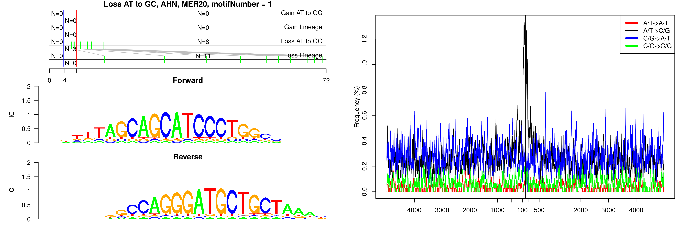
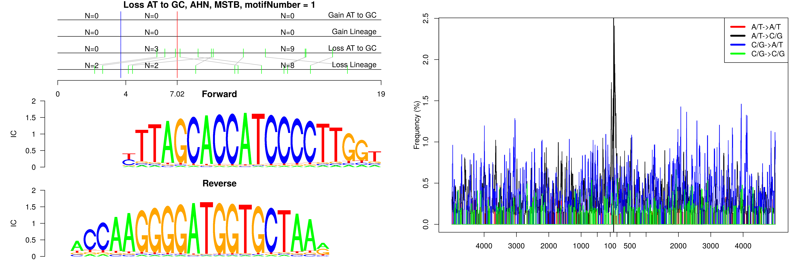
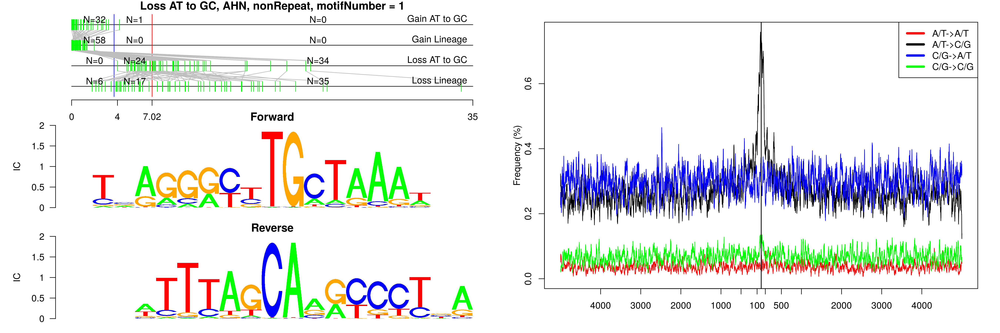
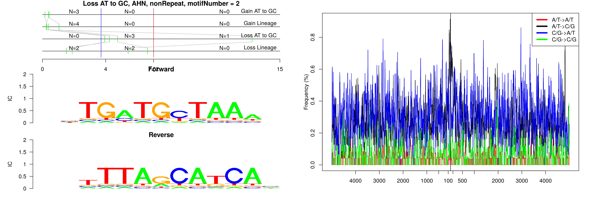
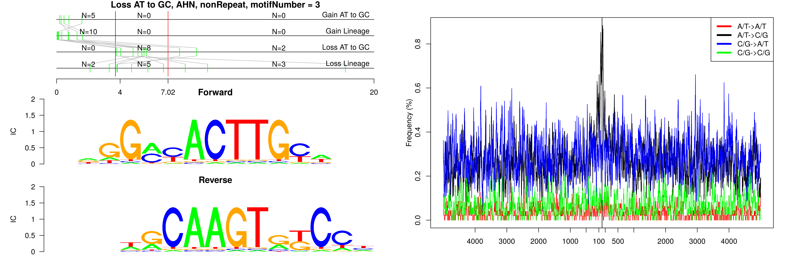
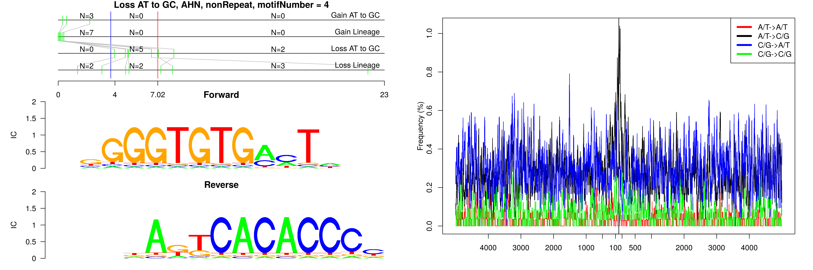
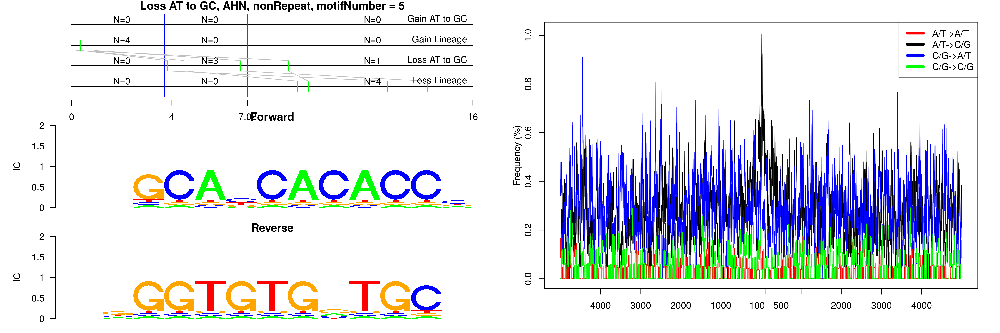
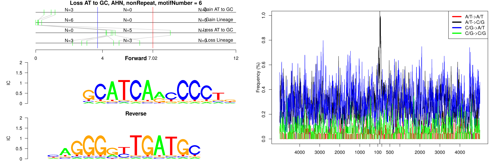
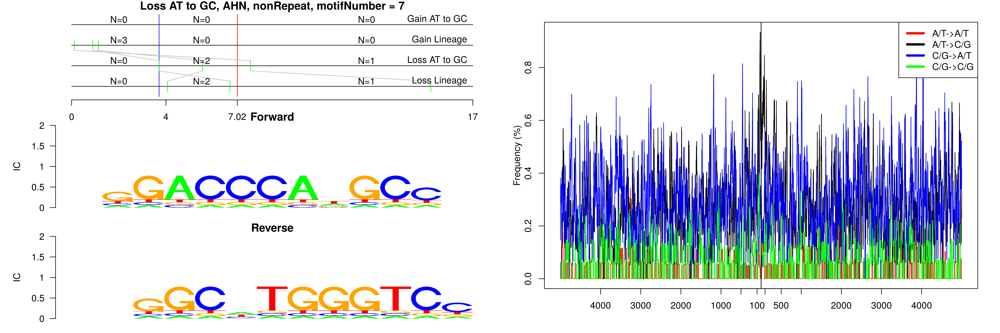

```
## Loss AT to GC, AHN, MER20, motifNumber = 1
```



```
## Loss AT to GC, AHN, MSTB, motifNumber = 1
```



```
## Loss AT to GC, AHN, nonRepeat, motifNumber = 1
```



```
## Loss AT to GC, AHN, nonRepeat, motifNumber = 2
```



```
## Loss AT to GC, AHN, nonRepeat, motifNumber = 3
```



```
## Loss AT to GC, AHN, nonRepeat, motifNumber = 4
```



```
## Loss AT to GC, AHN, nonRepeat, motifNumber = 5
```



```
## Loss AT to GC, AHN, nonRepeat, motifNumber = 6
```



```
## Loss AT to GC, AHN, nonRepeat, motifNumber = 7
```


  
