```
## Loss AT to GC, CHIMP, L1MEc, motifNumber = 1
```

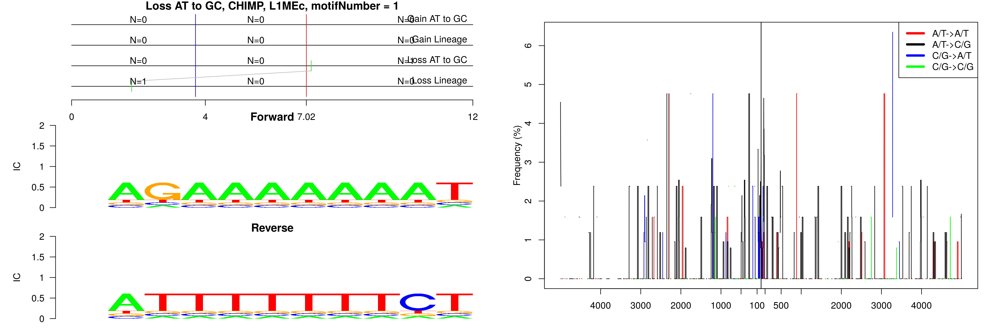

```
## Loss AT to GC, CHIMP, L1PA13, motifNumber = 1
```

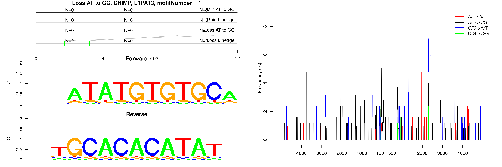

```
## Loss AT to GC, CHIMP, L2c, motifNumber = 1
```

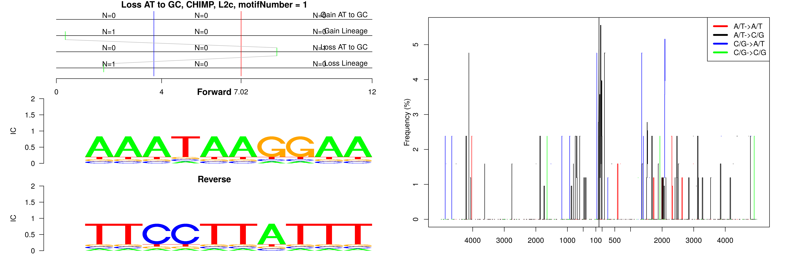

```
## Loss AT to GC, CHIMP, L2c, motifNumber = 2
```

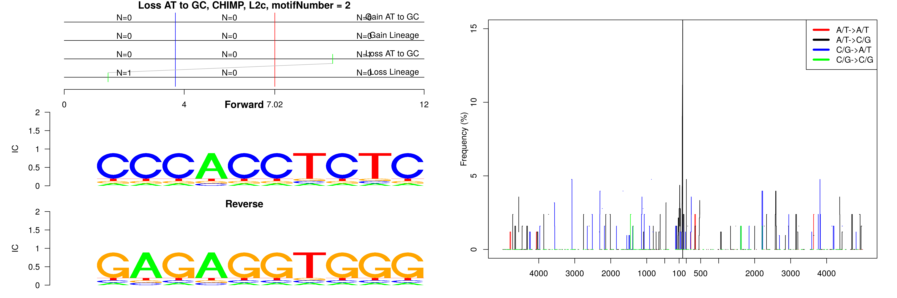

```
## Loss AT to GC, CHIMP, L2c, motifNumber = 3
```

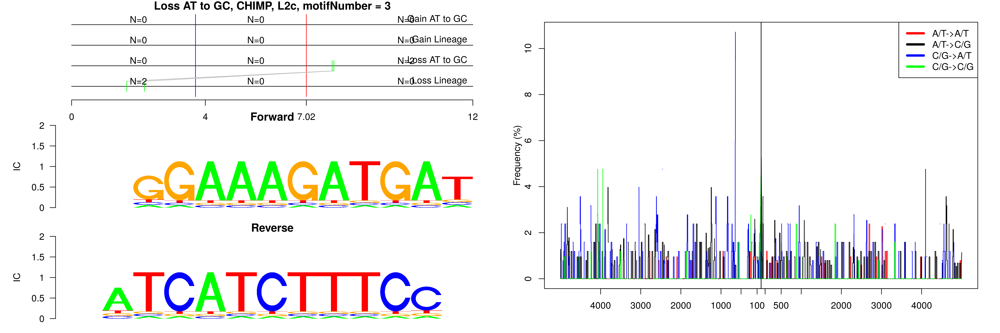

```
## Loss AT to GC, CHIMP, MIR, motifNumber = 1
```

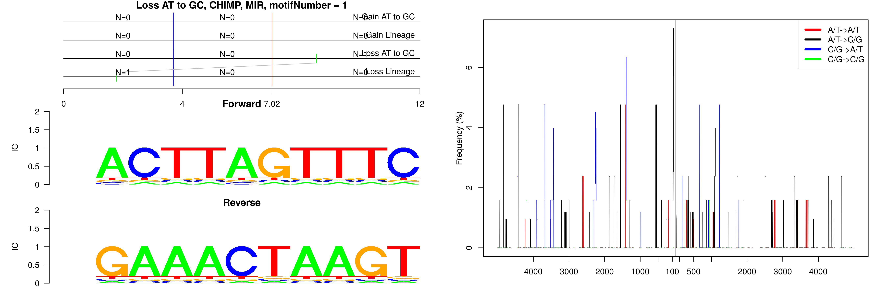

```
## Loss AT to GC, CHIMP, MLT1C, motifNumber = 1
```

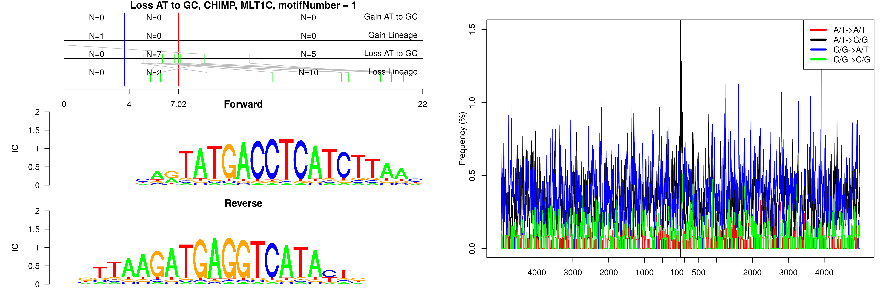

```
## Loss AT to GC, CHIMP, MLT2A1, motifNumber = 1
```

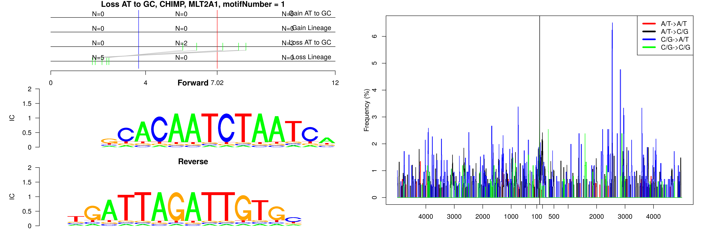

```
## Loss AT to GC, CHIMP, nonRepeat, motifNumber = 1
```


```
## Loss AT to GC, CHIMP, nonRepeat, motifNumber = 2
```

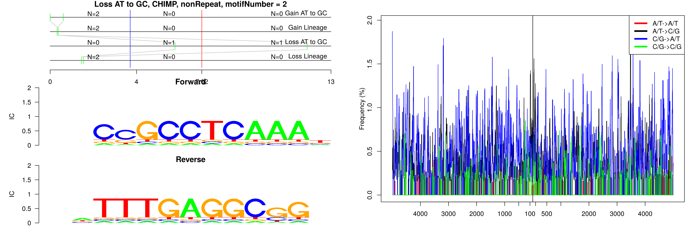

```
## Loss AT to GC, CHIMP, nonRepeat, motifNumber = 3
```


```
## Loss AT to GC, CHIMP, nonRepeat, motifNumber = 4
```


```
## Loss AT to GC, CHIMP, nonRepeat, motifNumber = 5
```


```
## Loss AT to GC, CHIMP, nonRepeat, motifNumber = 6
```

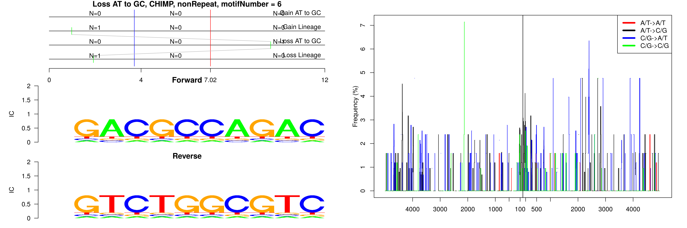

```
## Loss AT to GC, CHIMP, nonRepeat, motifNumber = 7
```

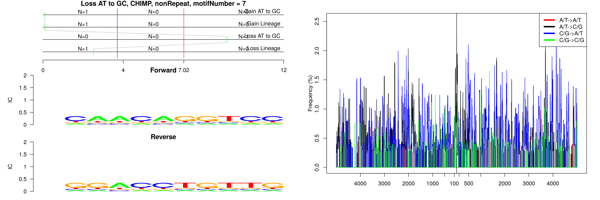

```
## Loss AT to GC, CHIMP, nonRepeat, motifNumber = 8
```

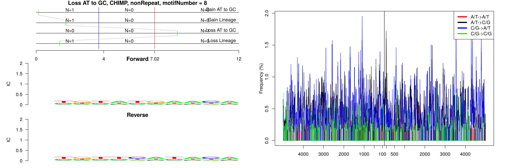

```
## Loss AT to GC, CHIMP, nonRepeat, motifNumber = 9
```

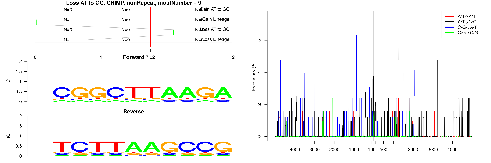

```
## Loss AT to GC, CHIMP, nonRepeat, motifNumber = 10
```

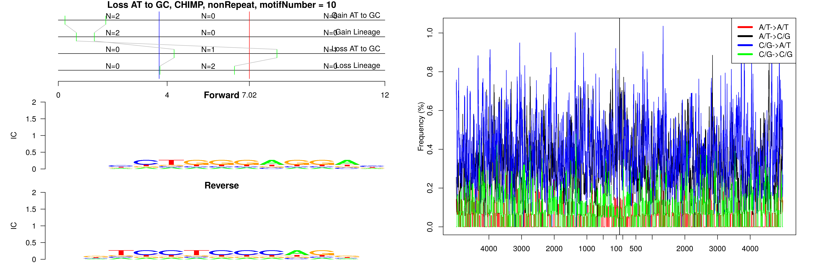

```
## Loss AT to GC, CHIMP, nonRepeat, motifNumber = 11
```

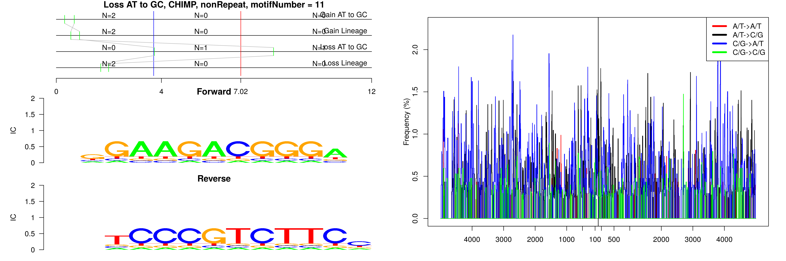

```
## Loss AT to GC, CHIMP, nonRepeat, motifNumber = 12
```

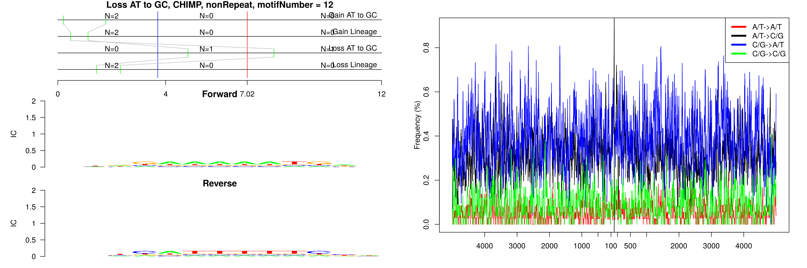

```
## Loss AT to GC, CHIMP, nonRepeat, motifNumber = 13
```


```
## Loss AT to GC, CHIMP, nonRepeat, motifNumber = 14
```

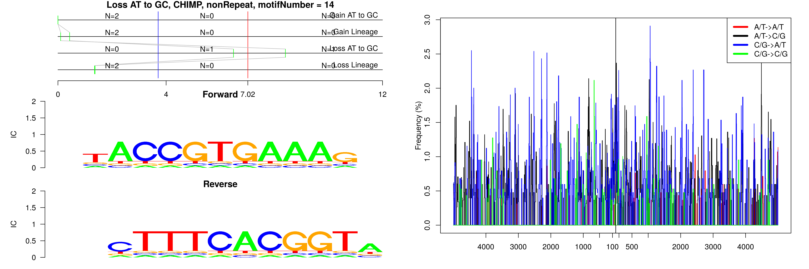

```
## Loss AT to GC, CHIMP, nonRepeat, motifNumber = 15
```

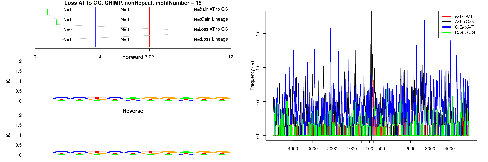

```
## Loss AT to GC, CHIMP, nonRepeat, motifNumber = 16
```

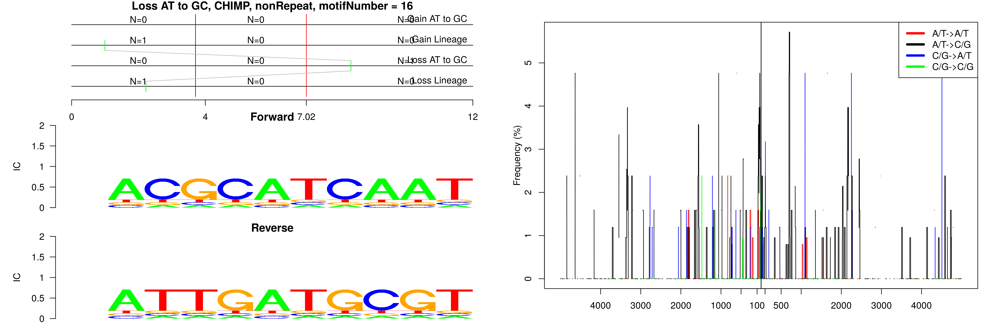

```
## Loss AT to GC, CHIMP, nonRepeat, motifNumber = 17
```

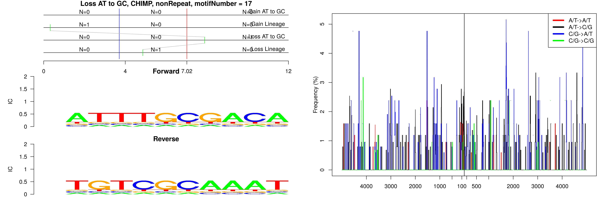

```
## Loss AT to GC, CHIMP, nonRepeat, motifNumber = 18
```

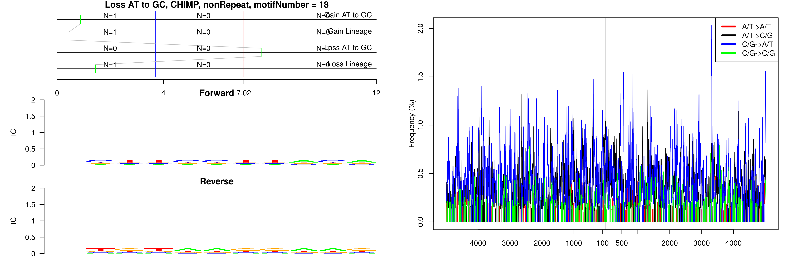

```
## Loss AT to GC, CHIMP, nonRepeat, motifNumber = 19
```

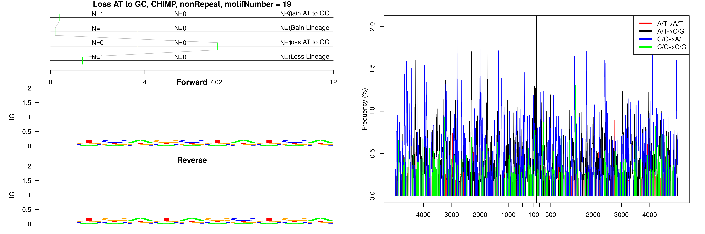

```
## Loss AT to GC, CHIMP, nonRepeat, motifNumber = 20
```

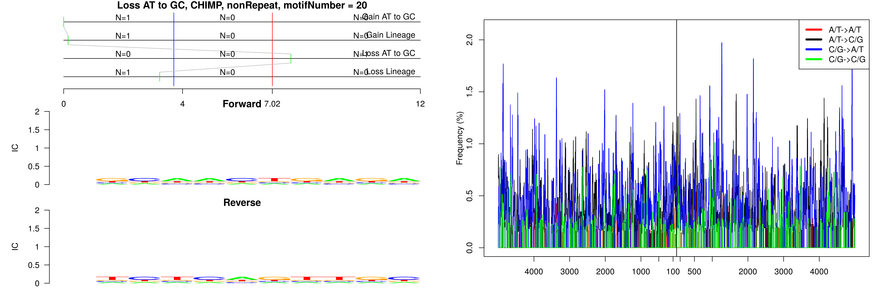

```
## Loss AT to GC, CHIMP, nonRepeat, motifNumber = 21
```


```
## Loss AT to GC, CHIMP, nonRepeat, motifNumber = 22
```

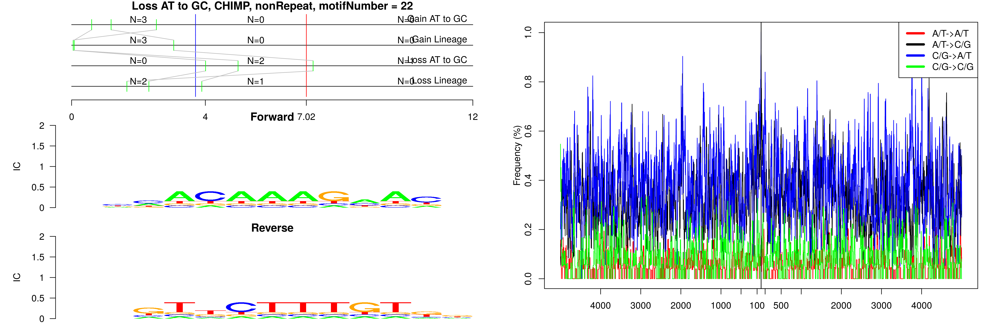

```
## Loss AT to GC, CHIMP, nonRepeat, motifNumber = 23
```

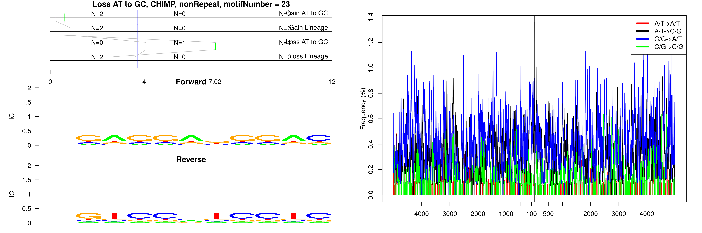

```
## Loss AT to GC, CHIMP, nonRepeat, motifNumber = 24
```

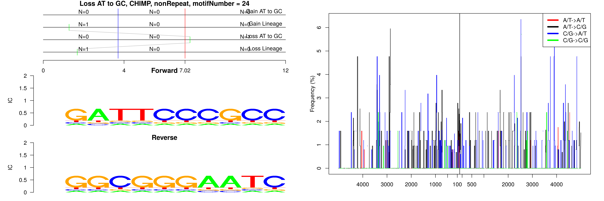

```
## Loss AT to GC, CHIMP, nonRepeat, motifNumber = 25
```

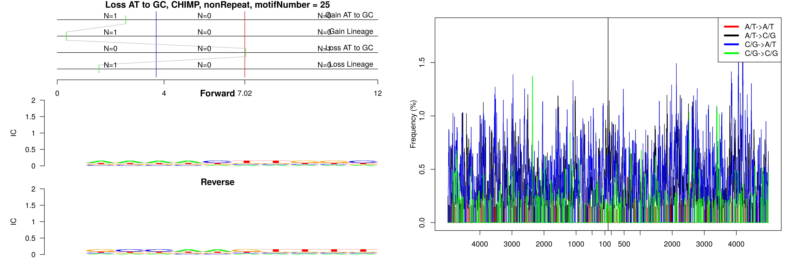

```
## Loss AT to GC, CHIMP, nonRepeat, motifNumber = 26
```

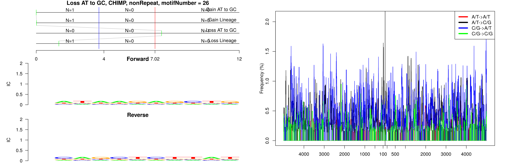
  
