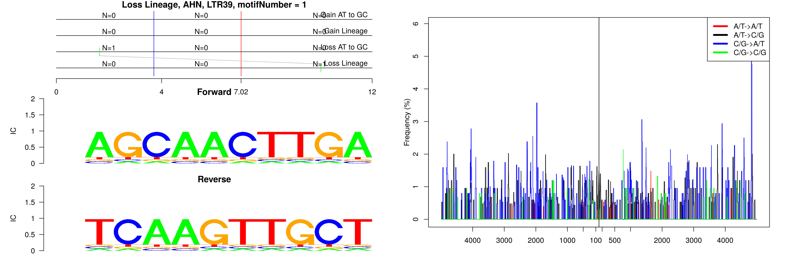
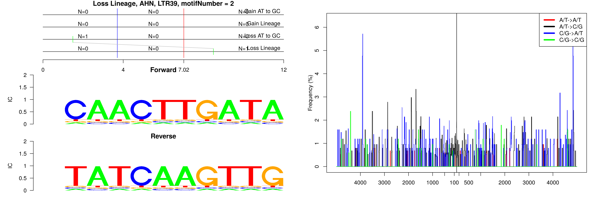
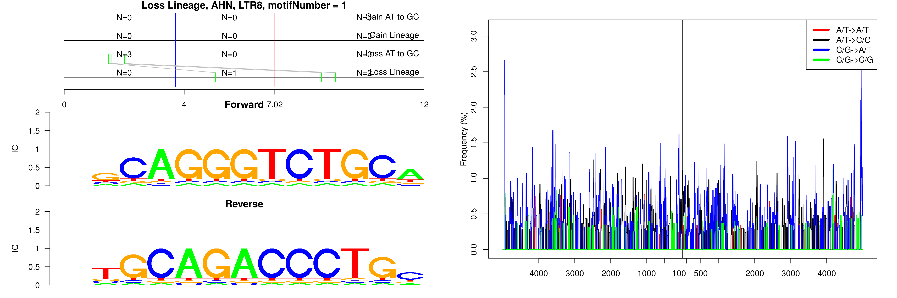
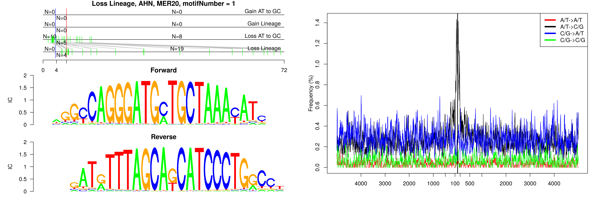
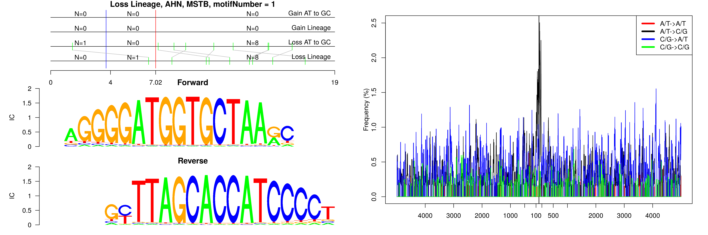
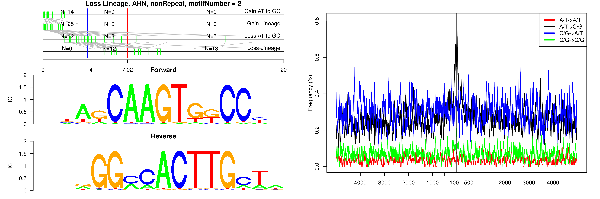
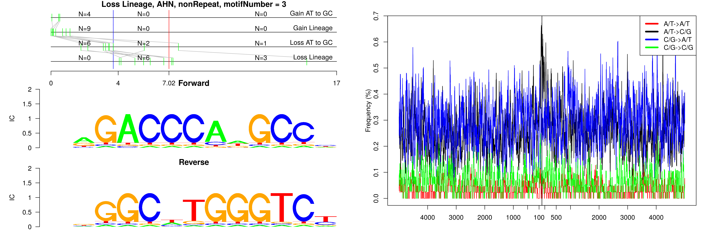
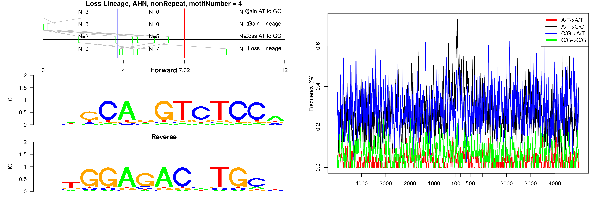
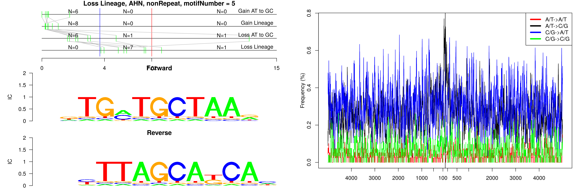

```
## Loss Lineage, AHN, LTR39, motifNumber = 1
```



```
## Loss Lineage, AHN, LTR39, motifNumber = 2
```



```
## Loss Lineage, AHN, LTR8, motifNumber = 1
```



```
## Loss Lineage, AHN, MER20, motifNumber = 1
```



```
## Loss Lineage, AHN, MER5A, motifNumber = 1
```


```
## Loss Lineage, AHN, MSTB, motifNumber = 1
```



```
## Loss Lineage, AHN, nonRepeat, motifNumber = 1
```


```
## Loss Lineage, AHN, nonRepeat, motifNumber = 2
```



```
## Loss Lineage, AHN, nonRepeat, motifNumber = 3
```



```
## Loss Lineage, AHN, nonRepeat, motifNumber = 4
```



```
## Loss Lineage, AHN, nonRepeat, motifNumber = 5
```


  
