```
## Loss Lineage, MACAQUE, L1MA2, motifNumber = 1
```

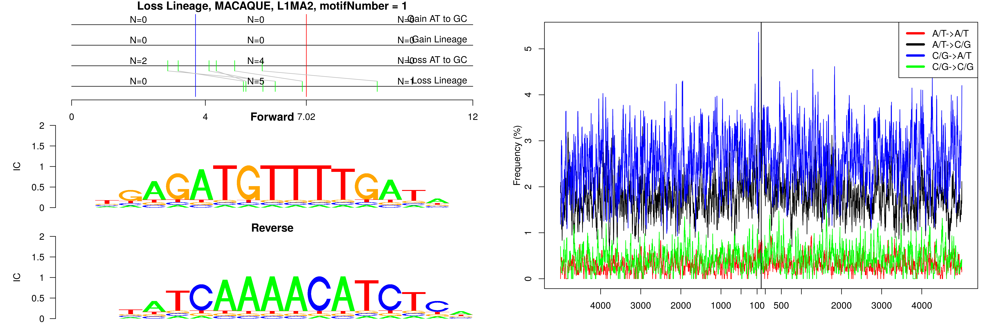

```
## Loss Lineage, MACAQUE, L1MB2, motifNumber = 1
```

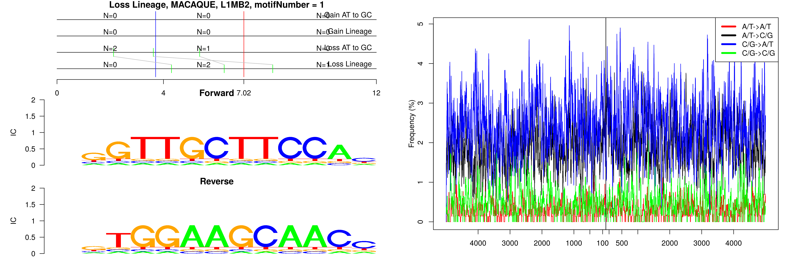

```
## Loss Lineage, MACAQUE, L1MB3, motifNumber = 1
```

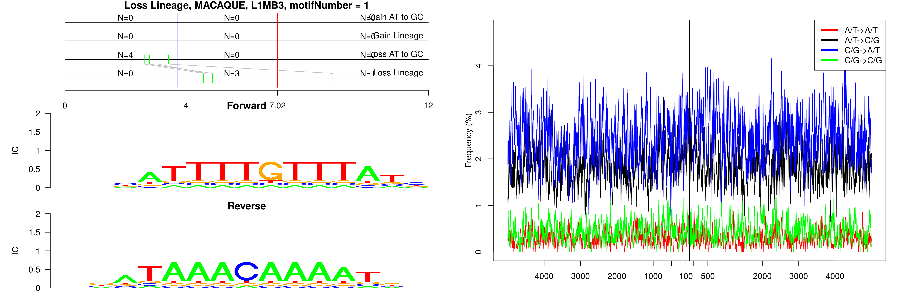

```
## Loss Lineage, MACAQUE, L1MB3, motifNumber = 2
```

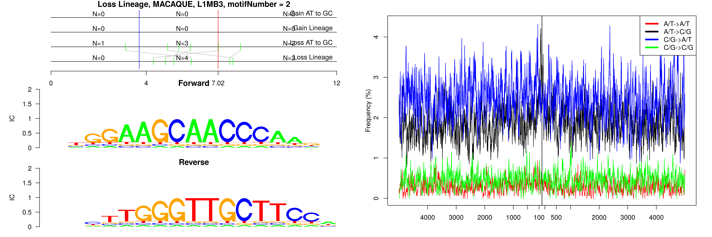

```
## Loss Lineage, MACAQUE, MSTD, motifNumber = 1
```

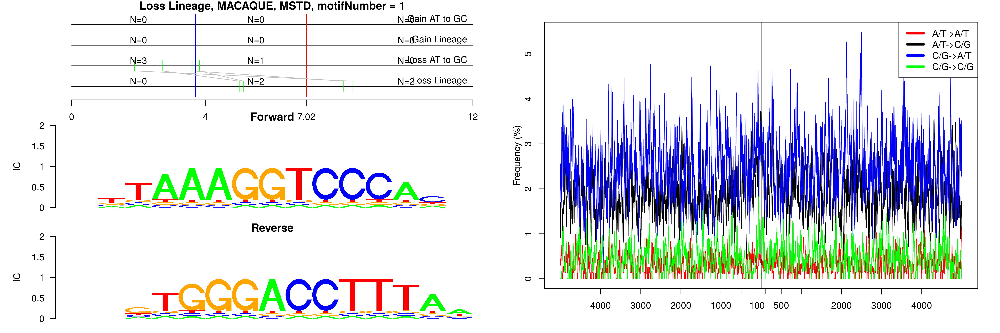

```
## Loss Lineage, MACAQUE, THE1B, motifNumber = 1
```

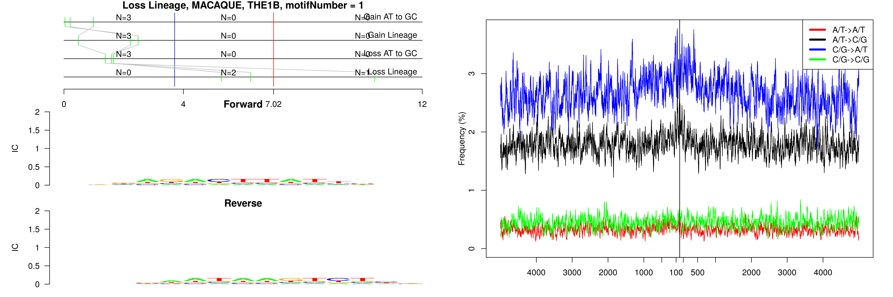

```
## Loss Lineage, MACAQUE, Tigger1, motifNumber = 1
```

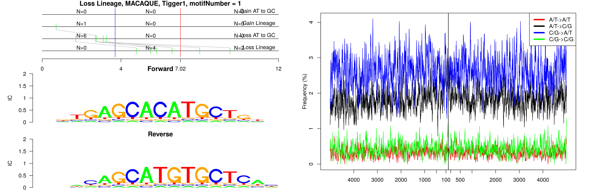

```
## Loss Lineage, MACAQUE, Tigger3a, motifNumber = 1
```

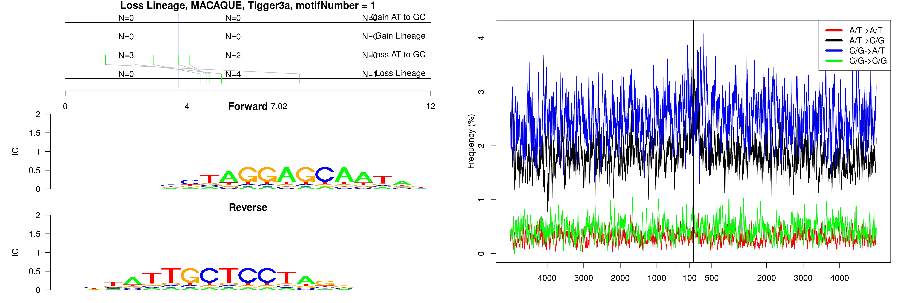

```
## Loss Lineage, MACAQUE, Tigger3b, motifNumber = 1
```

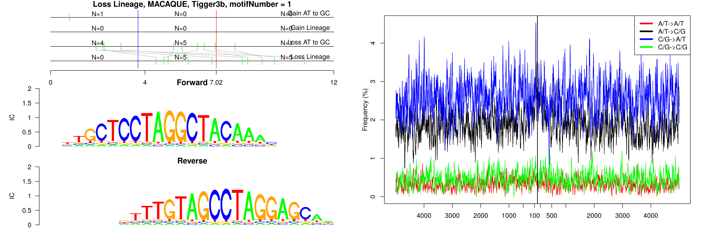

```
## Loss Lineage, MACAQUE, nonRepeat, motifNumber = 1
```

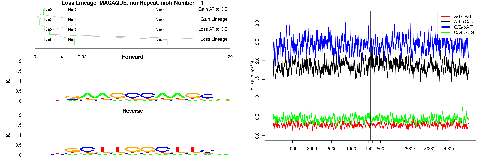

```
## Loss Lineage, MACAQUE, nonRepeat, motifNumber = 2
```

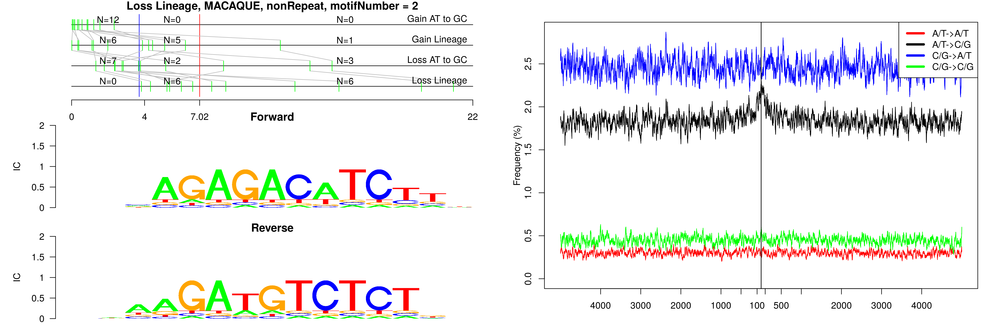

```
## Loss Lineage, MACAQUE, nonRepeat, motifNumber = 3
```

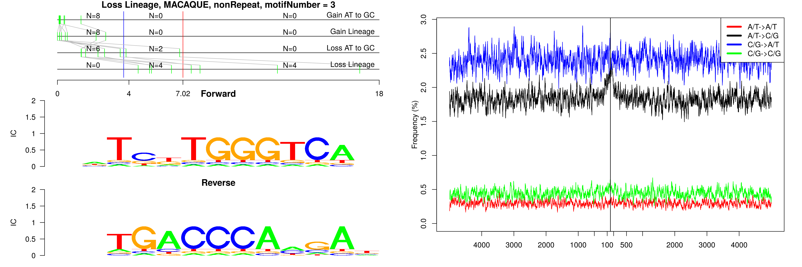

```
## Loss Lineage, MACAQUE, nonRepeat, motifNumber = 4
```

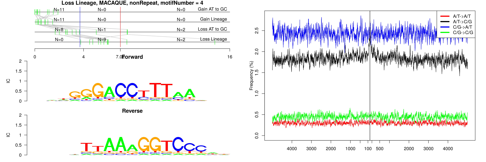

```
## Loss Lineage, MACAQUE, nonRepeat, motifNumber = 5
```

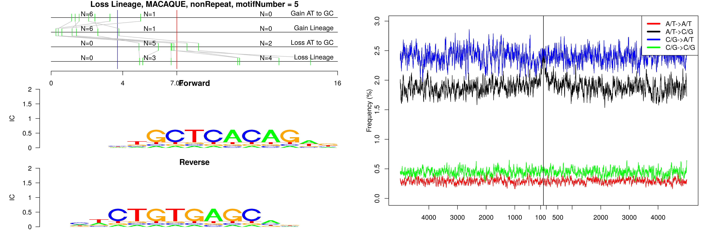

```
## Loss Lineage, MACAQUE, nonRepeat, motifNumber = 6
```

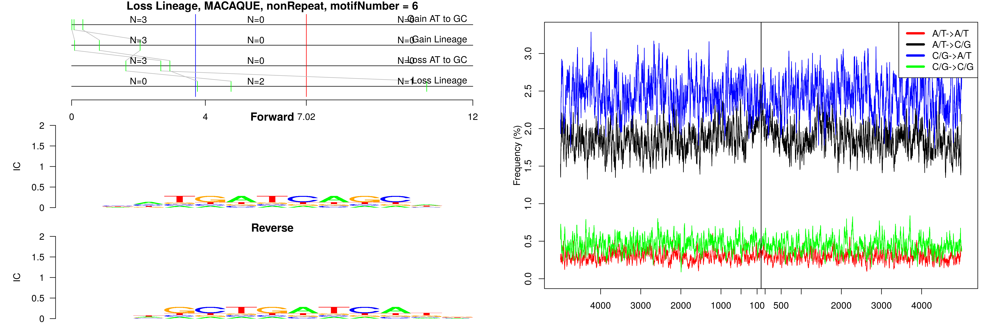

```
## Loss Lineage, MACAQUE, nonRepeat, motifNumber = 7
```

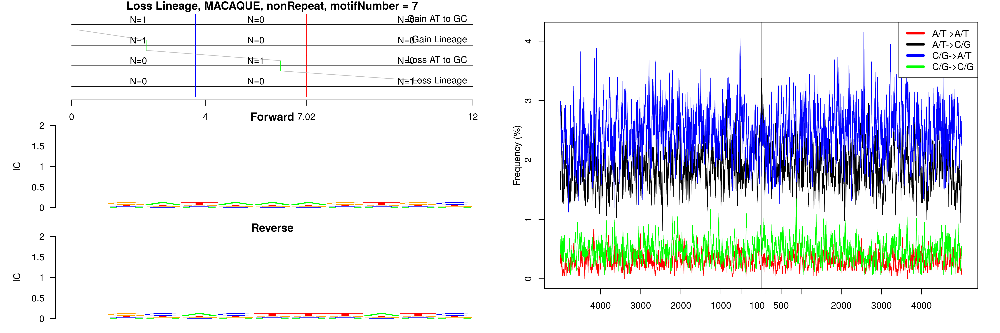

```
## Loss Lineage, MACAQUE, nonRepeat, motifNumber = 8
```


```
## Loss Lineage, MACAQUE, nonRepeat, motifNumber = 9
```

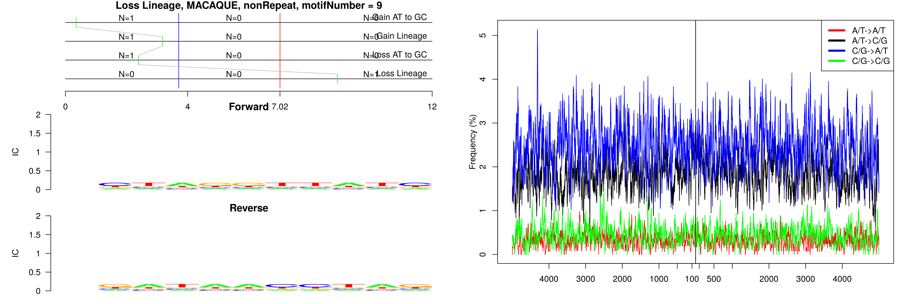

```
## Loss Lineage, MACAQUE, nonRepeat, motifNumber = 10
```

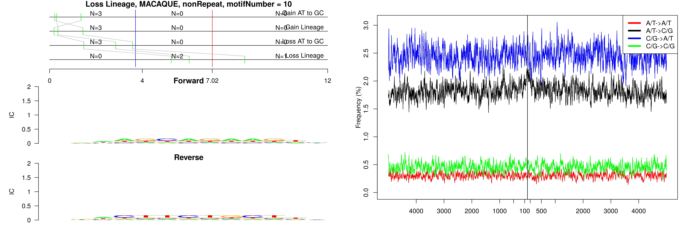
  
