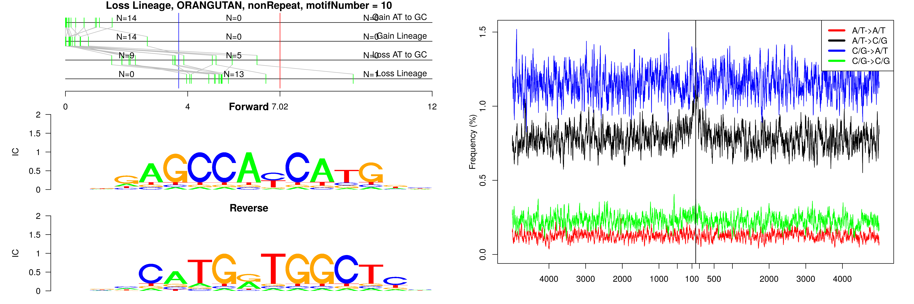
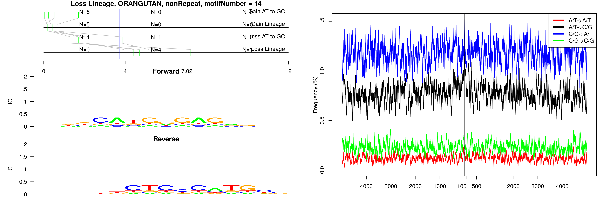

```
## Loss Lineage, ORANGUTAN, L1PA13, motifNumber = 1
```


```
## Loss Lineage, ORANGUTAN, MIR, motifNumber = 1
```


```
## Loss Lineage, ORANGUTAN, MIRb, motifNumber = 1
```


```
## Loss Lineage, ORANGUTAN, MIRc, motifNumber = 1
```


```
## Loss Lineage, ORANGUTAN, MIRc, motifNumber = 2
```


```
## Loss Lineage, ORANGUTAN, MIRc, motifNumber = 3
```


```
## Loss Lineage, ORANGUTAN, MLT1B, motifNumber = 1
```


```
## Loss Lineage, ORANGUTAN, THE1D, motifNumber = 1
```


```
## Loss Lineage, ORANGUTAN, nonRepeat, motifNumber = 1
```


```
## Loss Lineage, ORANGUTAN, nonRepeat, motifNumber = 2
```


```
## Loss Lineage, ORANGUTAN, nonRepeat, motifNumber = 3
```


```
## Loss Lineage, ORANGUTAN, nonRepeat, motifNumber = 4
```


```
## Loss Lineage, ORANGUTAN, nonRepeat, motifNumber = 5
```


```
## Loss Lineage, ORANGUTAN, nonRepeat, motifNumber = 6
```


```
## Loss Lineage, ORANGUTAN, nonRepeat, motifNumber = 7
```


```
## Loss Lineage, ORANGUTAN, nonRepeat, motifNumber = 8
```


```
## Loss Lineage, ORANGUTAN, nonRepeat, motifNumber = 9
```


```
## Loss Lineage, ORANGUTAN, nonRepeat, motifNumber = 10
```



```
## Loss Lineage, ORANGUTAN, nonRepeat, motifNumber = 11
```


```
## Loss Lineage, ORANGUTAN, nonRepeat, motifNumber = 12
```


```
## Loss Lineage, ORANGUTAN, nonRepeat, motifNumber = 13
```


```
## Loss Lineage, ORANGUTAN, nonRepeat, motifNumber = 14
```


  
