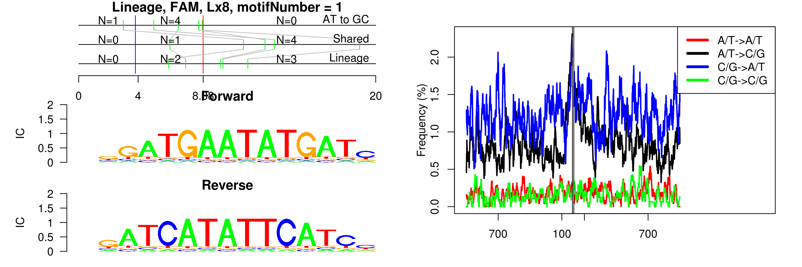
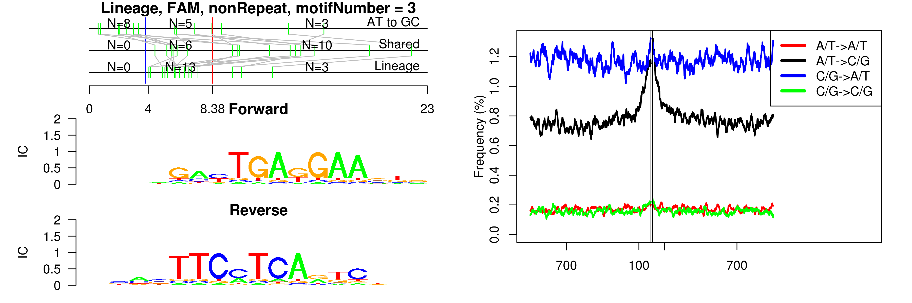
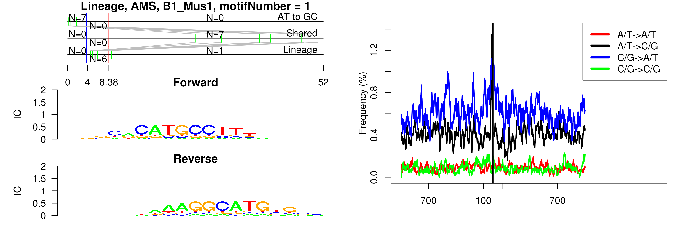
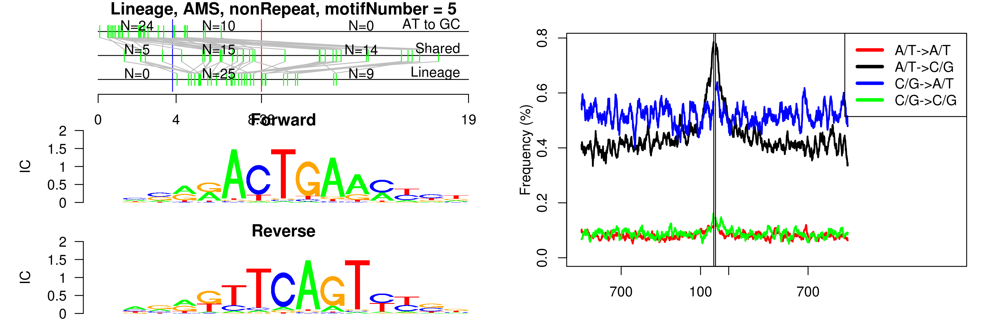
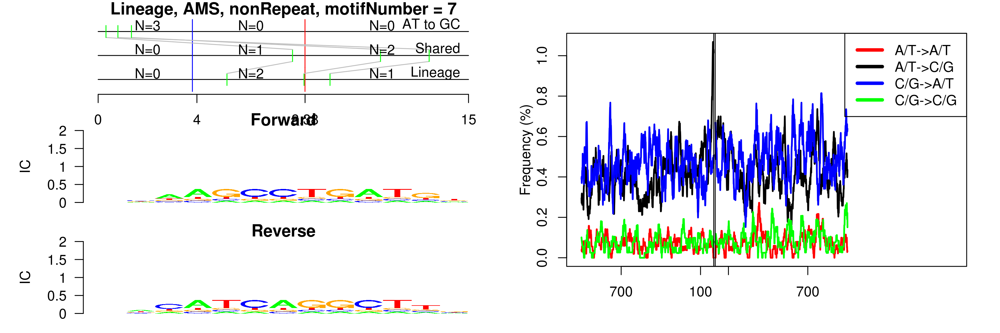
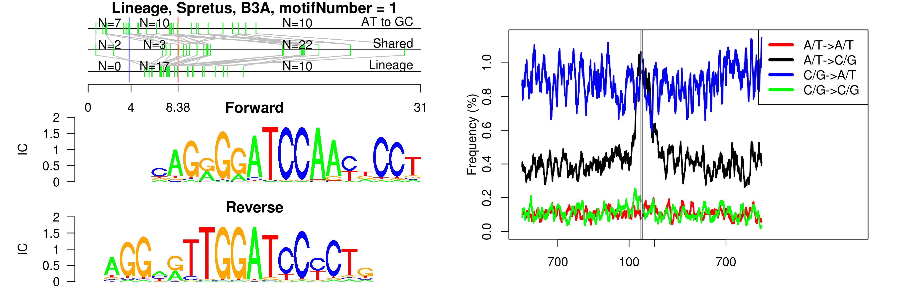
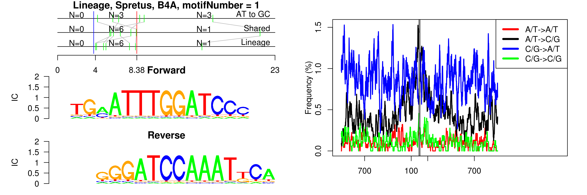

#Hotspot death
##Species: mice
##Run version: 2014_10_27
---


##Changelog
Date refers to first version with changes. If there is a plus after, then all subsequent versions have the change
* **2014_10_27** Redo significant value selection - do not require to the best on a lineage, but if OR>1, require that does not exist OR<1 with more significant p-value, for both clustering and motif selection
* **2014_10_27** Added variable pwmMinimum to control PWM plotting
* **2014_10_27** Use OR for better PWM plotting
* **2014_10_24** Added filtering folder for mice (ArrayNotFiltered95.0 used in all prior runs)
* **2014_10_01** Changed clustering method - increase difficulty such that current threshold for iteration is Bonferonni for this round and all other previous rounds. Also, only allow a motif to be included in one cluster per repeat background
* **2014_10_01** Fixed major repeat name problem - assigning motifs to repeats was fine, but got name wrong between assigning and reporting. Also affected generation of QQ plots in this summary document
* **2014_09_22** Added number of motif clusters in summary section  
* **2014_09_22** Add new AT  to GC plots, and details of making the plots
* **2014_09_18** Give the option to specify how to compare against other motifs for making 2x2 tables
* **2014_09_18** Don't perform motif loss counting if the the repeat background changes during the motif loss region
* **2014_09_17** For mice, set regions of the genome as uncallable if insufficient number of samples are callable in that region
* **2014_09_16** Clustering - changed it so motifs are only eligible to be added to a cluster if they have the best p-value among lineages for that motif
* **2014_09_15** added removal of A) nearby SNPs on the same lineage and B) too many SNPs in general locally, as well as check against expectations
* **2014_09_15** added proper support for mice for smaller number of musculus lineages
* **2014_09_13** x axis in left plot for comparison between two test p-values

------


##Important Parameters

|Parameter             |Value                   |Description                                                              |
|:---------------------|:-----------------------|:------------------------------------------------------------------------|
|mouseFilter           |NA                      |what folder used for mice                                                |
|mrle                  |10                      |maximum run length less than or equal to                                 |
|ndge                  |0                       |nuclotide diversity greater than or equal to                             |
|Klist                 |10                      |range of K to use                                                        |
|gcW1                  |100                     |range to test for GC increase                                            |
|gcW2                  |1000                    |,range to plot GC increases                                              |
|gcW3                  |10                      |,smoothing window for AT to GC plots                                     |
|ctge                  |10                      |for a p-value to be generated, each cell must have at least this number  |
|rgte                  |50                      |for a row to count, there must be this many entries                      |
|testingNames          |lin,shared,at           |(short) names of the tests we will perform                               |
|plottingNames         |Lineage,Shared,AT to GC |plotting names of the tests we will perform                              |
|nTests                |3                       |Number of tests to be performed                                          |
|pThresh               |0.000152439024390244    |Initial threshold for p-value clstering                                  |
|mouseMatrixDefinition |narrow                  |How we define mice lineages                                              |
|nR1                   |12                      |If there are nR1 SNPs in nD1 bp, remove all SNPs                         |
|nD1                   |50                      |See above                                                                |
|nR2                   |7                       |For a lineage, if there are ge this many SNPs in nD2 bp, remove all SNPs |
|nD2                   |50                      |See above                                                                |
|removeNum             |0                       |How many samples are allowed to be uncallable                            |
|contingencyComparison |Same CpG, GC Content    |To what do we compare motifs                                             |

---


##Methods
###SNP Filtering

SNPs are filtered if they have any missingness among the lineages, do not agree with the species tree, are multi-allelic, or are heterozygous among homozygous animals. 

Subsequently, SNPs are removed if they are too close together. This is the last step in the procedure, ie after removing SNPs for reasons listed above. I removed any SNPs if there were nR1 SNPs within nD1 bases, and, following this, I removed lineage specific SNPs down any lineage if there were nR2 SNPs within nD2 bases. For example, if nR1 was 10 and nD1 was 50, and there was a cluster of 14 SNPs within 50 bases, all of the offending SNPs were removed. 

To get a sense of how many SNPs this removed for given parameter settings, I checked how many SNPs were filtered for a range of parameter settings for the smallest chromosome. I also compared this against expectations. To get an expectation, I simulated a pseudo-chromosome of results. I calculated the expected branch lengths of each lineage given the emprical data to this point, ie lineage 1 has 1 percent divergence against MRCA of the set of all lineages, lineage 2 has 0.5 percent divergence against MRCA, etc. Then, I decided whether each base was mutated according to the total branch length of the tree, and then, given a mutation, what branch it occured on with probabilities equal to each lineages share of the total tree length. 

<!---
Figure ADD FIGURE REFERENCE? shows the results. 
TODO Add back in figure here

-->

###Testing - general

3 tests are run based on motifs which are lost at every SNP down a lineage. Note that where there are multiple SNPs within a motif size (ie two SNPs 5 bases away), I considered all motifs lost over that range. If there were any missing bases within that range, the motifs were not counted towards the testing. Further, if the repeat background changed during that range, the motifs were not counted towards the testing.

###Test 1 - Lineage - Motif loss within a lineage versus other lineages

Here I look at the number of motifs lost down a lineage versus all other lineages. The 2 * 2 test is therefore


|                     |Lineage |All other lineages |
|:--------------------|:-------|:------------------|
|Motif                |n1      |n2                 |
|Same CpG, GC Content |n3      |n4                 |

###Test 2 - Shared - Motif loss within a lineage versus ancestral counts

Here, I look at the number of motifs lost down a lineage versus the number present in its ancestor in the species tree. Then, we test the number of motifs lost vs the number which are not lost. The 2 * 2 test is therefore


|                     |Lost down this lineage |Not lost down this lineage |
|:--------------------|:----------------------|:--------------------------|
|Motif                |n1                     |n2                         |
|Same CpG, GC Content |n3                     |n4                         |

###Test 3 - AT to GC - Motif loss AT to GC counts versus local AT bases
  
Let gcW1=100 be the distance to test for increased presence of AT to GC
bases. Then around every motif that is lost, we count three numbers

* The number of AT to GC changes in nearest gcW bases away from the motif, not including the motif itself. For example, with K=10, for a motif from 1,000 to 1,009 inclusive, then the following 100 bp are from 1,010 to 1,109, inclusive. So an A to a G at 1,109 is within range while an A to a C at 1,110 is out of range.
* The number of AT bases within gcW bases, not including motif
* The number of callable bases within gcW bases, not including motif

We are currently not using the third value (the number of callable bases), only the total number of AT bases. The 2 * 2 test per motif is


|                     |AT to GC bases |Number of AT bases |
|:--------------------|:--------------|:------------------|
|Motif                |n1             |n2                 |
|Same CpG, GC Content |n3             |n4                 |
            
###Motif Filtering

Motifs were kept if the longest run of a specific nucleotide was less than or equal to mrle = 10. Motifs were also kept if the nucleotide diversity (ie number of A,C,G,T) bases was greater than or equal to ndge =0. For each test seperately, motifs were removed as well as individual results masked if the counts were too low. Motif level results were not calculated if the counts among all lineages for a motif was less than rgte = 50. Lineage specific results were also masked (ie not calculated) in each test seperately if the motif lineage value was less than cgte = 10 (ie the n1 entry in the contingency tables).

###Clustering

To be eligible for clustering, a motif had to be Bonferonni significant on its lineage, have an OR>1, and not have a lineage with an OR<1 which had a more significant p-value. For clustering, a motif would have to meet a p-value threshold (explained below), as well as meet the criteria that there not be a lineage with OR<1 with a more significant p-value.

Given a set of motifs which pass Bonferonni correction for a given lineage for a given test for a given repeat background which are most significant in this lineage versus all other lineages, start with the motif with the most significant p-value. 

Consider as eligible all motifs on the repeat background for that test which are the ``most significant'' (ie lowest p-value) for that motif and beat a threshold which increases in difficulty as the iterative process goes on (defined below). Add to the cluster all motifs within a certain distance (defined below), keeping track of alignment. Continue recursively for each added motif until exhausted. Build a position weight matrix by collapsing all clustered motifs, counting each base, adding 0.5 to all pwm cell entries, and dividing by the column totals to have each entry scaled between 0 and 1. 

Let K be the motif length we are interested in. We define as acceptably close for clustering all motifs which align perfectly and are off by 1 base (sum of K*4), or that are off by 1 base in the alignment left or right (2 for left vs right) with any new base in the gap (4 bases) with any one of the remaining K-1 bases allowed to change as well (4). In total there are (K-1)*4*4*2+K*4 = 328 possible acceptably close motifs.

For the first iteration, take a p-value threshold of the number of motifs to be searched, or (K-1)*4*4*2+K*4 = 328. For each subsequent iteration, take a p-value threshold where the deminator is the number of tests already performed plus the number to be searched on this iteration. For example, if on the first iteration 3 close motifs were found to meet the iteration 1 p-value threshold, then on the second iteration the p-value threhsold would be 0.05 divided by the number of motifs searched on the first iteration, 328, plus the 3 * 328 to be searched on the second iteration.

For plotting, we summed the collapsed motif clusters counts by base and added 0.5 to each count. Then, for a motif cluster of length $m$, letting $j \in \{1,2,3,4\}$ be the four nucleotides and $i \in \{1,2,...,m\}$ be the position within the motif cluster, we set $H_i = \sum_{j=1}^4 f_{i,j} \log(f_{i,j})$, and define the height of each base as $h_{i,j}=H_{i} f_{i,j}$. Bases are then ordered from smallest to largest entropy and plotted. We used elements of the seqLogo R package to draw the PWM.

The math for drawing the PWM is taken from [here](http://en.wikipedia.org/wiki/Sequence_logo).


###AT to GC plots
To better visualize the localization of AT to GC changes surrounding a motif cluster, we plotted whether bases changed from AT to GC or vice versa, with respect to their distance from the motif. We first scanned through the chromosomes to find instances where motifs in the motif cluster were lost. To ensure we weren't oversampling SNP changes due to similar motifs, we limited ourselves to counting only a single motif loss instance among a run of motif losses each one within the length of the motif cluster in distance from each other. 

Next, taking care to get both the correct strand as well as the position of the motif within the cluster of motifs correct, we catalogued both the position and base composition of any changes within a neighbourhood of 1000 bases. By summing across all loss instances of motifs in the cluster, and normalizing to the local sequence context, we could plot any type of ancestral to derived base change. Smoothing was done over 21 bases, ie taking the value at the flanking bases and over the prior and aft 10 bases. 

These plots also feature a PWM for the forward and reverse forms of the motif, as well as a series of line plots which show the number of motifs and their p-values for the motifs in the cluster. The middle line is for the test under consideration, while p-values for the other two tests are highlighted above and below, with grey lines linking the same motif (motifs with undefiend p-values on the other two tests are omitted from the plots for those tests and are not linked). These are stratefied into those which are Bonferonni significant on their test to the right of the red line, those which are between the initial clustering p-value threshold and the Bonferonni thresold in the middle, and those which do not meet the initial clustering p-value threhsold on the left. Numbers of motifs falling into each category are given as well.

---


## Some summary numbers

Aligned Genome (Gbp)


|  Total| Pass QC| Fail QC| Pass QC Non Repeat|
|------:|-------:|-------:|------------------:|
| 2.4723|  1.6449|  0.8274|             1.1138|
Number of Derived Mutations down a specific lineage


|FAM        |AMS        |Spretus    |AM         |WSBEiJ     |CASTEiJ    |PWKPhJ     |
|:----------|:----------|:----------|:----------|:----------|:----------|:----------|
|17,935,113 | 8,439,998 |11,800,414 | 4,728,452 | 6,066,739 | 6,178,547 | 6,347,677 |
Branch length as percent of alignable genome


|   FAM|   AMS| Spretus|    AM| WSBEiJ| CASTEiJ| PWKPhJ|
|-----:|-----:|-------:|-----:|------:|-------:|------:|
| 1.090| 0.513|   0.717| 0.287|  0.369|   0.376|  0.386|
Branch length compared to ancestral of all lineages in SNPs


|PWKPhJ     |CASTEiJ    |WSBEiJ     |Spretus    |FAM        |
|:----------|:----------|:----------|:----------|:----------|
|19,516,127 |19,346,997 |19,235,189 |20,240,412 |17,935,113 |
Branch length compared to ancestral as percent of alignable genome


| PWKPhJ| CASTEiJ| WSBEiJ| Spretus|   FAM|
|------:|-------:|------:|-------:|-----:|
|  1.186|   1.176|  1.169|   1.230| 1.090|


---

## Number of significant motifs per lineage per test

Note that the following numbers are only for motifs that have been clustered


```
## Warning: cannot open compressed file
## '/Net/dense/data/wildmice/motifLoss/cluster_E_2014_10_27/lin.K10.motifSuperResults.RData',
## probable reason 'No such file or directory'
```

```
## Error: cannot open the connection
```

Number of motifs (clusters) per test and lineage

```
## Error: data is too long
```

FAM
No significant results

AMS
No significant results

Spretus
No significant results

AM
No significant results

PWKPhJ
No significant results

CASTEiJ
No significant results

CASTEiJ.PWKPhJ
No significant results

WSBEiJ
No significant results

WSBEiJ.PWKPhJ
No significant results

WSBEiJ.CASTEiJ
No significant results

---

## Features of significant motifs


```
## Features of top associated motifs
```

```
## Test: lin
```

```
## Error: object 'qqData' not found
```

---

## All signifiant motifs

                      


---

