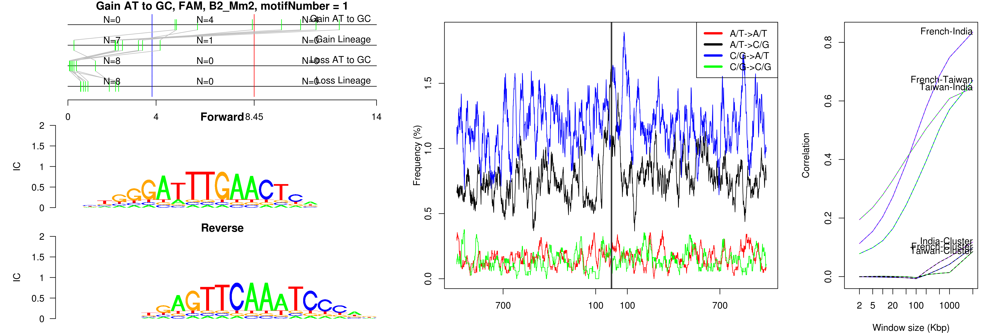
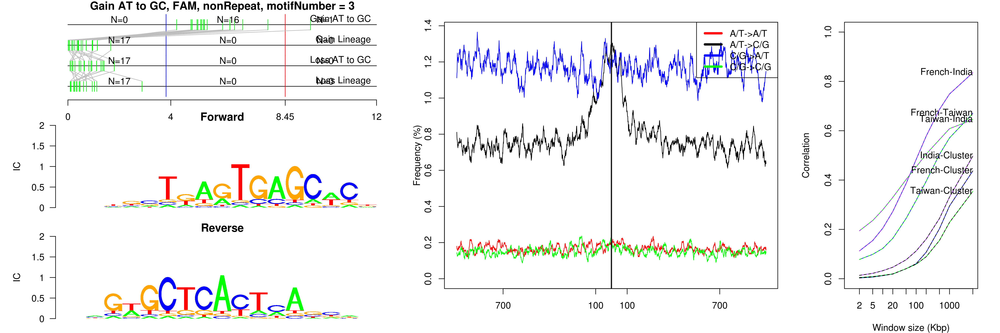
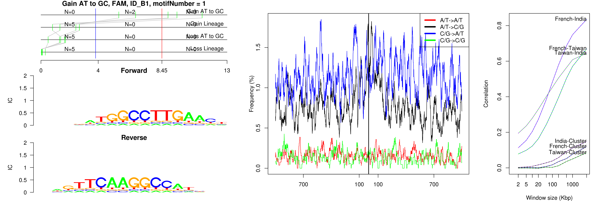
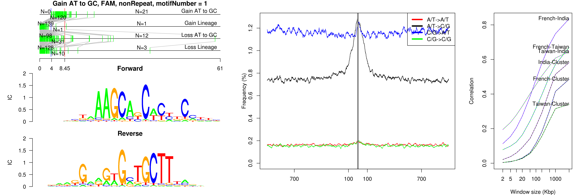
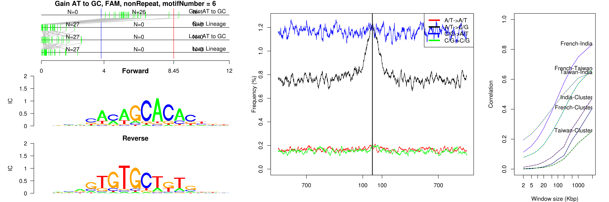
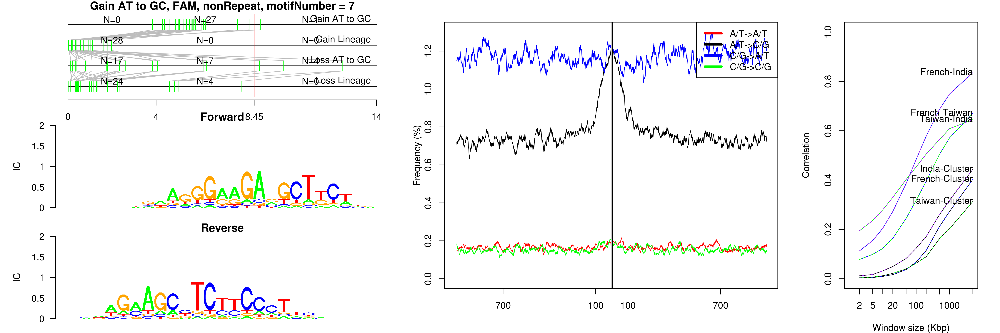

```
## Gain AT to GC, FAM, nonRepeat, motifNumber = 1
```

 

```
## Gain AT to GC, FAM, nonRepeat, motifNumber = 2
```

 

```
## Gain AT to GC, FAM, nonRepeat, motifNumber = 3
```

 

```
## Gain AT to GC, FAM, nonRepeat, motifNumber = 4
```

 

```
## Gain AT to GC, FAM, nonRepeat, motifNumber = 5
```

 

```
## Gain AT to GC, FAM, nonRepeat, motifNumber = 6
```

 

```
## Gain AT to GC, FAM, nonRepeat, motifNumber = 7
```

 
  
