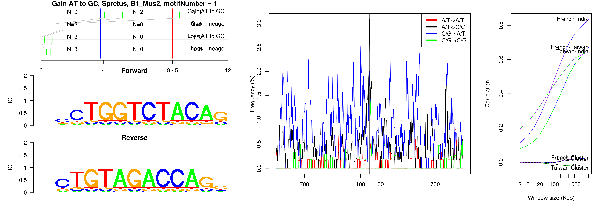
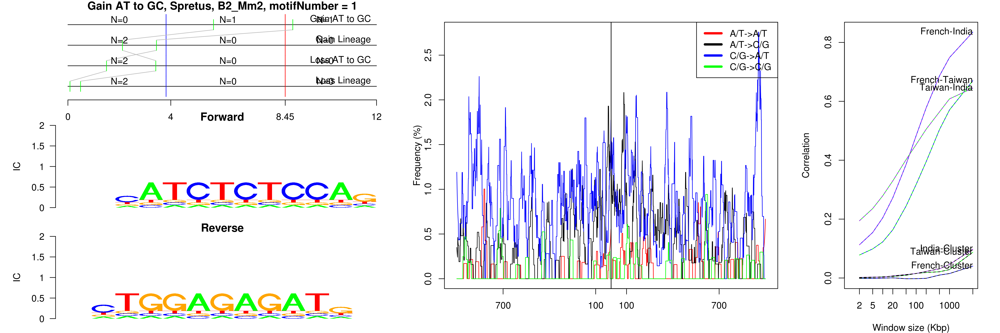
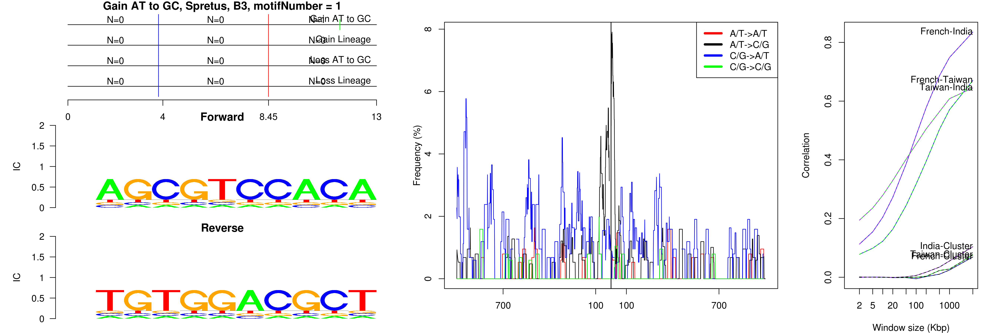
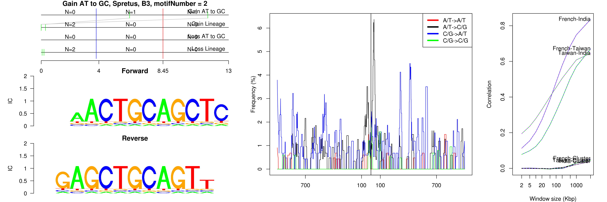
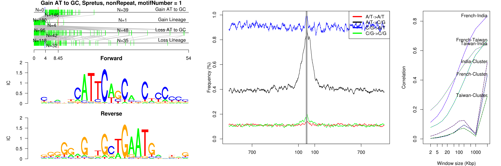
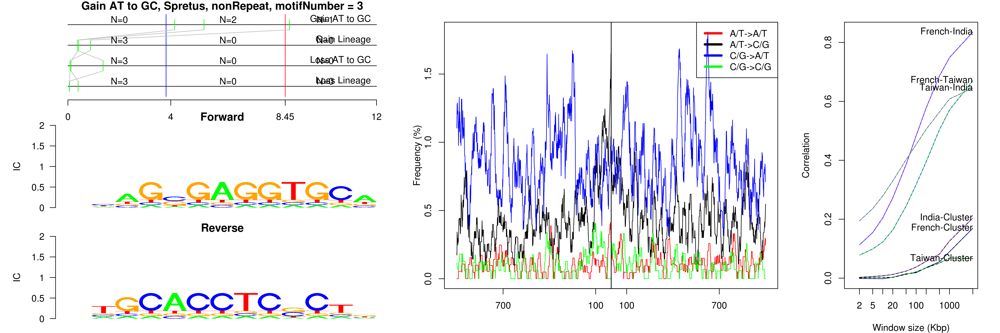
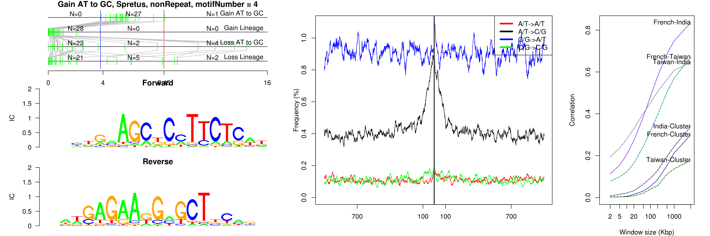
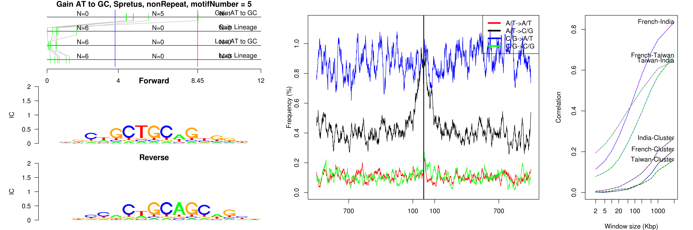

```
## Gain AT to GC, Spretus, B1_Mus2, motifNumber = 1
```

 

```
## Gain AT to GC, Spretus, B2_Mm2, motifNumber = 1
```

 

```
## Gain AT to GC, Spretus, B3, motifNumber = 1
```

 

```
## Gain AT to GC, Spretus, B3, motifNumber = 2
```

 

```
## Gain AT to GC, Spretus, nonRepeat, motifNumber = 1
```

 

```
## Gain AT to GC, Spretus, nonRepeat, motifNumber = 2
```

 

```
## Gain AT to GC, Spretus, nonRepeat, motifNumber = 3
```

 

```
## Gain AT to GC, Spretus, nonRepeat, motifNumber = 4
```

 

```
## Gain AT to GC, Spretus, nonRepeat, motifNumber = 5
```

 
  
