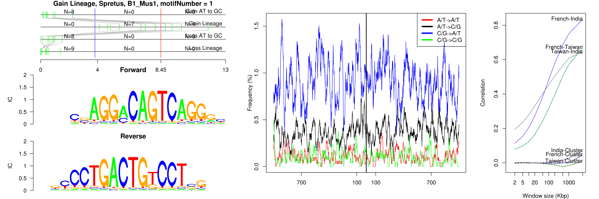

```
## Gain Lineage, Spretus, B1_Mus1, motifNumber = 1
```

 

```
## Gain Lineage, Spretus, B2_Mm2, motifNumber = 1
```

 

```
## Gain Lineage, Spretus, B3, motifNumber = 1
```

 

```
## Gain Lineage, Spretus, nonRepeat, motifNumber = 1
```

 

```
## Gain Lineage, Spretus, nonRepeat, motifNumber = 2
```

 

```
## Gain Lineage, Spretus, nonRepeat, motifNumber = 3
```

 

```
## Gain Lineage, Spretus, (TCTA)n, motifNumber = 1
```

 
  
