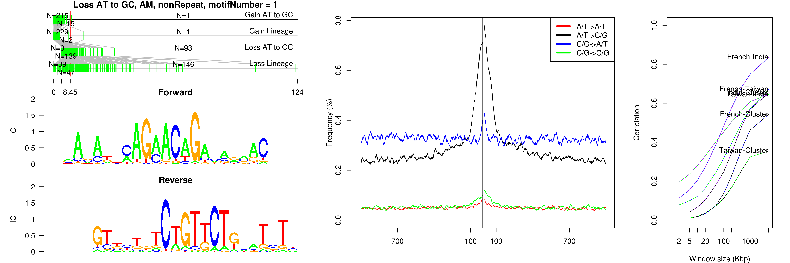
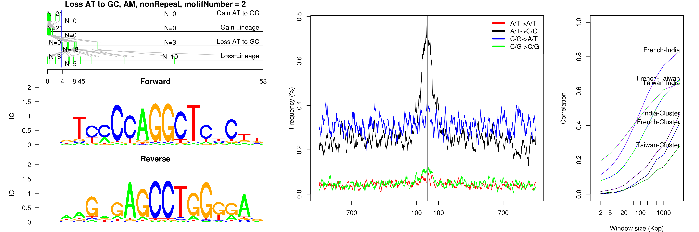
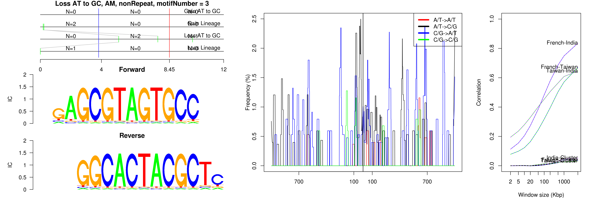
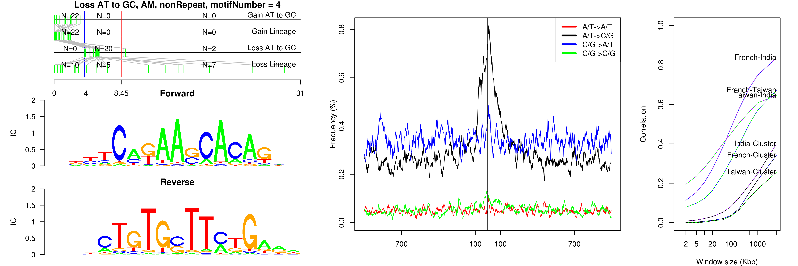
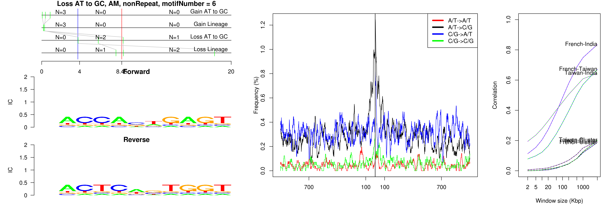
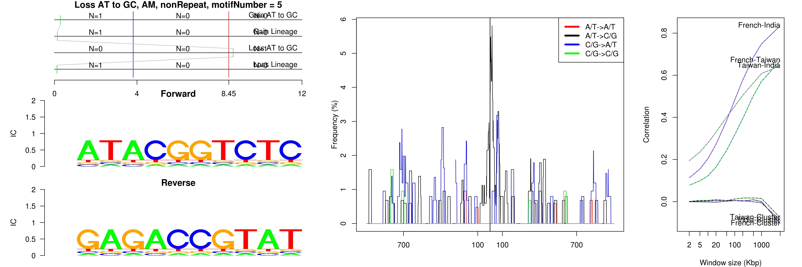
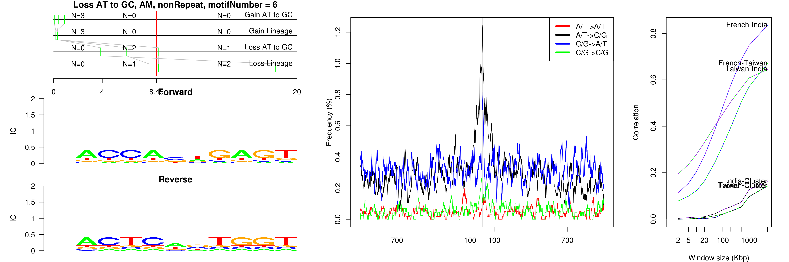

```
## Loss AT to GC, AM, B3, motifNumber = 1
```

 

```
## Loss AT to GC, AM, ID4, motifNumber = 1
```

 

```
## Loss AT to GC, AM, nonRepeat, motifNumber = 1
```

 

```
## Loss AT to GC, AM, nonRepeat, motifNumber = 2
```

 

```
## Loss AT to GC, AM, nonRepeat, motifNumber = 3
```

 

```
## Loss AT to GC, AM, nonRepeat, motifNumber = 4
```

 

```
## Loss AT to GC, AM, nonRepeat, motifNumber = 5
```

 

```
## Loss AT to GC, AM, nonRepeat, motifNumber = 6
```

 
  
