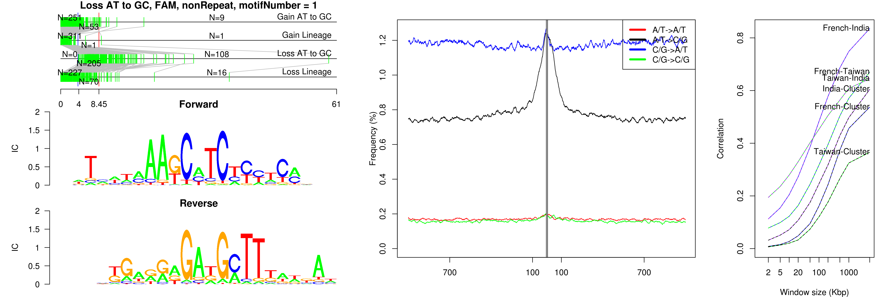
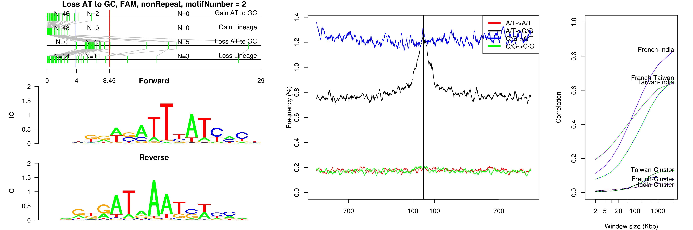
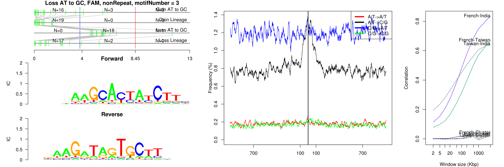
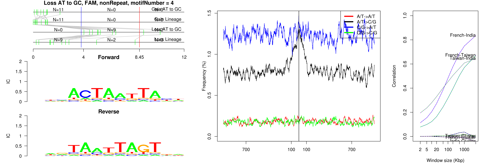
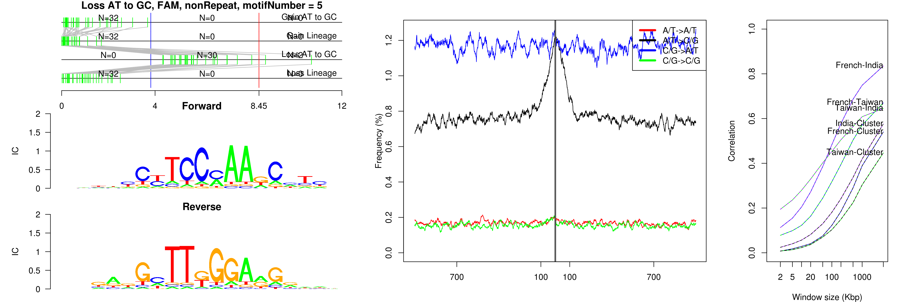

```
## Loss AT to GC, FAM, nonRepeat, motifNumber = 1
```

 

```
## Loss AT to GC, FAM, nonRepeat, motifNumber = 2
```

 

```
## Loss AT to GC, FAM, nonRepeat, motifNumber = 3
```

 

```
## Loss AT to GC, FAM, nonRepeat, motifNumber = 4
```

 

```
## Loss AT to GC, FAM, nonRepeat, motifNumber = 5
```

```
## Error: subscript out of bounds
```

 
  
