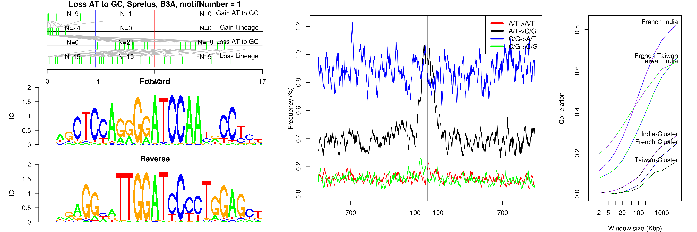
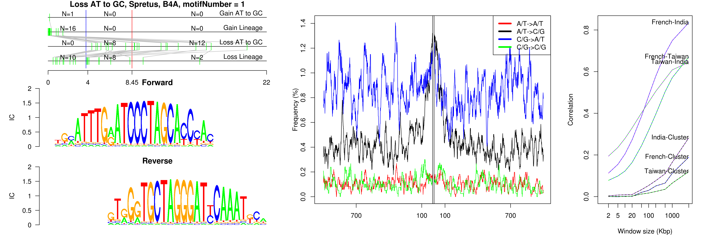
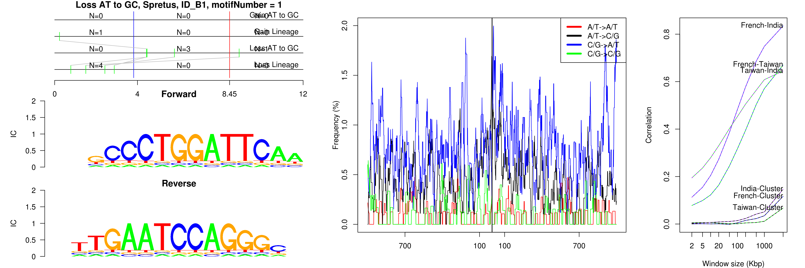

```
## Loss AT to GC, Spretus, B3, motifNumber = 1
```

 

```
## Loss AT to GC, Spretus, B3A, motifNumber = 1
```

 

```
## Loss AT to GC, Spretus, B4A, motifNumber = 1
```

 

```
## Loss AT to GC, Spretus, ID_B1, motifNumber = 1
```

 

```
## Loss AT to GC, Spretus, Lx9, motifNumber = 1
```

 

```
## Loss AT to GC, Spretus, nonRepeat, motifNumber = 1
```

 

```
## Loss AT to GC, Spretus, nonRepeat, motifNumber = 2
```

 

```
## Loss AT to GC, Spretus, nonRepeat, motifNumber = 3
```

 

```
## Loss AT to GC, Spretus, nonRepeat, motifNumber = 4
```

 

```
## Loss AT to GC, Spretus, RSINE1, motifNumber = 1
```

 

```
## Loss AT to GC, Spretus, (TAGA)n, motifNumber = 1
```

 

```
## Loss AT to GC, Spretus, URR1B, motifNumber = 1
```

 
  
