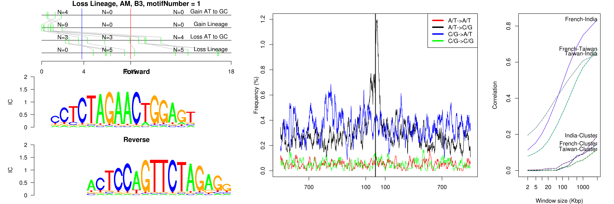
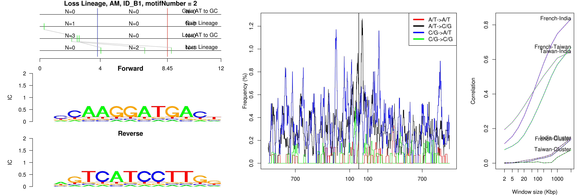

```
## Loss Lineage, AM, B3, motifNumber = 1
```

 

```
## Loss Lineage, AM, B4A, motifNumber = 1
```

 

```
## Loss Lineage, AM, ID_B1, motifNumber = 1
```

 

```
## Loss Lineage, AM, ID_B1, motifNumber = 2
```

 

```
## Loss Lineage, AM, nonRepeat, motifNumber = 1
```

 

```
## Loss Lineage, AM, nonRepeat, motifNumber = 2
```

 

```
## Loss Lineage, AM, nonRepeat, motifNumber = 3
```

 

```
## Loss Lineage, AM, nonRepeat, motifNumber = 4
```

 

```
## Loss Lineage, AM, RSINE1, motifNumber = 1
```

 
  
