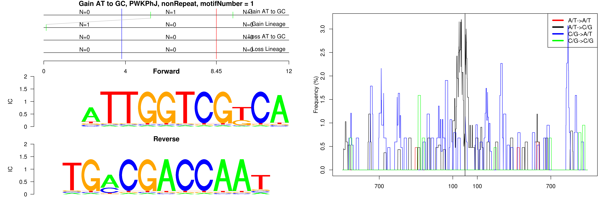

```
## Gain AT to GC, PWKPhJ, B1_Mur4, motifNumber = 1
```

 

```
## Gain AT to GC, PWKPhJ, nonRepeat, motifNumber = 1
```

 

```
## Gain AT to GC, PWKPhJ, nonRepeat, motifNumber = 2
```

 

```
## Gain AT to GC, PWKPhJ, nonRepeat, motifNumber = 3
```

 
  
