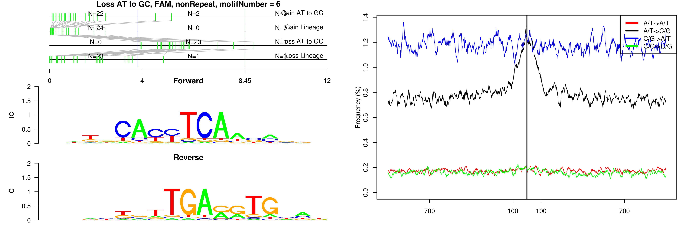

```
## Loss AT to GC, FAM, Lx8, motifNumber = 1
```

 

```
## Loss AT to GC, FAM, MTC, motifNumber = 1
```

 

```
## Loss AT to GC, FAM, nonRepeat, motifNumber = 1
```

 

```
## Loss AT to GC, FAM, nonRepeat, motifNumber = 2
```

 

```
## Loss AT to GC, FAM, nonRepeat, motifNumber = 3
```

 

```
## Loss AT to GC, FAM, nonRepeat, motifNumber = 4
```

 

```
## Loss AT to GC, FAM, nonRepeat, motifNumber = 5
```

 

```
## Loss AT to GC, FAM, nonRepeat, motifNumber = 6
```

 

```
## Loss AT to GC, FAM, RMER6A, motifNumber = 1
```

 

```
## Loss AT to GC, FAM, RMER6A, motifNumber = 2
```

 

```
## Loss AT to GC, FAM, RMER6C, motifNumber = 1
```

 
  
