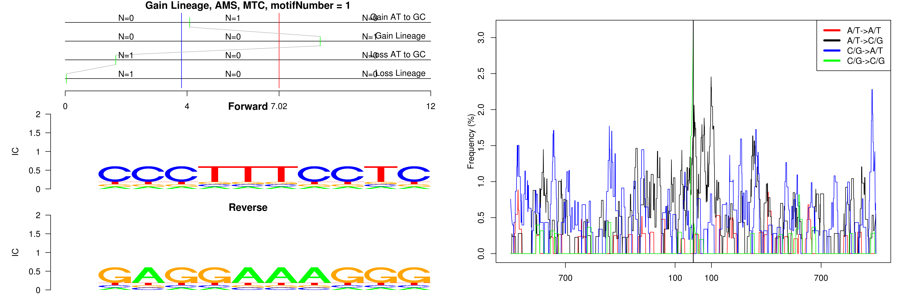

```
## Gain Lineage, AMS, B1_Mus1, motifNumber = 1
```

 

```
## Gain Lineage, AMS, B1_Mus1, motifNumber = 2
```

 

```
## Gain Lineage, AMS, B1_Mus1, motifNumber = 3
```

 

```
## Gain Lineage, AMS, B1_Mus1, motifNumber = 4
```

 

```
## Gain Lineage, AMS, B1_Mus2, motifNumber = 1
```

 

```
## Gain Lineage, AMS, B1_Mus2, motifNumber = 2
```

 

```
## Gain Lineage, AMS, B2_Mm2, motifNumber = 1
```

 

```
## Gain Lineage, AMS, B2_Mm2, motifNumber = 2
```

 

```
## Gain Lineage, AMS, B2_Mm2, motifNumber = 3
```

 

```
## Gain Lineage, AMS, B2_Mm2, motifNumber = 4
```

 

```
## Gain Lineage, AMS, B2_Mm2, motifNumber = 5
```

 

```
## Gain Lineage, AMS, B2_Mm2, motifNumber = 6
```

 

```
## Gain Lineage, AMS, B2_Mm2, motifNumber = 7
```

 

```
## Gain Lineage, AMS, B2_Mm2, motifNumber = 8
```

 

```
## Gain Lineage, AMS, B2_Mm2, motifNumber = 9
```

 

```
## Gain Lineage, AMS, MTC, motifNumber = 1
```

 

```
## Gain Lineage, AMS, RSINE1, motifNumber = 1
```

 

```
## Gain Lineage, AMS, (TAGA)n, motifNumber = 1
```

 
  
