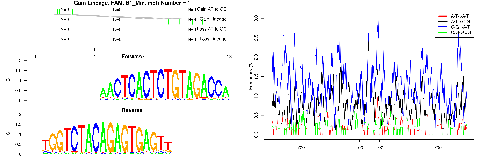
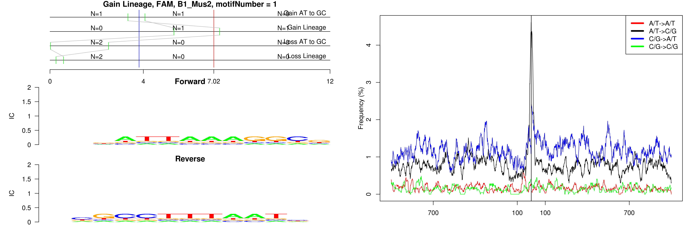
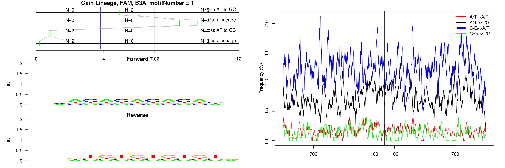
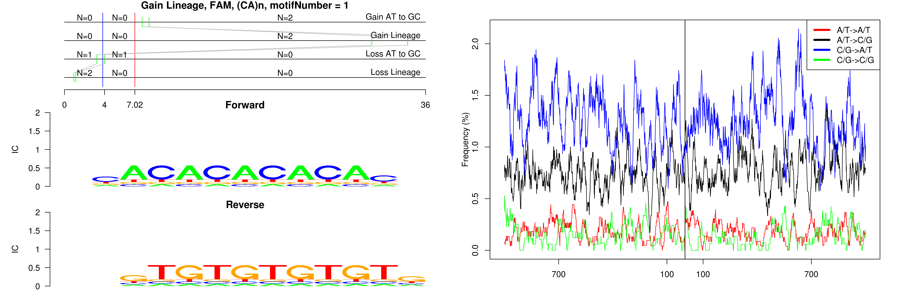
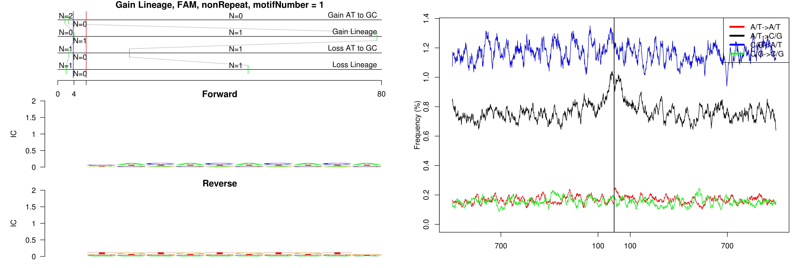
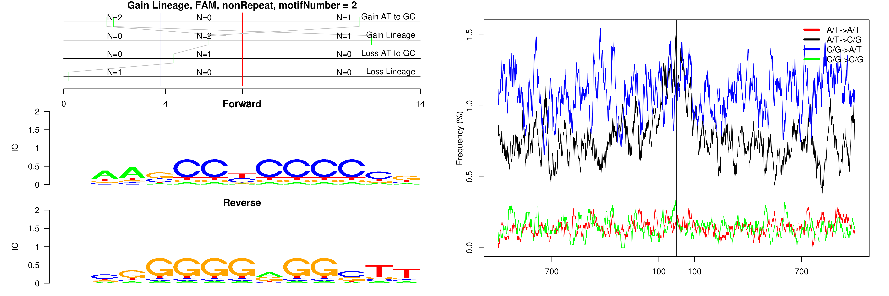
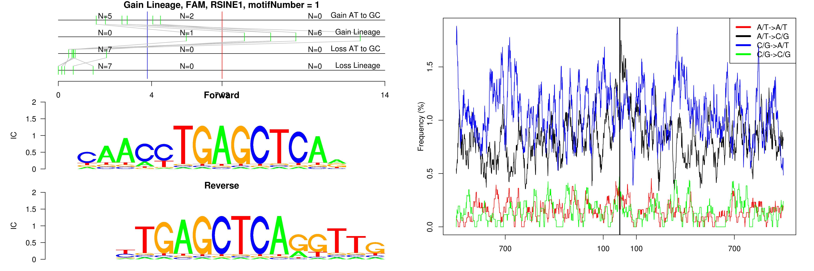
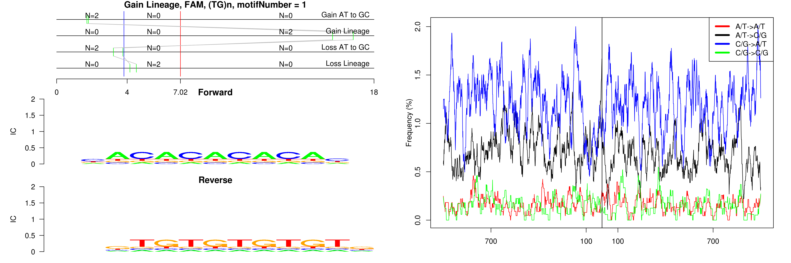

```
## Gain Lineage, FAM, B1_Mm, motifNumber = 1
```

 

```
## Gain Lineage, FAM, B1_Mus1, motifNumber = 1
```

 

```
## Gain Lineage, FAM, B1_Mus2, motifNumber = 1
```

 

```
## Gain Lineage, FAM, B3A, motifNumber = 1
```

 

```
## Gain Lineage, FAM, (CA)n, motifNumber = 1
```

 

```
## Gain Lineage, FAM, nonRepeat, motifNumber = 1
```

 

```
## Gain Lineage, FAM, nonRepeat, motifNumber = 2
```

 

```
## Gain Lineage, FAM, RSINE1, motifNumber = 1
```

 

```
## Gain Lineage, FAM, (TG)n, motifNumber = 1
```

 
  
